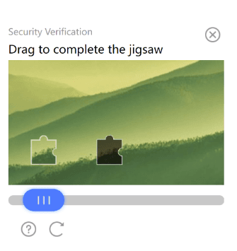

import Tabs from '@theme/Tabs';
import TabItem from '@theme/TabItem';
import ParamItem from '@theme/ParamItem';
import MethodItem from '@theme/MethodItem';
import MethodDescription from '@theme/MethodDescription'
import PriceBlock from '../../../../../src/theme/PriceBlock';
import PriceBlockWrap from '@theme/PriceBlockWrap';
import BlogLink from '@theme/BlogLink';
import { ArticleHead } from '../../../../../src/theme/ArticleHead';

<ArticleHead slug="captchas/tendi" />

# TenDI - Tencent CAPTCHA

<PriceBlockWrap>
  <PriceBlock title="Tencent captcha" captchaId="tencent"/>
</PriceBlockWrap>



<BlogLink url="https://capmonster.cloud/pt-BR/blog/ten-1/what-is-tencent-captcha-and-how-do-i-bypass-it"/>

:::warning **Atenção!**
O CapMonster Cloud, por padrão, funciona com proxies integrados — já incluídos no custo do serviço. É necessário especificar seus próprios proxies apenas nos casos em que o site não aceita o token ou quando o acesso aos serviços integrados está restrito.

Se o proxy utiliza autenticação por IP, é necessário adicionar o endereço **65.21.190.34** à lista de permissões (whitelist).
:::

## Parâmetros da solicitação

<TabItem value="proxyless" label="RecaptchaV2EnterpriseTaskProxyless (sem proxy)" default className="bordered-panel">
    <ParamItem title="type" required type="string" />
    **CustomTask**

    ---

    <ParamItem title="class" required type="string" />
    **TenDI**

    ---

    <ParamItem title="websiteURL" required type="string" />
    O endereço da página principal onde o captcha é resolvido.

    ---

    <ParamItem title="websiteKey" required type="string" />
    captchaAppId. Por exemplo, `"websiteKey": "189123456"` é um parâmetro único para seu site. Você pode obtê-lo de uma página HTML com captcha ou a partir do tráfego (veja a descrição abaixo).

    ---

    <ParamItem title="captchaUrl (dentro da metadata)" type="string" />
    Link para o script do captcha. Normalmente termina com `TCaptcha.js` ou `TCaptcha-global.js`. Pode ser encontrado na lista de requisições (veja o exemplo abaixo).
	
    ---

    <ParamItem title="userAgent" type="string" />
    User-Agent do navegador. <br />
**Transmita apenas o UA atual do sistema operacional Windows. No momento, o válido é**: `userAgentPlaceholder`
	
---

<ParamItem title="proxyType" type="string" />
**http** - proxy regular http/https;<br />**https** - use essa opção apenas se "http" não funcionar (necessário para alguns proxies personalizados);<br />**socks4** - proxy socks4;<br />**socks5** - proxy socks5.

---

<ParamItem title="proxyAddress" type="string" />
<p>
Endereço IP do proxy IPv4/IPv6. Não permitido:
- uso de proxies transparentes (onde é possível ver o IP do cliente);
- uso de proxies em máquinas locais.
</p>

---

<ParamItem title="proxyPort" type="integer" />
Porta do proxy.

---

<ParamItem title="proxyLogin" type="string" />
Login do servidor proxy.

---

<ParamItem title="proxyPassword" type="string" />
Senha do servidor proxy.

</TabItem>

## Método de criação da tarefa

<Tabs className="full-width-tabs filled-tabs request-tabs" groupId="captcha-type">

<TabItem value="proxyless" label="Custom task (sem proxy)" default className="method-panel">
  <MethodItem>
    ```http
    https://api.capmonster.cloud/createTask
    ```
  </MethodItem>
  <MethodDescription>
    **Solicitação**
    ```json
    {
      "clientKey": "API_KEY",
      "task": {
        "type": "CustomTask",
        "class": "TenDI",
        "websiteURL": "https://example.com",
        "websiteKey": "189123456",
        "userAgent": "userAgentPlaceholder",
        "metadata": {
          "captchaUrl": "https://global.captcha.example.com/TCaptcha-global.js"
        }
      }
    }
    ```

    **Resposta**
    ```json
    {
      "errorId": 0,
      "taskId": 407533072
    }
    ```
  </MethodDescription>
</TabItem>

<TabItem value="proxy" label="Custom task (com proxy)" default className="method-panel">
  <MethodItem>
    ```http
    https://api.capmonster.cloud/createTask
    ```
  </MethodItem>
  <MethodDescription>
    **Solicitação**
    ```json
    {
      "clientKey": "API_KEY",
      "task": {
        "type": "CustomTask",
        "class": "TenDI",
        "websiteURL": "https://example.com",
        "websiteKey": "189123456",
        "userAgent": "userAgentPlaceholder",
        "metadata": {
          "captchaUrl": "https://global.captcha.example.com/TCaptcha-global.js"
        },
        "proxyType": "http",
        "proxyAddress": "8.8.8.8",
        "proxyPort": 8080,
        "proxyLogin": "proxyLoginHere",
        "proxyPassword": "proxyPasswordHere"
      }
    }
    ```

    **Resposta**
    ```json
    {
      "errorId": 0,
      "taskId": 407533072
    }
    ```
  </MethodDescription>
</TabItem>

</Tabs>

## Método de obter resultado da tarefa
Use o método [getTaskResult](../api/methods/get-task-result.mdx) para obter a solução do TenDI.

<TabItem value="proxyless" label="GeeTestTaskProxyless (sem proxy)" default className="method-panel-full">
    <MethodItem>
```http
https://api.capmonster.cloud/getTaskResult
```
    </MethodItem>
    <MethodDescription>
**Solicitação**
```json
{
  "clientKey":"API_KEY",
  "taskId": 407533072
}
```
**Resposta**
```json
{
    "errorId":0,
    "status":"ready",
    "solution": {
       "data": {
            "randstr": "@EcL",
            "ticket": "tr03lHUhdnuW3neJZu.....7LrIbs*"
        },
        "headers": {
            "User-Agent": "userAgentPlaceholder"
        }
    }
}
```
  </MethodDescription>
  </TabItem>

## Como obter websiteKey (captchaAppId)
Ative as *Ferramentas de Desenvolvedor*, vá para a aba **Network**, ative o captcha e veja as solicitações. Algumas delas conterão o valor do parâmetro que você precisa. Nesse caso, `websiteKey=aid`  
 

## Como obter captchaUrl
Abra *Ferramentas de Desenvolvedor*, vá para a aba **Network**, ative o captcha e examine as requisições de rede. Entre elas aparecerá `TCaptcha.js` ou `TCaptcha-global.js`, no qual você pode encontrar um link semelhante a este:


## Como Encontrar Todos os Parâmetros Necessários para a Criação da Tarefa

### Automaticamente

Para automatizar a extração dos parâmetros, eles podem ser obtidos via **navegador** (normal ou headless, por exemplo, usando **Playwright**) ou diretamente a partir de **requisições HTTP**. Como os valores dos parâmetros dinâmicos têm curta duração, recomenda-se utilizá-los imediatamente após a extração.

:::warning **Importante!**
Os trechos de código fornecidos são exemplos básicos para aprendizado sobre como extrair os parâmetros necessários. A implementação exata dependerá do seu site com captcha, sua estrutura e os elementos HTML e seletores utilizados.
:::

<Tabs className="full-width-tabs filled-tabs request-tabs">
  <TabItem value="js" label="JavaScript" default className="method-panel">
    <details>
      <summary>Mostrar código (Node.js)</summary>
      ```js
      import { chromium } from "playwright";

      (async () => {
        const browser = await chromium.launch({ headless: false });
        const page = await browser.newPage();

        // Interceptar requisições
        page.on("request", (request) => {
          const url = request.url();
          if (
            url.startsWith("https://sg.captcha.qcloud.com/cap_union_prehandle?aid=")
          ) {
            const parsedUrl = new URL(url);
            const aid = parsedUrl.searchParams.get("aid");
            console.log("Aid extraído:", aid);
          }
        });

        await page.goto("https://www.example.com/", { waitUntil: "load" });

        await page.waitForTimeout(5000);

        await browser.close();
      })();
      ```
    </details>
  </TabItem>

  <TabItem value="python" label="Python" className="method-panel">
    <details>
      <summary>Mostrar código</summary>
      ```python
      import asyncio
      from playwright.async_api import async_playwright

      async def main():
          async with async_playwright() as p:
              browser = await p.chromium.launch(headless=False)
              page = await browser.new_page()

              # Interceptar requisições
              page.on("request", lambda request: handle_request(request))

              await page.goto("https://www.example.com/", wait_until="load")

              await asyncio.sleep(5)

              await browser.close()

      def handle_request(request):
          url = request.url
          if url.startswith("https://sg.captcha.qcloud.com/cap_union_prehandle?aid="):
              parsed_url = request.url.split('?')[1]
              params = dict(param.split('=') for param in parsed_url.split('&') if '=' in param)
              aid = params.get('aid')
              print("Aid extraído:", aid)

      asyncio.run(main())
      ```
    </details>
  </TabItem>

  <TabItem value="csharp" label="C#" className="method-panel">
    <details>
      <summary>Mostrar código</summary>
      ```csharp
      using System;
      using System.Threading.Tasks;
      using Microsoft.Playwright;

      class Program
      {
          public static async Task Main()
          {
              using var playwright = await Playwright.CreateAsync();
              await using var browser = await playwright.Chromium.LaunchAsync(new BrowserTypeLaunchOptions {
                 Headless = false });
              var page = await browser.NewPageAsync();

              // Interceptar requisições
              page.Request += (_, request) =>
              {
                  var url = request.Url;
                  if (url.StartsWith("https://sg.captcha.qcloud.com/cap_union_prehandle?aid="))
                  {
                      var uri = new Uri(url);
                      var queryParams = System.Web.HttpUtility.ParseQueryString(uri.Query);
                      var aid = queryParams.Get("aid");
                      Console.WriteLine("Aid extraído: " + aid);
                  }
              };

              await page.GotoAsync("https://www.example.com/", new PageGotoOptions {
               WaitUntil = WaitUntilState.Load });

              await Task.Delay(5000);

              await browser.CloseAsync();
          }
      }
      ```
    </details>
  </TabItem>
</Tabs>  
  
## Usar biblioteca SDK

<Tabs className="full-width-tabs filled-tabs request-tabs" groupId="captcha-type">

  <TabItem value="js" label="JavaScript" default className="method-panel">
<details>
      <summary>Mostrar Código (para navegador)</summary>
  ```js
  // https://github.com/ZennoLab/capmonstercloud-client-js

  import {
    CapMonsterCloudClientFactory,
    ClientOptions,
    TenDIRequest
  } from '@zennolab_com/capmonstercloud-client';

  const API_KEY = "YOUR_API_KEY"; // Insira sua chave de API do CapMonster Cloud

  document.addEventListener("DOMContentLoaded", async () => {
    const client = CapMonsterCloudClientFactory.Create(
      new ClientOptions({ clientKey: API_KEY })
    );

    // Exemplo básico sem proxy
    // O CapMonster Cloud usa automaticamente seus próprios proxies
    let tenDIRequest = new TenDIRequest({
      websiteURL: "https://example.com", // URL da página com o captcha Tencent (TenDI)
      websiteKey: "183268248"            // TencentCaptcha appid (substitua por um valor válido)
    });

    // Exemplo de uso do seu próprio proxy
    // Descomente este bloco se quiser usar um proxy personalizado
    /*
    const proxy = {
      proxyType: "http",
      proxyAddress: "123.45.67.89",
      proxyPort: 8080,
      proxyLogin: "username",
      proxyPassword: "password"
    };

    tenDIRequest = new TenDIRequest({
      websiteURL: "https://example.com",
      websiteKey: "183268248",
      userAgent: "userAgentPlaceholder",
      proxy
    });
    */

    // Se necessário, você pode verificar o saldo
    const balance = await client.getBalance();
    console.log("Balance:", balance);

    const result = await client.Solve(tenDIRequest);
    console.log("Solution:", result);
  });
```
</details>

<details>
      <summary>Mostrar Código (Node.js)</summary>
```javascript
// https://github.com/ZennoLab/capmonstercloud-client-js

import { 
  CapMonsterCloudClientFactory, 
  ClientOptions, 
  TenDIRequest 
} from '@zennolab_com/capmonstercloud-client';

const API_KEY = "YOUR_API_KEY"; // Insira sua chave de API do CapMonster Cloud

async function solveTenDI() {
  const client = CapMonsterCloudClientFactory.Create(
    new ClientOptions({ clientKey: API_KEY })
  );

  // Exemplo básico sem proxy
  // O CapMonster Cloud usa automaticamente seus próprios proxies
  let tenDIRequest = new TenDIRequest({
    websiteURL: "https://example.com", // URL da página com o captcha
    websiteKey: "183268248"            // Substitua por um valor válido
  });

  // Exemplo de uso do seu próprio proxy
  // Descomente este bloco se quiser usar um proxy personalizado

  /*
  const proxy = {
    proxyType: "http",
    proxyAddress: "123.45.67.89",
    proxyPort: 8080,
    proxyLogin: "username",
    proxyPassword: "password"
  };

  tenDIRequest = new TenDIRequest({
    websiteURL: "https://example.com",
    websiteKey: "websiteKey",
    proxy,
    userAgent: "userAgentPlaceholder"
  });
  */

  // Se necessário, você pode verificar o saldo
  const balance = await client.getBalance();
  console.log("Balance:", balance);

  const result = await client.Solve(tenDIRequest);
  console.log("Solution:", result);
}

solveTenDI().catch(console.error);
```
</details>

  </TabItem>

  <TabItem value="python" label="Python" className="method-panel">
<details>
      <summary>Mostrar Código</summary>
```python
# https://github.com/ZennoLab/capmonstercloud-client-python

import asyncio
from capmonstercloudclient import CapMonsterClient, ClientOptions
from capmonstercloudclient.requests import TenDiCustomTaskRequest
# from capmonstercloudclient.requests.baseRequestWithProxy import ProxyInfo  # Descomente se quiser usar um proxy

API_KEY = "YOUR_API_KEY"  # Insira sua chave de API do CapMonster Cloud

async def solve_tendi_custom():
    client_options = ClientOptions(api_key=API_KEY)
    cap_monster_client = CapMonsterClient(options=client_options)

    # Exemplo básico sem proxy
    # O CapMonster Cloud usa automaticamente seus próprios proxies
    tendi_request = TenDiCustomTaskRequest(
        websiteUrl="https://example.com",  # URL da página com o captcha Tencent (TenDI)
        websiteKey="189956587",            # TencentCaptcha appid
        userAgent="userAgentPlaceholder"
    )

    # Exemplo de uso do seu próprio proxy
    # Descomente este bloco se quiser usar um proxy
    #
    # proxy = ProxyInfo(
    #     proxyType="http",
    #     proxyAddress="123.45.67.89",
    #     proxyPort=8080,
    #     proxyLogin="username",
    #     proxyPassword="password"
    # )
    #
    # tendi_request = TenDiCustomTaskRequest(
    #     websiteUrl="https://example.com",
    #     websiteKey="189956587",
    #     userAgent="userAgentPlaceholder",
    #     proxy=proxy
    # )

    # Se necessário, você pode verificar o saldo
    balance = await cap_monster_client.get_balance()
    print("Balance:", balance)

    result = await cap_monster_client.solve_captcha(tendi_request)
    print("Solution:", result)

asyncio.run(solve_tendi_custom())
```
</details>
  </TabItem>

  <TabItem value="csharp" label="C#" className="method-panel">
<details>
      <summary>Mostrar Código</summary>
```csharp
// https://github.com/ZennoLab/capmonstercloud-client-dotnet

using System;
using System.Threading.Tasks;
using Zennolab.CapMonsterCloud;
using Zennolab.CapMonsterCloud.Requests;

class Program
{
    static async Task Main(string[] args)
    {
        // Insira sua chave de API do CapMonster Cloud
        var clientOptions = new ClientOptions
        {
            ClientKey = "YOUR_API_KEY"
        };

        var cmCloudClient = CapMonsterCloudClientFactory.Create(clientOptions);

        // Se necessário, você pode verificar o saldo
        var balance = await cmCloudClient.GetBalanceAsync();
        Console.WriteLine("Balance: " + balance);

        // Exemplo básico sem proxy
        // O CapMonster Cloud usa automaticamente seus próprios proxies
        var tenDiRequest = new TenDiCustomTaskRequest
        {
            WebsiteUrl = "https://example.com",   // URL da página com o captcha
            WebsiteKey = "189956587",             // TencentCaptcha appid
            UserAgent = "userAgentPlaceholder"
        };

        // Exemplo de uso do seu próprio proxy
        // Descomente este bloco se quiser usar um proxy personalizado
        /*
        var tenDiRequest = new TenDiCustomTaskRequest
        {
            WebsiteUrl = "https://example.com",
            WebsiteKey = "189956587",
            UserAgent = "userAgentPlaceholder",

            Proxy = new ProxyContainer(
                "123.45.67.89",
                8080,
                ProxyType.Http,
                "username",
                "password"
            )
        };
        */

        var tenDiResult = await cmCloudClient.SolveAsync(tenDiRequest);

        Console.WriteLine("Solution Data: " + string.Join(", ", tenDiResult.Solution.Data));
        Console.WriteLine("Solution Headers: " + string.Join(", ", tenDiResult.Solution.Headers));
    }
}
```
</details>
  </TabItem>

</Tabs>
