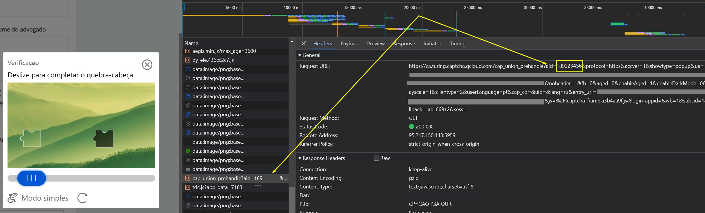

import Tabs from '@theme/Tabs';
import TabItem from '@theme/TabItem';
import ParamItem from '@theme/ParamItem';
import MethodItem from '@theme/MethodItem';
import MethodDescription from '@theme/MethodDescription'
import PriceBlock from '@theme/PriceBlock';
import PriceBlockWrap from '@theme/PriceBlockWrap';
import BlogLink from '@theme/BlogLink';


# TenDI - Captcha da Tencent

<PriceBlockWrap>
  <PriceBlock title="Tencent captcha" name="tencentToken"/>
</PriceBlockWrap>

<BlogLink url="https://capmonster.cloud/pt-BR/blog/ten-1/what-is-tencent-captcha-and-how-do-i-bypass-it"/>

:::warning **Atenção!**
Essa tarefa será realizada usando nossos servidores proxy.
:::

## Parâmetros da solicitação

<TabItem value="proxyless" label="RecaptchaV2EnterpriseTaskProxyless (sem proxy)" default className="bordered-panel">
    <ParamItem title="type" required type="string" />
    **CustomTask**

    ---

    <ParamItem title="class" required type="string" />
    **TenDI**

    ---

    <ParamItem title="websiteURL" required type="string" />
    O endereço da página principal onde o captcha é resolvido.

    ---

    <ParamItem title="websiteKey" required type="string" />
    captchaAppId. Por exemplo, `"websiteKey": "189123456"` é um parâmetro único para seu site. Você pode obtê-lo de uma página HTML com captcha ou a partir do tráfego (veja a descrição abaixo).

    ---

    <ParamItem title="metadata.captchaUrl" type="string" />
    Link para o script do captcha. Normalmente termina com `TCaptcha.js` ou `TCaptcha-global.js`. Pode ser encontrado na lista de requisições (veja o exemplo abaixo).
	
    ---

    <ParamItem title="userAgent" type="string" />
    O User-Agent do navegador. **Passe apenas o UA real de um sistema operacional Windows. Atualmente, a versão é**: `userAgentPlaceholder`
	
---

<ParamItem title="proxyType" type="string" />
**http** - proxy regular http/https;<br />**https** - use essa opção apenas se "http" não funcionar (necessário para alguns proxies personalizados);<br />**socks4** - proxy socks4;<br />**socks5** - proxy socks5.

---

<ParamItem title="proxyAddress" type="string" />
<p>
Endereço IP do proxy IPv4/IPv6. Não permitido:
- uso de nomes de host;
- uso de proxies transparentes (onde é possível ver o IP do cliente);
- uso de proxies em máquinas locais.
</p>

---

<ParamItem title="proxyPort" type="integer" />
Porta do proxy.

---

<ParamItem title="proxyLogin" type="string" />
Login do servidor proxy.

---

<ParamItem title="proxyPassword" type="string" />
Senha do servidor proxy.

</TabItem>

### Como obter websiteKey (captchaAppId)
Ative as *Ferramentas de Desenvolvedor*, vá para a aba **Network**, ative o captcha e veja as solicitações. Algumas delas conterão o valor do parâmetro que você precisa. Nesse caso, `websiteKey=aid`  
 

### Como obter captchaUrl
Abra *Ferramentas de Desenvolvedor*, vá para a aba **Network**, ative o captcha e examine as requisições de rede. Entre elas aparecerá `TCaptcha.js` ou `TCaptcha-global.js`, no qual você pode encontrar um link semelhante a este:


## Método de criação da tarefa

<TabItem value="proxyless" label="RecaptchaV2TaskProxyless (sem proxy)" default className="method-panel">
  <MethodItem>
    ```http
    https://api.capmonster.cloud/createTask
    ```
  </MethodItem>
  <MethodDescription>
    **Solicitação**
    ```json
    {
      "clientKey": "API_KEY",
      "task": {
        "type": "CustomTask",
        "class": "TenDI",
        "websiteURL": "https://example.com",
        "websiteKey": "189123456",
        "userAgent": "userAgentPlaceholder",
        "metadata": {
          "captchaUrl": "https://global.captcha.example.com/TCaptcha-global.js"
        }
      }
    }
    ```

    **Resposta**
    ```json
    {
      "errorId": 0,
      "taskId": 407533072
    }
    ```
  </MethodDescription>
</TabItem>

## Método de obter resultado da tarefa
Use o método [getTaskResult](../api/methods/get-task-result.md) para obter a solução do TenDI.

<TabItem value="proxyless" label="GeeTestTaskProxyless (sem proxy)" default className="method-panel-full">
    <MethodItem>
```http
https://api.capmonster.cloud/getTaskResult
```
    </MethodItem>
    <MethodDescription>
**Solicitação**
```json
{
  "clientKey":"API_KEY",
  "taskId": 407533072
}
```
**Resposta**
```json
{
    "errorId":0,
    "status":"ready",
    "solution": {
       "data": {
            "randstr": "@EcL",
            "ticket": "tr03lHUhdnuW3neJZu.....7LrIbs*"
        },
        "headers": {
            "User-Agent": "userAgentPlaceholder"
        }
    }
}
```
  </MethodDescription>
  </TabItem>

## Como Encontrar Todos os Parâmetros Necessários para a Criação da Tarefa

### Automaticamente

Uma forma conveniente de automatizar a busca por todos os parâmetros necessários.  
Alguns parâmetros são regenerados a cada carregamento da página, então você precisará extraí-los através de um navegador — seja normal ou headless (por exemplo, usando **Playwright**).  
Como os valores dos parâmetros dinâmicos são de curta duração, o captcha deve ser resolvido imediatamente após a captura deles.

:::warning **Importante!**  
Os trechos de código fornecidos são exemplos básicos para familiarização com a extração dos parâmetros necessários. A implementação exata dependerá da sua página de captcha, sua estrutura e dos elementos/seletores HTML que ela utiliza.  
:::

<Tabs className="full-width-tabs filled-tabs request-tabs">
  <TabItem value="js" label="JavaScript" default className="method-panel">
    <details>
      <summary>Mostrar código (Node.js)</summary>
      ```js
      import { chromium } from "playwright";

      (async () => {
        const browser = await chromium.launch({ headless: false });
        const page = await browser.newPage();

        // Interceptar requisições
        page.on("request", (request) => {
          const url = request.url();
          if (
            url.startsWith("https://sg.captcha.qcloud.com/cap_union_prehandle?aid=")
          ) {
            const parsedUrl = new URL(url);
            const aid = parsedUrl.searchParams.get("aid");
            console.log("Aid extraído:", aid);
          }
        });

        await page.goto("https://www.example.com/", { waitUntil: "load" });

        await page.waitForTimeout(5000);

        await browser.close();
      })();
      ```
    </details>
  </TabItem>

  <TabItem value="python" label="Python" className="method-panel">
    <details>
      <summary>Mostrar código</summary>
      ```python
      import asyncio
      from playwright.async_api import async_playwright

      async def main():
          async with async_playwright() as p:
              browser = await p.chromium.launch(headless=False)
              page = await browser.new_page()

              # Interceptar requisições
              page.on("request", lambda request: handle_request(request))

              await page.goto("https://www.example.com/", wait_until="load")

              await asyncio.sleep(5)

              await browser.close()

      def handle_request(request):
          url = request.url
          if url.startswith("https://sg.captcha.qcloud.com/cap_union_prehandle?aid="):
              parsed_url = request.url.split('?')[1]
              params = dict(param.split('=') for param in parsed_url.split('&') if '=' in param)
              aid = params.get('aid')
              print("Aid extraído:", aid)

      asyncio.run(main())
      ```
    </details>
  </TabItem>

  <TabItem value="csharp" label="C#" className="method-panel">
    <details>
      <summary>Mostrar código</summary>
      ```csharp
      using System;
      using System.Threading.Tasks;
      using Microsoft.Playwright;

      class Program
      {
          public static async Task Main()
          {
              using var playwright = await Playwright.CreateAsync();
              await using var browser = await playwright.Chromium.LaunchAsync(new BrowserTypeLaunchOptions {
                 Headless = false });
              var page = await browser.NewPageAsync();

              // Interceptar requisições
              page.Request += (_, request) =>
              {
                  var url = request.Url;
                  if (url.StartsWith("https://sg.captcha.qcloud.com/cap_union_prehandle?aid="))
                  {
                      var uri = new Uri(url);
                      var queryParams = System.Web.HttpUtility.ParseQueryString(uri.Query);
                      var aid = queryParams.Get("aid");
                      Console.WriteLine("Aid extraído: " + aid);
                  }
              };

              await page.GotoAsync("https://www.example.com/", new PageGotoOptions {
               WaitUntil = WaitUntilState.Load });

              await Task.Delay(5000);

              await browser.CloseAsync();
          }
      }
      ```
    </details>
  </TabItem>
</Tabs>  
  
## Usar biblioteca SDK

<Tabs className="full-width-tabs filled-tabs request-tabs" groupId="captcha-type">
	<TabItem value="js" label="JavaScript" default className="method-panel">
		```js
		// https://github.com/ZennoLab/capmonstercloud-client-js

		import { CapMonsterCloudClientFactory, ClientOptions, TenDIRequest } from '@zennolab_com/capmonstercloud-client';

		document.addEventListener('DOMContentLoaded', async () => {
			const cmcClient = CapMonsterCloudClientFactory.Create(new ClientOptions({ clientKey: '<your capmonster.cloud API key>' }));
			console.log(await cmcClient.getBalance());

			const tenDIRequest = new TenDIRequest({
				websiteURL: 'https://example.com',
				websiteKey: 'websiteKey',
			});

			console.log(await cmcClient.Solve(tenDIRequest));
		});
		```
	</TabItem>
	
  <TabItem value="python" label="Python" default className="method-panel">
    ```python
    # https://github.com/ZennoLab/capmonstercloud-client-python

    import asyncio
    from capmonstercloudclient import CapMonsterClient, ClientOptions
    from capmonstercloudclient.requests import TenDiCustomTaskProxylessRequest

    client_options = ClientOptions(api_key="your_api_key")  # Replace with your CapMonster Cloud API key
    cap_monster_client = CapMonsterClient(options=client_options)

    ten_di_request = TenDiCustomTaskProxylessRequest(
        websiteUrl="https://example.com",  # URL with the captcha
        websiteKey="189956587",  # Replace with the website key for the captcha
        userAgent="Mozilla/5.0 (Windows NT 10.0; Win64; x64) AppleWebKit/537.36 (KHTML, like Gecko) Chrome/130.0.0.0 Safari/537.36"  # Use the current userAgent
    )

    async def solve_captcha():
        return await cap_monster_client.solve_captcha(ten_di_request)

    responses = asyncio.run(solve_captcha())
    print(responses)
    ```
  </TabItem>

  <TabItem value="csharp" label="C#" className="method-panel">
    ```csharp
    // https://github.com/ZennoLab/capmonstercloud-client-dotnet

    using Zennolab.CapMonsterCloud.Requests;
    using Zennolab.CapMonsterCloud;

    class Program
    {
        static async Task Main(string[] args)
        {
            var clientOptions = new ClientOptions
            {
                ClientKey = "your_api_key" // Replace with your CapMonster Cloud API key
            };

            var cmCloudClient = CapMonsterCloudClientFactory.Create(clientOptions);

            var tenDiRequest = new TenDiCustomTaskProxylessRequest
            {
                WebsiteUrl = "https://example.com", // URL with the captcha
                WebsiteKey = "189956587", // Replace with the correct website key
                UserAgent = "Mozilla/5.0 (Windows NT 10.0; Win64; x64) AppleWebKit/537.36 (KHTML, like Gecko) Chrome/130.0.0.0 Safari/537.36" // Use the current userAgent
            };

            var tenDiRequestResult = await cmCloudClient.SolveAsync(tenDiRequest);
            Console.WriteLine("Captcha Solution: " + string.Join(", ", tenDiRequestResult.Solution.Data));
            Console.WriteLine("Captcha Solution: " + string.Join(", ", tenDiRequestResult.Solution.Headers));
        }
    }
    ```
  </TabItem>
</Tabs>