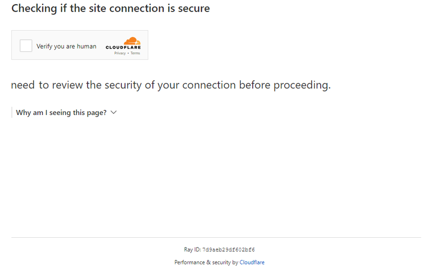

import Tabs from '@theme/Tabs';
import TabItem from '@theme/TabItem';
import ParamItem from '@theme/ParamItem';
import MethodItem from '@theme/MethodItem';
import MethodDescription from '@theme/MethodDescription'
import PriceBlock from '../../../../../src/theme/PriceBlock'
import PriceBlockWrap from '@theme/PriceBlockWrap';
import BlogLink from '@theme/BlogLink';
import { ArticleHead } from '../../../../../src/theme/ArticleHead';

<ArticleHead slug="captchas/turnstile-challenge-task" />

# Cloudflare Challenge

<PriceBlockWrap>
  <PriceBlock title="Cloudflare Challenge" captchaId="cf-turnstile"/>
</PriceBlockWrap>


<BlogLink url="https://capmonster.cloud/pt-BR/blog/Cloudflare/what-is-cloudflare-captcha"/>
<BlogLink url="https://capmonster.cloud/pt-BR/blog/Cloudflare/how-cloudflare-bot-challenge-and-turnstile-protect-web-traffic"/>

:::info Importante:
O CapMonster Cloud pode retornar o resultado da solução como um **token** ou como um **cookie cf_clearance**. Antes de começar, analise ambas as opções e escolha a que melhor se adapta ao seu caso de uso.
:::

## Parâmetros da solicitação

## Opção 1. Challenge (token)

:::warning **Atenção!**
* O CapMonster Cloud, por padrão, funciona com proxies integrados — já incluídos no custo do serviço. É necessário especificar seus próprios proxies apenas nos casos em que o site não aceita o token ou quando o acesso aos serviços integrados está restrito.

* Se o proxy utiliza autenticação por IP, é necessário adicionar o endereço **65.21.190.34** à lista de permissões (whitelist).
* Após resolver, você receberá um **token** para confirmar a conclusão do captcha.
:::

<TabItem value="proxyless" label="RecaptchaV2EnterpriseTaskProxyless (sem proxy)" default className="bordered-panel">
  <ParamItem title="type" required type="string" />
  **TurnstileTask**

  ---

  <ParamItem title="websiteURL" required type="string" />
  A URL da página onde o captcha será resolvido

  ---

  <ParamItem title="websiteKey" required type="string" />
  Chave do site Turnstile

  ---

  <ParamItem title="cloudflareTaskType" required type="string" />
  **token**

  ---

  <ParamItem title="pageAction" required type="string" />
  O campo `action` encontrado na função de callback. Se estiver usando *cloudflareTaskType*, `action` geralmente é “managed” ou “non-interactive”.

  ---

  <ParamItem title="userAgent" required type="string" />
  User-Agent do navegador. <br />
**Transmita apenas o UA atual do sistema operacional Windows. No momento, o válido é**: `userAgentPlaceholder`

  ---

  <ParamItem title="data" required type="string" />
  O valor do campo *data*, obtido de `cData`.

  ---

  <ParamItem title="pageData" required type="string" />
  O valor de *pageData*, obtido de `chlPageData`.

  ---

  <ParamItem title="apiJsUrl" type="string" />
  String contendo a URL do script do captcha.

  ---

  <ParamItem title="proxyType" type="string" />
**http** - proxy http/https comum;<br />
**https** - tente esta opção apenas se "http" não funcionar (necessário para alguns proxies personalizados);<br />
**socks4** - proxy socks4;<br />
**socks5** - proxy socks5.

---

<ParamItem title="proxyAddress" type="string" />
<p>
Endereço IP do proxy IPv4/IPv6. Não é permitido:
- uso de proxies transparentes (que revelem o IP do cliente);
- uso de proxies em máquinas locais.
</p>

---

<ParamItem title="proxyPort" type="integer" />
Porta do proxy.

---

<ParamItem title="proxyLogin" type="string" />
Login do servidor proxy.

---

<ParamItem title="proxyPassword" type="string" />
Senha do servidor proxy.


</TabItem>

<br />

Estes parâmetros estão no objeto passado para `window.turnstile.render(el, paramsObj)` ao criar o captcha. Você pode obtê-los, por exemplo, executando JavaScript antes de carregar outros scripts:

```js
(function () {
  const obj = {
    render: function () {
      const { action, cData, chlPageData } = arguments[1];
        const params = [
          ["action", action],
          ["data", cData],
          ["pageData", chlPageData],
        ];
        console.table(params)
    }
  };

  Object.defineProperty(window, "turnstile", {
    get: () => {
      return obj;
    },
  });
})();
````

Quando `window.turnstile.render(el, paramsObj)` é chamado, o captcha é carregado na página e, após a resolução bem-sucedida, a função `callback` retorna as informações da solução.

`window.turnstile.render(el, paramsObj):`

* `el`: Elemento DOM onde o captcha será inserido.
* `paramsObj`: Objeto contendo informações do captcha e instruções de resolução. Geralmente inclui *sitekey*, *action*, *cData*, *chlPageData*, *callback*.
* `callback`: Função chamada após o captcha ser resolvido com sucesso.

---

## Opção 2. Challenge (cookie)

:::warning **Atenção!**

* Use **seus próprios proxies** para esta tarefa.

* Após resolver, você receberá **cookies especiais** para adicionar ao navegador.
:::

#### Parâmetros da Requisição

<TabItem value="proxyless" label="RecaptchaV2EnterpriseTaskProxyless (sem proxy)" default className="bordered-panel">
  <ParamItem title="type" required type="string" />
  **TurnstileTask**

---

  <ParamItem title="websiteURL" required type="string" />
  A URL da página onde o captcha será resolvido

---

  <ParamItem title="websiteKey" required type="string" />
  Chave do site Turnstile (qualquer string é aceita)

---

  <ParamItem title="cloudflareTaskType" required type="string" />
  **cf_clearance**

---

  <ParamItem title="htmlPageBase64" required type="string" />
  Página HTML codificada em Base64 do "Just a moment" exibido com resposta 403.<br/>
  Exemplo para obter `htmlPageBase64`:
  ```js
  var htmlContent = document.documentElement.outerHTML;
  var htmlBase64 = btoa(unescape(encodeURIComponent(htmlContent)));
  console.log(htmlBase64);
  ```

---

  <ParamItem title="userAgent" required type="string" />
  User-Agent do navegador.<br />
  **Forneça apenas o UA do Windows atual:** userAgentPlaceholder

---

  <ParamItem title="proxyType" required type="string" />
  **http** - proxy HTTP/HTTPS normal;<br />
  **https** - use se http não funcionar (necessário para alguns proxies personalizados);<br />
  **socks4** - proxy SOCKS4;<br />
  **socks5** - proxy SOCKS5.

---

  <ParamItem title="proxyAddress" required type="string" />
  <p>
    Endereço IP do proxy (IPv4/IPv6). Não permitido:
    - Proxies transparentes
    - Proxies da máquina local
  </p>

---

  <ParamItem title="proxyPort" required type="integer" />
  Porta do proxy.

---

  <ParamItem title="proxyLogin" required type="string" />
  Login do proxy.

---

  <ParamItem title="proxyPassword" required type="string" />
  Senha do proxy.

</TabItem>

---

## Método de criação da tarefa

### Opção 1. Challenge (token)
<Tabs className="full-width-tabs filled-tabs request-tabs" groupId="captcha-type">

  <TabItem value="proxyless" label="TurnstileTask (sem proxy)" default className="method-panel">
    <MethodItem>
      ```http
      https://api.capmonster.cloud/createTask
      ```
    </MethodItem>
    <MethodDescription>
      **Solicitação**
      ```json
      {
        "clientKey": "API_KEY",
        "task": {
          "type": "TurnstileTask",
          "websiteURL": "https://example.com",
          "websiteKey": "0x4AAAAAAADnPIDROrmt1Wwj",
          "cloudflareTaskType": "token",
          "userAgent": "userAgentPlaceholder",
          "pageAction": "managed",
          "pageData": "HUHDWUHuhuwfiweh32..uh2uhuhyugYUG=",
          "data": "874291f4retD1366"
        }
      }
      ```

      **Resposta**
      ```json
      {
        "errorId": 0,
        "taskId": 407533072
      }
      ```
    </MethodDescription>
  </TabItem>

  <TabItem value="proxy" label="TurnstileTask (com proxy)" className="method-panel">
    <MethodItem>
      ```http
      https://api.capmonster.cloud/createTask
      ```
    </MethodItem>
    <MethodDescription>
      **Solicitação**
      ```json
      {
        "clientKey": "API_KEY",
        "task": {
          "type": "TurnstileTask",
          "websiteURL": "https://example.com",
          "websiteKey": "0x4AAAAAAADnPIDROrmt1Wwj",
          "cloudflareTaskType": "token",
          "userAgent": "userAgentPlaceholder",
          "pageAction": "managed",
          "pageData": "HUHDWUHuhuwfiweh32..uh2uhuhyugYUG=",
          "data": "874291f4retD1366",
          "proxyType": "http",
          "proxyAddress": "8.8.8.8",
          "proxyPort": 8080,
          "proxyLogin": "proxyLoginHere",
          "proxyPassword": "proxyPasswordHere"
        }
      }
      ```

      **Resposta**
      ```json
      {
        "errorId": 0,
        "taskId": 407533072
      }
      ```
    </MethodDescription>
  </TabItem>

</Tabs>

---
### Opção 2. Challenge (cookie)
<TabItem value="proxyless" label="TurnstileTask (sem proxy)" default className="method-panel">
	<MethodItem>
		```http
		https://api.capmonster.cloud/createTask
		```
	</MethodItem>
	<MethodDescription>
		**Requisição**
		```json 
		{
		  "clientKey":"API_KEY",
		  "task": {
			"type":"TurnstileTask",
			"websiteURL":"https://example.com",
			"websiteKey":"xxxxxxxxxx",
			"cloudflareTaskType": "cf_clearance",
			"htmlPageBase64": "PCFET0NUWVBFIGh0...vYm9keT48L2h0bWw+",
			"userAgent": "userAgentPlaceholder",
			"proxyType":"http",
			"proxyAddress":"8.8.8.8",
			"proxyPort":8080,
			"proxyLogin":"proxyLoginHere",
			"proxyPassword":"proxyPasswordHere"
		  }
		}
		```
		**Resposta**
		```json
		{
		  "errorId":0,
		  "taskId":407533072
		}
		```
	</MethodDescription>
</TabItem>
---

## Método de obter resultado da tarefa

### Opção 1. Challenge (token)

<TabItem value="proxyless" label="TurnstileTask (proxyless)" default className="method-panel-full">
  <MethodItem>
    ```http
    https://api.capmonster.cloud/getTaskResult
    ```
  </MethodItem>
  <MethodDescription>
    **Solicitação**
    ```json
    {
      "clientKey": "API_KEY",
      "taskId": 407533072
    }
    ```

    **Resposta**
    ```json
    {
      "errorId": 0,
      "status": "ready",
      "solution": {
        "userAgent": "userAgentPlaceholder",
        "token": "0.iGX3xsyFCkbGePM3jP4P4khLo6TrLukt8ZzBvwuQOvbC...f61f3082"
      }
    }
    ```
  </MethodDescription>
</TabItem>

Use o método **[getTaskResult](../api/methods/get-task-result.mdx)** para obter a solução do Challenge. Dependendo da carga do sistema, a resposta pode levar entre **5 e 20 segundos**.

| **Propriedade** | **Tipo** | **Descrição**                                 |
| :-------------- | :------- | :-------------------------------------------- |
| token           | String   | Use este token ao chamar a função de callback |

### Opção 2. Challenge (cookie)

<TabItem value="proxyless" label="TurnstileTask (без прокси)" default className="method-panel-full">
  <MethodItem>
    ```http
    https://api.capmonster.cloud/getTaskResult
    ```
  </MethodItem>
  <MethodDescription>
    **Solicitação**
    ```json
    {
      "clientKey": "API_KEY",
      "taskId": 407533072
    }
    ```

    **Resposta**
    ```json
    {
      "errorId": 0,
      "status": "ready",
      "solution": {
        "cf_clearance": "1tarGvbY2_ZhQdYxpSBloao.FoOn9VtcJtmb_IQ_hCE-1761217338-1.2.1.1-vyVPoLYIGX0VCJomVuLjF7n0kdM0PXaPjpDsRcohxGr7hb2CE7WfcHpmQZ70goqEjdWxPsDhSVaKNTz9opxWguiNdWEEq_.SceWXIqfP7tnEb69f3bP0mixNqcWy_5P_9INpoAEqr1k7aYU0r45PT4gPr5pwHxedVySyLRdoBXIJasdTE52YOQ3NPdGWTwQ_3h2n_wYqqIvf0kCSAvimRrmsgZxomlyejwqPI6ZHi.w"
      }
    }
    ```
  </MethodDescription>
</TabItem>

| **Propriedade** | **Tipo** | **Descrição**                                                          |
| :-------------- | :------- | :--------------------------------------------------------------------- |
| cf_clearance    | String   | Cookies especiais do Cloudflare que você pode definir no seu navegador |

---

## Como diferenciar Challenge do Turnstile

<details>
  <summary>Diferenças entre Challenge e Turnstile</summary>

Os tipos de verificação da Cloudflare podem aparecer de formas diferentes.

**Turnstile padrão:**



**Variantes estilizadas:**

<figure>


<figcaption>O Challenge está integrado de forma orgânica no próprio site.</figcaption>

</figure>

<figure>


<figcaption>Parece um Turnstile comum, mas na verdade é um Challenge.</figcaption>

</figure>

Para ter certeza absoluta da presença de um Challenge, você pode abrir as ferramentas de desenvolvedor, analisar o tráfego, estudar o código da página e observar os sinais característicos:

* A primeira requisição ao site retorna status 403:


* O formulário com id **challenge-form** possui atributo **action** (não confundir com o action do Turnstile captcha) contendo o parâmetro `__cf_chl_f_tk=`:


* A página contém duas tags `<script>` similares que criam novos valores no objeto `window`:


</details>

---

## Como encontrar todos os parâmetros necessários para a criação da tarefa

### Automaticamente

Para automatizar a extração dos parâmetros, eles podem ser obtidos via **navegador** (normal ou headless, por exemplo, usando **Playwright**) ou diretamente a partir de **requisições HTTP**. Como os valores dos parâmetros dinâmicos têm curta duração, recomenda-se utilizá-los imediatamente após a extração.

:::warning **Importante!**
Os trechos de código fornecidos são exemplos básicos para aprendizado sobre como extrair os parâmetros necessários. A implementação exata dependerá do seu site com captcha, sua estrutura e os elementos HTML e seletores utilizados.
:::

<Tabs className="full-width-tabs filled-tabs request-tabs">
  <TabItem value="js" label="JavaScript" default className="method-panel">

<details>
      <summary>Para a Opção 1: Challenge (token) – Node.js</summary>

      ```js
      import { chromium } from "playwright";

      (async () => {
        const browser = await chromium.launch({ headless: false });
        const page = await browser.newPage();

        let params = null;

        try {
          while (!params) {
            await page.goto("https://example.com");

            await page.evaluate(() => {
              window.turnstile = new Proxy(window.turnstile, {
                get(target, prop) {
                  if (prop === "render") {
                    return function (a, b) {
                      const p = {
                        websiteKey: b.sitekey,
                        websiteURL: window.location.href,
                        data: b.cData,
                        pagedata: b.chlPageData,
                        action: b.action,
                        userAgent: navigator.userAgent,
                      };
                      window.params = p;
                      return target.render.apply(this, arguments);
                    };
                  }
                  return target[prop];
                },
              });
            });

            params = await page.evaluate(() => {
              return new Promise((resolve) => {
                setTimeout(() => resolve(window.params || null), 5000);
              });
            });

            if (!params) {
              await page.waitForTimeout(3000);
            }
          }

          console.log("Parâmetros Turnstile:", params);
        } finally {
          await browser.close();
        }
      })();
      ```
    </details>

    <details>
      <summary>Para a Opção 2: Challenge (cookie `cf_clearance`) – Node.js</summary>

      ```js
      import { chromium } from "playwright";
      import { Buffer } from "buffer";

      (async () => {
        const browser = await chromium.launch({ headless: false });
        const page = await browser.newPage();

        let websiteKey = null;

        while (!websiteKey) {
          await page.goto("https://example.com");

          await page.evaluate(() => {
            window.turnstile = new Proxy(window.turnstile, {
              get(target, prop) {
                if (prop === "render") {
                  return function (a, b) {
                    window.websiteKey = b.sitekey;
                    return target.render.apply(this, arguments);
                  };
                }
                return target[prop];
              },
            });
          });

          websiteKey = await page.evaluate(() => {
            return new Promise((resolve) => {
              setTimeout(() => resolve(window.websiteKey || null), 5000);
            });
          });

          if (!websiteKey) {
            await page.waitForTimeout(3000);
          }
        }

        const html = await page.content();
        const htmlPageBase64 = Buffer.from(html).toString("base64");

        const result = {
          websiteKey,
          htmlPageBase64,
        };

        console.log(result);

        await browser.close();
      })();
      ```
    </details>
  </TabItem>

<TabItem value="python" label="Python" className="method-panel">
<details>
      <summary>Para a Opção 1: Challenge (token)</summary>

      ```python
      import asyncio
      from playwright.async_api import async_playwright

      async def extract_turnstile_params():
          async with async_playwright() as p:
              browser = await p.chromium.launch(headless=False)
              page = await browser.new_page()

              params = None

              while not params:
                  await page.goto("https://example.com")

                  await page.evaluate("""
                      window.turnstile = new Proxy(window.turnstile, {
                        get(target, prop) {
                          if (prop === "render") {
                            return function(a, b) {
                              const p = {
                                websiteKey: b.sitekey,
                                websiteURL: window.location.href,
                                data: b.cData,
                                pagedata: b.chlPageData,
                                action: b.action,
                                userAgent: navigator.userAgent
                              };
                              window.params = p;
                              return target.render.apply(this, arguments);
                            };
                          }
                          return target[prop];
                        }
                      });
                  """)

                  await page.wait_for_timeout(5000)

                  params = await page.evaluate("window.params || null")

                  if not params:
                      await page.wait_for_timeout(3000)

              print("Parâmetros Turnstile:", params)

              await browser.close()

      asyncio.run(extract_turnstile_params())
      ```
    </details>

    <details>
      <summary>Para a Opção 2: Challenge (cookie `cf_clearance`)</summary>

      ```python
      import asyncio
      import base64
      from playwright.async_api import async_playwright

      async def main():
          async with async_playwright() as p:
              browser = await p.chromium.launch(headless=False)
              page = await browser.new_page()

              website_key = None

              while not website_key:
                  await page.goto("https://example.com")

                  await page.evaluate("""
                      () => {
                          window.turnstile = new Proxy(window.turnstile, {
                              get(target, prop) {
                                  if (prop === 'render') {
                                      return function(a, b) {
                                          window.websiteKey = b.sitekey;
                                          return target.render.apply(this, arguments);
                                      };
                                  }
                                  return target[prop];
                              }
                          });
                      }
                  """)

                  website_key = await page.evaluate("""
                      () => new Promise(resolve => {
                          setTimeout(() => resolve(window.websiteKey || null), 5000);
                      })
                  """)

                  if not website_key:
                      await page.wait_for_timeout(3000)

              html = await page.content()
              html_base64 = base64.b64encode(html.encode("utf-8")).decode("utf-8")

              result = {
                  "websiteKey": website_key,
                  "htmlPageBase64": html_base64
              }

              print(result)

              await browser.close()

      asyncio.run(main())
      ```
    </details>
  </TabItem>

  <TabItem value="csharp" label="C#" className="method-panel">

  <details>
      <summary>Para a Opção 1: Challenge (token)</summary>

      ```csharp
      using Microsoft.Playwright;
      using System.Text.Json;

      class Program
      {
          public static async Task Main()
          {
              using var playwright = await Playwright.CreateAsync();
              var browser = await playwright.Chromium.LaunchAsync(new BrowserTypeLaunchOptions
              {
                  Headless = false
              });

              var page = await browser.NewPageAsync();
              object? parameters = null;

              while (parameters == null)
              {
                  await page.GotoAsync("https://example.com");

                  await page.EvaluateAsync(@"() => {
                      window.turnstile = new Proxy(window.turnstile, {
                          get(target, prop) {
                              if (prop === 'render') {
                                  return function(a, b) {
                                      const p = {
                                          websiteKey: b.sitekey,
                                          websiteURL: window.location.href,
                                          data: b.cData,
                                          pagedata: b.chlPageData,
                                          action: b.action,
                                          userAgent: navigator.userAgent
                                      };
                                      window.params = p;
                                      return target.render.apply(this, arguments);
                                  };
                              }
                              return target[prop];
                          }
                      });
                  }");

                  parameters = await page.EvaluateAsync(@"() => new Promise(resolve => {
                      setTimeout(() => resolve(window.params || null), 5000);
                  })");

                  if (parameters == null)
                  {
                      await page.WaitForTimeoutAsync(3000);
                  }
              }

              Console.WriteLine("Parâmetros Turnstile:");
              Console.WriteLine(JsonSerializer.Serialize(parameters, new JsonSerializerOptions { WriteIndented = true }));

              await browser.CloseAsync();
          }
      }
      ```
    </details>

    <details>
      <summary>Para a Opção 2: Challenge (cookie `cf_clearance`)</summary>

      ```csharp
      using System;
      using System.Text;
      using System.Threading.Tasks;
      using Microsoft.Playwright;

      class Program
      {
          public static async Task Main()
          {
              using var playwright = await Playwright.CreateAsync();
              var browser = await playwright.Chromium.LaunchAsync(
                new BrowserTypeLaunchOptions { Headless = false });
              var page = await browser.NewPageAsync();

              string websiteKey = null;

              while (websiteKey == null)
              {
                  await page.GotoAsync("https://example.com");

                  await page.EvaluateAsync(@"() => {
                      window.turnstile = new Proxy(window.turnstile, {
                          get(target, prop) {
                              if (prop === 'render') {
                                  return function(a, b) {
                                      window.websiteKey = b.sitekey;
                                      return target.render.apply(this, arguments);
                                  };
                              }
                              return target[prop];
                          }
                      });
                  }");

                  websiteKey = await page.EvaluateAsync<string>(@"() => 
                  new Promise(resolve => {
                      setTimeout(() => resolve(window.websiteKey || null), 5000);
                  })");

                  if (websiteKey == null)
                  {
                      await page.WaitForTimeoutAsync(3000);
                  }
              }

              var html = await page.ContentAsync();
              var htmlBase64 = Convert.ToBase64String(Encoding.UTF8.GetBytes(html));

              Console.WriteLine($"websiteKey: {websiteKey}");
              Console.WriteLine($"htmlPageBase64: {htmlBase64}");

              await browser.CloseAsync();
          }
      }
      ```
    </details>
  </TabItem>
</Tabs>

## Exemplo de implementação usando Selenium no Node.js

<details>
  <summary>Mostrar código</summary>

```js
const { Builder } = require('selenium-webdriver');
const chrome = require('selenium-webdriver/chrome');

(async function example() {
  const options = new chrome.Options();
  options.addArguments('--auto-open-devtools-for-tabs')

  const driver = new Builder()
    .forBrowser('chrome')
    .setChromeOptions(options)
    .build();

  try {
    driver.executeScript(`
    window.turnstile = new Proxy(window.turnstile, {
      get(target, prop) {
        if (prop === 'render') {
          return function(a, b) {
            let p = {
              type: "TurnstileTask",
              websiteKey: b.sitekey,
              websiteURL: window.location.href,
              data: b.cData,
              pagedata: b.chlPageData,
              action: b.action,
              userAgent: navigator.userAgent
          }
          
          console.log(JSON.stringify(p))
          window.params = p;
          window.turnstileCallback = b.callback;
            return target.render.apply(this, arguments);
          }
        }
        return target[prop];
      }
    });
    `)

    driver.get('SITE WITH CAPTCHA');
    
    const params = await driver.executeScript(`
      return new Promise((resolve, reject) => {
        setTimeout(() => {
          resolve(window.params)
        }, 2000)
      })
    `);

    if (params) {
      const data = {
        clientKey: 'API KEY',
        task: {
          type: 'TurnstileTask',
          websiteURL: params.websiteURL,
          websiteKey: params.websiteKey,
          data: params.data,
          action: params.action
        }
      }

      const createResult = await fetch('https://api.capmonster.cloud/createTask', {
        method: 'post',
        body: JSON.stringify(data)
      });

      const createTaskResult = await createResult.json()

      if (createTaskResult.taskId) {
        const asyncDelay = (timeout) =>
          new Promise(resolve => {
              setTimeout(() => {
                  resolve();
              }, timeout);
          });
        
        const getTaskResult = async (taskId) => {
          const taskResult = await fetch('https://api.capmonster.cloud/getTaskResult', {
            method: 'post',
            body: JSON.stringify({
              "clientKey":"API KEY",
              "taskId": createTaskResult.taskId
            })
          });
          const taskResponse = await taskResult.json();
          if (taskResponse.status === 'processing') {
            await asyncDelay(5000);
            return await getTaskResult(taskId)
          }
          return taskResponse;
        }
       
        const taskRes = await getTaskResult(createTaskResult.taskId)

        if (taskRes.solution) {
          await driver.executeScript(`
            window.turnstileCallback(${taskRes.solution.token});
          `);
        }
      }
      
    }

    //FAÇA ALGO
  } finally {
    await driver.quit();
  }
})();
```

</details>

## Usar biblioteca SDK

<Tabs className="full-width-tabs filled-tabs request-tabs" groupId="captcha-type">
  <TabItem value="js" label="JavaScript" default className="method-panel">

<details>
<summary>Opção 1: Challenge (token)</summary>

```js
// https://github.com/ZennoLab/capmonstercloud-client-js

import { 
    CapMonsterCloudClientFactory, 
    ClientOptions, 
    TurnstileRequest 
} from '@zennolab_com/capmonstercloud-client';

const API_KEY = "YOUR_API_KEY"; // Insira sua chave de API do CapMonster Cloud

document.addEventListener("DOMContentLoaded", async () => {
    const client = CapMonsterCloudClientFactory.Create(
        new ClientOptions({ clientKey: API_KEY })
    );

    // Exemplo básico sem proxy
    // O CapMonster Cloud usa automaticamente seus próprios proxies
    let turnstileRequest = new TurnstileRequest({
        websiteURL: "https://example.com", // URL da página com a captcha
        websiteKey: "0x4AAAAAAABUYP0XeMJF0xoy", // Substitua pelo valor correto
        data: "YOUR_DATA_HERE",
        pageAction: "managed",
        cloudflareTaskType: "token",
        pageData: "YOUR_PAGE_DATA_HERE",
        userAgent: "userAgentPlaceholder"
    });

    // Exemplo de uso do seu próprio proxy
    // Descomente este bloco se quiser usar um proxy personalizado

    /*
    const proxy = {
        proxyType: "http",
        proxyAddress: "123.45.67.89",
        proxyPort: 8080,
        proxyLogin: "username",
        proxyPassword: "password"
    };

    turnstileRequest = new TurnstileRequest({
        websiteURL: "https://example.com",
        websiteKey: "0x4AAAAAAABUYP0XeMJF0xoy",
        proxy,
        data: "YOUR_DATA_HERE",
        pageAction: "managed",
        cloudflareTaskType: "token",
        pageData: "YOUR_PAGE_DATA_HERE",
        userAgent: "userAgentPlaceholder"
    });
    */

    // Se necessário, você pode verificar o saldo 
    const balance = await client.getBalance();
    console.log("Balance:", balance);

    const result = await client.Solve(turnstileRequest);
    console.log("Solution:", result);
});
```

</details>

<details>
<summary>Opção 2: Challenge (cookie `cf_clearance`)</summary>

```js
// https://github.com/ZennoLab/capmonstercloud-client-js

import { 
    CapMonsterCloudClientFactory, 
    ClientOptions, 
    TurnstileRequest 
} from '@zennolab_com/capmonstercloud-client';

document.addEventListener("DOMContentLoaded", async () => {
    const cmcClient = CapMonsterCloudClientFactory.Create(
        new ClientOptions({ clientKey: 'YOUR_API_KEY' }) // Insira sua chave de API do CapMonster Cloud
    );

    // Se necessário, você pode verificar o saldo
    const balance = await cmcClient.getBalance();
    console.log('Balance:', balance);

    const proxy = {
        proxyType: "http",
        proxyAddress: '123.45.67.89',
        proxyPort: 8080,
        proxyLogin: 'username',
        proxyPassword: 'password'
    };

    // O Cloudflare cf_clearance só pode ser resolvido usando seu próprio proxy
    const turnstileRequest = new TurnstileRequest({
        websiteURL: 'https://example.com/',
        websiteKey: '0x4AAAAAAABUY0VLtOUMAHxE',
        cloudflareTaskType: 'cf_clearance',
        proxy,
        htmlPageBase64: 'PGh0bW...h0bWw+',
        userAgent: 'userAgentPlaceholder'
    });

    // Envio da tarefa para resolução
    const result = await cmcClient.Solve(turnstileRequest);
    console.log('Solution:', result.solution);
});
```

</details>
</TabItem>

  <TabItem value="nodejs" label="Node.js" className="method-panel">
  <details>
<summary>Opção 1: Challenge (token)</summary>

```js
// https://github.com/ZennoLab/capmonstercloud-client-js

import { 
    CapMonsterCloudClientFactory, 
    ClientOptions, 
    TurnstileRequest 
} from '@zennolab_com/capmonstercloud-client';

const API_KEY = "YOUR_API_KEY"; // Insira sua chave de API do CapMonster Cloud

(async () => {
    const client = CapMonsterCloudClientFactory.Create(
        new ClientOptions({ clientKey: API_KEY })
    );

    // Exemplo básico sem proxy
    // O CapMonster Cloud usa automaticamente seus próprios proxies
    let turnstileRequest = new TurnstileRequest({
        websiteURL: "https://example.com", // URL da página com a captcha
        websiteKey: "0x4AAAAAAABUYP0XeMJF0xoy", // Substitua pelo valor correto
        data: "YOUR_DATA_HERE",
        pageAction: "managed",
        cloudflareTaskType: "token",
        pageData: "YOUR_PAGE_DATA_HERE",
        userAgent: "userAgentPlaceholder"
    });

    // Exemplo de uso do seu próprio proxy
    // Descomente este bloco se quiser usar um proxy personalizado

    /*
    const proxy = {
        proxyType: "http",
        proxyAddress: "123.45.67.89",
        proxyPort: 8080,
        proxyLogin: "username",
        proxyPassword: "password"
    };

    turnstileRequest = new TurnstileRequest({
        websiteURL: "https://example.com",
        websiteKey: "0x4AAAAAAABUYP0XeMJF0xoy",
        proxy,
        data: "YOUR_DATA_HERE",
        pageAction: "managed",
        cloudflareTaskType: "token",
        pageData: "YOUR_PAGE_DATA_HERE",
        userAgent: "userAgentPlaceholder"
    });
    */

    // Se necessário, você pode verificar o saldo 
    const balance = await client.getBalance();
    console.log("Balance:", balance);

    const result = await client.Solve(turnstileRequest);
    console.log("Solution:", result);
})();
```

</details>

<details>
<summary>Opção 2: Challenge (cookie <code>cf_clearance</code>)</summary>

```js
// https://github.com/ZennoLab/capmonstercloud-client-js

import { CapMonsterCloudClientFactory, ClientOptions, TurnstileRequest } from '@zennolab_com/capmonstercloud-client';

async function main() {
    const cmcClient = CapMonsterCloudClientFactory.Create(
        new ClientOptions({ clientKey: 'YOUR_API_KEY' }) // Insira sua chave de API do CapMonster Cloud
    );

    // Se necessário, você pode verificar o saldo
    const balance = await cmcClient.getBalance();
    console.log('Balance:', balance);

    const proxy = {
        proxyType: "http",
        proxyAddress: '123.45.67.89',
        proxyPort: 8080,
        proxyLogin: 'username',
        proxyPassword: 'password'
    };

    // O Cloudflare cf_clearance só pode ser resolvido usando seu próprio proxy
    const turnstileRequest = new TurnstileRequest({
        websiteURL: 'https://example.com/',
        websiteKey: '0x4AAAAAAABUY0VLtOUMAHxE',
        cloudflareTaskType: 'cf_clearance',
        proxy,
        htmlPageBase64: 'PGh0bW...h0bWw+',
        userAgent: 'userAgentPlaceholder'
    });

    // Envio da tarefa para resolução
    const result = await cmcClient.Solve(turnstileRequest);
    console.log('Solution:', result.solution);
}

main().catch(console.error);
```

</details>

</TabItem>

  <TabItem value="python" label="Python" className="method-panel">

<details>
<summary> Opção 1: Challenge (token)</summary>

```python
# https://github.com/ZennoLab/capmonstercloud-client-python

import asyncio
from capmonstercloudclient import CapMonsterClient, ClientOptions
from capmonstercloudclient.requests import TurnstileRequest
# from capmonstercloudclient.requests.baseRequestWithProxy import ProxyInfo  # Descomente se planeja usar um proxy

API_KEY = "YOUR_API_KEY"  # Insira sua chave de API do CapMonster Cloud

async def solve_turnstile_token():
    client_options = ClientOptions(api_key=API_KEY)
    cap_monster_client = CapMonsterClient(options=client_options)

    # Exemplo básico sem proxy
    # O CapMonster Cloud usa automaticamente seus próprios proxies
    turnstile_request = TurnstileRequest(
        websiteURL="http://example.com",  # URL da página com a captcha
        websiteKey="0x4AAAAAAABUYP0XeMJF0xoy",        # Substitua pelo valor correto
        data="YOUR_DATA_HERE",
        pageAction="managed",
        cloudflareTaskType="token",
        pageData="YOUR_PAGE_DATA_HERE",
        userAgent="userAgentPlaceholder"
    )

    # Exemplo de uso do seu próprio proxy
    # Descomente este bloco se quiser usar um proxy personalizado
    #
    # proxy = ProxyInfo(
    #     proxyType="http",               
    #     proxyAddress="123.45.67.89",    
    #     proxyPort=8080,                 
    #     proxyLogin="username",          
    #     proxyPassword="password"        
    # )
    #
    # turnstile_request = TurnstileRequest(
    #     websiteURL="http://tsmanaged.zlsupport.com",
    #     websiteKey="0x4AAAAAAABUYP0XeMJF0xoy",
    #     proxy=proxy,
    #     data="YOUR_DATA_HERE",
    #     pageAction="managed",
    #     cloudflareTaskType="token",
    #     pageData="YOUR_PAGE_DATA_HERE",
    #     userAgent="userAgentPlaceholder"
    # )

    # Se necessário, você pode verificar o saldo 
    balance = await cap_monster_client.get_balance()
    print("Balance:", balance)

    result = await cap_monster_client.solve_captcha(turnstile_request)
    print("Solution:", result)

asyncio.run(solve_turnstile_token())
```

</details>

<details>
<summary> Opção 2: Challenge (cookie `cf_clearance`)</summary>

```python
# https://github.com/ZennoLab/capmonstercloud-client-python

import asyncio
from capmonstercloudclient import CapMonsterClient, ClientOptions
from capmonstercloudclient.requests import TurnstileRequest
from capmonstercloudclient.requests.baseRequestWithProxy import ProxyInfo  # Usando ProxyInfo

API_KEY = "YOUR_API_KEY"  # Insira sua chave de API do CapMonster Cloud

async def solve_cf_clearance():
    client_options = ClientOptions(api_key=API_KEY)
    cap_monster_client = CapMonsterClient(options=client_options)

    # Exemplo de configuração do proxy
    proxy = ProxyInfo(
        proxyType="http",
        proxyAddress="123.45.67.89",
        proxyPort=8080,
        proxyLogin="username",
        proxyPassword="password"
    )

    # O Cloudflare cf_clearance só pode ser resolvido usando seu próprio proxy
    turnstile_request = TurnstileRequest(
        websiteURL="https://example.com",
        websiteKey="0x4AAAAAAABUYP0XeMJF0xoy",
        cloudflareTaskType="cf_clearance",
        htmlPageBase64="BASE64_HTML_PAGE_HERE",
        userAgent="userAgentPlaceholder",
        proxy=proxy
    )

    # Se necessário, você pode verificar o saldo
    balance = await cap_monster_client.get_balance()
    print("Balance:", balance)

    result = await cap_monster_client.solve_captcha(turnstile_request)
    print("Solution:", result)

asyncio.run(solve_cf_clearance())
```

</details>
  </TabItem>

    <TabItem value="csharp" label="C#" className="method-panel">
    <details>
<summary>Opção 1: Challenge (token)</summary>

```csharp
// https://github.com/ZennoLab/capmonstercloud-client-dotnet

using System;
using System.Threading.Tasks;
using Zennolab.CapMonsterCloud;
using Zennolab.CapMonsterCloud.Requests;

class Program
{
    static async Task Main(string[] args)
    {
        // Insira sua chave de API do CapMonster Cloud
        var clientOptions = new ClientOptions
        {
            ClientKey = "YOUR_API_KEY"
        };

        var cmCloudClient = CapMonsterCloudClientFactory.Create(clientOptions);

        // Exemplo básico sem proxy
        // O CapMonster Cloud usa automaticamente seus próprios proxies
        var turnstileRequest = new TurnstileRequest
        {
            WebsiteUrl = "https://example.com",                 // URL da página com a captcha
            WebsiteKey = "0x4AAAAAAABUYP0XeMJF0xoy",           // Substitua pelo valor correto
            Data = "data_here",
            PageAction = "managed",
            CloudflareTaskType = "token",
            PageData = "pagedata_here",
            UserAgent = "userAgentPlaceholder"
        };

        // Exemplo de uso do seu próprio proxy
        // Descomente este bloco se quiser usar um proxy personalizado

        /*
        var turnstileRequest = new TurnstileRequest
        {
            WebsiteUrl = "https://example.com",
            WebsiteKey = "0x4AAAAAAABUYP0XeMJF0xoy",
            Data = "data_here",
            PageAction = "managed",
            CloudflareTaskType = "token",
            PageData = "pagedata_here",
            UserAgent = "userAgentPlaceholder",

            Proxy = new ProxyContainer(
                "123.45.67.89",      
                8080,              
                ProxyType.Http,   
                "username", 
                "password"  
            )
        };
        */

        // Se necessário, você pode verificar o saldo 
        var balance = await cmCloudClient.GetBalanceAsync();
        Console.WriteLine("Balance: " + balance);

        var turnstileResult = await cmCloudClient.SolveAsync(turnstileRequest);

        Console.WriteLine("Solution: " + turnstileResult.Solution.Value);
    }
}
```

</details>

<details>
<summary> Opção 2: Challenge (cookie `cf_clearance`)</summary>

```csharp
// https://github.com/ZennoLab/capmonstercloud-client-dotnet

using Zennolab.CapMonsterCloud;
using Zennolab.CapMonsterCloud.Requests;

class Program
{
    static async Task Main(string[] args)
    {
        var clientOptions = new ClientOptions
        {
            ClientKey = "YOUR_API_KEY" // Insira sua chave de API do CapMonster Cloud
        };

        var cmCloudClient = CapMonsterCloudClientFactory.Create(clientOptions);
        
        // O Cloudflare cf_clearance só pode ser resolvido usando seu próprio proxy
        var turnstileRequest = new TurnstileRequest
        {
            WebsiteUrl = "https://example.com",     // URL da página com a captcha        
            WebsiteKey = "0x4AAAAAAADnPIDROrmt1Wwj",  // Substitua pelo valor correto     
            CloudflareTaskType = "cf_clearance",                                    
            HtmlPageBase64 = "htmlPageBase64Here",        
            UserAgent = "userAgentPlaceholder", 

            Proxy = new ProxyContainer(
                "123.45.67.89", 
                8080,   
                ProxyType.Http,      
                "username",      
                "password"           
            )
        };

        var turnstileResult = await cmCloudClient.SolveAsync(turnstileRequest);

        Console.WriteLine("Solution: " + turnstileResult.Solution.Clearance);
    }
}
```

</details>
  </TabItem>
</Tabs>
