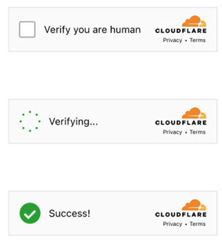

import Tabs from '@theme/Tabs';
import TabItem from '@theme/TabItem';
import ParamItem from '@theme/ParamItem';
import MethodItem from '@theme/MethodItem';
import MethodDescription from '@theme/MethodDescription'
import PriceBlock from '../../../../../src/theme/PriceBlock'
import PriceBlockWrap from '@theme/PriceBlockWrap';
import BlogLink from '@theme/BlogLink';
import { ArticleHead } from '../../../../../src/theme/ArticleHead';

<ArticleHead slug="captchas/turnstile-task" />

# Cloudflare Turnstile

<PriceBlockWrap>
  <PriceBlock title="Cloudflare Turnstile" captchaId="cf-turnstile"/>
</PriceBlockWrap>



Após resolver o CAPTCHA, você receberá um **token** que deve ser inserido em um campo específico da página.
Todos os subtipos do Turnstile são suportados automaticamente: **manual**, **não interativo** e **invisível**. Portanto, não é necessário especificar um subtipo para um captcha padrão.

<BlogLink url="https://capmonster.cloud/pt-BR/blog/Cloudflare/what-is-cloudflare-captcha"/>
<BlogLink url="https://capmonster.cloud/pt-BR/blog/Cloudflare/how-cloudflare-bot-challenge-and-turnstile-protect-web-traffic"/>

## Parâmetros da solicitação

Você deve resolver um captcha Turnstile **padrão**, como o mostrado [aqui](https://zenno.link/zl-support).
Observe que os captchas em páginas protegidas pelo Cloudflare podem parecer visualmente idênticos. Consulte [esta seção](#como-diferenciar-o-cloudflare-turnstile-do-cloudflare-challenge) para saber como diferenciar um captcha Turnstile padrão de um Cloudflare Challenge.


:::warning **Atenção!**
* O CapMonster Cloud, por padrão, funciona com proxies integrados — já incluídos no custo do serviço. É necessário especificar seus próprios proxies apenas nos casos em que o site não aceita o token ou quando o acesso aos serviços integrados está restrito. 

* Se o proxy utiliza autenticação por IP, é necessário adicionar o endereço **65.21.190.34** à lista de permissões (whitelist).
* Após resolver, você receberá um **token** para confirmar a conclusão do captcha.
:::

<TabItem value="proxyless" label="TurnstileTask (sem proxy)" default className="bordered-panel">
  <ParamItem title="type" required type="string" />
  **TurnstileTask**

  ---

  <ParamItem title="websiteURL" required type="string" />
  A URL da página onde o captcha será resolvido

  ---

  <ParamItem title="websiteKey" required type="string" />
  Chave do site Turnstile

  ---

  <ParamItem title="pageAction" type="string" />
  O campo `action` encontrado na função de callback quando o captcha é carregado

  ---

  <ParamItem title="data" type="string" />
  O valor do campo *data*, obtido do parâmetro `cData`.

  ---

  <ParamItem title="proxyType" type="string" />
**http** - proxy http/https comum;<br />
**https** - tente esta opção apenas se "http" não funcionar (necessário para alguns proxies personalizados);<br />
**socks4** - proxy socks4;<br />
**socks5** - proxy socks5.

---

<ParamItem title="proxyAddress" type="string" />
<p>
Endereço IP do proxy IPv4/IPv6. Não é permitido:
- uso de proxies transparentes (que revelem o IP do cliente);
- uso de proxies em máquinas locais.
</p>

---

<ParamItem title="proxyPort" type="integer" />
Porta do proxy.

---

<ParamItem title="proxyLogin" type="string" />
Login do servidor proxy.

---

<ParamItem title="proxyPassword" type="string" />
Senha do servidor proxy.


</TabItem>

---

## Método de criação da tarefa

<Tabs className="full-width-tabs filled-tabs request-tabs" groupId="captcha-type">

  <TabItem value="proxyless" label="TurnstileTask (sem proxy)" default className="method-panel">
    <MethodItem>
      ```http
      https://api.capmonster.cloud/createTask
      ```
    </MethodItem>
    <MethodDescription>
      **Solicitação**
      ```json
      {
        "clientKey": "API_KEY",
        "task": {
          "type": "TurnstileTask",
          "websiteURL": "http://tsmanaged.zlsupport.com",
          "websiteKey": "0x4AAAAAAABUYP0XeMJF0xoy"
        }
      }
      ```
  **Resposta**
  ```json
  {
    "errorId": 0,
    "taskId": 407533072
  }
  ```
</MethodDescription>

  </TabItem>

  <TabItem value="proxy" label="TurnstileTask (com proxy)" className="method-panel">
    <MethodItem>
      ```http
      https://api.capmonster.cloud/createTask
      ```
    </MethodItem>
    <MethodDescription>
      **Solicitação**
      ```json
      {
        "clientKey": "API_KEY",
        "task": {
          "type": "TurnstileTask",
          "websiteURL": "http://tsmanaged.zlsupport.com",
          "websiteKey": "0x4AAAAAAABUYP0XeMJF0xoy",
          "proxyType": "http",
          "proxyAddress": "8.8.8.8",
          "proxyPort": 8080,
          "proxyLogin": "proxyLoginHere",
          "proxyPassword": "proxyPasswordHere"
        }
      }
      ```

  **Resposta**
  ```json
  {
    "errorId": 0,
    "taskId": 407533072
  }
  ```
</MethodDescription>

  </TabItem>

</Tabs>

---

## Método de obter resultado da tarefa

Use o método [getTaskResult](../api/methods/get-task-result) para obter o resultado da resolução do Turnstile.
Dependendo da carga do sistema, a resposta pode levar de **5 a 20 segundos**.

<TabItem value="proxyless" label="TurnstileTask (proxyless)" default className="method-panel-full">
  <MethodItem>
    ```http
    https://api.capmonster.cloud/getTaskResult
    ```
  </MethodItem>
  <MethodDescription>
    **Solicitação**
    ```json
    {
      "clientKey": "API_KEY",
      "taskId": 407533072
    }
    ```

    **Resposta**
    ```json
    {
      "errorId": 0,
      "status": "ready",
      "solution": {
        "userAgent": "userAgentPlaceholder",
        "token": "0.iGX3xsyFCkbGePM3jP4P4khLo6TrLukt8ZzBvwuQOvbC...f61f3082"
      }
    }
    ```
  </MethodDescription>
</TabItem>


| **Propriedade** | **Tipo** | **Descrição**                                                        |
| :-------------- | :------- | :------------------------------------------------------------------- |
| token           | String   | Use o token em um campo de input ou ao chamar uma função de callback |

---

## Como diferenciar o Cloudflare Turnstile do Cloudflare Challenge

<details>
  <summary>Diferenças entre Turnstile e Challenge</summary>

Os tipos de verificação da Cloudflare podem aparecer de formas diferentes.

**Turnstile padrão:**


**Variantes estilizadas:**

<figure>


<figcaption>O Challenge está integrado de forma orgânica no próprio site.</figcaption>

</figure>

<figure>


<figcaption>Parece um Turnstile comum, mas na verdade é um Challenge.</figcaption>

</figure>

Para ter certeza absoluta da presença de um Challenge, você pode abrir as ferramentas de desenvolvedor, analisar o tráfego, estudar o código da página e observar os sinais característicos:

* A primeira requisição ao site retorna status 403:


* O formulário com id **challenge-form** possui atributo **action** (não confundir com o action do Turnstile captcha) contendo o parâmetro `__cf_chl_f_tk=`:


* A página contém duas tags `<script>` similares que criam novos valores no objeto `window`:


</details>

---

## Como encontrar todos os parâmetros necessários para a criação da tarefa

### Manualmente

1. Abra seu site onde o captcha aparece no navegador.
2. Clique com o botão direito no elemento do captcha e selecione **Inspecionar**.

#### websiteKey

Pode ser encontrado em **Elements**:


#### pageAction

*Action* e *sitekey* também podem ser encontrados na função *callback*:


### Automaticamente

Para automatizar a extração dos parâmetros, eles podem ser obtidos via **navegador** (normal ou headless, por exemplo, usando **Playwright**) ou diretamente a partir de **requisições HTTP**. Como os valores dos parâmetros dinâmicos têm curta duração, recomenda-se utilizá-los imediatamente após a extração.

:::warning **Importante!**
Os trechos de código fornecidos são exemplos básicos para aprendizado sobre como extrair os parâmetros necessários. A implementação exata dependerá do seu site com captcha, sua estrutura e os elementos HTML e seletores utilizados.
:::

<Tabs className="full-width-tabs filled-tabs request-tabs">
  <TabItem value="js" label="JavaScript" default className="method-panel">
    <details>
      <summary>Mostrar código (para navegador)</summary>

      ```js
      // Função para verificar a presença de window.onloadTurnstileCallback
      const checkTurnstileCallback = () => {
        return new Promise((resolve, reject) => {
          const timeout = setTimeout(() => reject('Callback timeout'), 30000);

          const interval = setInterval(() => {
            if (window.onloadTurnstileCallback !== undefined) {
              clearInterval(interval);
              clearTimeout(timeout);

              const callbackDetails = window.onloadTurnstileCallback.toString();
              const sitekeyMatch = callbackDetails.match(/sitekey: ['"]([^'"]+)['"]/);
              const actionMatch = callbackDetails.match(/action: ['"]([^'"]+)['"]/);

              resolve({
                sitekey: sitekeyMatch ? sitekeyMatch[1] : null,
                action: actionMatch ? actionMatch[1] : null,
              });
            }
          }, 500);
        });
      };

      // Tentar encontrar qualquer elemento com data-sitekey
      const turnstileElement = document.querySelector('[data-sitekey]');

      if (turnstileElement) {
        // Extrair o valor do atributo data-sitekey
        const sitekey = turnstileElement.getAttribute("data-sitekey");
        console.log("Turnstile Sitekey (from element):", sitekey);
      } else {
        console.log("Turnstile element not found. Checking via callback...");

        // Se o elemento não for encontrado, verificar via window.onloadTurnstileCallback
        checkTurnstileCallback()
          .then((data) => {
            console.log("Turnstile Params (from callback):", data);
          })
          .catch((error) => {
            console.error(error);
          });
      }
      ```
    </details>

  </TabItem>

  <TabItem value="python" label="Python" className="method-panel">
    <details>
      <summary>Mostrar código</summary>

      ```python
      import asyncio
      from playwright.async_api import async_playwright

      async def run():
          async with async_playwright() as p:
              browser = await p.chromium.launch(headless=False)
              context = await browser.new_context()
              page = await context.new_page()

              await page.goto("https://example.com")  # Substitua pelo seu site

              # Tentar encontrar um elemento com data-sitekey
              element = await page.query_selector('[data-sitekey]')
              if element:
                  sitekey = await element.get_attribute("data-sitekey")
                  print("Turnstile Sitekey (from element):", sitekey)
              else:
                  print("Turnstile element not found. Checking via callback...")

                  try:
                      result = await page.evaluate('''() => {
                          return new Promise((resolve, reject) => {
                              const timeout = setTimeout(() => reject('Callback timeout'), 30000);
                              const interval = setInterval(() => {
                                  if (window.onloadTurnstileCallback !== undefined) {
                                      clearInterval(interval);
                                      clearTimeout(timeout);
                                      const cbStr = window.onloadTurnstileCallback.toString();
                                      const sitekeyMatch = cbStr.match(/sitekey: ['"]([^'"]+)['"]/);
                                      const actionMatch = cbStr.match(/action: ['"]([^'"]+)['"]/);
                                      resolve({
                                          sitekey: sitekeyMatch ? sitekeyMatch[1] : null,
                                          action: actionMatch ? actionMatch[1] : null,
                                      });
                                  }
                              }, 500);
                          });
                      }''')
                      print("Turnstile Params (from callback):", result)
                  except Exception as e:
                      print("Error:", e)

              await browser.close()

      asyncio.run(run())
      ```
    </details>

  </TabItem>

  <TabItem value="csharp" label="C#" className="method-panel">
    <details>
      <summary>Mostrar código</summary>

      ```csharp
      using System;
      using System.Text.RegularExpressions;
      using System.Threading.Tasks;
      using Microsoft.Playwright;

      class Program
      {
          public static async Task Main()
          {
              using var playwright = await Playwright.CreateAsync();
              var browser = await playwright.Chromium.LaunchAsync(new BrowserTypeLaunchOptions
              {
                  Headless = false
              });

              var context = await browser.NewContextAsync();
              var page = await context.NewPageAsync();

              await page.GotoAsync("https://example.com"); // Substitua pela URL alvo

              var element = await page.QuerySelectorAsync("[data-sitekey]");

              if (element != null)
              {
                  var sitekey = await element.GetAttributeAsync("data-sitekey");
                  Console.WriteLine($"Turnstile Sitekey (from element): {sitekey}");
              }
              else
              {
                  Console.WriteLine("Turnstile element not found. Checking via callback...");

                  try
                  {
                      var result = await page.EvaluateAsync(@"() => {
                          return new Promise((resolve, reject) => {
                              const timeout = setTimeout(() => reject('Callback timeout'), 30000);
                              const interval = setInterval(() => {
                                  if (window.onloadTurnstileCallback !== undefined) {
                                      clearInterval(interval);
                                      clearTimeout(timeout);
                                      const cbStr = window.onloadTurnstileCallback.toString();
                                      const sitekeyMatch = cbStr.match(/sitekey: ['""]([^'""]+)['""]/);
                                      const actionMatch = cbStr.match(/action: ['""]([^'""]+)['""]/);
                                      resolve({
                                          sitekey: sitekeyMatch ? sitekeyMatch[1] : null,
                                          action: actionMatch ? actionMatch[1] : null
                                      });
                                  }
                              }, 500);
                          });
                      }");

                      Console.WriteLine("Turnstile Params (from callback): " + result?.ToString());
                  }
                  catch (Exception ex)
                  {
                      Console.WriteLine("Error: " + ex.Message);
                  }
              }

              await browser.CloseAsync();
          }
      }
      ```
    </details>
  </TabItem>
</Tabs>

## Usar biblioteca SDK

<Tabs className="full-width-tabs filled-tabs request-tabs" groupId="captcha-type">
  <TabItem value="js" label="JavaScript" default className="method-panel">

<details>
<summary>Mostrar código (para navegador)</summary>

```js
// https://github.com/ZennoLab/capmonstercloud-client-js

import { 
    CapMonsterCloudClientFactory, 
    ClientOptions, 
    TurnstileRequest 
} from '@zennolab_com/capmonstercloud-client';

const API_KEY = "YOUR_API_KEY"; // Insira sua chave de API do CapMonster Cloud

document.addEventListener("DOMContentLoaded", async () => {
    const client = CapMonsterCloudClientFactory.Create(
        new ClientOptions({ clientKey: API_KEY })
    );

    // Exemplo básico sem proxy
    // O CapMonster Cloud usa automaticamente seus próprios proxies
    let turnstileRequest = new TurnstileRequest({
        websiteURL: "http://tsmanaged.zlsupport.com", // URL da página com a captcha
        websiteKey: "0x4AAAAAAABUYP0XeMJF0xoy"        // Substitua pelo valor correto
    });

    // Exemplo de uso do seu próprio proxy
    // Descomente este bloco se quiser usar um proxy personalizado

    /*
    const proxy = {
        proxyType: "https",
        proxyAddress: "123.45.67.89",
        proxyPort: 8080,
        proxyLogin: "proxyLogin",
        proxyPassword: "proxyPassword"
    };

    turnstileRequest = new TurnstileRequest({
        websiteURL: "http://tsmanaged.zlsupport.com",
        websiteKey: "0x4AAAAAAABUYP0XeMJF0xoy",
        proxy,
        userAgent: "userAgentPlaceholder"
    });
    */

    // Se necessário, você pode verificar o saldo 
    const balance = await client.getBalance();
    console.log("Balance:", balance);

    const result = await client.Solve(turnstileRequest);
    console.log("Solution:", result);
});
```
</details>

<details>
      <summary>Mostrar código (Node.js)</summary>

```js
// https://github.com/ZennoLab/capmonstercloud-client-js

import { CapMonsterCloudClientFactory, ClientOptions, TurnstileRequest } from '@zennolab_com/capmonstercloud-client';

const API_KEY = "YOUR_API_KEY"; // Insira sua chave de API do CapMonster Cloud

async function solveTurnstile() {
    const client = CapMonsterCloudClientFactory.Create(
        new ClientOptions({ clientKey: API_KEY })
    );

    // Exemplo básico sem proxy
    // O CapMonster Cloud usa automaticamente seus próprios proxies
    let turnstileRequest = new TurnstileRequest({
        websiteURL: "http://tsmanaged.zlsupport.com", // URL da página com a captcha
        websiteKey: "0x4AAAAAAABUYP0XeMJF0xoy"        // Substitua pelo valor correto
    });

    // Exemplo de uso do seu próprio proxy
    // Descomente este bloco se quiser usar um proxy personalizado

    /*
    const proxy = {
        proxyType: "https",
        proxyAddress: "123.45.67.89",
        proxyPort: 8080,
        proxyLogin: "proxyLogin",
        proxyPassword: "proxyPassword"
    };

    turnstileRequest = new TurnstileRequest({
        websiteURL: "http://tsmanaged.zlsupport.com",
        websiteKey: "0x4AAAAAAABUYP0XeMJF0xoy",
        proxy,
        userAgent: "userAgentPlaceholder"
    });
    */

    // Se necessário, você pode verificar o saldo 
    const balance = await client.getBalance();
    console.log("Balance:", balance);

    const result = await client.Solve(turnstileRequest);
    console.log("Solution:", result);
}

solveTurnstile().catch(err => console.error("Erro:", err));
```

</details>
  </TabItem>

  <TabItem value="python" label="Python" className="method-panel">

<details>
<summary>Mostrar código</summary>

```python
# https://github.com/ZennoLab/capmonstercloud-client-python

import asyncio
from capmonstercloudclient import CapMonsterClient, ClientOptions
from capmonstercloudclient.requests import TurnstileRequest
# from capmonstercloudclient.requests.baseRequestWithProxy import ProxyInfo  # Descomente se quiser usar proxies personalizados

API_KEY = "YOUR_API_KEY"  # Insira sua chave de API do CapMonster Cloud

async def solve_turnstile_token():
    client_options = ClientOptions(api_key=API_KEY)
    cap_monster_client = CapMonsterClient(options=client_options)

    # Exemplo básico sem proxy
    # O CapMonster Cloud usa automaticamente seus próprios proxies
    turnstile_request = TurnstileRequest(
        websiteURL="http://tsmanaged.zlsupport.com",
        websiteKey="0x4AAAAAAABUYP0XeMJF0xoy",
    )

    # Exemplo de uso do seu próprio proxy
    # Descomente este bloco se quiser usar um proxy personalizado
    #
    # proxy = ProxyInfo(
    #     proxyType="http",
    #     proxyAddress="123.45.67.89",
    #     proxyPort=8080,
    #     proxyLogin="username",
    #     proxyPassword="password"
    # )
    #
    # turnstile_request = TurnstileRequest(
    #     websiteURL="http://tsmanaged.zlsupport.com",
    #     websiteKey="0x4AAAAAAABUYP0XeMJF0xoy",
    #     proxy=proxy
    # )

    # Se necessário, você pode verificar o saldo 
    balance = await cap_monster_client.get_balance()
    print("Balance:", balance)

    result = await cap_monster_client.solve_captcha(turnstile_request)
    print("Solution:", result)

asyncio.run(solve_turnstile_token())
```

</details>
  </TabItem>

  <TabItem value="csharp" label="C#" className="method-panel">

<details>
<summary>Mostrar código</summary>

```csharp
// https://github.com/ZennoLab/capmonstercloud-client-dotnet

using System;
using System.Threading.Tasks;
using Zennolab.CapMonsterCloud;
using Zennolab.CapMonsterCloud.Requests;

class Program
{
    static async Task Main(string[] args)
    {
        // Insira sua chave de API do CapMonster Cloud
        var clientOptions = new ClientOptions
        {
            ClientKey = "YOUR_API_KEY"
        };

        var cmCloudClient = CapMonsterCloudClientFactory.Create(clientOptions);

        // Exemplo básico sem proxy
        // O CapMonster Cloud usa automaticamente seus próprios proxies
        var turnstileRequest = new TurnstileRequest
        {
            WebsiteUrl = "http://tsmanaged.zlsupport.com", // URL da página com a captcha
            WebsiteKey = "0x4AAAAAAABUYP0XeMJF0xoy"       // Substitua pelo valor correto
        };

        // Exemplo de uso do seu próprio proxy
        // Descomente este bloco se quiser usar um proxy personalizado

        /*
        var turnstileRequest = new TurnstileRequest
        {
            WebsiteUrl = "http://tsmanaged.zlsupport.com",
            WebsiteKey = "0x4AAAAAAABUYP0XeMJF0xoy",

            Proxy = new ProxyContainer(
                "123.45.67.89", 
                8080,
                ProxyType.Http, 
                "username",
                "password"
            )
        };
        */

        // Se necessário, você pode verificar o saldo 
        var balance = await cmCloudClient.GetBalanceAsync();
        Console.WriteLine("Balance: " + balance);

        var turnstileResult = await cmCloudClient.SolveAsync(turnstileRequest);

        Console.WriteLine("Solution: " + turnstileResult.Solution.Value);
    }
}
```
</details>
  </TabItem>
</Tabs>

