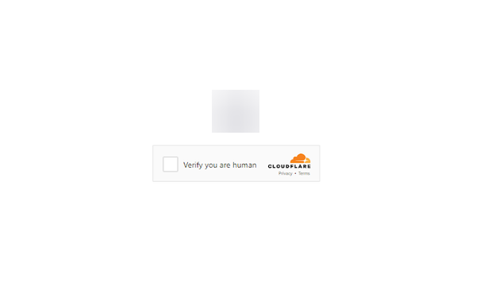
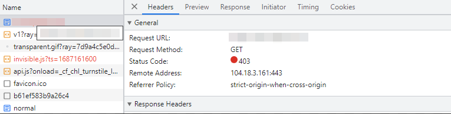

import Tabs from '@theme/Tabs';
import TabItem from '@theme/TabItem';
import ParamItem from '@theme/ParamItem';
import MethodItem from '@theme/MethodItem';
import MethodDescription from '@theme/MethodDescription'
import PriceBlock from '../../../../../src/theme/PriceBlock';
import PriceBlockWrap from '@theme/PriceBlockWrap';
import BlogLink from '@theme/BlogLink';

# Cloudflare TurnstileTask | Challenge | Waiting Room

<PriceBlockWrap>
  <PriceBlock title="TurnstileTask" captchaId="cf-turnstile"/>
</PriceBlockWrap>

Todos os subtipos Turnstile são suportados automaticamente: manual, não interativo e invisível. Portanto, não é necessário especificar um subtipo para um captcha padrão.

<BlogLink url="https://capmonster.cloud/ru/blog/Cloudflare/what-is-cloudflare-captcha"/>
<BlogLink url="https://capmonster.cloud/ru/blog/Cloudflare/how-cloudflare-bot-challenge-and-turnstile-protect-web-traffic"/>

:::info Importante:
Antes de começar, revise todas as três opções de resolução de captcha e escolha a que melhor atende às suas necessidades.
:::

## Opção 1 (Turnstile)

Você precisa resolver um captcha **Turnstile padrão**, como [aqui](https://zenno.link/zl-support). Note que os captchas nas páginas da Cloudflare podem parecer idênticos. Veja no final do artigo como distinguir um Turnstile padrão de um Cloudflare Challenge.

:::warning **Atenção!**
* Você **não precisa** usar seus próprios proxies para esta tarefa.
* Após resolver, você receberá um **token** para confirmar a conclusão do captcha.
:::

#### Parâmetros da Requisição
<TabItem value="proxyless" label="TurnstileTask (sem proxy)" default className="bordered-panel">
  <ParamItem title="type" required type="string" />
  **TurnstileTask**

  ---

  <ParamItem title="websiteURL" required type="string" />
  A URL da página onde o captcha será resolvido

  ---

  <ParamItem title="websiteKey" required type="string" />
  Chave do site Turnstile

  ---

  <ParamItem title="pageAction" type="string" />
  O campo `action` encontrado na função de callback quando o captcha é carregado

  ---

  <ParamItem title="data" type="string" />
  O valor do campo *data*, obtido do parâmetro `cData`.

</TabItem>

---

## Opção 2 (Challenge)

:::warning **Atenção!**
* Você **não precisa** usar seus próprios proxies para esta tarefa.
* Após resolver, você receberá um **token** para confirmar a conclusão do captcha.
:::

#### Parâmetros da Requisição
<TabItem value="proxyless" label="RecaptchaV2EnterpriseTaskProxyless (sem proxy)" default className="bordered-panel">
  <ParamItem title="type" required type="string" />
  **TurnstileTask**

  ---

  <ParamItem title="websiteURL" required type="string" />
  A URL da página onde o captcha será resolvido

  ---

  <ParamItem title="websiteKey" required type="string" />
  Chave do site Turnstile

  ---

  <ParamItem title="cloudflareTaskType" required type="string" />
  **token**

  ---

  <ParamItem title="pageAction" required type="string" />
  O campo `action` encontrado na função de callback. Se estiver usando *cloudflareTaskType*, `action` geralmente é “managed” ou “non-interactive”.

  ---

  <ParamItem title="userAgent" required type="string" />
  User-Agent do navegador.<br /> **Forneça apenas o UA do Windows atual:** userAgentPlaceholder

  ---

  <ParamItem title="data" required type="string" />
  O valor do campo *data*, obtido de `cData`.

  ---

  <ParamItem title="pageData" required type="string" />
  O valor de *pageData*, obtido de `chlPageData`.

  ---

  <ParamItem title="apiJsUrl" type="string" />
  String contendo a URL do script do captcha.

</TabItem>

<br />

Estes parâmetros estão no objeto passado para `window.turnstile.render(el, paramsObj)` ao criar o captcha. Você pode obtê-los, por exemplo, executando JavaScript antes de carregar outros scripts:

```js
(function () {
  const obj = {
    render: function () {
      const { action, cData, chlPageData } = arguments[1];
        const params = [
          ["action", action],
          ["data", cData],
          ["pageData", chlPageData],
        ];
        console.table(params)
    }
  };

  Object.defineProperty(window, "turnstile", {
    get: () => {
      return obj;
    },
  });
})();
````

Quando `window.turnstile.render(el, paramsObj)` é chamado, o captcha é carregado na página e, após a resolução bem-sucedida, a função `callback` retorna as informações da solução.

`window.turnstile.render(el, paramsObj):`

* `el`: Elemento DOM onde o captcha será inserido.
* `paramsObj`: Objeto contendo informações do captcha e instruções de resolução. Geralmente inclui *sitekey*, *action*, *cData*, *chlPageData*, *callback*.
* `callback`: Função chamada após o captcha ser resolvido com sucesso.

---

## Opção 3 (Challenge)

:::warning **Atenção!**

* Use **seus próprios proxies** para esta tarefa.
* Após resolver, você receberá **cookies especiais** para adicionar ao navegador.
:::

#### Parâmetros da Requisição

<TabItem value="proxyless" label="RecaptchaV2EnterpriseTaskProxyless (sem proxy)" default className="bordered-panel">
  <ParamItem title="type" required type="string" />
  **TurnstileTask**

---

  <ParamItem title="websiteURL" required type="string" />
  A URL da página onde o captcha será resolvido

---

  <ParamItem title="websiteKey" required type="string" />
  Chave do site Turnstile (qualquer string é aceita)

---

  <ParamItem title="cloudflareTaskType" type="string" />
  **cf_clearance**

---

  <ParamItem title="htmlPageBase64" required type="string" />
  Página HTML codificada em Base64 do "Just a moment" exibido com resposta 403.<br/>
  Exemplo para obter `htmlPageBase64`:
  ```js
  var htmlContent = document.documentElement.outerHTML;
  var htmlBase64 = btoa(unescape(encodeURIComponent(htmlContent)));
  console.log(htmlBase64);
  ```

---

  <ParamItem title="userAgent" required type="string" />
  User-Agent do navegador.<br />
  **Forneça apenas o UA do Windows atual:** userAgentPlaceholder

---

  <ParamItem title="proxyType" required type="string" />
  **http** - proxy HTTP/HTTPS normal;<br />
  **https** - use se http não funcionar (necessário para alguns proxies personalizados);<br />
  **socks4** - proxy SOCKS4;<br />
  **socks5** - proxy SOCKS5.

---

  <ParamItem title="proxyAddress" required type="string" />
  <p>
    Endereço IP do proxy (IPv4/IPv6). Não permitido:
    - Nomes de host
    - Proxies transparentes
    - Proxies da máquina local
  </p>

---

  <ParamItem title="proxyPort" required type="integer" />
  Porta do proxy.

---

  <ParamItem title="proxyLogin" required type="string" />
  Login do proxy.

---

  <ParamItem title="proxyPassword" required type="string" />
  Senha do proxy.

</TabItem>

---

## Opção 4 (Waiting Room)

:::warning **Atenção!**

* Use **seus próprios proxies** para esta tarefa.
* Após resolver, você receberá **cookies especiais** para adicionar ao navegador.
:::

Este é um novo mecanismo de proteção da Cloudflare: o usuário deve esperar em média \~3 minutos antes de acessar o recurso:


Você também pode identificar este tipo de Cloudflare pelo cabeçalho da página:


---

#### Parâmetros da Requisição

<TabItem value="proxyless" label="RecaptchaV2EnterpriseTaskProxyless (sem proxy)" default className="bordered-panel">
  <ParamItem title="type" required type="string" />
  **TurnstileTask**

---

  <ParamItem title="websiteURL" required type="string" />
  A URL da página contendo a verificação

---

  <ParamItem title="websiteKey" required type="string" />
  Chave do site Cloudflare

---

  <ParamItem title="cloudflareTaskType" type="string" />
  **wait_room**

---

  <ParamItem title="htmlPageBase64" required type="string" />
  Página HTML codificada em Base64 contendo `<title>Waiting Room powered by Cloudflare</title>`

---

  <ParamItem title="userAgent" required type="string" />
  User-Agent do navegador.<br />
  **Forneça apenas o UA do Windows atual:** userAgentPlaceholder

---

  <ParamItem title="proxyType" required type="string" />
  **http** - proxy HTTP/HTTPS normal;<br />
  **https** - use se http não funcionar (necessário para alguns proxies personalizados);<br />
  **socks4** - proxy SOCKS4;<br />
  **socks5** - proxy SOCKS5.

---

  <ParamItem title="proxyAddress" required type="string" />
  <p>
    Endereço IP do proxy (IPv4/IPv6). Não permitido:
    - Nomes de host
    - Proxies transparentes
    - Proxies da máquina local
  </p>

---

  <ParamItem title="proxyPort" required type="integer" />
  Porta do proxy.

---

  <ParamItem title="proxyLogin" required type="string" />
  Login do proxy.

---

  <ParamItem title="proxyPassword" required type="string" />
  Senha do proxy.

</TabItem>
---

## Exemplos de Requisição

### Opção 1. Turnstile padrão:

<TabItem value="proxyless" label="TurnstileTask (sem proxy)" default className="method-panel">
	<MethodItem>
		```http
		https://api.capmonster.cloud/createTask
		```
	</MethodItem>
	<MethodDescription>
		**Requisição**
		```json
		{
			"clientKey":"API_KEY",
			"task":
			{
				"type":"TurnstileTask",
				"websiteURL":"http://tsmanaged.zlsupport.com",
				"websiteKey":"0x4AAAAAAABUYP0XeMJF0xoy"
			}
		}
		```
		**Resposta**
		```json
		{
		  "errorId":0,
		  "taskId":407533072
		}
		```
	</MethodDescription>
</TabItem>
---
### Opção 2. Challenge (token)
<TabItem value="proxyless" label="TurnstileTask (sem proxy)" default className="method-panel">
	<MethodItem>
		```http
		https://api.capmonster.cloud/createTask
		```
	</MethodItem>
	<MethodDescription>
		**Requisição**
		```json
		{
			"clientKey": "API_KEY",
			"task": {
				"type": "TurnstileTask",
				"websiteURL": "https://example.com",
				"websiteKey": "0x4AAAAAAADnPIDROrmt1Wwj",
				"cloudflareTaskType": "token",
				"userAgent":"userAgentPlaceholder",
				"pageAction": "managed",
				"pageData": "HUHDWUHuhuwfiweh32..uh2uhuhyugYUG=",
				"data": "874291f4retD1366"
			}
		}
		```
		**Resposta**
		```json
		{
		  "errorId":0,
		  "taskId":407533072
		}
		```
	</MethodDescription


>

</TabItem>
---
### Opção 3. Challenge (cookie)
<TabItem value="proxyless" label="TurnstileTask (sem proxy)" default className="method-panel">
	<MethodItem>
		```http
		https://api.capmonster.cloud/createTask
		```
	</MethodItem>
	<MethodDescription>
		**Requisição**
		```json 
		{
		  "clientKey":"API_KEY",
		  "task": {
			"type":"TurnstileTask",
			"websiteURL":"https://example.com",
			"websiteKey":"xxxxxxxxxx",
			"cloudflareTaskType": "cf_clearance",
			"htmlPageBase64": "PCFET0NUWVBFIGh0...vYm9keT48L2h0bWw+",
			"userAgent": "userAgentPlaceholder",
			"proxyType":"http",
			"proxyAddress":"8.8.8.8",
			"proxyPort":8080,
			"proxyLogin":"proxyLoginHere",
			"proxyPassword":"proxyPasswordHere"
		  }
		}
		```
		**Resposta**
		```json
		{
		  "errorId":0,
		  "taskId":407533072
		}
		```
	</MethodDescription>
</TabItem>
---
### Opção 4. Waiting Room (cookie)
<TabItem value="proxyless" label="TurnstileTask (sem proxy)" default className="method-panel">
	<MethodItem>
		```http
		https://api.capmonster.cloud/createTask
		```
	</MethodItem>
	<MethodDescription>
		**Requisição**
		```json 
		{
		  "clientKey":"API_KEY",
		  "task": {
			"type":"TurnstileTask",
			"websiteURL":"https://example.com",
			"websiteKey":"xxxxxxxxxx",
			"cloudflareTaskType": "wait_room",
			"htmlPageBase64": "PCFET0NUWVBFIGh0...vYm9keT48L2h0bWw+",
			"userAgent": "userAgentPlaceholder",
			"proxyType":"http",
			"proxyAddress":"8.8.8.8",
			"proxyPort":8080,
			"proxyLogin":"proxyLoginHere",
			"proxyPassword":"proxyPasswordHere"
		  }
		}
		```
		**Resposta**
		```json
		{
		  "errorId":0,
		  "taskId":407533072
		}
		```
	</MethodDescription>
</TabItem>
---
## Método para Obter o Resultado da Tarefa
Use o método [getTaskResult](../api/methods/get-task-result.md) para obter a solução do Turnstile. Dependendo da carga do sistema, a resposta pode levar entre 5 e 20 segundos.

| **Propriedade** | **Tipo** | **Descrição**                                                         |
| :-------------- | :------- | :-------------------------------------------------------------------- |
| cf\_clearance   | String   | Cookies especiais do Cloudflare que você pode configurar no navegador |
| token           | String   | Use este token ao chamar a função de callback                         |

---

## Como distinguir um Turnstile padrão de um Cloudflare Challenge

Os desafios da Cloudflare podem aparecer de maneira diferente.

**Turnstile padrão:**


**Variantes estilizadas:**

<figure>


<figcaption>O desafio é integrado de forma contínua ao site</figcaption>

</figure>

<figure>



<figcaption>Parece um Turnstile normal, mas na verdade é um desafio da Cloudflare</figcaption>

</figure>

Para confirmar a presença da Cloudflare, abra as ferramentas de desenvolvedor, inspecione o tráfego de rede e verifique o código-fonte da página para sinais típicos:

* A primeira requisição ao site retorna status 403:



* O formulário com id **challenge-form** possui atributo **action** (não confundir com o action do Turnstile captcha) contendo o parâmetro `__cf_chl_f_tk=`:


* A página contém duas tags `<script>` similares que criam novos valores no objeto `window`:


<details>
        <summary>Exemplo de implementação usando Selenium no Node.js</summary>

```js
const { Builder } = require('selenium-webdriver');
const chrome = require('selenium-webdriver/chrome');

(async function example() {
  const options = new chrome.Options();
  options.addArguments('--auto-open-devtools-for-tabs')

  const driver = new Builder()
    .forBrowser('chrome')
    .setChromeOptions(options)
    .build();

  try {
    driver.executeScript(`
    window.turnstile = new Proxy(window.turnstile, {
      get(target, prop) {
        if (prop === 'render') {
          return function(a, b) {
            let p = {
              type: "TurnstileTask",
              websiteKey: b.sitekey,
              websiteURL: window.location.href,
              data: b.cData,
              pagedata: b.chlPageData,
              action: b.action,
              userAgent: navigator.userAgent
          }
          
          console.log(JSON.stringify(p))
          window.params = p;
          window.turnstileCallback = b.callback;
            return target.render.apply(this, arguments);
          }
        }
        return target[prop];
      }
    });
    `)

    driver.get('SITE WITH CAPTCHA');
    
    const params = await driver.executeScript(`
      return new Promise((resolve, reject) => {
        setTimeout(() => {
          resolve(window.params)
        }, 2000)
      })
    `);

    if (params) {
      const data = {
        clientKey: 'API KEY',
        task: {
          type: 'TurnstileTask',
          websiteURL: params.websiteURL,
          websiteKey: params.websiteKey,
          data: params.data,
          action: params.action
        }
      }

      const createResult = await fetch('https://api.capmonster.cloud/createTask', {
        method: 'post',
        body: JSON.stringify(data)
      });

      const createTaskResult = await createResult.json()

      if (createTaskResult.taskId) {
        const asyncDelay = (timeout) =>
          new Promise(resolve => {
              setTimeout(() => {
                  resolve();
              }, timeout);
          });
        
        const getTaskResult = async (taskId) => {
          const taskResult = await fetch('https://api.capmonster.cloud/getTaskResult', {
            method: 'post',
            body: JSON.stringify({
              "clientKey":"API KEY",
              "taskId": createTaskResult.taskId
            })
          });
          const taskResponse = await taskResult.json();
          if (taskResponse.status === 'processing') {
            await asyncDelay(5000);
            return await getTaskResult(taskId)
          }
          return taskResponse;
        }
       
        const taskRes = await getTaskResult(createTaskResult.taskId)

        if (taskRes.solution) {
          await driver.executeScript(`
            window.turnstileCallback(${taskRes.solution.token});
          `);
        }
      }
      
    }

    //FAÇA ALGO
  } finally {
    await driver.quit();
  }
})();
```

</details>

## Como Encontrar Todos os Parâmetros Necessários para a Criação da Tarefa

### Manualmente

1. Abra seu site onde o captcha aparece no navegador.
2. Clique com o botão direito no elemento do captcha e selecione **Inspecionar**.

#### Opção 1.

#### websiteKey

Pode ser encontrado em **Elements**:


Você também pode usar um comando no console abrindo a URL do captcha (começando com `https://challenges.cloudflare.com/cdn-cgi/challenge-platform/h/g…`) em uma aba separada:

`console.log(window._cf_chl_opt.chlApiSitekey);`

*chlApiSitekey* é o sitekey.

#### pageAction

*Action* e *sitekey* também podem ser encontrados na função *callback*:


Para as **Opções 2** e **3**, é melhor extrair os parâmetros automaticamente:

### Automaticamente

Uma forma conveniente de automatizar a busca por todos os parâmetros necessários.  
Alguns parâmetros são regenerados a cada carregamento da página, então você precisará extraí-los através de um navegador — seja normal ou headless (por exemplo, usando **Playwright**).  
Como os valores dos parâmetros dinâmicos são de curta duração, o captcha deve ser resolvido imediatamente após a captura deles.

:::warning **Importante!**  
Os trechos de código fornecidos são exemplos básicos para familiarização com a extração dos parâmetros necessários. A implementação exata dependerá da sua página de captcha, sua estrutura e dos elementos/seletores HTML que ela utiliza.  
:::

<Tabs className="full-width-tabs filled-tabs request-tabs">
  <TabItem value="js" label="JavaScript" default className="method-panel">
    <details>
      <summary>Opção 1 (No Navegador)</summary>

      ```js
      // Função para verificar a presença de window.onloadTurnstileCallback
      const checkTurnstileCallback = () => {
        return new Promise((resolve, reject) => {
          const timeout = setTimeout(() => reject('Tempo limite do callback'), 30000);

          const interval = setInterval(() => {
            if (window.onloadTurnstileCallback !== undefined) {
              clearInterval(interval);
              clearTimeout(timeout);

              const callbackDetails = window.onloadTurnstileCallback.toString();
              const sitekeyMatch = callbackDetails.match(/sitekey: ['"]([^'"]+)['"]/);
              const actionMatch = callbackDetails.match(/action: ['"]([^'"]+)['"]/);

              resolve({
                sitekey: sitekeyMatch ? sitekeyMatch[1] : null,
                action: actionMatch ? actionMatch[1] : null,
              });
            }
          }, 500);
        });
      };

      // Tenta encontrar qualquer elemento com data-sitekey
      const turnstileElement = document.querySelector('[data-sitekey]');

      if (turnstileElement) {
        // Extrai o valor do atributo data-sitekey
        const sitekey = turnstileElement.getAttribute("data-sitekey");
        console.log("Turnstile Sitekey (do elemento):", sitekey);
      } else {
        console.log("Elemento Turnstile não encontrado. Verificando via callback...");

        // Se o elemento não for encontrado, verifica via window.onloadTurnstileCallback
        checkTurnstileCallback()
          .then((data) => {
            console.log("Parâmetros Turnstile (do callback):", data);
          })
          .catch((error) => {
            console.error(error);
          });
      }
      ```
    </details>

    <details>
      <summary>Opção 2 (Node.js)</summary>

      ```js
      import { chromium } from "playwright";

      (async () => {
        const browser = await chromium.launch({ headless: false });
        const page = await browser.newPage();

        let params = null;

        try {
          while (!params) {
            await page.goto("https://example.com");

            await page.evaluate(() => {
              window.turnstile = new Proxy(window.turnstile, {
                get(target, prop) {
                  if (prop === "render") {
                    return function (a, b) {
                      const p = {
                        websiteKey: b.sitekey,
                        websiteURL: window.location.href,
                        data: b.cData,
                        pagedata: b.chlPageData,
                        action: b.action,
                        userAgent: navigator.userAgent,
                      };
                      window.params = p;
                      return target.render.apply(this, arguments);
                    };
                  }
                  return target[prop];
                },
              });
            });

            params = await page.evaluate(() => {
              return new Promise((resolve) => {
                setTimeout(() => resolve(window.params || null), 5000);
              });
            });

            if (!params) {
              await page.waitForTimeout(3000);
            }
          }

          console.log("Parâmetros Turnstile:", params);
        } finally {
          await browser.close();
        }
      })();
      ```
    </details>

    <details>
      <summary>Opção 3 (Node.js)</summary>

      ```js
      import { chromium } from "playwright";
      import { Buffer } from "buffer";

      (async () => {
        const browser = await chromium.launch({ headless: false });
        const page = await browser.newPage();

        let websiteKey = null;

        while (!websiteKey) {
          await page.goto("https://example.com");

          await page.evaluate(() => {
            window.turnstile = new Proxy(window.turnstile, {
              get(target, prop) {
                if (prop === "render") {
                  return function (a, b) {
                    window.websiteKey = b.sitekey;
                    return target.render.apply(this, arguments);
                  };
                }
                return target[prop];
              },
            });
          });

          websiteKey = await page.evaluate(() => {
            return new Promise((resolve) => {
              setTimeout(() => resolve(window.websiteKey || null), 5000);
            });
          });

          if (!websiteKey) {
            await page.waitForTimeout(3000);
          }
        }

        const html = await page.content();
        const htmlPageBase64 = Buffer.from(html).toString("base64");

        const result = {
          websiteKey,
          htmlPageBase64,
        };

        console.log(result);

        await browser.close();
      })();
      ```
    </details>
  </TabItem>

  <TabItem value="python" label="Python" className="method-panel">
    <details>
      <summary>Opção 1</summary>

      ```python
      import asyncio
      from playwright.async_api import async_playwright

      async def run():
          async with async_playwright() as p:
              browser = await p.chromium.launch(headless=False)
              context = await browser.new_context()
              page = await context.new_page()

              await page.goto("https://example.com")  # Substitua pelo seu site

              # Tenta encontrar um elemento com data-sitekey
              element = await page.query_selector('[data-sitekey]')
              if element:
                  sitekey = await element.get_attribute("data-sitekey")
                  print("Turnstile Sitekey (do elemento):", sitekey)
              else:
                  print("Elemento Turnstile não encontrado. Verificando via callback...")

                  try:
                      result = await page.evaluate('''() => {
                          return new Promise((resolve, reject) => {
                              const timeout = setTimeout(() => reject('Tempo limite do callback'), 30000);
                              const interval = setInterval(() => {
                                  if (window.onloadTurnstileCallback !== undefined) {
                                      clearInterval(interval);
                                      clearTimeout(timeout);
                                      const cbStr = window.onloadTurnstileCallback.toString();
                                      const sitekeyMatch = cbStr.match(/sitekey: ['"]([^'"]+)['"]/);
                                      const actionMatch = cbStr.match(/action: ['"]([^'"]+)['"]/);
                                      resolve({
                                          sitekey: sitekeyMatch ? sitekeyMatch[1] : null,
                                          action: actionMatch ? actionMatch[1] : null,
                                      });
                                  }
                              }, 500);
                          });
                      }''')
                      print("Parâmetros Turnstile (do callback):", result)
                  except Exception as e:
                      print("Erro:", e)

              await browser.close()

      asyncio.run(run())
      ```
    </details>

    <details>
      <summary>Opção 2</summary>

      ```python
      import asyncio
      from playwright.async_api import async_playwright

      async def extract_turnstile_params():
          async with async_playwright() as p:
              browser = await p.chromium.launch(headless=False)
              page = await browser.new_page()

              params = None

              while not params:
                  await page.goto("https://example.com")

                  await page.evaluate("""
                      window.turnstile = new Proxy(window.turnstile, {
                        get(target, prop) {
                          if (prop === "render") {
                            return function(a, b) {
                              const p = {
                                websiteKey: b.sitekey,
                                websiteURL: window.location.href,
                                data: b.cData,
                                pagedata: b.chlPageData,
                                action: b.action,
                                userAgent: navigator.userAgent
                              };
                              window.params = p;
                              return target.render.apply(this, arguments);
                            };
                          }
                          return target[prop];
                        }
                      });
                  """)

                  await page.wait_for_timeout(5000)

                  params = await page.evaluate("window.params || null")

                  if not params:
                      await page.wait_for_timeout(3000)

              print("Parâmetros Turnstile:", params)

              await browser.close()

      asyncio.run(extract_turnstile_params())
      ```
    </details>

    <details>
      <summary>Opção 3</summary>

      ```python
      import asyncio
      import base64
      from playwright.async_api import async_playwright

      async def main():
          async with async_playwright() as p:
              browser = await p.chromium.launch(headless=False)
              page = await browser.new_page()

              website_key = None

              while not website_key:
                  await page.goto("https://example.com")

                  await page.evaluate("""
                      () => {
                          window.turnstile = new Proxy(window.turnstile, {
                              get(target, prop) {
                                  if (prop === 'render') {
                                      return function(a, b) {
                                          window.websiteKey = b.sitekey;
                                          return target.render.apply(this, arguments);
                                      };
                                  }
                                  return target[prop];
                              }
                          });
                      }
                  """)

                  website_key = await page.evaluate("""
                      () => new Promise(resolve => {
                          setTimeout(() => resolve(window.websiteKey || null), 5000);
                      })
                  """)

                  if not website_key:
                      await page.wait_for_timeout(3000)

              html = await page.content()
              html_base64 = base64.b64encode(html.encode("utf-8")).decode("utf-8")

              result = {
                  "websiteKey": website_key,
                  "htmlPageBase64": html_base64
              }

              print(result)

              await browser.close()

      asyncio.run(main())
      ```
    </details>
  </TabItem>

  <TabItem value="csharp" label="C#" className="method-panel">
    <details>
      <summary>Opção 1</summary>

      ```csharp
      using System;
      using System.Text.RegularExpressions;
      using System.Threading.Tasks;
      using Microsoft.Playwright;

      class Program
      {
          public static async Task Main()
          {
              using var playwright = await Playwright.CreateAsync();
              var browser = await playwright.Chromium.LaunchAsync(new BrowserTypeLaunchOptions
              {
                  Headless = false
              });

              var context = await browser.NewContextAsync();
              var page = await context.NewPageAsync();

              await page.GotoAsync("https://example.com"); // Substitua pela URL alvo

              var element = await page.QuerySelectorAsync("[data-sitekey]");

              if (element != null)
              {
                  var sitekey = await element.GetAttributeAsync("data-sitekey");
                  Console.WriteLine($"Turnstile Sitekey (do elemento): {sitekey}");
              }
              else
              {
                  Console.WriteLine("Elemento Turnstile não encontrado. Verificando via callback...");

                  try
                  {
                      var result = await page.EvaluateAsync(@"() => {
                          return new Promise((resolve, reject) => {
                              const timeout = setTimeout(() => reject('Tempo limite do callback'), 30000);
                              const interval = setInterval(() => {
                                  if (window.onloadTurnstileCallback !== undefined) {
                                      clearInterval(interval);
                                      clearTimeout(timeout);
                                      const cbStr = window.onloadTurnstileCallback.toString();
                                      const sitekeyMatch = cbStr.match(/sitekey: ['""]([^'""]+)['""]/);
                                      const actionMatch = cbStr.match(/action: ['""]([^'""]+)['""]/);
                                      resolve({
                                          sitekey: sitekeyMatch ? sitekeyMatch[1] : null,
                                          action: actionMatch ? actionMatch[1] : null
                                      });
                                  }
                              }, 500);
                          });
                      }");

                      Console.WriteLine("Parâmetros Turnstile (do callback): " + result?.ToString());
                  }
                  catch (Exception ex)
                  {
                      Console.WriteLine("Erro: " + ex.Message);
                  }
              }

              await browser.CloseAsync();
          }
      }
      ```
    </details>

    <details>
      <summary>Opção 2</summary>

      ```csharp
      using Microsoft.Playwright;
      using System.Text.Json;

      class Program
      {
          public static async Task Main()
          {
              using var playwright = await Playwright.CreateAsync();
              var browser = await playwright.Chromium.LaunchAsync(new BrowserTypeLaunchOptions
              {
                  Headless = false
              });

              var page = await browser.NewPageAsync();
              object? parameters = null;

              while (parameters == null)
              {
                  await page.GotoAsync("https://example.com");

                  await page.EvaluateAsync(@"() => {
                      window.turnstile = new Proxy(window.turnstile, {
                          get(target, prop) {
                              if (prop === 'render') {
                                  return function(a, b) {
                                      const p = {
                                          websiteKey: b.sitekey,
                                          websiteURL: window.location.href,
                                          data: b.cData,
                                          pagedata: b.chlPageData,
                                          action: b.action,
                                          userAgent: navigator.userAgent
                                      };
                                      window.params = p;
                                      return target.render.apply(this, arguments);
                                  };
                              }
                              return target[prop];
                          }
                      });
                  }");

                  parameters = await page.EvaluateAsync(@"() => new Promise(resolve => {
                      setTimeout(() => resolve(window.params || null), 5000);
                  })");

                  if (parameters == null)
                  {
                      await page.WaitForTimeoutAsync(3000);
                  }
              }

              Console.WriteLine("Parâmetros Turnstile:");
              Console.WriteLine(JsonSerializer.Serialize(parameters, new JsonSerializerOptions { WriteIndented = true }));

              await browser.CloseAsync();
          }
      }
      ```
    </details>

    <details>
      <summary>Opção 3</summary>

      ```csharp
      using System;
      using System.Text;
      using System.Threading.Tasks;
      using Microsoft.Playwright;

      class Program
      {
          public static async Task Main()
          {
              using var playwright = await Playwright.CreateAsync();
              var browser = await playwright.Chromium.LaunchAsync(
                new BrowserTypeLaunchOptions { Headless = false });
              var page = await browser.NewPageAsync();

              string websiteKey = null;

              while (websiteKey == null)
              {
                  await page.GotoAsync("https://example.com");

                  await page.EvaluateAsync(@"() => {
                      window.turnstile = new Proxy(window.turnstile, {
                          get(target, prop) {
                              if (prop === 'render') {
                                  return function(a, b) {
                                      window.websiteKey = b.sitekey;
                                      return target.render.apply(this, arguments);
                                  };
                              }
                              return target[prop];
                          }
                      });
                  }");

                  websiteKey = await page.EvaluateAsync<string>(@"() => 
                  new Promise(resolve => {
                      setTimeout(() => resolve(window.websiteKey || null), 5000);
                  })");

                  if (websiteKey == null)
                  {
                      await page.WaitForTimeoutAsync(3000);
                  }
              }

              var html = await page.ContentAsync();
              var htmlBase64 = Convert.ToBase64String(Encoding.UTF8.GetBytes(html));

              Console.WriteLine($"websiteKey: {websiteKey}");
              Console.WriteLine($"htmlPageBase64: {htmlBase64}");

              await browser.CloseAsync();
          }
      }
      ```
    </details>
  </TabItem>
</Tabs>

## Usar biblioteca SDK

<Tabs className="full-width-tabs filled-tabs request-tabs" groupId="captcha-type">
  <TabItem value="js" label="JavaScript" default className="method-panel">

<details>
<summary> Cloudflare Turnstile </summary>

```js
// https://github.com/ZennoLab/capmonstercloud-client-js

// Turnstile 1 sem proxy
import { CapMonsterCloudClientFactory, ClientOptions, TurnstileRequest } from '@zennolab_com/capmonstercloud-client';

document.addEventListener('DOMContentLoaded', async () => {
  const cmcClient = CapMonsterCloudClientFactory.Create(
    new ClientOptions({ clientKey: '<sua chave API do capmonster.cloud>' }) // Sua chave API do CapMonster Cloud
  );
  console.log(await cmcClient.getBalance());

  const turnstileRequest = new TurnstileRequest({
    websiteURL: 'http://tsmanaged.zlsupport.com', // URL da página com captcha
    websiteKey: '0x4AAAAAAABUYP0XeMJF0xoy',       // Substitua pelo valor correto
  });

  // Turnstile 1 com proxy
  /*
  const turnstileRequest = new TurnstileRequest({
    websiteURL: 'http://tsmanaged.zlsupport.com', 
    websiteKey: '0x4AAAAAAABUYP0XeMJF0xoy',
    proxyType: 'https',
    proxyAddress: '8.8.8.8',
    proxyPort: 8080,
    proxyLogin: 'proxyLogin',
    proxyPassword: 'proxyPassword',
  })
  */

  console.log(await cmcClient.Solve(turnstileRequest));
});
````

</details>

<details>
<summary> Cloudflare Challenge (token)</summary>

```js
// Cloudflare Challenge token

import { CapMonsterCloudClientFactory, ClientOptions, TurnstileRequest } from '@zennolab_com/capmonstercloud-client';

document.addEventListener('DOMContentLoaded', async () => {
  const cmcClient = CapMonsterCloudClientFactory.Create(
    new ClientOptions({ clientKey: '<sua chave API do capmonster.cloud>' }) 
  );
  console.log(await cmcClient.getBalance());

  const turnstileRequest = new TurnstileRequest({
    websiteURL: 'https://example.com', // URL da página com captcha
    websiteKey: '0x4AAAAAAABUYP0XeMJF0xoy', // Substitua pelo valor correto
    data: 'SEUS_DADOS_AQUI',
    pageAction: 'managed',
    cloudflareTaskType: 'token',
    pageData: 'SEUS_DADOS_DA_PAGINA_AQUI',
    userAgent: 'userAgentPlaceholder',
  });

  // Exemplo com proxy (descomente se necessário)
  /*
  const turnstileRequest = new TurnstileRequest({
    websiteURL: 'https://example.com',
    websiteKey: '0x4AAAAAAABUYP0XeMJF0xoy',
    data: 'SEUS_DADOS_AQUI',
    pageAction: 'managed',
    cloudflareTaskType: 'token',
    pageData: 'SEUS_DADOS_DA_PAGINA_AQUI',
    userAgent: 'userAgentPlaceholder',

    // Configurações de proxy
    proxyType: 'http',              
    proxyAddress: '123.45.67.89',   
    proxyPort: 8080,                
    proxyLogin: 'usuario',         
    proxyPassword: 'senha'       
  });
  */

  console.log(await cmcClient.Solve(turnstileRequest));
});
```

</details>

<details>
<summary> Cloudflare Challenge (cookie cf_clearance)</summary>

```js
// Cloudflare Challenge cf_clearance

import { CapMonsterCloudClientFactory, ClientOptions, TurnstileRequest } from '@zennolab_com/capmonstercloud-client';

document.addEventListener('DOMContentLoaded', async () => {
  const cmcClient = CapMonsterCloudClientFactory.Create(
    new ClientOptions({ clientKey: '<sua chave API do capmonster.cloud>' })
  );

  console.log(await cmcClient.getBalance());

  const turnstileRequest = new TurnstileRequest({
    websiteURL: 'https://tsinvisble.zlsupport.com', // URL da página com captcha
    websiteKey: '0x4AAAAAAABUY0VLtOUMAHxE', // Substitua pelo valor correto
    cloudflareTaskType: 'cf_clearance',
    proxyType: 'http',           
    proxyAddress: '8.8.8.8',      
    proxyPort: 8080,       
    proxyLogin: 'proxyLoginAqui', 
    proxyPassword: 'proxySenhaAqui',                 
    htmlPageBase64: 'htmlPageBase64Aqui', 
    userAgent: 'userAgentPlaceholder'
  });

  console.log(await cmcClient.Solve(turnstileRequest));
});
```

</details>
  </TabItem>

  <TabItem value="python" label="Python" className="method-panel">

<details>
<summary> Cloudflare Turnstile</summary>

```python
# https://github.com/ZennoLab/capmonstercloud-client-python

import asyncio
from capmonstercloudclient import CapMonsterClient, ClientOptions
from capmonstercloudclient.requests import TurnstileRequest

client_options = ClientOptions(api_key="sua_chave_api")  # Sua chave API do CapMonster Cloud
cap_monster_client = CapMonsterClient(options=client_options)

# Opção 1: sem proxy
turnstile_request = TurnstileRequest(
    websiteURL="http://tsmanaged.zlsupport.com", # URL da página com captcha  
    websiteKey="0x4AAAAAAABUYP0XeMJF0xoy" # Substitua pelo valor correto
)

# Opção 2: com proxy
# turnstile_request = TurnstileRequest(
#     websiteURL="http://tsmanaged.zlsupport.com",
#     websiteKey="0x4AAAAAAABUYP0XeMJF0xoy",
#     proxyType="http",     
#     proxyAddress="123.45.67.89", 
#     proxyPort=8080,             
#     proxyLogin="usuario",      
#     proxyPassword="senha"    
# )

async def solve_captcha():
    return await cap_monster_client.solve_captcha(turnstile_request)

responses = asyncio.run(solve_captcha())
print(responses)
```

</details>

<details>
<summary> Cloudflare Challenge (token)</summary>

```python
# Cloudflare Challenge (token)

import asyncio
from capmonstercloudclient import CapMonsterClient, ClientOptions
from capmonstercloudclient.requests import TurnstileRequest

client_options = ClientOptions(api_key="sua_chave_api") # Sua chave API do CapMonster Cloud
cap_monster_client = CapMonsterClient(options=client_options)

turnstile_request = TurnstileRequest(
    websiteURL="http://tsmanaged.zlsupport.com", # URL da página com captcha 
    websiteKey="0x4AAAAAAABUYP0XeMJF0xoy",  # Substitua pelo valor correto
    data="SEUS_DADOS_AQUI",                
    pageAction="managed",                  
    cloudflareTaskType="token",            
    pageData="SEUS_DADOS_DA_PAGINA_AQUI",        
    userAgent="userAgentPlaceholder"        
)

# Exemplo com proxy (descomente se necessário)
# turnstile_request = TurnstileRequest(
#     websiteURL="http://tsmanaged.zlsupport.com",
#     websiteKey="0x4AAAAAAABUYP0XeMJF0xoy",
#     data="SEUS_DADOS_AQUI",
#     pageAction="managed",
#     cloudflareTaskType="token",
#     pageData="SEUS_DADOS_DA_PAGINA_AQUI",
#     userAgent="userAgentPlaceholder",
#     proxyType="http",               
#     proxyAddress="123.45.67.89",    
#     proxyPort=8080,                 
#     proxyLogin="usuario",          
#     proxyPassword="senha"        
# )

async def solve_captcha():
    balance = await cap_monster_client.get_balance()
    print("Saldo:", balance)
    return await cap_monster_client.solve_captcha(turnstile_request)

responses = asyncio.run(solve_captcha())
print(responses)
```

</details>

<details>
<summary> Cloudflare Challenge (cookie cf_clearance)</summary>

```python
# Cloudflare Challenge (cookie cf_clearance) - resolvido com seu proxy

import asyncio
from capmonstercloudclient import CapMonsterClient, ClientOptions
from capmonstercloudclient.requests import TurnstileRequest

client_options = ClientOptions(api_key="sua_chave_api") # Sua chave API do CapMonster Cloud
cap_monster_client = CapMonsterClient(options=client_options)

turnstile_request = TurnstileRequest(
    websiteURL="https://example.com",  # URL da página com captcha 
    websiteKey="0x4AAAAAAABUYP0XeMJF0xoy", # Substitua pelo valor correto
    cloudflareTaskType="cf_clearance",
    userAgent="userAgentPlaceholder", # Use o UserAgent atual
    htmlPageBase64="htmlPageBase64Aqui",
    proxyType="http",  
    proxyAddress="8.8.8.8",
    proxyPort=8000,
    proxyLogin="proxyLoginAqui",
    proxyPassword="proxySenhaAqui"
)

async def solve_captcha():
    return await cap_monster_client.solve_captcha(turnstile_request)

responses = asyncio.run(solve_captcha())
print(responses)
```

</details>
  </TabItem>

  <TabItem value="csharp" label="C#" className="method-panel">

<details>
<summary> Cloudflare Turnstile </summary>

```csharp
// https://github.com/ZennoLab/capmonstercloud-client-dotnet

using System;
using System.Threading.Tasks;
using Zennolab.CapMonsterCloud;
using Zennolab.CapMonsterCloud.Requests;

class Program
{
    static async Task Main(string[] args)
    {
        var clientOptions = new ClientOptions
        {
            ClientKey = "sua_chave_api" // Sua chave API do CapMonster Cloud
        };

        var cmCloudClient = CapMonsterCloudClientFactory.Create(clientOptions);

        var turnstileRequest = new TurnstileRequest
        {
            WebsiteUrl = "http://tsmanaged.zlsupport.com", // URL da página com captcha 
            WebsiteKey = "0x4AAAAAAABUYP0XeMJF0xoy"    // Substitua pelo valor correto
        };

        // Com proxy
        /*
        var turnstileRequest = new TurnstileRequest
        {
            WebsiteUrl = "http://tsmanaged.zlsupport.com",
            WebsiteKey = "0x4AAAAAAABUYP0XeMJF0xoy",

            Proxy = new ProxyContainer(
                "8.8.8.8",           
                8080,                
                ProxyType.Http,      
                "proxyLoginAqui",    
                "proxySenhaAqui"  
            )
        };
        */

        var turnstileResult = await cmCloudClient.SolveAsync(turnstileRequest);

        Console.WriteLine("Solução Turnstile: " + turnstileResult.Solution.Value);
    }
}
```

</details>

<details>
<summary> Cloudflare Challenge (token)</summary>

```csharp
// Cloudflare Challenge (token)

using System;
using System.Threading.Tasks;
using Zennolab.CapMonsterCloud;
using Zennolab.CapMonsterCloud.Requests;

class Program
{
static async Task Main(string[] args)
{
    var clientOptions = new ClientOptions
    {
        ClientKey = "sua_chave_api" // Sua chave API do CapMonster Cloud
    };

    var cmCloudClient = CapMonsterCloudClientFactory.Create(clientOptions);

    var turnstileRequest = new TurnstileRequest
    {
        WebsiteUrl = "https://example.com",   //  URL da página com captcha     
        WebsiteKey = "0x4AAAAAAABUYP0XeMJF0xoy",  // Substitua pelo valor correto   
        Data = "dados_aqui",                               
        PageAction = "managed",                           
        CloudflareTaskType = "token",                     
        PageData = "pagedata_aqui",                       
        UserAgent = "userAgentPlaceholder"  // Use o UserAgent atual   
    };

    // Com proxy
    /*
    var turnstileRequest = new TurnstileRequest
    {
        WebsiteUrl = "https://example.com",
        WebsiteKey = "0x4AAAAAAABUYP0XeMJF0xoy",
        Data = "dados_aqui",
        PageAction = "managed",
        CloudflareTaskType = "token",
        PageData = "pagedata_aqui",
        UserAgent = "userAgentPlaceholder",

        Proxy = new ProxyContainer(
            "8.8.8.8",           
            8080,                
            ProxyType.Http,      
            "proxyLoginAqui",    
            "proxySenhaAqui"  
        )
    };
    */

    var turnstileResult = await cmCloudClient.SolveAsync(turnstileRequest);

    Console.WriteLine("Solução Turnstile: " + turnstileResult.Solution.Value);
}
}
```

</details>

<details>
<summary> Cloudflare Challenge (cookie cf_clearance)</summary>

```csharp
// Cloudflare Challenge (cookie cf_clearance) - resolvido com seu proxy

using Zennolab.CapMonsterCloud;
using Zennolab.CapMonsterCloud.Requests;

class Program
{
    static async Task Main(string[] args)
    {
        var clientOptions = new ClientOptions
        {
            ClientKey = "sua_chave_api" // Sua chave API do CapMonster Cloud
        };

        var cmCloudClient = CapMonsterCloudClientFactory.Create(clientOptions);

        var turnstileRequest = new TurnstileRequest
        {
            WebsiteUrl = "https://example.com",  // URL da página com captcha        
            WebsiteKey = "0x4AAAAAAADnPIDROrmt1Wwj", // Substitua pelo valor correto 
            CloudflareTaskType = "cf_clearance",                                     
            HtmlPageBase64 = "htmlPageBase64Aqui",        
            UserAgent = "userAgentPlaceholder", // Use o UserAgent atual

            Proxy = new ProxyContainer(
                "8.8.8.8",       
                8000,            
                ProxyType.Http,  
                "proxyLoginAqui", 
                "proxySenhaAqui" 
            )
        };

        var turnstileResult = await cmCloudClient.SolveAsync(turnstileRequest);

        Console.WriteLine("Captcha resolvido. Cookie cf_clearance: " + turnstileResult.Solution.Clearance);
    }
}
```

</details>
  </TabItem>
</Tabs>
