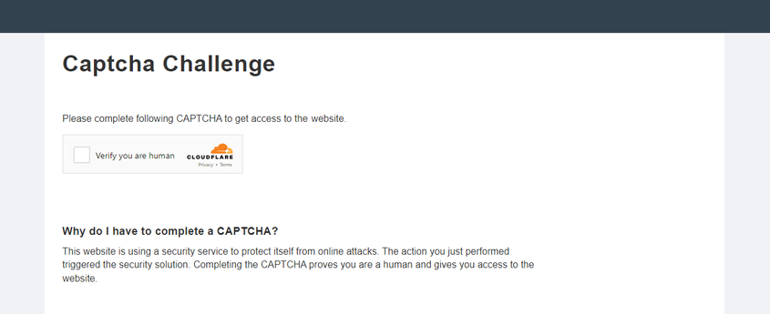

import Tabs from '@theme/Tabs';
import TabItem from '@theme/TabItem';
import ParamItem from '@theme/ParamItem';
import MethodItem from '@theme/MethodItem';
import MethodDescription from '@theme/MethodDescription'
import PriceBlock from '../../../../../src/theme/PriceBlock';
import PriceBlockWrap from '@theme/PriceBlockWrap';
import BlogLink from '@theme/BlogLink';

# TurnstileTask | Cloudflare Challenge

<PriceBlockWrap>
  <PriceBlock title="TurnstileTask" captchaId="cf-turnstile"/>
</PriceBlockWrap>

Todos os subtipos do Turnstile são suportados automaticamente: manual, não interativo e invisível. Portanto, não há necessidade de especificar um subtipo para um captcha comum.

<BlogLink url="https://capmonster.cloud/pt-BR/blog/web-scraping1/what-is-cloudflare-captcha"/>
<BlogLink url="https://capmonster.cloud/pt-BR/blog/Cloudflare/how-cloudflare-bot-challenge-and-turnstile-protect-web-traffic"/>

:::caution Atenção!
Confira todas as três opções de reconhecimento de captcha e escolha a mais conveniente para você.
:::
## Opção 1 (Turnstile)
Você precisa resolver um captcha comum do turnstile, como mostrado aqui. Observe que o CAPTCHA em páginas da CloudFlare pode parecer idêntico. Saiba mais sobre como diferenciar um Turnstile comum de um Cloudflare Challenge no final do artigo.

#### Parâmetros da solicitação
<TabItem value="proxyless" label="RecaptchaV2EnterpriseTaskProxyless (sem proxy)" default className="bordered-panel">
  <ParamItem title="type" required type="string" />
  **TurnstileTaskProxyless**

  ---

  <ParamItem title="websiteURL" required type="string" />
  O endereço da página onde o captcha é resolvido

  ---

  <ParamItem title="websiteKey" required type="string" />
  Chave Turnstile

  ---

  <ParamItem title="pageAction" type="string" />
  O campo `action` que pode ser encontrado na função de callback para carregar o captcha
  
  ---

  <ParamItem title="data" type="string" />
  O valor do campo `data` pode ser obtido do parâmetro `cData`.

</TabItem>

## Opção 2 (CloudFlare)
Você está navegando em um browser e precisa obter um token para passar pela CloudFlare.

#### Parâmetros da solicitação
<TabItem value="proxyless" label="RecaptchaV2EnterpriseTaskProxyless (sem proxy)" default className="bordered-panel">
  <ParamItem title="type" required type="string" />
  **TurnstileTaskProxyless**

  ---

  <ParamItem title="websiteURL" required type="string" />
  O endereço da página onde o captcha é resolvido

  ---

  <ParamItem title="websiteKey" required type="string" />
  Chave Turnstile

  ---

  <ParamItem title="cloudflareTaskType" required type="string" />
  **token**

  ---

  <ParamItem title="pageAction" required type="string" />
  O campo `action` pode ser encontrado na função de callback para carregar o captcha. Se `cloudflareTaskType` for usado, a `action` geralmente é "managed" ou "non-interactive".

  ---

  <ParamItem title="userAgent" required type="string" />
  User-Agent do navegador.<br /> **Informe apenas o UA real do sistema Windows. Agora é**: userAgentPlaceholder

  ---

  <ParamItem title="data" required type="string" />
  O valor do campo `data` pode ser obtido do parâmetro `cData`.

  ---

  <ParamItem title="pageData" required type="string" />
  O valor do campo `pageData` pode ser obtido do parâmetro `chlPageData`.
  
  ---
  
  <ParamItem title="apiJsUrl" type="string" />
  A string que contém um link para o script de captcha.

</TabItem>

<br />

Não é necessário passar um proxy para obter o token.

Esses parâmetros estão no objeto que é passado durante a criação do captcha para a função `window.turnstile.render(el, paramsObj)`. Você pode obtê-los, por exemplo, executando JavaScript antes de carregar outros scripts:

```js
(function () {
  const obj = {
    render: function () {
      const { action, cData, chlPageData } = arguments[1];
        const params = [
          ["action", action],
          ["data", cData],
          ["pageData", chlPageData],
        ];
        console.table(params)
    }
  };

  Object.defineProperty(window, "turnstile", {
    get: () => {
      return obj;
    },
  });
})();
```

Ao chamar `window.turnstile.render(el, paramsObj)`, o captcha na página é carregado e, se bem-sucedido, uma função de `callback` é chamada para passar as informações sobre a solução.

`window.turnstile.render(el, paramsObj):`

`el`: O elemento DOM no qual o captcha será inserido.

`paramsObj`: Um objeto contendo informações sobre o captcha e instruções para resolvê-lo. Este objeto geralmente contém campos como 
*sitekey*, *action*, *cData*, *chlPageData*, *callback*. 

`callback` – é uma função chamada após o captcha ser passado com sucesso.

## Opção 3 (CloudFlare)
Você está trabalhando usando consultas e precisa de cookies cf_clearance. É necessário que você tenha seus proxies.

#### Parâmetros da solicitação
<TabItem value="proxyless" label="RecaptchaV2EnterpriseTaskProxyless (sem proxy)" default className="bordered-panel">
  <ParamItem title="type" required type="string" />
  **TurnstileTask**

  ---

  <ParamItem title="websiteURL" required type="string" />
  O endereço da página onde o captcha é resolvido

  ---

  <ParamItem title="websiteKey" required type="string" />
  Chave Turnstile (você pode passar qualquer string)

  ---

  <ParamItem title="cloudflareTaskType" type="string" />
  **cf_clearance**

  ---

  <ParamItem title="htmlPageBase64" required type="string" />
  Página html codificada em Base64 **"Just a moment"** que é fornecida com o código 403 ao acessar um site com esta proteção.<br/> Exemplo de obtenção de uma string `htmlPageBase64`: *<br/>var htmlContent = document.documentElement.outerHTML;<br/>var htmlBase64 = btoa(unescape(encodeURIComponent(htmlContent)));<br/>console.log(htmlBase64);*

  ---

  <ParamItem title="userAgent" required type="string" />
  User-Agent do navegador.<br /> **Informe apenas o UA real do sistema Windows. Agora é**: userAgentPlaceholder

  ---

  <ParamItem title="proxyType" required type="string" />
  **http** - proxy http/https comum;<br />**https** - tente esta opção apenas se "http" não funcionar (necessário para alguns proxies personalizados);<br />**socks4** - proxy socks4;<br />**socks5** - proxy socks5.

  ---

  <ParamItem title="proxyAddress" required type="string" />
  <p>
    Endereço IP do proxy IPv4/IPv6. Não é permitido:
    - usar nomes de host;
    - usar proxies transparentes (onde você pode ver o IP do cliente);
    - usar proxies em máquinas locais.
  </p>

  ---

  <ParamItem title="proxyPort" required type="integer" />
  Porta do proxy.

  ---

  <ParamItem title="proxyLogin" required type="string" />
  Login do servidor proxy.

  ---

  <ParamItem title="proxyPassword" required type="string" />
  Senha do servidor proxy.

</TabItem>

## Exemplos de solicitações
### Opção 1: Turnstile Normal

<TabItem value="proxyless" label="TurnstileTaskProxyless (sem proxy)" default className="method-panel">
<MethodItem>
  ```http
  https://api.capmonster.cloud/createTask
  ```
</MethodItem>
<MethodDescription>
**Solicitação**
```json
{
    "clientKey":"API_KEY",
    "task": 
	{
        "type":"TurnstileTaskProxyless",
        "websiteURL":"http://tsmanaged.zlsupport.com",
        "websiteKey":"0x4AAAAAAABUYP0XeMJF0xoy"
    }
}
```
**Resposta**
```json
{
  "errorId":0,
  "taskId":407533072
}
```

</MethodDescription>
</TabItem>

### Opção 2. CloudFlare (token)

<TabItem value="proxyless" label="RecaptchaV2TaskProxyless (sem proxy)" default className="method-panel">
<MethodItem>
  ```http
  https://api.capmonster.cloud/createTask
  ```
</MethodItem>
<MethodDescription>
**Solicitação**
```json
{
	"clientKey": "API_KEY",
	"task": {
		"type": "TurnstileTask",
		"websiteURL": "https://example.com",
		"websiteKey": "0x4AAAAAAADnPIDROrmt1Wwj",
		"cloudflareTaskType": "token",
		"userAgent":"userAgentPlaceholder",
		"pageAction": "managed",
		"pageData": "HUHDWUHuhuwfiweh32..uh2uhuhyugYUG=",
		"data": "874291f4retD1366"
	}
}
```
**Resposta**
```json
{
  "errorId":0,
  "taskId":407533072
}
```

</MethodDescription>
</TabItem>

### Opção 3. CloudFlare (cookie)

<TabItem value="proxyless" label="RecaptchaV2TaskProxyless (sem proxy)" default className="method-panel">
<MethodItem>
  ```http
  https://api.capmonster.cloud/createTask
  ```
</MethodItem>
<MethodDescription>
**Solicitação**
```json 
{
  "clientKey":"API_KEY",
  "task": {
    "type":"TurnstileTask",
    "websiteURL":"https://example.com",
    "websiteKey":"xxxxxxxxxx",
    "cloudflareTaskType": "cf_clearance",
    "htmlPageBase64": "PCFET0NUWVBFIGh0...vYm9keT48L2h0bWw+",
    "userAgent": "userAgentPlaceholder",
    "proxyType":"http",
    "proxyAddress":"8.8.8.8",
    "proxyPort":8080,
    "proxyLogin":"proxyLoginHere",
    "proxyPassword":"proxyPasswordHere"
  }
}
```
**Resposta**
```json
{
  "errorId":0,
  "taskId":407533072
}
```

</MethodDescription>
</TabItem>

## Método GetTaskResult
Use o método [getTaskResult](../api/methods/get-task-result.md) para obter a solução do Turnstile. Dependendo da carga do sistema, você receberá uma resposta em um intervalo de 5 a 20 segundos.

|**Propriedade**|**Tipo**|**Descrição**|
| :- | :- | :- |
|cf_clearance|String|Um cookie especial da Cloudflare que você pode substituir no seu navegador|
|token|String|Use o token ao chamar uma função de callback|

## Como diferenciar entre um Turnstile comum e um Cloudflare Challenge
Um desafio da Cloudflare pode ter uma aparência diferente.

**Variante normal:**


**Variantes estilizadas:**

<figure>


<figcaption>O desafio é perfeitamente integrado ao próprio site.</figcaption>

</figure>

<figure>


<figcaption>Parece um CAPTCHA comum do turnstile, mas é na verdade um desafio.</figcaption>

</figure>

## Para se certificar da presença do Cloudflare, você pode abrir as ferramentas de desenvolvedor, observar o tráfego, examinar o código da página e procurar por sinais característicos:

- A primeira solicitação ao site retorna um código 403:


- O formulário com o id **challenge-form** tem um atributo **action** (não confundir com o action dos parâmetros para o captcha turnstile) que contém o parâmetro `__cf_chl_f_tk=`:


- A página contém duas tags `<script>` semelhantes que criam um novo valor no objeto `window`:


<details>
        <summary>Exemplo de implementação da solução usando Selenium em Node.js</summary>

```js

const { Builder } = require('selenium-webdriver');
const chrome = require('selenium-webdriver/chrome');

(async function example() {
  const options = new chrome.Options();
  options.addArguments('--auto-open-devtools-for-tabs')

  const driver = new Builder()
    .forBrowser('chrome')
    .setChromeOptions(options)
    .build();

  try {
    driver.executeScript(`
    window.turnstile = new Proxy(window.turnstile, {
      get(target, prop) {
        if (prop === 'render') {
          return function(a, b) {
            let p = {
              type: "TurnstileTaskProxyless",
              websiteKey: b.sitekey,
              websiteURL: window.location.href,
              data: b.cData,
              pagedata: b.chlPageData,
              action: b.action,
              userAgent: navigator.userAgent
          }
          
          console.log(JSON.stringify(p))
          window.params = p;
          window.turnstileCallback = b.callback;
            return target.render.apply(this, arguments);
          }
        }
        return target[prop];
      }
    });
    `)

    driver.get('SITE WITH CAPTCHA');
    

    const params = await driver.executeScript(`
      return new Promise((resolve, reject) => {
        setTimeout(() => {
          resolve(window.params)
        }, 2000)
      })
    `);

    if (params) {
      const data = {
        clientKey: 'API KEY',
        task: {
          type: 'TurnstileTaskProxyless',
          websiteURL: params.websiteURL,
          websiteKey: params.websiteKey,
          data: params.data,
          action: params.action
        }
      }

      const createResult = await fetch('https://api.capmonster.cloud/createTask', {
        method: 'post',
        body: JSON.stringify(data)
      });

      const createTaskResult = await createResult.json()

      if (createTaskResult.taskId) {
        const asyncDelay = (timeout) =>
          new Promise(resolve => {
              setTimeout(() => {
                  resolve();
              }, timeout);
          });
        
        const getTaskResult = async (taskId) => {
          const taskResult = await fetch('https://api.capmonster.cloud/getTaskResult', {
            method: 'post',
            body: JSON.stringify({
              "clientKey":"API KEY",
              "taskId": createTaskResult.taskId
            })
          });
          const taskResponse = await taskResult.json();
          if (taskResponse.status === 'processing') {
            await asyncDelay(5000);
            return await getTaskResult(taskId)
          }
          return taskResponse;
        }
       
        const taskRes = await getTaskResult(createTaskResult.taskId)

        if (taskRes.solution) {
          await driver.executeScript(`
            window.turnstileCallback(${taskRes.solution.token});
          `);
        }
      }
      
    }

    //FAÇA ALGO
  } finally {
    await driver.quit();
  }
})();
```
</details>

## Como Encontrar Todos os Parâmetros Necessários para a Criação da Tarefa

### Manualmente

1. Abra seu site onde o captcha aparece no navegador.
2. Clique com o botão direito no elemento do captcha e selecione **Inspecionar**.

#### Opção 1.

#### websiteKey

Pode ser encontrado em **Elements**:


Você também pode usar um comando no console abrindo a URL do captcha (começando com `https://challenges.cloudflare.com/cdn-cgi/challenge-platform/h/g…`) em uma aba separada:

`console.log(window._cf_chl_opt.chlApiSitekey);`

*chlApiSitekey* é o sitekey.

#### pageAction

*Action* e *sitekey* também podem ser encontrados na função *callback*:


Para as **Opções 2** e **3**, é melhor extrair os parâmetros automaticamente:

### Automaticamente

Uma forma conveniente de automatizar a busca por todos os parâmetros necessários.  
Alguns parâmetros são regenerados a cada carregamento da página, então você precisará extraí-los através de um navegador — seja normal ou headless (por exemplo, usando **Playwright**).  
Como os valores dos parâmetros dinâmicos são de curta duração, o captcha deve ser resolvido imediatamente após a captura deles.

:::warning **Importante!**  
Os trechos de código fornecidos são exemplos básicos para familiarização com a extração dos parâmetros necessários. A implementação exata dependerá da sua página de captcha, sua estrutura e dos elementos/seletores HTML que ela utiliza.  
:::

<Tabs className="full-width-tabs filled-tabs request-tabs">
  <TabItem value="js" label="JavaScript" default className="method-panel">
    <details>
      <summary>Opção 1 (No Navegador)</summary>

      ```js
      // Função para verificar a presença de window.onloadTurnstileCallback
      const checkTurnstileCallback = () => {
        return new Promise((resolve, reject) => {
          const timeout = setTimeout(() => reject('Tempo limite do callback'), 30000);

          const interval = setInterval(() => {
            if (window.onloadTurnstileCallback !== undefined) {
              clearInterval(interval);
              clearTimeout(timeout);

              const callbackDetails = window.onloadTurnstileCallback.toString();
              const sitekeyMatch = callbackDetails.match(/sitekey: ['"]([^'"]+)['"]/);
              const actionMatch = callbackDetails.match(/action: ['"]([^'"]+)['"]/);

              resolve({
                sitekey: sitekeyMatch ? sitekeyMatch[1] : null,
                action: actionMatch ? actionMatch[1] : null,
              });
            }
          }, 500);
        });
      };

      // Tenta encontrar qualquer elemento com data-sitekey
      const turnstileElement = document.querySelector('[data-sitekey]');

      if (turnstileElement) {
        // Extrai o valor do atributo data-sitekey
        const sitekey = turnstileElement.getAttribute("data-sitekey");
        console.log("Turnstile Sitekey (do elemento):", sitekey);
      } else {
        console.log("Elemento Turnstile não encontrado. Verificando via callback...");

        // Se o elemento não for encontrado, verifica via window.onloadTurnstileCallback
        checkTurnstileCallback()
          .then((data) => {
            console.log("Parâmetros Turnstile (do callback):", data);
          })
          .catch((error) => {
            console.error(error);
          });
      }
      ```
    </details>

    <details>
      <summary>Opção 2 (Node.js)</summary>

      ```js
      import { chromium } from "playwright";

      (async () => {
        const browser = await chromium.launch({ headless: false });
        const page = await browser.newPage();

        let params = null;

        try {
          while (!params) {
            await page.goto("https://example.com");

            await page.evaluate(() => {
              window.turnstile = new Proxy(window.turnstile, {
                get(target, prop) {
                  if (prop === "render") {
                    return function (a, b) {
                      const p = {
                        websiteKey: b.sitekey,
                        websiteURL: window.location.href,
                        data: b.cData,
                        pagedata: b.chlPageData,
                        action: b.action,
                        userAgent: navigator.userAgent,
                      };
                      window.params = p;
                      return target.render.apply(this, arguments);
                    };
                  }
                  return target[prop];
                },
              });
            });

            params = await page.evaluate(() => {
              return new Promise((resolve) => {
                setTimeout(() => resolve(window.params || null), 5000);
              });
            });

            if (!params) {
              await page.waitForTimeout(3000);
            }
          }

          console.log("Parâmetros Turnstile:", params);
        } finally {
          await browser.close();
        }
      })();
      ```
    </details>

    <details>
      <summary>Opção 3 (Node.js)</summary>

      ```js
      import { chromium } from "playwright";
      import { Buffer } from "buffer";

      (async () => {
        const browser = await chromium.launch({ headless: false });
        const page = await browser.newPage();

        let websiteKey = null;

        while (!websiteKey) {
          await page.goto("https://example.com");

          await page.evaluate(() => {
            window.turnstile = new Proxy(window.turnstile, {
              get(target, prop) {
                if (prop === "render") {
                  return function (a, b) {
                    window.websiteKey = b.sitekey;
                    return target.render.apply(this, arguments);
                  };
                }
                return target[prop];
              },
            });
          });

          websiteKey = await page.evaluate(() => {
            return new Promise((resolve) => {
              setTimeout(() => resolve(window.websiteKey || null), 5000);
            });
          });

          if (!websiteKey) {
            await page.waitForTimeout(3000);
          }
        }

        const html = await page.content();
        const htmlPageBase64 = Buffer.from(html).toString("base64");

        const result = {
          websiteKey,
          htmlPageBase64,
        };

        console.log(result);

        await browser.close();
      })();
      ```
    </details>
  </TabItem>

  <TabItem value="python" label="Python" className="method-panel">
    <details>
      <summary>Opção 1</summary>

      ```python
      import asyncio
      from playwright.async_api import async_playwright

      async def run():
          async with async_playwright() as p:
              browser = await p.chromium.launch(headless=False)
              context = await browser.new_context()
              page = await context.new_page()

              await page.goto("https://example.com")  # Substitua pelo seu site

              # Tenta encontrar um elemento com data-sitekey
              element = await page.query_selector('[data-sitekey]')
              if element:
                  sitekey = await element.get_attribute("data-sitekey")
                  print("Turnstile Sitekey (do elemento):", sitekey)
              else:
                  print("Elemento Turnstile não encontrado. Verificando via callback...")

                  try:
                      result = await page.evaluate('''() => {
                          return new Promise((resolve, reject) => {
                              const timeout = setTimeout(() => reject('Tempo limite do callback'), 30000);
                              const interval = setInterval(() => {
                                  if (window.onloadTurnstileCallback !== undefined) {
                                      clearInterval(interval);
                                      clearTimeout(timeout);
                                      const cbStr = window.onloadTurnstileCallback.toString();
                                      const sitekeyMatch = cbStr.match(/sitekey: ['"]([^'"]+)['"]/);
                                      const actionMatch = cbStr.match(/action: ['"]([^'"]+)['"]/);
                                      resolve({
                                          sitekey: sitekeyMatch ? sitekeyMatch[1] : null,
                                          action: actionMatch ? actionMatch[1] : null,
                                      });
                                  }
                              }, 500);
                          });
                      }''')
                      print("Parâmetros Turnstile (do callback):", result)
                  except Exception as e:
                      print("Erro:", e)

              await browser.close()

      asyncio.run(run())
      ```
    </details>

    <details>
      <summary>Opção 2</summary>

      ```python
      import asyncio
      from playwright.async_api import async_playwright

      async def extract_turnstile_params():
          async with async_playwright() as p:
              browser = await p.chromium.launch(headless=False)
              page = await browser.new_page()

              params = None

              while not params:
                  await page.goto("https://example.com")

                  await page.evaluate("""
                      window.turnstile = new Proxy(window.turnstile, {
                        get(target, prop) {
                          if (prop === "render") {
                            return function(a, b) {
                              const p = {
                                websiteKey: b.sitekey,
                                websiteURL: window.location.href,
                                data: b.cData,
                                pagedata: b.chlPageData,
                                action: b.action,
                                userAgent: navigator.userAgent
                              };
                              window.params = p;
                              return target.render.apply(this, arguments);
                            };
                          }
                          return target[prop];
                        }
                      });
                  """)

                  await page.wait_for_timeout(5000)

                  params = await page.evaluate("window.params || null")

                  if not params:
                      await page.wait_for_timeout(3000)

              print("Parâmetros Turnstile:", params)

              await browser.close()

      asyncio.run(extract_turnstile_params())
      ```
    </details>

    <details>
      <summary>Opção 3</summary>

      ```python
      import asyncio
      import base64
      from playwright.async_api import async_playwright

      async def main():
          async with async_playwright() as p:
              browser = await p.chromium.launch(headless=False)
              page = await browser.new_page()

              website_key = None

              while not website_key:
                  await page.goto("https://example.com")

                  await page.evaluate("""
                      () => {
                          window.turnstile = new Proxy(window.turnstile, {
                              get(target, prop) {
                                  if (prop === 'render') {
                                      return function(a, b) {
                                          window.websiteKey = b.sitekey;
                                          return target.render.apply(this, arguments);
                                      };
                                  }
                                  return target[prop];
                              }
                          });
                      }
                  """)

                  website_key = await page.evaluate("""
                      () => new Promise(resolve => {
                          setTimeout(() => resolve(window.websiteKey || null), 5000);
                      })
                  """)

                  if not website_key:
                      await page.wait_for_timeout(3000)

              html = await page.content()
              html_base64 = base64.b64encode(html.encode("utf-8")).decode("utf-8")

              result = {
                  "websiteKey": website_key,
                  "htmlPageBase64": html_base64
              }

              print(result)

              await browser.close()

      asyncio.run(main())
      ```
    </details>
  </TabItem>

  <TabItem value="csharp" label="C#" className="method-panel">
    <details>
      <summary>Opção 1</summary>

      ```csharp
      using System;
      using System.Text.RegularExpressions;
      using System.Threading.Tasks;
      using Microsoft.Playwright;

      class Program
      {
          public static async Task Main()
          {
              using var playwright = await Playwright.CreateAsync();
              var browser = await playwright.Chromium.LaunchAsync(new BrowserTypeLaunchOptions
              {
                  Headless = false
              });

              var context = await browser.NewContextAsync();
              var page = await context.NewPageAsync();

              await page.GotoAsync("https://example.com"); // Substitua pela URL alvo

              var element = await page.QuerySelectorAsync("[data-sitekey]");

              if (element != null)
              {
                  var sitekey = await element.GetAttributeAsync("data-sitekey");
                  Console.WriteLine($"Turnstile Sitekey (do elemento): {sitekey}");
              }
              else
              {
                  Console.WriteLine("Elemento Turnstile não encontrado. Verificando via callback...");

                  try
                  {
                      var result = await page.EvaluateAsync(@"() => {
                          return new Promise((resolve, reject) => {
                              const timeout = setTimeout(() => reject('Tempo limite do callback'), 30000);
                              const interval = setInterval(() => {
                                  if (window.onloadTurnstileCallback !== undefined) {
                                      clearInterval(interval);
                                      clearTimeout(timeout);
                                      const cbStr = window.onloadTurnstileCallback.toString();
                                      const sitekeyMatch = cbStr.match(/sitekey: ['""]([^'""]+)['""]/);
                                      const actionMatch = cbStr.match(/action: ['""]([^'""]+)['""]/);
                                      resolve({
                                          sitekey: sitekeyMatch ? sitekeyMatch[1] : null,
                                          action: actionMatch ? actionMatch[1] : null
                                      });
                                  }
                              }, 500);
                          });
                      }");

                      Console.WriteLine("Parâmetros Turnstile (do callback): " + result?.ToString());
                  }
                  catch (Exception ex)
                  {
                      Console.WriteLine("Erro: " + ex.Message);
                  }
              }

              await browser.CloseAsync();
          }
      }
      ```
    </details>

    <details>
      <summary>Opção 2</summary>

      ```csharp
      using Microsoft.Playwright;
      using System.Text.Json;

      class Program
      {
          public static async Task Main()
          {
              using var playwright = await Playwright.CreateAsync();
              var browser = await playwright.Chromium.LaunchAsync(new BrowserTypeLaunchOptions
              {
                  Headless = false
              });

              var page = await browser.NewPageAsync();
              object? parameters = null;

              while (parameters == null)
              {
                  await page.GotoAsync("https://example.com");

                  await page.EvaluateAsync(@"() => {
                      window.turnstile = new Proxy(window.turnstile, {
                          get(target, prop) {
                              if (prop === 'render') {
                                  return function(a, b) {
                                      const p = {
                                          websiteKey: b.sitekey,
                                          websiteURL: window.location.href,
                                          data: b.cData,
                                          pagedata: b.chlPageData,
                                          action: b.action,
                                          userAgent: navigator.userAgent
                                      };
                                      window.params = p;
                                      return target.render.apply(this, arguments);
                                  };
                              }
                              return target[prop];
                          }
                      });
                  }");

                  parameters = await page.EvaluateAsync(@"() => new Promise(resolve => {
                      setTimeout(() => resolve(window.params || null), 5000);
                  })");

                  if (parameters == null)
                  {
                      await page.WaitForTimeoutAsync(3000);
                  }
              }

              Console.WriteLine("Parâmetros Turnstile:");
              Console.WriteLine(JsonSerializer.Serialize(parameters, new JsonSerializerOptions { WriteIndented = true }));

              await browser.CloseAsync();
          }
      }
      ```
    </details>

    <details>
      <summary>Opção 3</summary>

      ```csharp
      using System;
      using System.Text;
      using System.Threading.Tasks;
      using Microsoft.Playwright;

      class Program
      {
          public static async Task Main()
          {
              using var playwright = await Playwright.CreateAsync();
              var browser = await playwright.Chromium.LaunchAsync(
                new BrowserTypeLaunchOptions { Headless = false });
              var page = await browser.NewPageAsync();

              string websiteKey = null;

              while (websiteKey == null)
              {
                  await page.GotoAsync("https://example.com");

                  await page.EvaluateAsync(@"() => {
                      window.turnstile = new Proxy(window.turnstile, {
                          get(target, prop) {
                              if (prop === 'render') {
                                  return function(a, b) {
                                      window.websiteKey = b.sitekey;
                                      return target.render.apply(this, arguments);
                                  };
                              }
                              return target[prop];
                          }
                      });
                  }");

                  websiteKey = await page.EvaluateAsync<string>(@"() => 
                  new Promise(resolve => {
                      setTimeout(() => resolve(window.websiteKey || null), 5000);
                  })");

                  if (websiteKey == null)
                  {
                      await page.WaitForTimeoutAsync(3000);
                  }
              }

              var html = await page.ContentAsync();
              var htmlBase64 = Convert.ToBase64String(Encoding.UTF8.GetBytes(html));

              Console.WriteLine($"websiteKey: {websiteKey}");
              Console.WriteLine($"htmlPageBase64: {htmlBase64}");

              await browser.CloseAsync();
          }
      }
      ```
    </details>
  </TabItem>
</Tabs>

## Use Biblioteca SDK

<Tabs className="full-width-tabs filled-tabs request-tabs" groupId="captcha-type">
  <TabItem value="js" label="JavaScript" default className="method-panel">
    ```js
    // https://github.com/ZennoLab/capmonstercloud-client-js

    import { CapMonsterCloudClientFactory, ClientOptions, TurnstileRequest } from '@zennolab_com/capmonstercloud-client';

    document.addEventListener('DOMContentLoaded', async () => {
      const cmcClient = CapMonsterCloudClientFactory.Create(new ClientOptions({ clientKey: '<your capmonster.cloud API key>' }));
      console.log(await cmcClient.getBalance());

      const turnstileRequest = new TurnstileRequest({
        websiteURL: 'https://tsinvisble.zlsupport.com',
        websiteKey: '0x4AAAAAAABUY0VLtOUMAHxE',
        cloudflareTaskType: 'cf_clearance',
        proxyType: 'http',
        proxyAddress: '8.8.8.8',
        proxyPort: 8080,
        proxyLogin: 'proxyLoginHere',
        proxyPassword: 'proxyPasswordHere',
        pageData: 'pageDataHere',
        data: 'dataHere',
        htmlPageBase64: 'htmlPageBase64Here',
        userAgent: 'userAgentHere',
      });

      console.log(await cmcClient.Solve(turnstileRequest));
    });
    ```
  </TabItem>
  
  <TabItem value="python" label="Python" className="method-panel">
    ```python
    # https://github.com/ZennoLab/capmonstercloud-client-python

    # Cloudflare Turnstile:

    import asyncio
    from capmonstercloudclient import CapMonsterClient, ClientOptions
    from capmonstercloudclient.requests import TurnstileRequest

    client_options = ClientOptions(api_key="your_api_key")  # Replace with your CapMonsterCloud API key
    cap_monster_client = CapMonsterClient(options=client_options)

    turnstile_request = TurnstileRequest(
        websiteURL="http://tsmanaged.zlsupport.com",  # Replace with the URL of the page with the captcha
        websiteKey="0x4AAAAAAABUYP0XeMJF0xoy"  # Replace with the website key for the captcha
    )

    async def solve_captcha():
        return await cap_monster_client.solve_captcha(turnstile_request)

    responses = asyncio.run(solve_captcha())
    print(responses)
    ```

    ```python
    # Cloudflare Challenge (token)

    import asyncio
    from capmonstercloudclient import CapMonsterClient, ClientOptions
    from capmonstercloudclient.requests import TurnstileProxylessRequest

    client_options = ClientOptions(api_key="your_api_key")  # Replace with your CapMonsterCloud API key
    cap_monster_client = CapMonsterClient(options=client_options)

    turnstile_request = TurnstileProxylessRequest(
        websiteURL="https://example.com",  # Replace with the URL of the page with the captcha
        websiteKey="0x4AAAAAAABUYP0XeMJF0xoy",  # Replace with the website key for the captcha
        data="YOUR_DATA_HERE",
        pageAction="managed",
        cloudflareTaskType="token",
        pageData="YOUR_PAGE_DATA_HERE",
        userAgent="Mozilla/5.0 (Windows NT 10.0; Win64; x64) AppleWebKit/537.36 (KHTML, like Gecko) Chrome/130.0.0.0 Safari/537.36"  # Use the current userAgent
    )

    async def solve_captcha():
        return await cap_monster_client.solve_captcha(turnstile_request)

    responses = asyncio.run(solve_captcha())
    print(responses)
    ```

    ```python
    # Cloudflare Challenge (cookie cf_clearance)

    import asyncio
    from capmonstercloudclient import CapMonsterClient, ClientOptions
    from capmonstercloudclient.requests import TurnstileRequest

    client_options = ClientOptions(api_key="your_api_key")  # Replace with your CapMonsterCloud API key
    cap_monster_client = CapMonsterClient(options=client_options)

    turnstile_request = TurnstileRequest(
        websiteURL="https://example.com",  # Replace with the URL of the page with the captcha
        websiteKey="0x4AAAAAAABUYP0XeMJF0xoy",  # Replace with the website key for the captcha
        cloudflareTaskType="cf_clearance",
        userAgent="Mozilla/5.0 (Windows NT 10.0; Win64; x64) AppleWebKit/537.36 (KHTML, like Gecko) Chrome/130.0.0.0 Safari/537.36",  # Use the current userAgent
        htmlPageBase64="htmlPageBase64Here",
        proxyType="http",  # Type of proxy (http, https, socks4, socks5)
        proxyAddress="8.8.8.8",
        proxyPort=8000,
        proxyLogin="proxyLoginHere",
        proxyPassword="proxyPasswordHere"
    )

    async def solve_captcha():
        return await cap_monster_client.solve_captcha(turnstile_request)

    responses = asyncio.run(solve_captcha())
    print(responses)
    ```
  </TabItem>
  
  <TabItem value="csharp" label="C#" className="method-panel">
    ```csharp
    // https://github.com/ZennoLab/capmonstercloud-client-dotnet

    // Cloudflare Turnstile:

    using Zennolab.CapMonsterCloud.Requests;
    using Zennolab.CapMonsterCloud;

    class Program
    {
        static async Task Main(string[] args)
        {
            var clientOptions = new ClientOptions
            {
                ClientKey = "your_api_key" // Replace with your CapMonster Cloud API key
            };

            var cmCloudClient = CapMonsterCloudClientFactory.Create(clientOptions);

            var turnstileRequest = new TurnstileProxylessRequest
            {
                WebsiteUrl = "http://tsmanaged.zlsupport.com",  // Replace with the URL of the page with the captcha
                WebsiteKey = "0x4AAAAAAABUYP0XeMJF0xoy"  // Replace with the website key for the captcha
            };

            var turnstileResult = await cmCloudClient.SolveAsync(turnstileRequest);

            Console.WriteLine("Captcha Solution: " + turnstileResult.Solution.Value);
        }
    }
    ```

    ```csharp
    // Cloudflare Challenge (token):

    using Zennolab.CapMonsterCloud.Requests;
    using Zennolab.CapMonsterCloud;

    class Program
    {
        static async Task Main(string[] args)
        {
            var clientOptions = new ClientOptions
            {
                ClientKey = "your_api_key" // Replace with your CapMonster Cloud API key
            };

            var cmCloudClient = CapMonsterCloudClientFactory.Create(clientOptions);

            var turnstileRequest = new TurnstileProxylessRequest
            {
                WebsiteUrl = "https://example.com",  // Replace with the URL of the page with the captcha
                WebsiteKey = "0x4AAAAAAABUYP0XeMJF0xoy",  // Replace with the website key for the captcha
                Data = "data_here",
                PageAction = "managed",
                CloudflareTaskType = "token",
                PageData = "pagedata_here",
                UserAgent = "Mozilla/5.0 (Windows NT 10.0; Win64; x64) AppleWebKit/537.36 (KHTML, like Gecko) Chrome/130.0.0.0 Safari/537.36" // Use the current UserAgent
            };

            var turnstileResult = await cmCloudClient.SolveAsync(turnstileRequest);

            Console.WriteLine("Captcha Solution: " + turnstileResult.Solution.Value);
        }
    }
    ```

    ```csharp
    // Cloudflare Challenge (cookie cf_clearance):

    using Zennolab.CapMonsterCloud.Requests;
    using Zennolab.CapMonsterCloud;

    class Program
    {
        static async Task Main(string[] args)
        {
            var clientOptions = new ClientOptions
            {
                ClientKey = "your_api_key" // Replace with your CapMonster Cloud API key
            };

            var cmCloudClient = CapMonsterCloudClientFactory.Create(clientOptions);

            var turnstileRequest = new TurnstileRequest
            {
                WebsiteUrl = "https://example.com", // URL with Turnstile challenge
                WebsiteKey = "0x4AAAAAAADnPIDROrmt1Wwj", // Replace with the correct website key
                CloudflareTaskType = "cf_clearance",
                ProxyType = ProxyType.Http, // Replace with the required type
                ProxyAddress = "8.8.8.8",
                ProxyPort = 8000,
                ProxyLogin = "proxyLoginHere",
                ProxyPassword = "proxyPasswordHere",
                PageData = "pageDataHere",
                Data = "pageDataHere",
                HtmlPageBase64 = "htmlPageBase64Here",
                UserAgent = "Mozilla/5.0 (Windows NT 10.0; Win64; x64) AppleWebKit/537.36 (KHTML, like Gecko) Chrome/130.0.0.0 Safari/537.36" // Use an up-to-date userAgent
            };

            var turnstileResult = await cmCloudClient.SolveAsync(turnstileRequest);

            Console.WriteLine("Captcha Solved. cf_clearance cookie: " + turnstileResult.Solution.Clearance);
        }
    }
    ```
  </TabItem>
</Tabs>