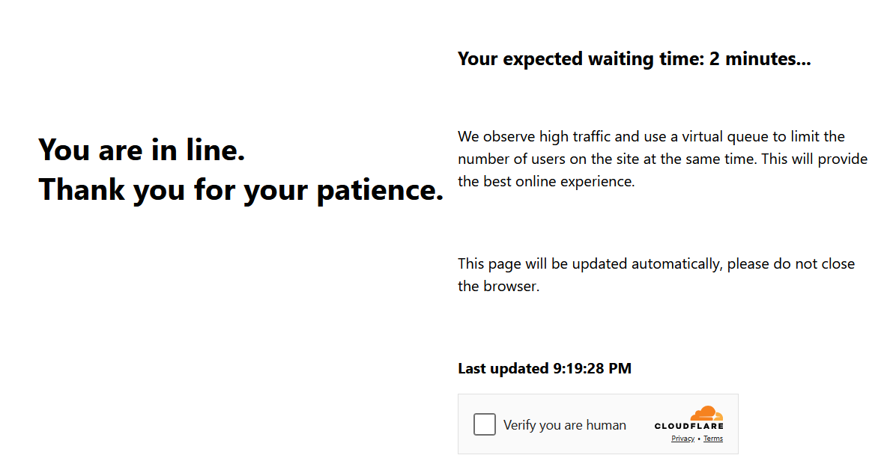

import Tabs from '@theme/Tabs';
import TabItem from '@theme/TabItem';
import ParamItem from '@theme/ParamItem';
import MethodItem from '@theme/MethodItem';
import MethodDescription from '@theme/MethodDescription'
import PriceBlock from '../../../../../src/theme/PriceBlock'
import PriceBlockWrap from '@theme/PriceBlockWrap';
import BlogLink from '@theme/BlogLink';
import { ArticleHead } from '../../../../../src/theme/ArticleHead';

<ArticleHead slug="captchas/turnstile-waitroom-task" />

# Cloudflare Waiting Room

<PriceBlockWrap>
  <PriceBlock title="Cloudflare Waiting Room" captchaId="cf-turnstile"/>
</PriceBlockWrap>

Este é um novo mecanismo de proteção da Cloudflare: o usuário deve esperar em média \~3 minutos antes de acessar o recurso:



Você também pode identificar este tipo de Cloudflare pelo cabeçalho da página:


<BlogLink url="https://capmonster.cloud/pt-BR/blog/Cloudflare/what-is-cloudflare-captcha"/>
<BlogLink url="https://capmonster.cloud/pt-BR/blog/Cloudflare/how-cloudflare-bot-challenge-and-turnstile-protect-web-traffic"/>

## Parâmetros da solicitação

:::warning **Atenção!**

* Use **seus próprios proxies** para esta tarefa.

* Após resolver, você receberá **cookies especiais** para adicionar ao navegador.
:::

<TabItem value="proxyless" label="RecaptchaV2EnterpriseTaskProxyless (sem proxy)" default className="bordered-panel">
  <ParamItem title="type" required type="string" />
  **TurnstileTask**

---

  <ParamItem title="websiteURL" required type="string" />
  A URL da página contendo a verificação

---

  <ParamItem title="websiteKey" required type="string" />
  Chave do site Cloudflare

---

  <ParamItem title="cloudflareTaskType" required type="string" />
  **wait_room**

---

  <ParamItem title="htmlPageBase64" required type="string" />
  Página HTML codificada em Base64 contendo `<title>Waiting Room powered by Cloudflare</title>`<br/>
  Exemplo para obter `htmlPageBase64`:
```js
var serializer = new XMLSerializer();
var fullHtml = serializer.serializeToString(document);

var htmlBase64 = btoa(unescape(encodeURIComponent(fullHtml)));
console.log(htmlBase64);
```

---

  <ParamItem title="userAgent" required type="string" />
  User-Agent do navegador.<br />
  **Forneça apenas o UA do Windows atual:** userAgentPlaceholder

---

  <ParamItem title="proxyType" required type="string" />
  **http** - proxy HTTP/HTTPS normal;<br />
  **https** - use se http não funcionar (necessário para alguns proxies personalizados);<br />
  **socks4** - proxy SOCKS4;<br />
  **socks5** - proxy SOCKS5.

---

  <ParamItem title="proxyAddress" required type="string" />
  <p>
    Endereço IP do proxy (IPv4/IPv6). Não permitido:
    - Proxies transparentes
    - Proxies da máquina local
  </p>

---

  <ParamItem title="proxyPort" required type="integer" />
  Porta do proxy.

---

  <ParamItem title="proxyLogin" required type="string" />
  Login do proxy.

---

  <ParamItem title="proxyPassword" required type="string" />
  Senha do proxy.

</TabItem>


## Método de criação da tarefa

<TabItem value="proxyless" label="TurnstileTask (sem proxy)" default className="method-panel">
	<MethodItem>
		```http
		https://api.capmonster.cloud/createTask
		```
	</MethodItem>
	<MethodDescription>
		**Solicitação**
		```json 
		{
		  "clientKey":"API_KEY",
		  "task": {
			"type":"TurnstileTask",
			"websiteURL":"https://example.com",
			"websiteKey":"xxxxxxxxxx",
			"cloudflareTaskType": "wait_room",
			"htmlPageBase64": "PCFET0NUWVBFIGh0...vYm9keT48L2h0bWw+",
			"userAgent": "userAgentPlaceholder",
			"proxyType":"http",
			"proxyAddress":"8.8.8.8",
			"proxyPort":8080,
			"proxyLogin":"proxyLoginHere",
			"proxyPassword":"proxyPasswordHere"
		  }
		}
		```
		**Resposta**
		```json
		{
		  "errorId":0,
		  "taskId":407533072
		}
		```
	</MethodDescription>
</TabItem>
---

## Método de obter resultado da tarefa

Use o método [getTaskResult](../api/methods/get-task-result.mdx) para obter a solução do Waiting Room. Dependendo da carga do sistema, a resposta pode levar entre 5 e 20 segundos.

<TabItem value="proxyless" label="TurnstileTask (proxyless)" default className="method-panel-full">
  <MethodItem>
    ```http
    https://api.capmonster.cloud/getTaskResult
    ```
  </MethodItem>
  <MethodDescription>
    **Solicitação**
    ```json
    {
      "clientKey": "API_KEY",
      "taskId": 407533072
    }
    ```

    **Resposta**
    ```json
    {
      "errorId": 0,
      "status": "ready",
      "solution": {
        "cf_clearance": "1tarGvbY2_ZhQdYxpSBloao.FoOn9VtcJtmb_IQ_hCE-1761217338-1.2.1.1-vyVPoLYIGX0VCJomVuLjF7n0kdM0PXaPjpDsRcohxGr7hb2CE7WfcHpmQZ70goqEjdWxPsDhSVaKNTz9opxWguiNdWEEq_.SceWXIqfP7tnEb69f3bP0mixNqcWy_5P_9INpoAEqr1k7aYU0r45PT4gPr5pwHxedVySyLRdoBXIJasdTE52YOQ3NPdGWTwQ_3h2n_wYqqIvf0kCSAvimRrmsgZxomlyejwqPI6ZHi.w"
      }
    }
    ```
  </MethodDescription>
</TabItem>

|**Property**|**Type**|**Description**|
| :- | :- | :- |
|cf_clearance|String|Cookies especiais do Cloudflare que você pode definir no seu navegador|