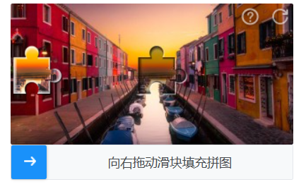
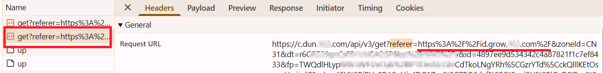
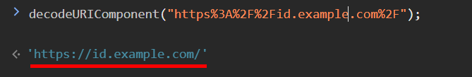
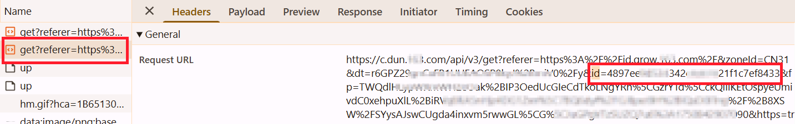

import Tabs from '@theme/Tabs';
import TabItem from '@theme/TabItem';
import ParamItem from '@theme/ParamItem';
import MethodItem from '@theme/MethodItem';
import MethodDescription from '@theme/MethodDescription'
import PriceBlock from '@theme/PriceBlock';
import PriceBlockWrap from '@theme/PriceBlockWrap';

# Yidun - NECaptcha

<PriceBlockWrap>
  <PriceBlock title="Yidun task" captchaId="yidun"/>
</PriceBlockWrap>



:::warning **Atenção!**
Esta tarefa será executada usando nossos servidores proxy.
:::

## Parâmetros da solicitação

<TabItem value="proxy" label="YidunTask (com proxy)" className="bordered-panel">
  <ParamItem title="type" required type="string" />
  **YidunTask**

  ---

  <ParamItem title="websiteURL" required type="string" />
  URL completa da página que contém o CAPTCHA.

  ---

  <ParamItem title="websiteKey" required type="string" />
  Valor do parâmetro `siteKey`, encontrado na página (*veja abaixo como localizá-lo*).

  ---

  <ParamItem title="userAgent" type="string" />
  User-Agent do navegador. <br />
  **Forneça um User-Agent válido do sistema Windows. O recomendado atualmente é**: userAgentPlaceholder

  ---

  <ParamItem title="proxyType" type="string" />
  **http** – proxy HTTP/HTTPS padrão;<br />
  **https** – use esta opção apenas se "http" não funcionar (necessário para alguns proxies personalizados);<br />
  **socks4** – proxy SOCKS4;<br />
  **socks5** – proxy SOCKS5.

  ---

  <ParamItem title="proxyAddress" type="string" />
  <p>
    Endereço IP do proxy (IPv4/IPv6). Não é permitido:
    - uso de nomes de host;
    - uso de proxies transparentes (onde o IP do cliente pode ser visto);
    - uso de proxies em máquinas locais.
  </p>

  ---

  <ParamItem title="proxyPort" type="integer" />
  Porta do proxy.

  ---

  <ParamItem title="proxyLogin" type="string" />
  Nome de usuário do proxy.

  ---

  <ParamItem title="proxyPassword" type="string" />
  Senha do proxy.

</TabItem>

### Como obter websiteURL e websiteKey
Abra as *Ferramentas de Desenvolvedor*, ative o captcha, vá para a aba **Network** e encontre a requisição que começa com `get?referer=` ou `check?referer=`. O valor de *referer* é o `websiteURL`.



Às vezes, o `referer` na URL está codificado, por exemplo: *https%3A%2F%2Fid.example.com%2F*. Para obter um endereço legível, você precisa decodificá-lo, por exemplo, usando o console do navegador:



O valor de *id* é o `websiteKey`.



## Método de criação da tarefa

<Tabs className="full-width-tabs filled-tabs request-tabs" groupId="captcha-type">
  <TabItem value="proxyless" label="YidunTask (sem proxy)" default className="method-panel">
    <MethodItem>
      ```http
      https://api.capmonster.cloud/createTask
      ```
    </MethodItem>
    <MethodDescription>

    **Solicitação**
    ```json
    {
      "clientKey": "API_KEY",
      "task": {
        "type": "YidunTask",
        "websiteURL": "https://www.example.com",
        "websiteKey": "6cw0f0485d5d46auacf9b735d20218a5",
        "userAgent": "userAgentPlaceholder"
      }
    }
    ```

    **Resposta**
    ```json
    {
      "errorId": 0,
      "taskId": 407533077
    }
    ```
    </MethodDescription>
  </TabItem>

  <TabItem value="proxy" label="YidunTask (com proxy)" default className="method-panel">
    <MethodItem>
      ```http
      https://api.capmonster.cloud/createTask
      ```
    </MethodItem>
    <MethodDescription>

    **Solicitação**
    ```json
    {
      "clientKey": "API_KEY",
      "task": {
        "type": "YidunTask",
        "websiteURL": "https://www.example.com",
        "websiteKey": "6cw0f0485d5d46auacf9b735d20218a5",
        "userAgent": "userAgentPlaceholder",
        "proxyType": "http",
        "proxyAddress": "8.8.8.8",
        "proxyPort": 8080,
        "proxyLogin": "proxyLoginHere",
        "proxyPassword": "proxyPasswordHere"
      }
    }
    ```

    **Resposta**
    ```json
    {
      "errorId": 0,
      "taskId": 407533077
    }
    ```
    </MethodDescription>
  </TabItem>
</Tabs>

## Método para obter o resultado da tarefa

Use o método [getTaskResult](../api/methods/get-task-result.md) para obter a solução do CAPTCHA Yidun.

<TabItem value="proxyless" label="CustomTask (sem proxy)" default className="method-panel-full">
  <MethodItem>
    ```http
    https://api.capmonster.cloud/getTaskResult
    ```
  </MethodItem>
  <MethodDescription>

  **Solicitação**
  ```json
  {
    "clientKey": "API_KEY",
    "taskId": 407533077
  }
  ```

  **Resposta**
  ```json
  {
    "errorId": 0,
    "errorCode": null,
    "errorDescription": null,
    "solution": {
      "token": "CN31_9AwsPmaYcJameP_09rA0vkVMQsPij...RXTlFJFc3"
    },
    "status": "ready"
  }
  ```
  </MethodDescription>
</TabItem>
