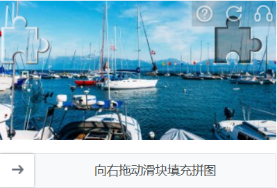
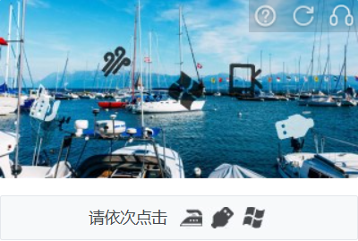
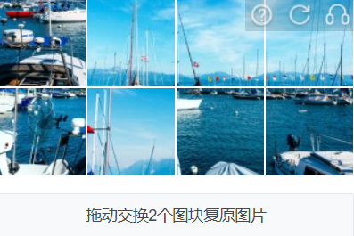

import Tabs from '@theme/Tabs';
import TabItem from '@theme/TabItem';
import ParamItem from '@theme/ParamItem';
import MethodItem from '@theme/MethodItem';
import MethodDescription from '@theme/MethodDescription'
import PriceBlock from '@theme/PriceBlock';
import PriceBlockWrap from '@theme/PriceBlockWrap';
import { ArticleHead } from '../../../../../src/theme/ArticleHead';

<ArticleHead slug="captchas/yidun-task" />

# Yidun - NECaptcha

<PriceBlockWrap>
  <PriceBlock title="Yidun task" captchaId="yidun"/>
</PriceBlockWrap>

## Exemplos de tarefas

<Tabs className="full-width-tabs">
  <TabItem value="jigsaw" label="Jigsaw" default>
    
  </TabItem>
  <TabItem value="picture-click" label="Picture-click">
    
  </TabItem>
  <TabItem value="avoid" label="Avoid">
    
  </TabItem>
  <TabItem value="icon-click" label="Icon-click">
    
  </TabItem>
  <TabItem value="inference" label="Inference">
    
  </TabItem>
  <TabItem value="sense" label="Sense">
    
  </TabItem>
  <TabItem value="space-inference" label="Space-inference">
    
  </TabItem>
</Tabs>

:::warning **Atenção!**
O CapMonster Cloud, por padrão, funciona com proxies integrados — já incluídos no custo do serviço. É necessário especificar seus próprios proxies apenas nos casos em que o site não aceita o token ou quando o acesso aos serviços integrados está restrito.

Se o proxy utiliza autenticação por IP, é necessário adicionar o endereço **65.21.190.34** à lista de permissões (whitelist).
:::

## Parâmetros da requisição

<TabItem value="proxy" label="YidunTask (com proxy)" className="bordered-panel">

  <ParamItem title="type" required type="string" />
  **YidunTask**

  ---

  <ParamItem title="websiteURL" required type="string" />
  URL completo da página com o captcha.

  ---

  <ParamItem title="websiteKey" required type="string" />
  Valor do parâmetro `siteKey` encontrado na página (*veja o exemplo abaixo sobre como encontrá-lo*).

  ---

  <ParamItem title="userAgent" type="string" />
  User-Agent do navegador. <br />
  **Utilize apenas um User-Agent atual do Windows. O recomendado é:** `userAgentPlaceholder`

  ---

  <ParamItem title="yidunGetLib" type="string" optional />
  Caminho para o arquivo JavaScript que carrega o captcha na página.  
  **Importante**: forneça a URL completa (https://...).  
  Recomendado quando os campos `challenge`, `hcg` ou `hct` estiverem presentes no site.

  ---

  <ParamItem title="yidunApiServerSubdomain" type="string" optional />
  Subdomínio do servidor API do Yidun.  
  **Importante**: deve ser diferente dos padrões `c.dun.163.com` e `c-v6.dun.163.com`.  
  Pode ser informado com ou sem `https://`.  
  Necessário quando um servidor personalizado é usado (comum nas versões Enterprise).

  ---

  <ParamItem title="challenge" type="string" optional />
  Identificador único do captcha atual.  
  Geralmente enviado nas requisições de rede ao inicializar ou exibir o captcha.  
  Indica o uso de captcha Enterprise.

  ---

  <ParamItem title="hcg" type="string" optional />
  Hash do captcha utilizado na requisição.  
  Pode ser obtido junto com o `challenge`.

  ---

  <ParamItem title="hct" type="integer" optional />
  Identificador de tempo numérico usado na validação de captchas Enterprise.

  ---

  <ParamItem title="proxyType" type="string" />
  **http** - proxy padrão http/https;<br />
  **https** - tente essa opção se "http" não funcionar (necessário para alguns proxies personalizados);<br />
  **socks4** - proxy socks4;<br />
  **socks5** - proxy socks5.

  ---

  <ParamItem title="proxyAddress" type="string" />
  <p>
    Endereço IP do proxy IPv4/IPv6. Não é permitido:
    - uso de proxies transparentes (aqueles que revelam o IP do cliente);
    - uso de proxies locais.
  </p>

  ---

  <ParamItem title="proxyPort" type="integer" />
  Porta do proxy.

  ---

  <ParamItem title="proxyLogin" type="string" />
  Login do proxy.

  ---

  <ParamItem title="proxyPassword" type="string" />
  Senha do proxy.

  ---

</TabItem>

## Método de criação da tarefa

<Tabs className="full-width-tabs filled-tabs request-tabs" groupId="captcha-type">
  <TabItem value="proxyless" label="YidunTask (sem proxy)" default className="method-panel">
    <MethodItem>
      ```http
      https://api.capmonster.cloud/createTask
      ```
    </MethodItem>
    <MethodDescription>
      **Requisição**
      ```json
      {
        "clientKey": "API_KEY",
        "task": 
        {
          "type": "YidunTask",
          "websiteURL": "https://www.example.com",
          "websiteKey": "6cw0f0485d5d46auacf9b735d20218a5",
          "userAgent": "userAgentPlaceholder"
        }
      }
      ```
      **Resposta**
      ```json
      {
        "errorId":0,
        "taskId":407533077
      }
      ```
    </MethodDescription>
  </TabItem>

  <TabItem value="proxy" label="YidunTask (com proxy)" className="method-panel">
    <MethodItem>
      ```http
      https://api.capmonster.cloud/createTask
      ```
    </MethodItem>
    <MethodDescription>
      **Requisição**
      ```json
      {
        "clientKey": "API_KEY",
        "task": 
        {
          "type": "YidunTask",
          "websiteURL": "https://www.example.com",
          "websiteKey": "6cw0f0485d5d46auacf9b735d20218a5",
          "userAgent": "userAgentPlaceholder",
          "proxyType":"http",
          "proxyAddress":"8.8.8.8",
          "proxyPort":8080,
          "proxyLogin":"proxyLoginHere",
          "proxyPassword":"proxyPasswordHere"
        }
      }
      ```
      **Resposta**
      ```json
      {
        "errorId":0,
        "taskId":407533077
      }
      ```
    </MethodDescription>
  </TabItem>
</Tabs>

## Método de obter resultado da tarefa

Use o método [getTaskResult](../api/methods/get-task-result.mdx) para obter a solução do captcha Yidun.

<TabItem value="proxyless" label="CustomTask (sem proxy)" default className="method-panel-full">
  <MethodItem>
    ```http
    https://api.capmonster.cloud/getTaskResult
    ```
  </MethodItem>
  <MethodDescription>

  **Requisição**
  ```json
  {
    "clientKey": "API_KEY",
    "taskId": 407533077
  }
````

**Resposta**

```json
{
  "errorId": 0,
  "errorCode": null,
  "errorDescription": null,
  "solution": {
    "token": "CN31_9AwsPmaYcJameP_09rA0vkVMQsPij...RXTlFJFc3"
  },
  "status": "ready"
}
```

  </MethodDescription>
</TabItem>

### Quando usar `yidunGetLib` e `yidunApiServerSubdomain`?

Se na aba **Network** dos desenvolvedores você encontrar os parâmetros `challenge`, `hcg`, `hct`, então a versão Enterprise (ou Business) do Yidun está em uso, e você deve fornecer também `yidunGetLib` e `yidunApiServerSubdomain` para resolução correta.

<details>
  <summary>Exemplo de tarefa</summary>

```json
{
  "type": "YidunTask",
  "websiteURL": "https://id7.cloud.example.com/IframeLogin.html",
  "websiteKey": "0f123r2a6am56431yg17n8rz6grz0ym6",
  "userAgent": "userAgentPlaceholder",
  "yidunGetLib": "https://example.com/captcha/b/v3//static/load.min.js",
  "yidunApiServerSubdomain": "csc-captcha-example.com",
  "challenge": "abc55382321547556267884cc3ba57c3d8a7c14f541fd9c6a7f1ce3173d3b9a1",
  "hcg": "9a217825f3dcfac3d34e551e93819d610dec931e5e2a2236edf0e1f3f320c191",
  "hct": 1751469954806
}
```

</details>

## Como encontrar `websiteURL` e `websiteKey`

Abra as *Ferramentas do desenvolvedor*, ative o captcha, vá até a aba **Network** e localize uma requisição que comece com `get?referer=` ou `check?referer=`. O valor de *referer* é o `websiteURL`.


Às vezes o `referer` está codificado, por exemplo: *https%3A%2F%2Fid.example.com%2F*. Para obter o endereço legível, decodifique com o console do navegador:


O valor de *id* é o `websiteKey`.


---

**Para Yidun Enterprise:**

Os parâmetros `websiteURL`, `websiteKey` e `yidunApiServerSubdomain` podem ser encontrados da mesma forma que no captcha Yidun comum, em requisições que comecem com `get?referer=` ou `check?referer=`


---

**`yidunGetLib`**

Caminho para o arquivo JavaScript responsável por carregar o captcha.
Normalmente pode ser encontrado nas requisições de rede, com nomes como `load.min.js`.


---

**`challenge`**, **`hcg`**, **`hct`**

Todos esses parâmetros podem ser encontrados nas requisições de rede. A requisição relevante normalmente começa com `cscPreprocess?reflushCode=`.


## Usar biblioteca SDK

<Tabs className="full-width-tabs filled-tabs request-tabs" groupId="captcha-type">

  <TabItem value="js" label="JavaScript" default className="method-panel">
<details>
      <summary>Mostrar Código (para navegador)</summary>
```js
// https://github.com/ZennoLab/capmonstercloud-client-js

import { CapMonsterCloudClientFactory, ClientOptions, YidunRequest } from '@zennolab_com/capmonstercloud-client';

const API_KEY = "YOUR_API_KEY";  // Insira sua chave de API do CapMonster Cloud

document.addEventListener("DOMContentLoaded", async () => {
    const client = CapMonsterCloudClientFactory.Create(
        new ClientOptions({ clientKey: API_KEY })
    );

    // Exemplo básico sem proxy
    // O CapMonster Cloud usa automaticamente seus próprios proxies
    let yidunRequest = new YidunRequest({
        websiteURL: "https://www.example.com",                 // URL da página com a captcha
        websiteKey: "6cw0f0485d5d46auacf9b735d20218a5",
        userAgent: "userAgentPlaceholder"
    });

    // Exemplo de uso do seu próprio proxy
    // Descomente este bloco se quiser usar um proxy personalizado
    /*
    const proxy = {
        proxyType: "http",
        proxyAddress: "123.45.67.89",
        proxyPort: 8080,
        proxyLogin: "username",
        proxyPassword: "password"
    };

    yidunRequest = new YidunRequest({
        websiteURL: "https://www.example.com",                 
        websiteKey: "6cw0f0485d5d46auacf9b735d20218a5",
        userAgent: "userAgentPlaceholder",
        proxy
    });
    */

    // Se necessário, você pode verificar o saldo
    const balance = await client.getBalance();
    console.log("Balance:", balance);

    const result = await client.Solve(yidunRequest);
    console.log("Solution:", result);
});
```
</details>

<details>
      <summary>Mostrar Código (Node.js)</summary>
```javascript
// https://github.com/ZennoLab/capmonstercloud-client-js

import { CapMonsterCloudClientFactory, ClientOptions, YidunRequest } from '@zennolab_com/capmonstercloud-client';

const API_KEY = "YOUR_API_KEY";  // Insira sua chave de API do CapMonster Cloud

async function solveYidun() {
    const client = CapMonsterCloudClientFactory.Create(
        new ClientOptions({ clientKey: API_KEY })
    );

    // Exemplo básico sem proxy
    // O CapMonster Cloud usa automaticamente seus próprios proxies
    let yidunRequest = new YidunRequest({
        websiteURL: "https://www.example.com",                 // URL da página com a captcha
        websiteKey: "6cw0f0485d5d46auacf9b735d20218a5",
        userAgent: "userAgentPlaceholder"
    });

    // Exemplo de uso do seu próprio proxy
    // Descomente este bloco se quiser usar um proxy personalizado

    /*
    const proxy = {
        proxyType: "http",
        proxyAddress: "123.45.67.89",
        proxyPort: 8080,
        proxyLogin: "username",
        proxyPassword: "password"
    };

    yidunRequest = new YidunRequest({
        websiteURL: "https://www.example.com",                 // URL da página com a captcha
        websiteKey: "6cw0f0485d5d46auacf9b735d20218a5",
        userAgent: "userAgentPlaceholder",
        proxy
    });
    */

    // Se necessário, você pode verificar o saldo
    const balance = await client.getBalance();
    console.log("Balance:", balance);

    const result = await client.Solve(yidunRequest);
    console.log("Solution:", result);
}

solveYidun().catch(err => console.error("Erro:", err));
```
</details>

  </TabItem>

  <TabItem value="python" label="Python" default className="method-panel">
<details>
      <summary>Mostrar Código</summary>
```python
# https://github.com/ZennoLab/capmonstercloud-client-python

import asyncio
from capmonstercloudclient import CapMonsterClient, ClientOptions
from capmonstercloudclient.requests import YidunRequest
# from capmonstercloudclient.requests.baseRequestWithProxy import ProxyInfo  # Descomente se você planeja usar um proxy

API_KEY = "YOUR_API_KEY"  # Insira sua chave de API do CapMonster Cloud

async def solve_yidun_captcha():
    client_options = ClientOptions(api_key=API_KEY)
    cap_monster_client = CapMonsterClient(options=client_options)

    # Exemplo básico sem proxy
    # O CapMonster Cloud usa automaticamente seus próprios proxies
    yidun_request = YidunRequest(
        websiteUrl="https://www.example.com",  # URL da página com a captcha
        websiteKey="6cw0f0485d5d46auacf9b735d20218a5",
        userAgent="userAgentPlaceholder"  # Use um UserAgent atual
    )

    # Exemplo de uso do seu próprio proxy
    # Descomente este bloco se quiser usar um proxy personalizado

    # proxy = ProxyInfo(
    #     proxyType="http",
    #     proxyAddress="123.45.67.89",
    #     proxyPort=8080,
    #     proxyLogin="username",
    #     proxyPassword="password"
    # )
    #
    # yidun_request = YidunRequest(
    #     websiteUrl="https://www.example.com",
    #     websiteKey="6cw0f0485d5d46auacf9b735d20218a5",
    #     userAgent="userAgentPlaceholder",
    #     proxy=proxy
    # )

    # Se necessário, você pode verificar o saldo
    balance = await cap_monster_client.get_balance()
    print("Balance:", balance)

    result = await cap_monster_client.solve_captcha(yidun_request)
    print("Solution:", result)

asyncio.run(solve_yidun_captcha())
```
</details>
  </TabItem>

  <TabItem value="csharp" label="C#" className="method-panel">
<details>
      <summary>Mostrar Código</summary>
```csharp
// https://github.com/ZennoLab/capmonstercloud-client-dotnet

using System;
using System.Threading.Tasks;
using Zennolab.CapMonsterCloud;
using Zennolab.CapMonsterCloud.Requests;

class Program
{
    static async Task Main(string[] args)
    {
        // Insira sua chave de API do CapMonster Cloud
        var clientOptions = new ClientOptions
        {
            ClientKey = "YOUR_API_KEY"
        };

        var cmCloudClient = CapMonsterCloudClientFactory.Create(clientOptions);

        // Exemplo básico sem proxy
        // O CapMonster Cloud usa automaticamente seus próprios proxies
        var yidunRequest = new YidunTaskRequest
        {
            WebsiteUrl = "https://example.com",                  // URL da página com a captcha
            WebsiteKey = "7ce0f0475b5d46acacf9b732a29218d9",
            UserAgent = "userAgentPlaceholder"
        };

        // Exemplo de uso do seu próprio proxy
        // Descomente este bloco se quiser usar um proxy personalizado

        /*
        var yidunRequest = new YidunTaskRequest
        {
            WebsiteUrl = "https://example.com",
            WebsiteKey = "6ce0f0475b5d46acacf9b732d29218d8",
            UserAgent = "userAgentPlaceholder",

            Proxy = new ProxyContainer(
                "123.45.67.89",  
                8080,              
                ProxyType.Http,    
                "username",       
                "password"     
            )
        };
        */

        // Se necessário, você pode verificar o saldo
        var balance = await cmCloudClient.GetBalanceAsync();
        Console.WriteLine("Balance: " + balance);

        var yidunResult = await cmCloudClient.SolveAsync(yidunRequest);

        Console.WriteLine("Solution: " + yidunResult.Solution.Value);
    }
}
```
</details>
  </TabItem>

</Tabs>
