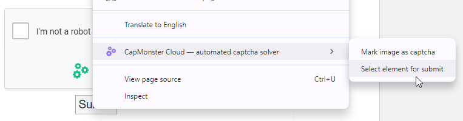
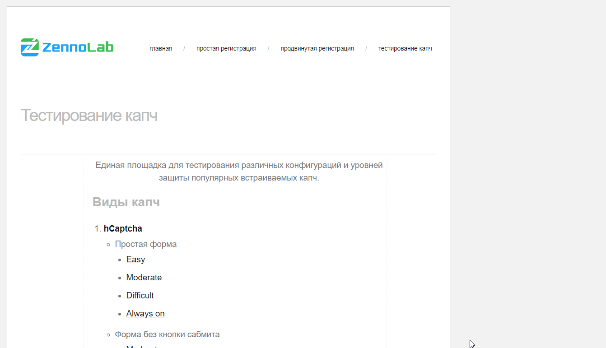

# Autosubmit na Extensão
Frequentemente, há a necessidade de realizar uma ação específica (como pressionar um botão) após resolver um CAPTCHA. 
A extensão CapMonster Cloud permite selecionar um elemento para clique automático após a resolução do CAPTCHA.

## Instruções para Selecionar um Elemento para Autosubmit
1. Acesse o site com o CAPTCHA.
2. Clique com o botão direito no botão (ou outro elemento) que deve ser clicado após resolver o CAPTCHA.
3. No menu que aparece, selecione "CapMonster Cloud - automated captcha solver" -> "Select element for submit".     
 

4. Após isso, uma mensagem informativa aparecerá no formulário dizendo "Element for auto submit", junto com um botão "Remove", que permite remover o elemento para autosubmit.  
 

5. Para soluções de CAPTCHA subsequentes nesta página, após o CAPTCHA ser resolvido com sucesso, o elemento de submissão selecionado será clicado automaticamente pela extensão.

## Disponibilidade do Autosubmit
Atualmente, o autosubmit pode ser usado apenas na extensão **Google Chrome** ao resolver com um **token**. 
O autosubmit está disponível para os seguintes tipos de CAPTCHA:
- ReCaptcha,
- GeeTest,
- Turnstile.
