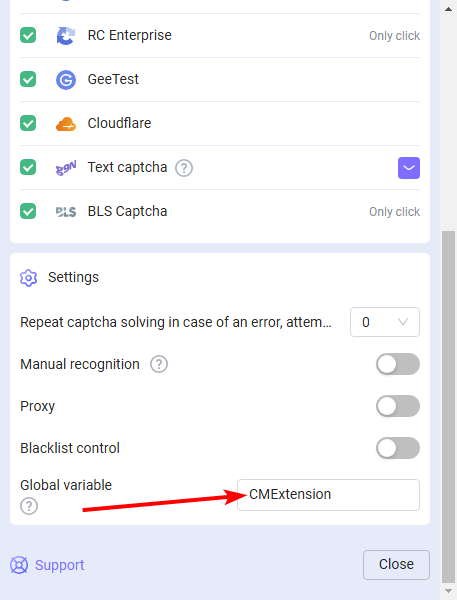

---
sidebar_position: 5
---


# Configurações da extensão

## Configurações disponíveis para alteração:

|**Chave**|**Tipo**|**Descrição**|
| :-: | :-: | :-: |
|`isEnabled`|`Boolean`|A extensão está ativada por padrão ou não|
|`clientKey`|`String`|Chave da API|
|`captchaList`|`Array<String>`|Lista de captchas que estão ativados (por padrão todos os captchas estão ativados)|
|`captchaExtra`|`Object<{[String]: 1 / 0}>`|Lista de captchas que podem ser resolvidos por cliques (Token - 0, Clique - 1)|
|`repeatsCount`|`Number`|Número de tentativas repetidas após um erro|
|`isEnabledIgnoreList`|`Boolean`|A lista negra de sites especificados no campo IgnoreList está ativada|
|`ignoreList`|`Array<String>`|Lista de sites para ignorar a solução de captchas|
|`proxy`|`Object`|Configurações de proxy|
|`isManualResolving`|`Boolean`|O reconhecimento manual está ativado|
|`delayStartCount`|`Array<{[CaptchaType]: Number}>`|Atraso antes de começar a resolver o captcha|
|`autoClick`|`Array<{[CaptchaType]: Boolean}>`|A habilidade de iniciar automaticamente a solução de captcha está ativada|
|`autoSolve`|`Array<{[CaptchaType]: Boolean}>`|A habilidade de resolver automaticamente a janela de captcha está ativada|
|`textCaptchaSaveOnSite`|`Boolean`|Se os elementos selecionados no site para captcha de texto serão salvos|
|`delayAfterLoadPage`|`Number`|Atraso antes de começar a resolver um captcha de texto, se foi salvo para o site|
|`recaptchaClickSelector`|`String`|Seletor de Elemento DOM para clicar ao iniciar a solução de Recaptcha|
|`globalVariable`|`String`|Nome do campo para interação com a extensão via objeto global|
<!-- |`hCaptchaClickSelector`|`String`|Seletor de Elemento DOM para clicar ao iniciar a solução de hCaptcha| -->

Há várias maneiras de alterar as configurações da extensão:
1. Antes de instalar a extensão.
2. Quando a extensão já está instalada.

## Alterando as configurações antes da instalação

Ao instalar a extensão via pacote (disponível para download [neste link](https://drive.google.com/file/d/11pVyiPltRW_vEPPnRnQJLNiX0J0GVhBe/view?usp=drive_link)), é possível definir os parâmetros iniciais com os quais a extensão funcionará. Para isso, você precisa descompactar o pacote e editar o arquivo defaultSettings.json, e depois empacotá-lo novamente.

### Descrição do arquivo de configurações defaultSettings.json

O arquivo de configurações é assim:

```json title="defaultSettings.json"
{
  "isEnabled": true,
  "clientKey": "",
  "captchaList": [
    "ReCaptcha2",
    "ReCaptcha3",
    "ReCaptchaEnterprise",
    "FunCaptcha",
    "GeeTest",
    "ImageToText",
    "Turnstile"
  ],
  "captchaExtra": {
    "ReCaptcha2": 1,
    "FunCaptcha": 1
  },
  "repeatsCount": 0,
  "isEnabledIgnoreList": false,
  "ignoreList": [],
  "proxy": {
    "isEnabled": false,
    "type": "http",
    "address": "",
    "port": 3128,
    "login": "",
    "password": ""
  },
  "manualResolving": false
}
```
## Alterando as configurações usando JS

O nome da variável global deve ser especificado na extensão, por exemplo, CMExtension. 
 

Após inicializar a extensão na página ativa, a variável global especificada aparece, permitindo que manipulemos as configurações da extensão.

Observe que os manipuladores de eventos estão anexados às propriedades, não aos dados internos.

### Exemplo:
```js
window.CMExtension.isEnabled = false;
```