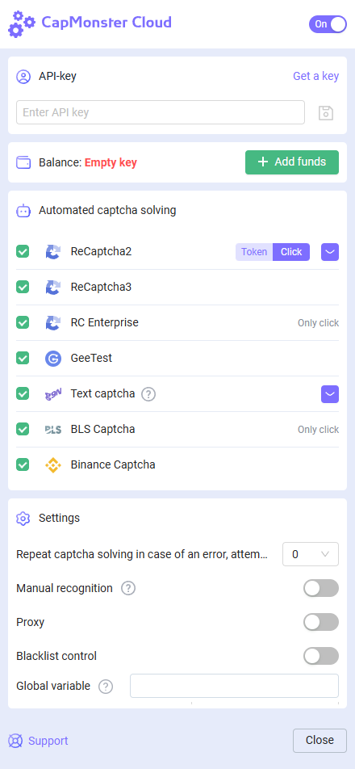
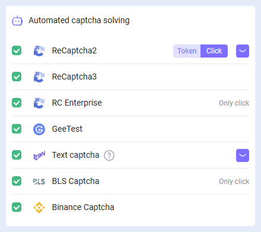

---
sidebar_position: 1
sidebar_label: Firefox browser extension
---

# Extensão do navegador Firefox

## Descrição
Com esta extensão, você pode reconhecer captchas automaticamente diretamente no navegador.

A extensão funciona no navegador Mozilla Firefox.

-----
## Instalação automática
1. Abra a [Loja de Add-ons do Firefox](https://addons.mozilla.org/en-US/firefox/addon/capmonster-cloud/).
2. Clique em **Adicionar ao Firefox**.
3. Confirme a adição da extensão clicando no botão "Adicionar" na janela modal.
   

Para começar a usar a extensão, clique em seu ícone à direita da barra de endereços. Vá para as [configurações](extension-firefox.md#configurações).

*Se por algum motivo não for possível instalar a extensão pela Loja de Add-ons do Firefox, use as instruções para instalação manual.*

    
Instalação manual

1. Baixe o [arquivo com a extensão](https://drive.google.com/file/d/1eKY5_nFmu-_BUuyewgLPIvf1S5wY8qYE/view?usp=drive_link).

1. Abra o navegador Firefox e vá trabalhar com as extensões:
   
   
1. Clique no botão de engrenagem e, na lista suspensa que se abre, selecione "Instalar add-on a partir do arquivo..."
   
   
1. Selecione o arquivo baixado com a extensão.

1. Após baixar a extensão, vá para "Gerenciar suas Extensões" e clique na extensão instalada.
   
   
1. Vá para a aba "Permissões" e certifique-se de que todas as permissões estão concedidas.
   

    
Atualização manual da extensão

Se você estiver instalando a extensão sobre a versão anterior, ao atualizar os arquivos originais da extensão, também precisará clicar no botão de atualização na página "Extensões" (como abrir esta página está descrito acima na seção "Instalação manual").

-----
## Configurações

    
Como fixar a extensão

Por padrão, uma extensão recém-instalada é fixada automaticamente no painel do navegador. 
   

Após iniciar a extensão, você verá esta janela:

### Chave API
Insira a chave da API no campo correspondente (1), pressione o botão salvar (2). Se você inseriu a chave correta, seu saldo será exibido abaixo (3).

### Solução automática de captchas
Aqui você pode selecionar os tipos de captchas que a extensão reconhecerá automaticamente.

:::info !

Pode ser necessário recarregar a página com captcha para que as alterações tenham efeito!

:::
### Repetir solução de captcha em caso de erro
Se a primeira tentativa de resolver o captcha falhar, a extensão enviará tarefas repetidas até que o captcha seja resolvido ou até que o limite especificado nesta configuração seja atingido.
### Proxy
 

Aqui você pode especificar o proxy que será enviado junto com a tarefa de reconhecimento.

O "Login" e a "Senha" são opcionais.
### Controle de lista negra
Usando a lista negra, você pode configurar a extensão para ignorar captchas em sites específicos.

Após ativar esta opção, aparecerá um campo para inserir os sites:

Os domínios devem ser especificados junto com o protocolo (https:// ou http://).
Você pode usar máscaras:

- ? - qualquer um caractere, exceto ponto final
- \* - qualquer número de caracteres

Exemplos:

|**Filtro**|**Descrição**|
| :-: | :-: |
|`https://zennolab.com`|Proibição da extensão no site `https://zennolab.com`|
|`https://*.zennolab.com`|Proibição da extensão em todos os subdomínios `https://zennolab.com`|
|`https://www.google.*`|Proibição da extensão de funcionar no Google em todas as zonas (ru, com, com.ua, etc.)|

Quando erros ocorrerem na solução de captchas, veja o [glossário de erros](/api/api-errors.md).