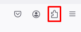
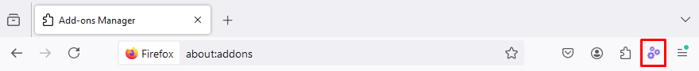
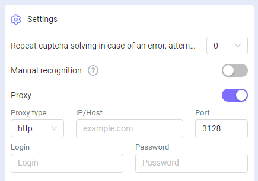

import { ArticleHead } from '../../../../../src/theme/ArticleHead';

<ArticleHead slug="extension/extension-firefox" />

# Extensão do navegador Firefox

## Descrição
Com esta extensão, você pode reconhecer captchas automaticamente diretamente no navegador.

A extensão funciona no navegador Mozilla Firefox.

-----
## Instalação automática
1. Abra a [Loja de Add-ons do Firefox](https://addons.mozilla.org/pt-br/firefox/addon/capmonster-cloud/).
2. Clique em **Adicionar ao Firefox**.
3. Confirme a adição da extensão clicando no botão **Adicionar** na janela modal.
   

Para começar a usar a extensão, clique em seu ícone à direita da barra de endereços. Vá para as [configurações](extension-firefox.mdx#configurações).

*Se por algum motivo não for possível instalar a extensão pela Loja de Add-ons do Firefox, use as instruções para instalação manual.*

    
Instalação manual

1. Baixe o [arquivo com a extensão](https://zenno.link/firefox-actual-build).

2. Abra o navegador Firefox e vá trabalhar com as extensões:
   
   
3. Clique no botão de engrenagem e, na lista suspensa que se abre, selecione **Instalar add-on a partir do arquivo...**
   
   
4. Selecione o arquivo baixado com a extensão.

5. Após baixar a extensão, vá para **Gerenciar suas Extensões** e clique na extensão instalada.
   
   
6. Vá para a aba **Permissões** e certifique-se de que todas as permissões estão concedidas.
   

    
Atualização manual da extensão

Se você estiver instalando a extensão sobre a versão anterior, ao atualizar os arquivos originais da extensão, também precisará clicar no botão de atualização na página **Extensões** (como abrir esta página está descrito acima na seção **Instalação manual**).

-----
## Configurações

    
Como fixar a extensão

Por padrão, uma extensão recém-instalada é fixada automaticamente no painel do navegador. 
   

Após iniciar a extensão, você verá esta janela:

### Chave API
Insira a chave da API no campo correspondente (1), pressione o botão salvar (2). Se você inseriu a chave correta, seu saldo será exibido abaixo (3).

### Solução automática de captchas
Aqui você pode selecionar os tipos de captchas que a extensão reconhecerá automaticamente.

:::info !

Pode ser necessário recarregar a página com captcha para que as alterações tenham efeito!

### Repetir solução de captcha em caso de erro
Se a primeira tentativa de resolver o captcha falhar, a extensão enviará tarefas repetidas até que o captcha seja resolvido ou até que o limite especificado nesta configuração seja atingido.
### Proxy
 

Aqui você pode especificar o proxy que será enviado junto com a tarefa de reconhecimento.

O "Login" e a "Senha" são opcionais.
### Controle de lista negra
Usando a lista negra, você pode configurar a extensão para ignorar captchas em sites específicos.

Após ativar esta opção, aparecerá um campo para inserir os sites:

Os domínios devem ser especificados junto com o protocolo (https:// ou http://).
Você pode usar máscaras:

- ? - qualquer um caractere, exceto ponto final
- \* - qualquer número de caracteres

Exemplos:

|**Filtro**|**Descrição**|
| :-: | :-: |
|`https://zennolab.com`|Proibição da extensão no site `https://zennolab.com`|
|`https://*.zennolab.com`|Proibição da extensão em todos os subdomínios `https://zennolab.com`|
|`https://www.google.*`|Proibição da extensão de funcionar no Google em todas as zonas (ru, com, com.ua, etc.)|

Quando erros ocorrerem na solução de captchas, veja o [glossário de erros](/api/api-errors.mdx).

## Mapeamento de parâmetros de captcha

A extensão **CapMonster Cloud** oferece uma maneira prática de visualizar os parâmetros de vários tipos de captcha necessários para o envio correto da tarefa ao servidor e sua resolução com sucesso. Os dados exibidos ajudam a garantir a precisão dos parâmetros enviados e podem ser usados como exemplo na criação de suas requisições de API.

### Tipos de captcha suportados e seus parâmetros

| Tipo de Captcha             | Parâmetros Exibidos                                                                                                             |
| --------------------------- | ------------------------------------------------------------------------------------------------------------------------------- |
| **reCAPTCHA V2**            | `class`, `imageUrls`, `Task` (dentro de `metadata`), `Grid` (dentro de `metadata`), `recognizingThreshold`, `userAgent`, `type` |
| **reCAPTCHA V2 Invisible**  | `class`, `imageUrls`, `Task` (dentro de `metadata`), `Grid` (dentro de `metadata`), `recognizingThreshold`, `userAgent`, `type` |
| **reCAPTCHA V2 Enterprise** | `class`, `imageUrls`, `Task` (dentro de `metadata`), `Grid` (dentro de `metadata`), `recognizingThreshold`, `userAgent`, `type` |
| **reCAPTCHA V3**            | `websiteURL`, `websiteKey`, `pageAction`, `minScore`, `type`                                                                    |
| **GeeTest v3**              | `websiteURL`, `gt`, `challenge`, `userAgent`, `type`                                                                            |
| **GeeTest v4**              | `websiteURL`, `gt` (`captcha_id`), `userAgent`, `version`, `type`                                                               |
| **Cloudflare Turnstile**    | `websiteURL`, `websiteKey`, `userAgent`, `type`                                                                                 |
| **Cloudflare Challenge**    | `websiteURL`, `websiteKey`, `userAgent`, `pageAction`, `data`, `pageData`, `cloudflareTaskType`, `type`                         |
| **ImageToText**             | `body` (em formato `base64`), `type`                                                                                            |
| **BLS**                     | `class`, `imagesBase64`, `Task` (dentro de `metadata`), `TaskArgument` (dentro de `metadata`), `type`                           |
| **Binance**                 | `websiteURL`, `websiteKey`, `validateId`, `userAgent`, `type`                                                                   |

Para utilizar este recurso, ative a extensão, abra a página do captcha (certifique-se de que o tipo é suportado e está selecionado para resolução), e siga os passos abaixo:

1. Abra as Ferramentas de **Desenvolvedor** (DevTools) e vá até a aba **CapMonster Cloud**:  
   
   

2. Recarregue a página.

Os parâmetros do captcha selecionado serão exibidos automaticamente:  

