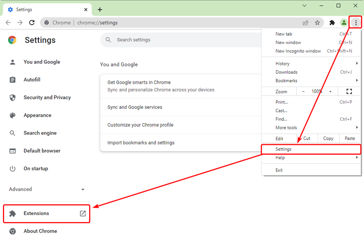
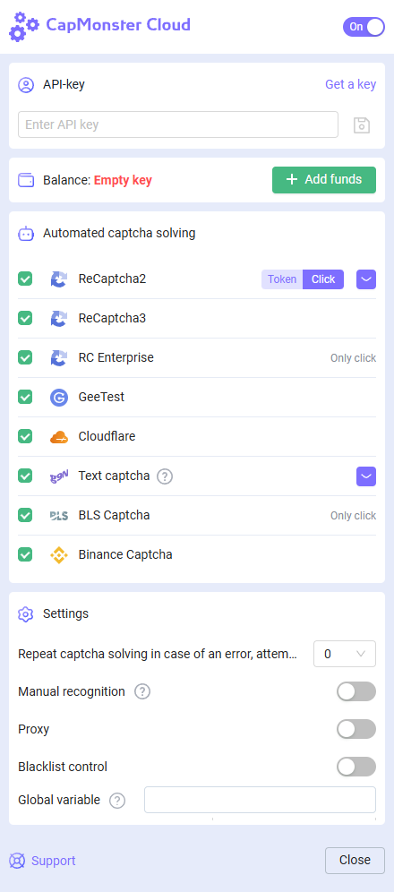
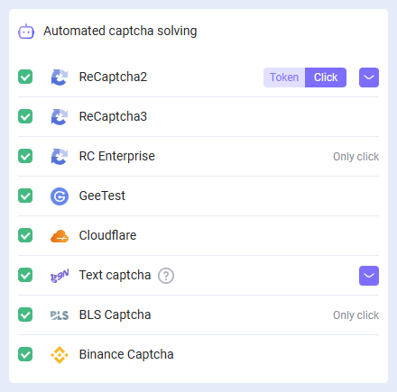
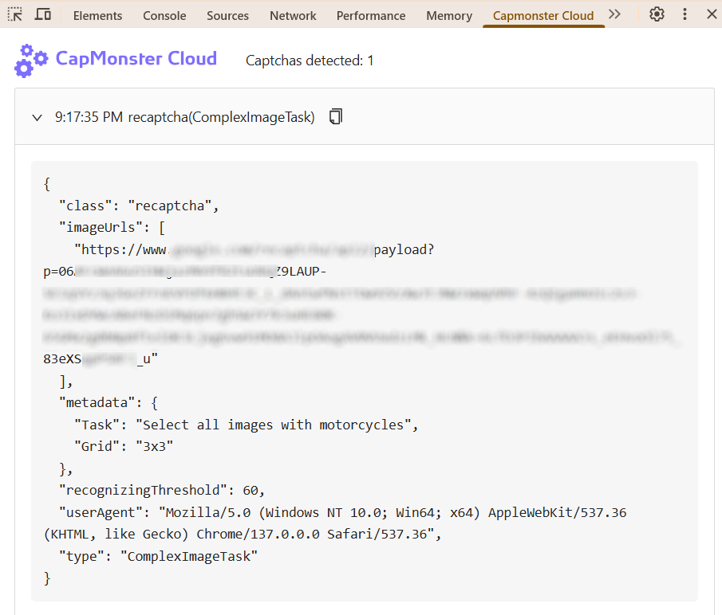

---
sidebar_position: 0
---

# Extensão do navegador Chrome
## Descrição
Com esta extensão, você pode reconhecer captchas automaticamente diretamente no navegador.

A extensão funciona no navegador Google Chrome.

-----
## Instalação automática
**Importante!** Não é possível instalar extensões no modo de navegação anônima e no modo visitante.

1. Abra a [Chrome Web Store](https://chrome.google.com/webstore/detail/capmonster-cloud-%E2%80%94-automa/pabjfbciaedomjjfelfafejkppknjleh?hl=en).
2. Clique em **Instalar**.

Para começar a usar a extensão, clique em seu ícone à direita da barra de endereços. Vá para as [configurações](extension-main.md#configurações).

*Se por algum motivo não for possível instalar a extensão pela Chrome Web Store, use as instruções para instalação manual.*

    
Instalação manual

1. Baixe o [arquivo com a extensão](https://zenno.link/chrome-actual-build).

2. Descompacte-o para qualquer pasta.
   
   **ATENÇÃO**: a pasta não deve ser excluída, caso contrário, a extensão deixará de funcionar.
3. No navegador Google Chrome, abra a página “Extensões”. Existem várias maneiras de fazer isso:
   1. Digite chrome://extensions na barra de endereços do navegador e pressione Enter.
   2. No menu: clique nos três pontos verticais no canto superior direito (perto da foto do perfil), depois em "Mais Ferramentas", e em seguida "Extensões".

  

   3. Ou vá para as configurações do Google Chrome e selecione "Extensões" (na parte inferior) no menu à direita.

  

4. Ative o “Modo de desenvolvedor”.
5. Em seguida, clique em “Carregar sem compactação”.

  

6. Encontre e escolha a pasta onde você descompactou a extensão.
7. Depois disso, a extensão deve aparecer na lista das extensões instaladas.

  

    
Atualização manual da extensão

Se você estiver instalando a extensão sobre a versão anterior, ao atualizar os arquivos originais da extensão, também precisará clicar no botão de atualização na página "Extensões" (como abrir esta página está descrito acima na seção "Instalação manual").

-----
## Configurações

    
Como fixar a extensão

Por padrão, a extensão instalada é ocultada. Para fixá-la, você deve clicar no botão “Fixar”:

Após iniciar a extensão, você verá esta janela:

### Chave API
Insira a chave da API no campo correspondente (1), pressione o botão salvar (2). Se você inseriu a chave correta, seu saldo será exibido abaixo (3).

### Solução automática de captchas
Aqui você pode selecionar os tipos de captchas que a extensão reconhecerá automaticamente.

:::info !

Pode ser necessário recarregar a página com captcha para que as alterações tenham efeito!

:::
### Repetir solução de captcha em caso de erro
Se a primeira tentativa de resolver o captcha falhar, a extensão enviará tarefas repetidas até que o captcha seja resolvido, ou até que o limite especificado nesta configuração seja atingido.
### Proxy
 

Aqui você pode especificar o proxy que será enviado junto com a tarefa de reconhecimento.

O "Login" e a "Senha" são opcionais.
### Controle de lista negra
Usando a lista negra, você pode configurar a extensão para ignorar captchas em sites específicos.

Após ativar esta opção, aparecerá um campo para inserir os sites:

Os domínios devem ser especificados junto com o protocolo (https:// ou http://).
Você pode usar máscaras:

- ? - qualquer um caractere, exceto ponto final
- \* - qualquer número de caracteres

Exemplos:

|**Filtro**|**Descrição**|
| :-: | :-: |
|`https://zennolab.com`|Proibição da extensão no site `https://zennolab.com`|
|`https://*.zennolab.com`|Proibição da extensão em todos os subdomínios `https://zennolab.com`|
|`https://www.google.*`|Proibição da extensão de funcionar no Google em todas as zonas (ru, com, com.ua, etc.)|

Quando erros ocorrerem na solução de captchas, veja o [glossário de erros](/api/api-errors.md).

## Mapeamento de parâmetros de captcha

A extensão **CapMonster Cloud** oferece uma maneira prática de visualizar os parâmetros de vários tipos de captchas necessários para o envio correto da tarefa ao servidor e a sua resolução com sucesso. Os dados exibidos ajudam a garantir a precisão dos parâmetros enviados e podem ser usados como exemplo na construção das suas requisições de API.

### Tipos de captcha suportados e seus parâmetros

| Tipo de captcha              | Parâmetros exibidos                                                                  |
|-----------------------------|----------------------------------------------------------------------------------------|
| **reCAPTCHA V2**            | `class`, `imageUrls`, `Task` (dentro de `metadata`), `Grid` (dentro de `metadata`), `recognizingThreshold`, `userAgent`, `type` |
| **reCAPTCHA V2 Invisible**  | `class`, `imageUrls`, `Task` (dentro de `metadata`), `Grid` (dentro de `metadata`), `recognizingThreshold`, `userAgent`, `type` |
| **reCAPTCHA V2 Enterprise** | `class`, `imageUrls`, `Task` (dentro de `metadata`), `Grid` (dentro de `metadata`), `recognizingThreshold`, `userAgent`, `type` |
| **GeeTest v3**              | `websiteURL`, `gt`, `challenge`, `userAgent`, `type`                                  |
| **GeeTest v4**              | `websiteURL`, `gt` (`captcha_id`), `userAgent`, `version`, `type`                     |
| **Cloudflare Turnstile**    | `websiteURL`, `websiteKey`, `userAgent`, `type`                                       |
| **Cloudflare Challenge**    | `websiteURL`, `websiteKey`, `userAgent`, `pageAction`, `data`, `pageData`, `cloudflareTaskType`, `type` |
| **ImageToText**             | `body` (em formato `base64`), `type`                                                  |
| **BLS**                     | `class`, `imagesBase64`, `Task` (dentro de `metadata`), `TaskArgument` (dentro de `metadata`), `type` |
| **Binance**                 | `websiteURL`, `websiteKey`, `validateId`, `userAgent`, `type`                         |

Para usar este recurso, ative a extensão, abra a página do captcha (certifique-se de que o tipo de captcha é suportado e está selecionado para resolução), e siga os passos abaixo:

1. Abra as Ferramentas de **Desenvolvedor** (DevTools) e vá até a aba **CapMonster Cloud**: 
    
   

2. Recarregue a página.

Os parâmetros do captcha selecionado serão exibidos automaticamente:  

