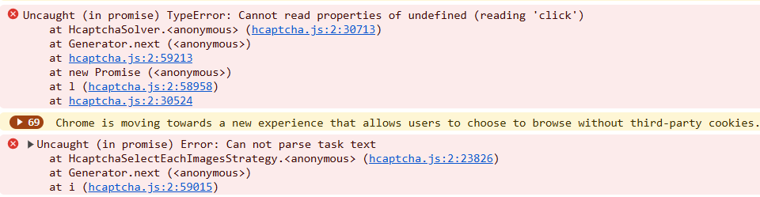

# Problemas conhecidos


<details>
        <summary>store.steampowered.com</summary>

Nosso serviço só pode resolver captchas em inglês; neste site, a determinação do idioma do captcha não vem das configurações do sistema, mas do idioma selecionado no site, portanto, para uma solução correta, certifique-se de selecionar o inglês.

</details>

<details>
        <summary>Erro 'Uncaught (in promise) TypeError: Cannot read properties of undefined (reading 'click')'</summary>

Se ao resolver o captcha usando o método de cliques (ComplexImageTask) através da extensão CapMonster Cloud você encontrar o erro 'Uncaught (in promise) TypeError: Cannot read properties of undefined (reading 'click')', conforme mostrado na captura de tela, recomenda-se definir o valor de 'Delay between click' na extensão — isso pode ajudar a resolver o problema.

</details>

<details>
  <summary>A extensão não responde ao Cloudflare Turnstile</summary>

## Acessando `websiteKey` via Shadow DOM  

Às vezes, a chave do captcha (**`websiteKey`**) está oculta dentro de um `shadow-root` com modo *closed*.  
Por exemplo, em um iframe com o endereço:  
`https://challenges.cloudflare.com/cdn-cgi/challenge-platform/h/g/turnstile/if/.../0x4AAAAAAA1a2345abc-/auto/...`

Nesse caso, o `websiteKey` é *0x4AAAAAAA1a2345abc*.  

Se a extensão for carregada **antes** desse iframe, é possível tornar o `shadowRoot` aberto e extrair o `websiteKey`.  
Se o iframe já estiver carregado — não será possível obter a chave.

Como alternativa à extensão para testes e depuração, você pode usar **Selenium** (ou outros navegadores headless), ou executá-lo junto com a extensão, se necessário.

---

## Exemplo: Abrindo `shadowRoot` com Selenium

```python
from selenium import webdriver
from selenium.webdriver.common.by import By
import time

# Configuração do WebDriver
options = webdriver.ChromeOptions()
driver = webdriver.Chrome(options=options)

# Abrir página
driver.get("https://example.com")

# Injetar JavaScript para abrir o ShadowRoot
inject_script = """
const originalAttachShadow = Element.prototype.attachShadow;
Element.prototype.attachShadow = function(...args) {
    if (args[0] && args[0].mode === 'closed') {
        args[0].mode = 'open';
    }
    const shadowRoot = originalAttachShadow.apply(this, args);
    return shadowRoot;
};
console.log('ShadowRoot mode changed to open.');
"""
driver.execute_script(inject_script)

# Aguardar o carregamento da página
time.sleep(3)

# Exemplo de interação com o shadow DOM após alterar o attachShadow
shadow_host = driver.find_element(By.CSS_SELECTOR, "shadow-host-selector")  # Especifique o seletor real
shadow_root = driver.execute_script("return arguments[0].shadowRoot", shadow_host)

# Interagir com elementos no shadow DOM
button = shadow_root.find_element(By.CSS_SELECTOR, "button")
button.click()

# Fechar o navegador
driver.quit()
```
Para usar o Selenium junto com a extensão, adicione a extensão ao iniciar o navegador:

```python
options = webdriver.ChromeOptions()
options.add_extension('your_extension.crx')  # caminho para a extensão
driver = webdriver.Chrome(options=options)
```
Saiba como baixar o arquivo CRX [aqui](https://zennolab.atlassian.net/wiki/spaces/EN/pages/2082930692/Works+with+Extensions#How-to-download-browser-extension-as-a-.crx-file).

</details>
