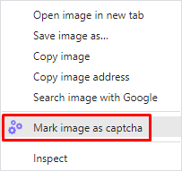
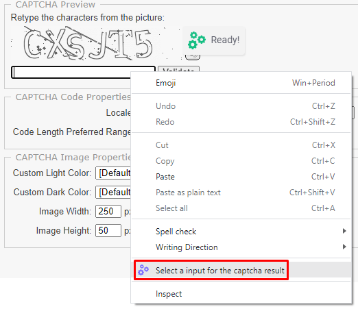

---
sidebar_position: 2
---

# Resolving captchas de texto
## Descrição
Adicionamos a capacidade de reconhecer captchas de texto em nossa extensão de navegador.

## Como funciona
### Ações no navegador
1. Clique com o botão direito na captcha e selecione "Marcar imagem como captcha" no menu que aparecer.

2. Clique com o botão direito no campo de entrada da resposta e selecione "Selecionar um campo para o resultado da captcha" no menu que abrir.

3. O resultado é automaticamente inserido no campo de resposta.

### Automação de reconhecimento usando software
Para automatizar o processo de reconhecimento de captchas de texto no navegador (por exemplo, usando *Developer Tool* ou *Selenium*), você precisa:
1. Atribuir o atributo `cm-image-to-text-source="id"` ao elemento com a imagem:

2. Atribuir o atributo `cm-image-to-text-input-result="id"` ao elemento com o campo de entrada:

Onde "id" é o identificador da captcha (valor arbitrário).
:::info
Ao mesmo tempo, captchas e campos de entrada correspondentes devem ter o mesmo id.

Você pode resolver várias captchas na página em paralelo, o importante é que o id dentro de um conjunto seja único e o id da captcha e do campo de entrada sejam correspondentes.
:::
