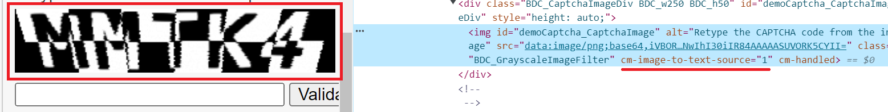

import { ArticleHead } from '../../../../../src/theme/ArticleHead';

<ArticleHead slug="extension/text-captcha-solve" />

# Resolving captchas de texto
## Descrição
Adicionamos a capacidade de reconhecer captchas de texto em nossa extensão de navegador.

## Como funciona
### Ações no navegador
1. Clique com o botão direito na captcha e selecione **Marcar imagem como captcha** no menu que aparecer.

2. Clique com o botão direito no campo de entrada da resposta e selecione **Selecionar um campo para o resultado da captcha** no menu que abrir.

3. O resultado é automaticamente inserido no campo de resposta.

### Automação de reconhecimento usando software
Para automatizar o processo de reconhecimento de captchas de texto no navegador (por exemplo, usando *Developer Tool* ou *Selenium*), você precisa:
1. Atribuir o atributo `cm-image-to-text-source=**id**` ao elemento com a imagem:

2. Atribuir o atributo `cm-image-to-text-input-result=**id**` ao elemento com o campo de entrada:

Onde **id** é o identificador da captcha (valor arbitrário).
:::info
Ao mesmo tempo, captchas e campos de entrada correspondentes devem ter o mesmo id.

Você pode resolver várias captchas na página em paralelo, o importante é que o id dentro de um conjunto seja único e o id da captcha e do campo de entrada sejam correspondentes.
:::

## O que fazer se o CAPTCHA de texto for resolvido incorretamente

Se o CAPTCHA de texto estiver sendo resolvido incorretamente pela extensão, siga estas etapas:

1. Selecione o módulo apropriado na lista disponível (veja [Nome do Módulo](/docs/api/module-name)).
2. Se o módulo necessário não estiver disponível, crie o seu próprio (veja [Criando um módulo de usuário](/docs/api/user-module)) e aguarde até que esteja pronto.
3. Na extensão, abra **Text captcha** → **Settings** (botão roxo com uma seta).

4. Insira o nome do módulo e clique em **+ Add Module**.

Assim, o CAPTCHA será resolvido corretamente usando o módulo selecionado ou personalizado.
