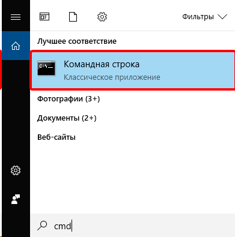

# Reconhecimento de Captcha via API de outros serviços
O CapMonster Cloud suporta API: Anti-Captcha (v1.0, v2.0), RuCaptcha, RipCaptcha, 2Captcha, BypassCaptcha, DeathByCaptcha. Assim, você pode resolver captchas através do CapMonster Cloud, mesmo que seu programa não tenha integração com nosso serviço.

Você só precisa instalar  [**CapMonsterInterceptor**](https://static.zenno.services/ccl/interceptor.msi) (OC Windows)
 Suporte para outras plataformas está em desenvolvimento.

Durante o processo de instalação, você precisará especificar a chave da API da sua conta, que pode ser encontrada na sua [área pessoal](https://capmonster.cloud/Dashboard).

Quando a instalação for concluída, um atalho do CapMonsterInterceptor será criado na área de trabalho. Após o lançamento, o programa ficará disponível na bandeja do sistema. Nenhuma configuração adicional é necessária.

Quando o CapMonsterInterceptor estiver em execução, todos os captchas enviados para reconhecimento aos serviços *Anti-Captcha (v1.0, v2.0), RuCaptcha, RipCaptcha, 2Captcha, BypassCaptcha, DeathByCaptcha* serão interceptados e redirecionados para o CapMonster Cloud.
## Exemplo
Basta selecionar um dos serviços de reconhecimento no seu programa onde você precisa inserir um captcha. No nosso exemplo, será *DeathByCaptcha*.

- **Nota para DeathByCaptcha:** para identificar um usuário, a API DeathByCaptcha usa nome de usuário e senha, não uma chave de API. Nesse caso, você precisa preencher 2 campos com valores aleatórios.

Insira qualquer chave de API (por exemplo, qwerty).

Agora você pode executar seu programa. Todos os captchas enviados para outro serviço (DeathByCaptcha no nosso exemplo) serão interceptados e enviados para o CapMonster Cloud.

Ao clicar duas vezes no ícone do CapMonsterInterceptor na bandeja, você pode ver as estatísticas dos captchas interceptados enviados para reconhecimento.

## Perguntas e respostas

    
Como alterar a chave de API especificada ao instalar o CapMonsterInterceptor?

Dê um clique duplo no ícone do CapMonsterInterceptor na bandeja. Na janela do programa, encontre o bloco «Configurações», altere a chave e clique em «Salvar».

    
O que fazer se ocorrer um erro: Tentativa de acessar um soquete usando um método proibido pelos direitos de acesso?

Se ocorrer um erro durante a inicialização, isso significa que as portas 80 e/ou 443 estão ocupadas por outro aplicativo.

Para corrigir esse erro, é necessário encerrar o processo que ocupa essas portas.

Execute o prompt de comando através do menu iniciar → pesquisa → cmd

Digite o comando `netstat -a -o | findstr :443`

A chave ***-a*** indica que estamos interessados em todas as conexões ativas, ***-o*** — para cada uma delas, precisamos exibir o PID (ID do processo).
**findstr :443** nos mostrará apenas o processo que ocupa a porta necessária.

O PID do processo será exibido na coluna da direita, como na captura de tela.
Lembre-se ou anote-o.

Abra o gerenciador de tarefas, vá para a aba «Detalhes», encontre o processo com o ID necessário e finalize a tarefa.

