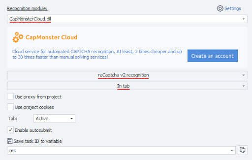
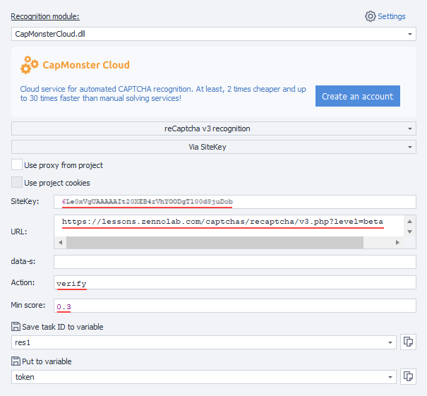
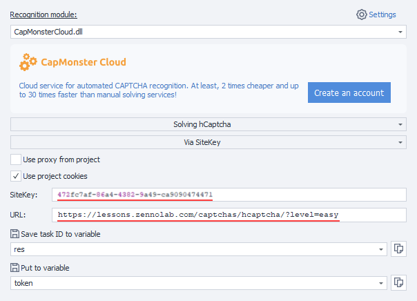

---

sidebar\_position: 0

# id: my-home-doc

# slug: /

---

# Começando

Esta seção contém instruções para começar a usar o serviço, além de descrever os principais métodos para enviar captchas e obter seu reconhecimento.

## Passo 1. Crie uma conta

Antes de começar a resolver captchas, registre-se em [CapMonster Cloud](https://capmonster.cloud/) da maneira que preferir. Depois, acesse o [Painel](https://capmonster.cloud/Dashboard), onde encontrará todas as informações necessárias — saldo atual, chave API e estatísticas de tarefas resolvidas e não resolvidas.


## Passo 2. Recarregue o saldo

O serviço suporta vários métodos de recarga.


Agora você pode resolver captchas automaticamente usando a [extensão](https://docs.capmonster.cloud/docs/extension) ou criando tarefas via API.

## Métodos para envio e obtenção do resultado

:::info Endereço do método

```http
https://api.capmonster.cloud
```

Formato da requisição: `JSON POST`.
Formato da resposta é sempre `JSON`.

:::

**Para resolver uma captcha, você precisa**:

1. Criar uma tarefa de captcha usando o método [createTask](api/methods/create-task.md).
2. Esperar algum tempo. Dependendo da carga do sistema, você receberá uma resposta entre 300 ms e 6 s.
3. Solicitar a resposta da captcha usando o método [getTaskResult](api/methods/get-task-result.md). Se a captcha ainda não tiver sido resolvida, volte ao passo 2.

Método adicional:

* [Consultar](api/methods/get-balance.md) o saldo atual da conta.

### Exemplos de código

Para sua conveniência, criamos bibliotecas prontas para integrar rapidamente a API do CapMonster.Cloud ao seu código. Reconheça diversos tipos de captchas pelos menores preços do mercado!

| **Linguagem** | **Link para repositório**                                                                                                                                |
| :------------ | :------------------------------------------------------------------------------------------------------------------------------------------------------- |
| C#            | - [Nuget](https://www.nuget.org/packages/Zennolab.CapMonsterCloud.Client)<br /> - [Github](https://github.com/ZennoLab/capmonstercloud-client-dotnet)    |
| Python        | - [PyPl](https://pypi.org/project/capmonstercloudclient/)<br /> - [Github](https://github.com/ZennoLab/capmonstercloud-client-python)                    |
| JS            | - [Npm](https://www.npmjs.com/package/@zennolab_com/capmonstercloud-client)<br /> - [Github](https://github.com/ZennoLab/capmonstercloud-client-js)      |
| GO            | - [Pkg.go.dev](https://pkg.go.dev/github.com/ZennoLab/capmonstercloud-client-go)<br /> - [Github](https://github.com/ZennoLab/capmonstercloud-client-go) |
| PHP           | - [Packagist](https://packagist.org/packages/zennolab/capmonstercloud.client)<br /> - [Github](https://github.com/ZennoLab/capmonstercloud-client-php)   |

## Métodos de reconhecimento de captcha

### 1. Via token

Este é o método básico de reconhecimento, onde você precisa:

* localizar manualmente parâmetros na página, como:

  * `sitekey` (ou `websiteKey`) — identificador único da captcha;
  * `websiteURL` — endereço da página onde a captcha está exibida;
* analisar o código JavaScript e as requisições de rede para obter esses dados;
* enviar a tarefa para CapMonster Cloud com os parâmetros necessários;
* receber em resposta o **token** — código único que confirma a resolução da captcha;
* executar o **autosubmit** — enviar o token de volta ao site para confirmar a passagem da captcha.

> Adequado para desenvolvedores que estão dispostos a analisar manualmente o código e construir a lógica de envio da solução.

---

### 2. Via cliques

Método que imita ações do usuário (movimento do mouse, cliques, seleção de imagens). É usado via extensão oficial do navegador e não requer:

* busca manual do `sitekey` ou outros parâmetros;
* análise de HTML ou JavaScript;
* implementação do mecanismo de autosubmit.

Este método é útil se:

* o site usa uma implementação não padrão da captcha;
* parâmetros são criptografados ou inseridos dinamicamente;
* a função submit está escondida profundamente nos scripts.

> Ideal para casos complexos e usuários sem experiência em programação.

---

Ambos os métodos usam CapMonster Cloud para reconhecimento, mas diferem na complexidade de configuração.
A escolha do método depende do site específico e do nível do usuário.

Existe também uma ótima possibilidade de aplicar o método de cliques no [ZennoPoster](https://zennolab.com/en/products/zennoposter/). Para isso, basta instalar a nossa extensão CapMonster Cloud (veja a seção [Instrução para instalar a extensão CapMonster Cloud no navegador ProjectMaker](extension/install-instruction.md)) no projeto com motor Chromium, inserir sua chave API e usar a extensão durante o trabalho com o projeto, como se estivesse usando o navegador Chrome padrão.

## Exemplos de envio do token no ZennoPoster

Com ações:

1. Integre CapMonster Cloud no ProjectMaker (“Configurações” - “Captchas” - selecione o módulo CapMonster Cloud e insira sua chave API);

2. Adicione ações “Limpar cookies” - “Navegar até página” (por exemplo, para reCaptcha v.2 – [https://lessons.zennolab.com/captchas/recaptcha/v2\_simple.php?level=high](https://lessons.zennolab.com/captchas/recaptcha/v2_simple.php?level=high)) - “Reconhecer ReCaptcha”;

3. Nas propriedades da ação “Reconhecer ReCaptcha” selecione o módulo CapMonsterCloud.dll, indique o tipo de captcha (reCaptcha v.2) e o modo de reconhecimento (**Na aba** ou **Via sitekey**):



4. Se escolher o modo **Via sitekey**, informe os dados da captcha (sitekey) e a url (endereço da página onde a captcha deve ser resolvida):


### reCaptcha v.3

1. Adicione ações “Limpar cookies” - “Navegar até página” (por exemplo, [https://lessons.zennolab.com/captchas/recaptcha/v3.php?level=beta](https://lessons.zennolab.com/captchas/recaptcha/v3.php?level=beta)) - “Reconhecer ReCaptcha”;

2. Nas propriedades da ação “Reconhecer ReCaptcha” escolha o módulo CapMonsterCloud.dll, defina o tipo da captcha (reCaptcha v.3), modo (Na aba ou Via sitekey), e também informe Action e minScore:



<!-- ### hCaptcha

1. Adicione ao seu projeto, onde já houve navegação até a página com captcha, a ação “Reconhecer hCaptcha”;

2. Nas propriedades da ação “Reconhecer hCaptcha” escolha o modo (Na aba ou Via Sitekey). Se escolher Via Sitekey, informe o sitekey e a URL onde a captcha está localizada:

 -->

### Usando requisições HTTP

Para alguns tipos de captcha não há ações prontas no ProjectMaker, neste caso você precisa usar a extensão ou montar as requisições manualmente para resolver a captcha.

1. “Processamento de variáveis” (“Adicionar ação” - “Dados” - “Processamento de variáveis”), nas propriedades escolha “Definir valor” e insira seu API-key do CapMonster Cloud:


2. “Adicionar ação” - “HTTP” - “Requisição POST” (adicione também dados de proxy, se necessário):


3. Adicione a ação “Processamento JSON/XML” (“Adicionar ação” - “Dados” - “Processamento JSON/XML”), nas propriedades escolha “parsing”, tipo “Json” e para o texto a ser analisado clique com o botão direito e selecione “Definir valor a partir da variável”:


4. Adicione uma ação “Processamento de variáveis”, nela defina o valor `{-Json.taskId-}`:


5. Monte nova requisição POST para obter o resultado:


6. Adicione “Parsing” na ação “Processamento JSON/XML”:


7. Depois, insira o valor do token no formulário da captcha (analisando o código da página) usando a ação “Definir valor”, por exemplo:


## Vídeo tutorial: resolvendo captchas via API e ZennoPoster

Este vídeo demonstra a resolução de captchas via CapMonster Cloud usando API e [ZennoPoster](https://zennolab.com/en/products/zennoposter/), além de oferecer dicas práticas para uma configuração rápida e uso eficiente do serviço. 
<video width="100%" height="400" controls>
  <source src="/videos/Capmonster Cloud-PT.mp4" type="video/mp4" />
  Seu navegador não suporta vídeo.
</video>
