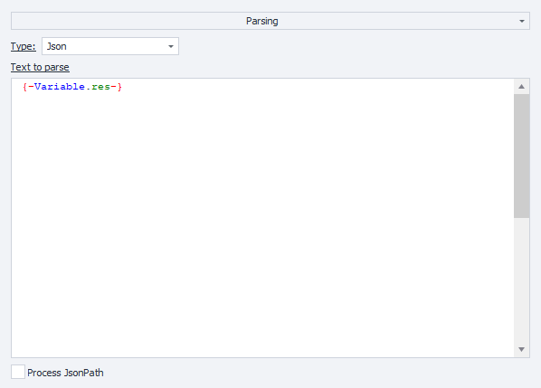

import { ArticleHead } from '../../../../src/theme/ArticleHead';

<ArticleHead slug="getting-start" />

# Primeiros passos

Esta seção contém instruções para começar a usar o serviço, bem como descreve os principais métodos para enviar captchas e obter suas soluções.

## Passo 1. Crie uma conta

Antes de começar a resolver captchas, registre-se no [CapMonster Cloud](https://capmonster.cloud/) da forma que for mais conveniente para você. Depois, acesse o [Painel de Controle](https://capmonster.cloud/Dashboard), onde você encontrará todas as informações necessárias — saldo atual, chave API e estatísticas de tarefas resolvidas e não resolvidas.


## Passo 2. Recarregue seu saldo

O serviço suporta vários métodos de recarga.


Agora você pode resolver captchas automaticamente usando a [extensão](../docs/extension) ou criando tarefas via API.

## Métodos para enviar solicitações e obter resultados

:::info Endereço do método
```http
https://api.capmonster.cloud
```
Formato da solicitação: `JSON POST`.
A resposta é sempre no formato `JSON`.
:::

**Para resolver um captcha, você deve:**

1. Criar uma tarefa de captcha usando o método [createTask](api/methods/create-task.mdx).
2. Esperar um pouco. Dependendo da carga do sistema, a resposta pode levar entre **300** ms e **6** segundos.  
3. Solicitar o resultado da tarefa com o método [getTaskResult](api/methods/get-task-result.mdx). Se o captcha ainda não foi resolvido, volte ao passo 2.

Método adicional:

- [Consultar](api/methods/get-balance.mdx) o saldo atual da conta.

### Exemplos de código

Para sua conveniência, fornecemos bibliotecas prontas para rápida integração da API do CapMonster Cloud em seu código. Resolva vários tipos de captchas com os preços mais baixos do mercado!

|**Linguagem**|**Link para o repositório**|
| :- | :- | 
|C#|- [Nuget](https://www.nuget.org/packages/Zennolab.CapMonsterCloud.Client)<br /> - [Github](https://github.com/ZennoLab/capmonstercloud-client-dotnet) |
|Python|- [PyPl](https://pypi.org/project/capmonstercloudclient/)<br /> - [Github](https://github.com/ZennoLab/capmonstercloud-client-python)|
|JS|- [Npm](https://www.npmjs.com/package/@zennolab_com/capmonstercloud-client)<br /> - [Github](https://github.com/ZennoLab/capmonstercloud-client-js)|
|GO|- [Pkg.go.dev](https://pkg.go.dev/github.com/ZennoLab/capmonstercloud-client-go)<br /> - [Github](https://github.com/ZennoLab/capmonstercloud-client-go)|
|PHP|- [Packagist](https://packagist.org/packages/zennolab/capmonstercloud.client)<br /> - [Github](https://github.com/ZennoLab/capmonstercloud-client-php)|

## Métodos de reconhecimento de captcha

### 1. Via token

Este é o método básico para resolver captchas, que consiste em:

- Encontrar manualmente parâmetros na página, tais como:  
  - `sitekey` (ou `websiteKey`) — identificador único do captcha;  
  - `websiteURL` — URL da página onde o captcha aparece;  
- Analisar o código JavaScript e as requisições de rede para obter esses dados;  
- Enviar uma tarefa ao CapMonster Cloud com os parâmetros necessários;  
- Receber em resposta um **token** — código único que confirma a solução do captcha;  
- Realizar o **autosubmit** — enviar o token de volta ao site para confirmar que o captcha foi resolvido.

> Indicado para desenvolvedores que estão dispostos a analisar o código manualmente e criar a lógica para enviar a solução.

---

### 2. Via cliques

Método que imita as ações do usuário (movimento do mouse, cliques, seleção de imagens). É utilizado através de uma extensão de navegador e de uma API. Com este método é possível resolver reCAPTCHA e CAPTCHAs visuais complexos com imagens.

Este método é útil se:

- O site usa uma implementação de captcha não padrão;  
- Os parâmetros são criptografados ou inseridos dinamicamente;  
- A função de envio está escondida profundamente nos scripts.

> Ideal para casos complexos e usuários sem experiência em programação.

---

Ambos os métodos usam o CapMonster Cloud para reconhecimento, mas diferem na complexidade de configuração.  
A escolha depende do site específico e do nível de conhecimento do usuário.

Também há uma ótima opção para usar o método de cliques no [ZennoPoster](https://zennolab.com/en/products/zennoposter/). Basta instalar nossa extensão CapMonster Cloud (veja a seção [Instalação da extensão CapMonster Cloud no navegador do ProjectMaker](extension/install-instruction.mdx)) no projeto com o motor Chromium, inserir a chave API e usar a extensão durante o trabalho no projeto, assim como no navegador Chrome.

## Exemplos de envio de tokens no ZennoPoster

Existem várias formas de transmitir o token do captcha para o ZennoPoster: por exemplo, através das **ações prontas do ProjectMaker** ou por meio de **requisições HTTP**.

### Através das ações do ProjectMaker

1. Integre o CapMonster Cloud no ProjectMaker (**Configurações** → **Captcha** → escolha o módulo CapMonster Cloud, insira sua chave API);

2. Adicione as ações **Limpar cookies** → **Ir para página** (exemplo para reCaptcha v.2 — [https://lessons.zennolab.com/captchas/recaptcha/v2_simple.php?level=high](https://lessons.zennolab.com/captchas/recaptcha/v2_simple.php?level=high)) → **Reconhecer ReCaptcha**;

3. Nas propriedades da ação **Reconhecer ReCaptcha**, selecione o módulo CapMonsterCloud.dll, defina o tipo do captcha (reCaptcha v.2) e o modo de resolução (**Na aba** ou **Por sitekey**):


4. Se escolher o modo **Por sitekey**, informe o sitekey e a URL da página onde o captcha deve ser resolvido:


### reCaptcha v.3

1. Adicione as ações **Limpar cookies** → **Ir para página** (exemplo: [https://lessons.zennolab.com/captchas/recaptcha/v3.php?level=beta](https://lessons.zennolab.com/captchas/recaptcha/v3.php?level=beta)) → **Reconhecer ReCaptcha**;

2. Nas propriedades da ação **Reconhecer ReCaptcha**, selecione o módulo CapMonsterCloud.dll, defina o tipo (reCaptcha v.3), o modo (na aba ou por sitekey), e informe `Action` e `minScore`:


<!-- ### hCaptcha

1. Adicione a ação **Reconhecer hCaptcha** no projeto, após navegar para a página com captcha;

2. Nas propriedades da ação, selecione o modo (na aba ou por sitekey). Para o modo por sitekey, informe o sitekey e a URL onde o captcha está localizado:

 -->

### Via requisições HTTP

Para alguns tipos de captchas não há ações prontas no ProjectMaker, então é necessário usar a extensão ou montar as requisições manualmente.

1. Adicione a ação **Processar variáveis** (Adicionar ação → Dados → Processar variáveis), selecione **Definir valor** e insira sua chave API do CapMonster Cloud:


2. Adicione a ação **HTTP** → **Requisição POST** (adicione dados de proxy se necessário):


3. Adicione a ação **Processar JSON/XML** (Adicionar ação → Dados → Processar JSON/XML), escolha **Parse**, tipo **JSON**, e para o texto a ser processado, defina **Definir valor a partir da variável**:



4. Adicione ação **Processar variáveis** e defina o valor `{-Json.taskId-}`:


5. Forme uma nova requisição POST para obter o resultado:


6. Adicione **Parse** na ação **Processar JSON/XML**:


7. Insira o token obtido no formulário da página (analisando o código fonte) usando a ação **Definir valor**:


