---
sidebar_position: 3
sidebar_label: FunCaptchaTask
draft: true
---

# FunCaptchaTask
这种类型的任务用于解决 FunCaptcha。您的应用程序提交网站地址、公钥和代理信息。

解决任务的结果是提交表单的令牌。

:::warning **注意！**
如果代理是通过 IP 授权的，请务必将 **116.203.55.208** 添加到白名单中。
:::

## **对象结构**

|**参数**|**类型**|**必需**|**值**|
| :- | :- | :- | :- |
|type|String|是|**FunCaptchaTaskProxyless（不使用代理）**或 **FunCaptchaTask**（使用代理）。|
|websiteURL|String|是|包含 FunCaptcha 的网页地址。|
|funcaptchaApiJSSubdomain|String|否|funcaptcha.com 的特定子域，用于加载 JavaScript 验证码小部件。在名为 `fc-token` 的元素中可以找到它 - `surl` 后面的值。这在使用除了 `client-api.arkoselabs.com` 之外的域名时是必需的。|
|websitePublicKey|String|是|FunCaptcha 网站密钥。`<div id="funcaptcha" data-pkey="THAT_ONE"></div>`|
|data|String|否|FunCaptcha 实现可能需要的附加参数。<br/> 使用此属性将 "blob" 值作为字符串化数组发送。例如，它可能如下所示：`{"blob":"HERE_COMES_THE_blob_VALUE"}`\*|
|proxyType|String|是（如果使用 **FunCaptchaTask**）|代理类型<br/> **http** - 普通的 http/https 代理；<br/> **https** - 仅在 "http" 不起作用时尝试（某些自定义代理服务器要求）；<br /> **socks4** - socks4 代理；<br /> **socks5** - socks5 代理。|
|proxyAddress|String|是（如果使用 **FunCaptchaTask**）|<p>代理 IP 地址 IPv4/IPv6。不允许使用：</p><p> - IP 地址而不是主机名</p><p> - 透明代理（客户端 IP 可见）</p><p> - 来自本地网络的代理（192.., 10.., 127...）。</p>|
|proxyPort|Integer|是（如果使用 **FunCaptchaTask**）|代理端口。|
|proxyLogin|String|否|代理登录。|
|proxyPassword|String|否|代理密码。|
|userAgent|String|是|浏览器的 User-Agent，用于模拟。|
|cookies|String|否|<p>与目标页面交互期间必须使用的额外 cookie。</p><p> **格式**：cookiename1=cookievalue1; cookiename2=cookievalue2</p>|

## **请求示例**

:::info 方法
```http
https://api.capmonster.cloud/createTask
```
:::

### FunCaptchaTask（带代理）
```json
{
  "clientKey":"API_KEY",
  "task": {
    "type":"FunCaptchaTask",
    "websiteURL":"http://mywebsite.com/",
    "funcaptchaApiJSSubdomain":"mywebsite-api.funcaptcha.com",
    "data": "{\"blob\":\"dyXvXANMbHj1iDyz.Qj97JtSqR2n%2BuoY1V%2FbdgbrG7p%2FmKiqdU9AwJ6MifEt0np4vfYn6TTJDJEfZDlcz9Q1XMn9przeOV%2FCr2%2FIpi%2FC1s%3D\"}",
    "websitePublicKey":"69A21A01-CC7B-B9C6-0F9A-E7FA06677FFC",
    "proxyType":"http",
    "proxyAddress":"8.8.8.8",
    "proxyPort":8080,
    "proxyLogin":"proxyLoginHere",
    "proxyPassword":"proxyPasswordHere",
    "userAgent":"Mozilla/5.0 (Windows NT 10.0; Win64; x64) AppleWebKit/537.36 (KHTML, like Gecko) Chrome/81.0.4044.132 Safari/537.36"
  }
}
```
### FunCaptchaTaskProxyless（无代理）
```json
{
  "clientKey":"API_KEY",
  "task": {
    "type":"FunCaptchaTaskProxyless",
    "websiteURL":"http://mywebsite.com/",
    "funcaptchaApiJSSubdomain":"mywebsite-api.funcaptcha.com",
    "data": "{\"blob\":\"dyXvXANMbHj1iDyz.Qj97JtSqR2n%2BuoY1V%2FbdgbrG7p%2FmKiqdU9AwJ6MifEt0np4vfYn6TTJDJEfZDlcz9Q1XMn9przeOV%2FCr2%2FIpi%2FC1s%3D\"}",
    "websitePublicKey":"69A21A01-CC7B-B9C6-0F9A-E7FA06677FFC"
  }
}
```

**响应示例**

```json
{
  "errorId":0,
  "taskId":407533072

}
```

## **获取结果**

:::info 方法
```http
https://api.capmonster.cloud/getTaskResult
```
:::

使用 [getTaskResult](../api/methods/get-task-result.md) 方法请求 FunCaptcha 的答案。根据服务负载，您将在 10 到 30 秒内收到响应。

|**属性**|**类型**|**描述**|
| :- | :- | :- |
|token|字符串|需要插入表单的 FunCaptcha 令牌。|

**示例：**
```json
{
  "errorId":0,
  "status":"ready",
  "solution": {
    "token":"36859d1086acb06e7.08293101|r=ap-southeast-1|metabgclr=%23ffffff|guitextcolor=%23555555|metaiconclr=%23cccccc|meta=3|pk=69A21A01-CC7B-B9C6-0F9A-E7FA06677FFC|injs=https://funcaptcha.com/fc/api/nojs/?pkey=69A21A01-CC7B-B9C6-0F9A-E7FA06677FFC|rid=11|cdn\_url=https://cdn.funcaptcha.com/fc|surl=https://funcaptcha.com"
  }
}
```

## 支持的任务类型

|**类型**|**描述**|
| :- | :- |
|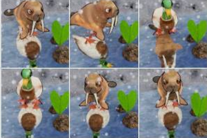|选择与反射匹配的图像|
||选择具有不同对象轮廓的阴影|
|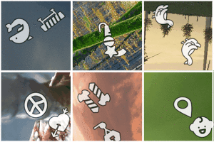|选择显示两个相同对象的方块|
|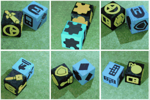|选择显示相同图标的骰子对|
|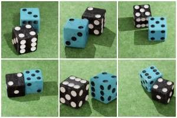|选择顶部面加起来为4的骰子对|
|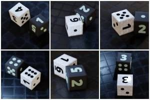|选择顶部面加起来为5的骰子对|
|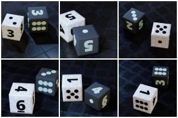|选择顶部面加起来为6的骰子对|
||选择顶部面加起来为7的骰子对|
||选择顶部面加起来为8的骰子对|
||选择顶部面加起来为10的骰子对|
||选择顶部面加起来为14的骰子对|
||选择使飞镖总数为8/10/12/14的图像|
|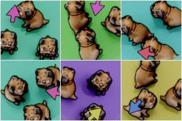|选择所有动物都朝箭头指示方向行走的图像|
||选择与图像顶部图标匹配的阴影|
|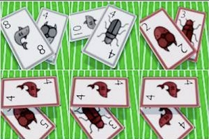|选择匹配的卡片|
|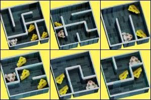|选择能够到达迷宫中所有奶酪的老鼠|
||选择带有错误头部的动物|
||选择企鹅|
||使用箭头将动物旋转到手指指向的方向|
|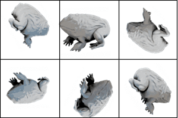|选择正确方向的图像|
||选择螺旋星系|
|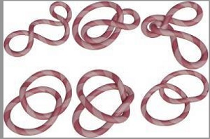|选择只有一根绳子的图像|
|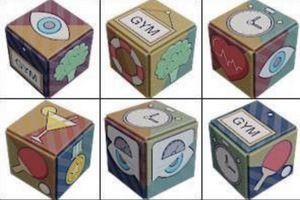|选择图标一分为二的立方体|
||选择错误拼图|
||选择动物数量与左侧图像匹配的图像|
|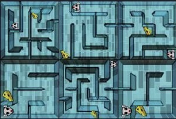|选择不能到达奶酪的老鼠|
|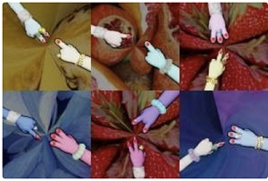|选择总手指数加起来为3的图像|
|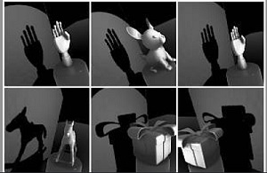|选择错误的阴影|
||选择显示三个相同对象的方块|
|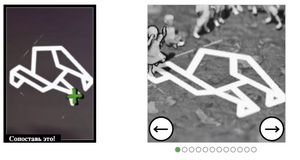|使用箭头将人移动到十字标示的位置|
|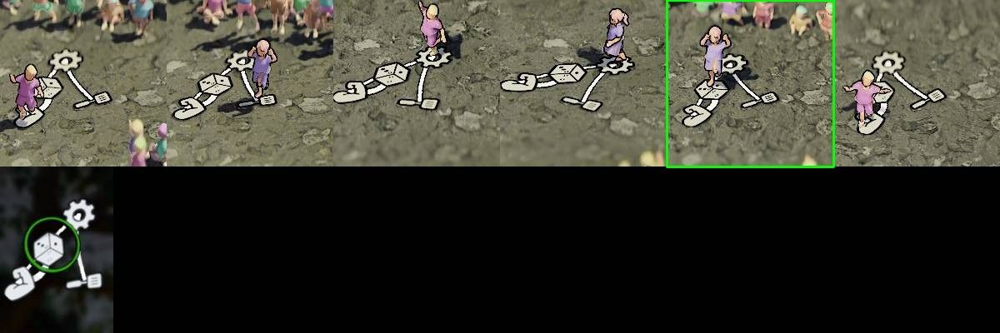|使用箭头将人移动到彩色圆圈标示的图标位置|
|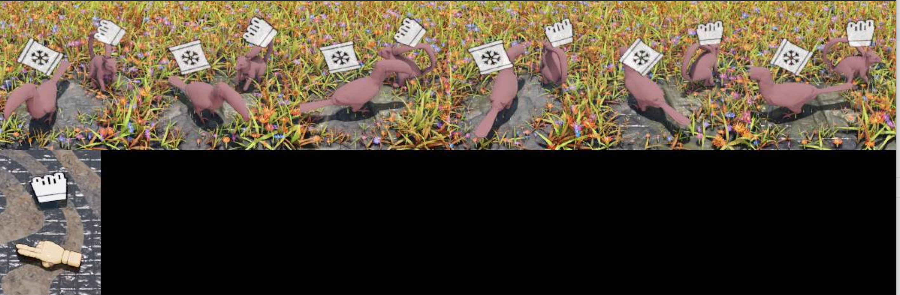|使用箭头将具有相同图标的动物旋转到手指指向的方向|
|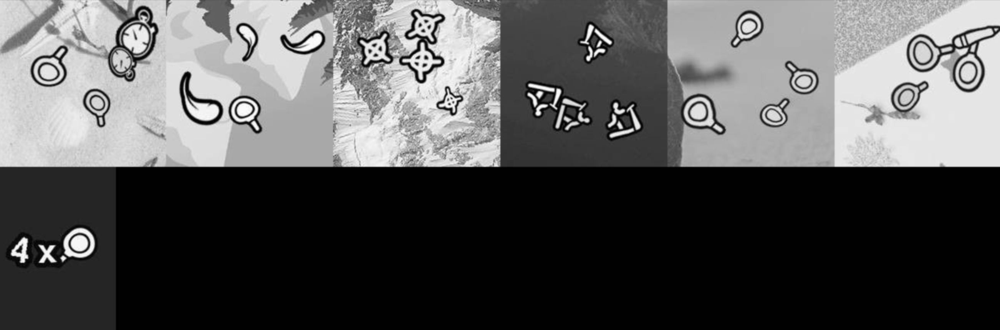|使用箭头更改对象数量，直到与左侧图像匹配|
||更改骰子直到数目与左侧图像相匹配|
||使用箭头将火车移动到左侧图像指示的坐标|
||将石头的数量与左侧图像上的数字匹配|
||使用箭头将人移动到指示的座位|
||选择考拉|
||选择瓢虫|
||选择猪|
||选择斑马|
||选择鲨鱼|
||选择恐龙|
||选择鸭子|
|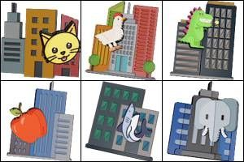|选择鸡|
|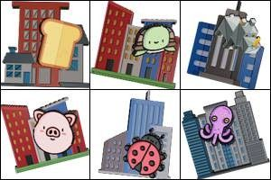|选择犀牛|
||选择海豚|
||选择葡萄|
|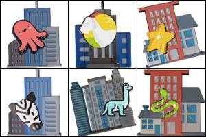|选择山羊|
||选择大象|
||选择海豹|
||选择熊|
||选择老鼠|
||选择蝴蝶|
||选择猴子|
|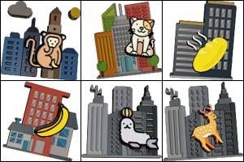|选择面包|
||选择龙虾|
||选择袋鼠|
||选择鹿|
|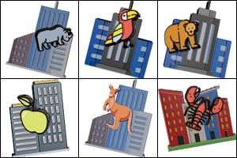|选择苹果|
||选择蚂蚁|
||选择蛇|
||选择冰淇淋|
||选择猫头鹰|
||选择裤子|
||选择仙人掌|
|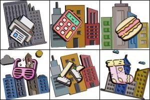|选择计算器|
||选择鞋子|
|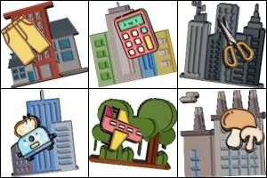|选择剪刀|
|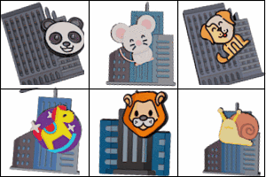|选择狮子|
|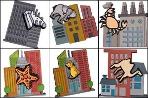|选择螃蟹|
||选择甜甜圈|
||选择狗|
|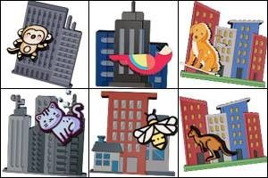|选择蜜蜂|
|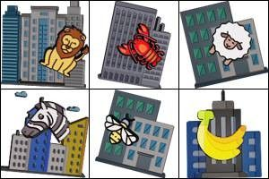|选择香蕉|
|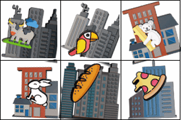|选择鹦鹉|
||选择章鱼|
||选择铅笔|
||选择灯|
|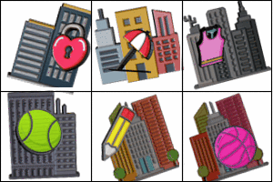|选择锁|
||选择乌龟|
|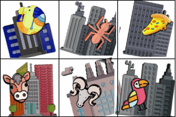|选择骆驼|
|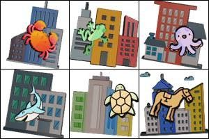|选择马|
||选择披萨|
|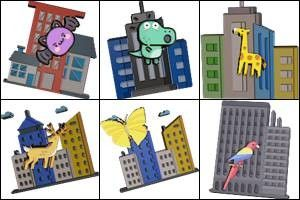|选择蝙蝠|
||选择西瓜|
||选择控制器|
||选择兔子|
|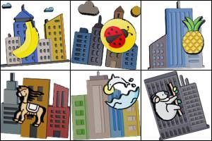|选择菠萝|
||选择蜗牛|
||选择眼镜|
||选择钥匙|
||选择热狗|
||选择头盔|
||选择袜子|
||选择海星|
||选择青蛙|
||选择打印机|
|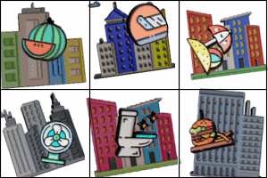|选择雨伞|
||选择长颈鹿|
||选择宇宙飞船|
|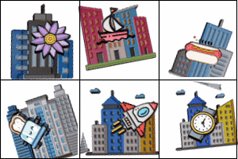|选择船|
|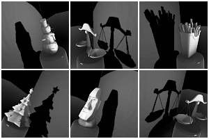|选择错误的阴影|
||选择直升机|
||选择冰箱|
|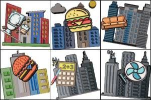|选择沙发|
||选择钱币|
||选择蘑菇|
|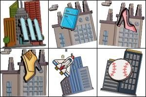|选择栅栏|
||选择汽车|
||选择手表|
||选择外星人|
||选择风扇|
||选择皇冠|
|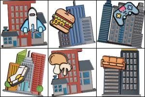|选择汉堡|
|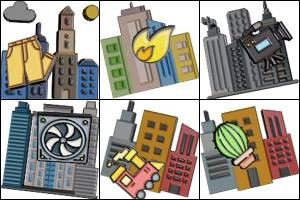|选择火车|
||选择奖杯|
||选择水族馆|
||选择锚|
|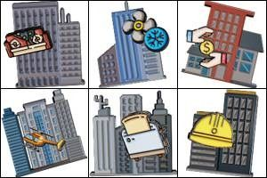|选择烤箱|
||选择订书机|
|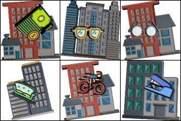|选择自行车|
||选择吉他|
||选择火焰|
||选择花朵|
||选择雪人|
|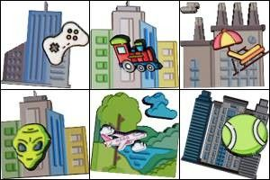|选择球|
||选择戒指|
|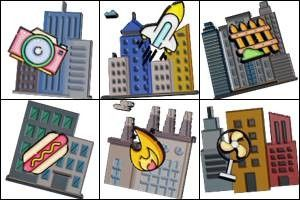|选择相机|
||类型的验证码，需要旋转图像|