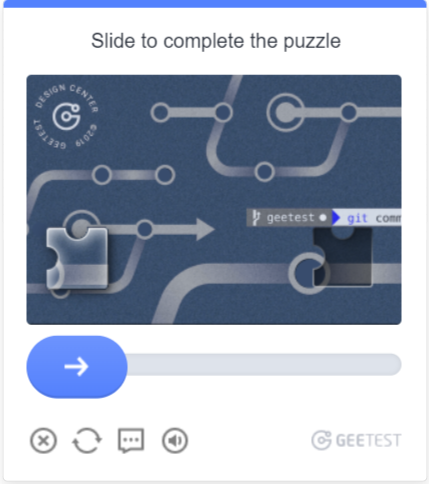

---
sidebar_position: 5
sidebar_label: GeeTestTask
---

# GeeTestTask
这种类型的任务是通过您的代理解决 GeeTest 验证码的问题。
您的应用程序应发送站点地址、公共域键 (`gt`)、键 (`challenge`) 和代理。

解决问题的结果是用于提交表单的三个或五个令牌。

:::warning **注意！**
暂不支持带有 IP 授权的代理。
:::

## **对象结构**

:::info
- `gt`、`challenge` 和 `geetestApiServerSubdomain` 参数通常可以在 `initGeetest` JavaScript 函数内找到。
- 您还可以在页面的 HTML 代码中找到它们。您可以在页面完全加载后在 `<sсript>` 块中找到它们。
  V3


V4 (captcha\_id = gt)


:::
|**参数**|**类型**|**必需**|**值**|
| :- | :- | :- | :- |
|type|String|是|**GeeTestTaskProxyless** 或 **GeeTestTask（使用代理时）。**|
|websiteURL|String|是|解决验证码的页面地址。|
|gt|String|是|域的 GeeTest 标识符键。静态值，很少更新。<br />如果是 v4，则为 clientId 参数。|
|challenge|String|是，仅限 V3|<p>动态密钥。<br />每次调用我们的 API 时，需要获取一个新的密钥值。如果验证码已加载在页面上，则 `challenge` 值将不再有效，并且您将收到[错误](../api/api-errors.md) `ERROR_TOKEN_EXPIRED`。</p><p>对于带有 `ERROR_TOKEN_EXPIRED` 错误的任务将收取费用。</p><p>需要检查请求并找到返回此值的请求，并在每次创建识别任务之前执行此请求并解析出 challenge。</p>|
|geetestApiServerSubdomain|String|否|Geetest API 子域服务器（必须与 api.geetest.com 不同）。<br />可选参数。某些站点可能需要。|
|geetestGetLib|String|否|展示验证码脚本的路径。 <br /> 可选参数。某些站点可能需要。<br />以字符串形式发送 JSON。|
|version|Integer|否|版本号（默认为 3）。可选值：3, 4。|
|initParameters|Object|否|版本 4 的附加参数，与 “riskType”（验证码类型/验证特性）一起使用。|
|proxyType|String|是（使用 **GeeTestTask** 时）|**http** - 常规的 HTTP/HTTPS 代理；<br /> **https** - 仅当 "http" 不起作用时尝试此选项（某些自定义代理需要）；<br /> **socks4** - socks4 代理；<br /> **socks5** - socks5 代理。|
|proxyAddress|String|是（使用 **GeeTestTask** 时）|<p>IPv4/IPv6 代理 IP 地址。不允许使用：</p><p>- 使用主机名；</p><p>- 使用透明代理（可以看到客户端 IP）；</p><p>- 使用本地机器上的代理。</p>|
|proxyPort|Integer|是（使用 **GeeTestTask** 时）|代理端口。|
|proxyLogin|String|否|代理服务器登录名。|
|proxyPassword|String|否|代理服务器密码。|
|userAgent|String|否|用于识别验证码的浏览器 User-Agent。|
## **GeeTest V3**

### **可能的验证码变体**

智能模式：


滑块验证码：


图标验证码：


空间验证码：


### **请求示例**

:::info 方法
```http
https://api.capmonster.cloud/createTask
```
:::

### 在测试站点上使用代理的 GeeTestTask

```json 
{
  "clientKey":"API_KEY",
  "task": {
    "type":"GeeTestTask",
    "websiteURL":"https://www.geetest.com/en/demo",
    "gt":"022397c99c9f646f6477822485f30404",
    "challenge":"7f044f48bc951ecfbfc03842b5e1fe59",
    "proxyType":"http",
    "proxyAddress":"8.8.8.8",
    "proxyPort":8080,
    "proxyLogin":"proxyLoginHere",
    "proxyPassword":"proxyPasswordHere",
    "userAgent":"Mozilla/5.0 (Windows NT 10.0; Win64; x64) AppleWebKit/537.36 (KHTML, like Gecko) Chrome/125.0.0.0 Safari/537.36"

  }
}
```
### 在测试站点上使用代理的 GeeTestTaskProxyless（无代理）

```json
{
    "clientKey":"API_KEY",
    "task":
    {
        "type":"GeeTestTaskProxyless",
        "websiteURL":"https://www.geetest.com/en/demo",
        "gt":"022397c99c9f646f6477822485f30404",
        "challenge":"7f044f48bc951ecfbfc03842b5e1fe59"

    }
}
```


**响应示例**
```json
{
  "errorId":0,
  "taskId":407533072
}
```

### **获取结果**
:::info 方法
```http
https://api.capmonster.cloud/getTaskResult
```
:::
使用 [getTaskResult](../api/methods/get-task-result.md) 方法获取 GeeTest 识别结果。根据系统负载，您将在 10 到 30 秒内收到响应。

<table><tr>
<th><b>属性</b></th><th><b>类型</b></th><th><b>描述</b></th>
</tr>
<tr><td>challenge</td><td>String</td><td rowspan="3">在目标网站提交表单时，这三个参数都是必需的。</td></tr>
<tr><td>validate</td><td>String</td></tr>
<tr><td>seccode</td><td>String</td></tr>
</table>

**示例：**

```json
{
  "errorId":0,
  "status":"ready",
  "solution": {
    "challenge":"0f759dd1ea6c4wc76cedc2991039ca4f23",
    "validate":"6275e26419211d1f526e674d97110e15",
    "seccode":"510cd9735583edcb158601067195a5eb|jordan"
  }
}
```

## **GeeTest V4**

### **可能的验证码变体**



### **请求示例**
:::info 方法
```http
https://api.capmonster.cloud/createTask
```
:::

### 在测试站点上使用代理的 GeeTestTask
```json
{
  "clientKey":"API_KEY",
  "task": {
    "type":"GeeTestTask",
    "websiteURL":"https://gt4.geetest.com/",
    "gt":"54088bb07d2df3c46b79f80300b0abbe",
    "version": 4,
    "initParameters": {
      "riskType": "slide"
    },
    "proxyType":"http",
    "proxyAddress":"8.8.8.8",
    "proxyPort":8080,
    "proxyLogin":"proxyLoginHere",
    "proxyPassword":"proxyPasswordHere",
    "userAgent":"Mozilla/5.0 (Windows NT 10.0; Win64; x64) AppleWebKit/537.36 (KHTML, like Gecko) Chrome/125.0.0.0 Safari/537.36"

  }
}
```
### 在测试站点上无代理的 GeeTestTaskProxyless
```json
{
    "clientKey":"API_KEY",
    "task":
    {
        "type":"GeeTestTaskProxyless",
        "websiteURL":"https://gt4.geetest.com/",
        "gt":"54088bb07d2df3c46b79f80300b0abbe",
        "version": 4,
        "initParameters": {
          "riskType": "slide"

        }
    }
}
```

**响应示例**

```json
{
  "errorId":0,
  "taskId":407533072
}
```

### **获取结果**
:::info 方法
```http
https://api.capmonster.cloud/getTaskResult
```
:::
使用 [getTaskResult](../api/methods/get-task-result.md) 方法获取 GeeTest 识别结果。根据系统负载，您将在 10 到 30 秒内收到响应。

<table>
<tr>
<th><b>属性</b></th><th><b>类型</b></th><th><b>描述</b></th>
</tr>
<tr>
<td>captcha_id</td><td>String</td><td rowspan="5">在目标网站提交表单时，这五个参数都是必需的。<br />input[name=captcha\_id]<br />input[name=lot\_number]<br />input[name=pass\_token]<br />input[name=gen\_time]<br />input[name=captcha\_output]</td>
</tr>
<tr><td>lot_number</td><td>String</td></tr>
<tr><td>pass_token</td><td>String</td></tr>
<tr><td>gen_time</td><td>String</td></tr>
<tr><td>captcha_output</td><td>String</td></tr>
</table>

**示例：**
```json
{
  "errorId":0,
  "status":"ready",
  "solution": {
    "captcha_id":"f5c2ad5a8a3cf37192d8b9c039950f79",
    "lot_number":"bcb2c6ce2f8e4e9da74f2c1fa63bd713",
    "pass_token":"edc7a17716535a5ae624ef4707cb6e7e478dc557608b068d202682c8297695cf",
    "gen_time":"1683794919",
    "captcha_output":"XwmTZEJCJEnRIJBlvtEAZ662T...[cut]...SQ3fX-MyoYOVDMDXWSRQig56"
  }
}
```
