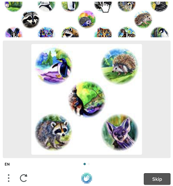
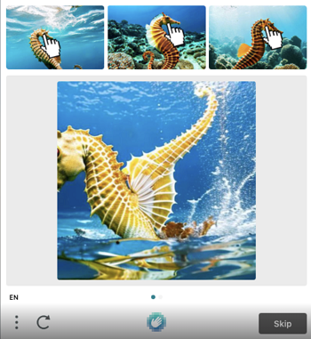

---
sidebar_position: 4
sidebar_label: HCaptchaTask
---

# HCaptchaTask
对象包含用于解决 hCaptcha 任务的数据。为了提供对这种类型任务的稳定普适性，我们复制了用于完成自动化任务的每一个环境因素。这包括：代理访问、浏览器的用户代理、cookies（可选）。这种方法将消除未来可能出现的所有可能障碍。

相较于通常的图片验证码，这种类型的验证码可能需要更长时间来解决，但通过发送给您的 g-captcha-response 值在我们解决您的验证码后仍然有效，有效期为60秒。

**重要提示！**如果您在接受 hCaptcha 令牌时遇到问题，请与 CapMonster Cloud 支持联系，并提供 URL 和 sitekey。我们将尽快解决这个问题。
## **对象结构**

|<h2>**参数**</h2>|<h2>**类型**</h2>|<h2>**必需**</h2>|<h2>**值**</h2>|
| :- | :- | :- | :- |
|<h2>type</h2>|<h2>字符串</h2>|<h2>是</h2>|<h2>**HCaptchaTaskProxyless** 或 **HCaptchaTask（使用代理时）**。</h2>|
|<h2>websiteURL</h2>|<h2>字符串</h2>|<h2>是</h2>|<h2>包含 hCaptcha 的网页地址。</h2>|
|<h2>websiteKey</h2>|<h2>字符串</h2>|<h2>是</h2>|<h2>hCaptcha 网站密钥。</h2>|
|<h2>isInvisible</h2>|<h2>布尔值</h2>|<h2>否</h2>|<h2>对于 hCaptcha 的隐形版本，请使用 true。</h2>|
|<h2>data</h2>|<h2>字符串</h2>|<h2>否</h2>|<h2><p>自定义数据，在某些 hCaptcha 实现中使用，主要与 `isInvisible=true` 配合使用。</p></h2>|
|<h2>proxyType</h2>|<h2>字符串</h2>|<h2>是（对于 **HCaptchaTask**）</h2>|<h2>**http** - 普通的 http/https 代理；<br />**https** - 仅在 "http" 不起作用时尝试此选项（某些自定义代理需要）；<br />**socks4** - socks4 代理；<br />**socks5** - socks5 代理。</h2>|
|<h2>proxyAddress</h2>|<h2>字符串</h2>|<h2>是（对于 **HCaptchaTask**）</h2>|<h2><p>IP 代理地址 IPv4/IPv6。不允许使用：</p><p>- 使用主机名；</p><p>- 使用透明代理（可以看到客户端的 IP）；</p><p>- 使用本地机器上的代理。</p></h2>|
|<h2>proxyPort</h2>|<h2>整数</h2>|<h2>是（对于 **HCaptchaTask**）</h2>|<h2>代理端口。</h2>|
|<h2>proxyLogin</h2>|<h2>字符串</h2>|<h2>否</h2>|<h2>代理服务器登录。</h2>|
|<h2>proxyPassword</h2>|<h2>字符串</h2>|<h2>否</h2>|<h2>代理服务器密码。</h2>|
|<h2>userAgent</h2>|<h2>字符串</h2>|<h2>否</h2>|<h2>**仅传递来自 Windows 操作系统的实际 UA。现在是：** </h2>|
|<h2>cookies</h2>|<h2>字符串</h2>|<h2>否</h2>|<h2><p>在与目标页面交互期间必须使用的额外 cookies。</p><p>**格式**：cookiename1=cookievalue1; cookiename2=cookievalue2</p></h2>|
|<h2>fallbackToActualUA</h2>|<h2>布尔值</h2>|<h2>否</h2>|<h2><p>**true** - 指定此参数时，我们将忽略用户在请求中发送的无关紧要的用户代理，并在 getTaskResult 中返回我们自己的（相关的）用户代理。这将提高令牌的接受率。</p><p>**false** - 我们插入请求中指定的用户代理。如果用户代理无效，您将收到错误 ERROR\_WRONG\_USERAGENT（在日志中显示为 USERAGENT IS EXPIRED）。</p></h2>|
##
**支持的类型**<br/>
支持的图像类型如下：

|||
| :- | :- |
|||
|||
|||

## **请求示例**
:::info 信息 方法
``` http
https://api.capmonster.cloud/createTask
```

:::
### HCaptchaTask (使用代理)
``` json
{
    "clientKey":"dce6bcbb1a728ea8d871de6d169a2057",
    "task":
    {
        "type":"HCaptchaTask",
        "websiteURL":"https://lessons.zennolab.com/captchas/hcaptcha/?level=easy",
        "websiteKey":"472fc7af-86a4-4382-9a49-ca9090474471",
        "userAgent": "Mozilla/5.0 (Windows NT 10.0; Win64; x64) AppleWebKit/537.36 (KHTML, like Gecko) Chrome/125.0.0.0 Safari/537.36",
        "fallbackToActualUA":true,
        "proxyType":"http",
        "proxyAddress":"8.8.8.8",
        "proxyPort":8080,
        "proxyLogin":"proxyLoginHere",
        "proxyPassword":"proxyPasswordHere"
    }
}
```
### HCaptchaTaskProxyless (不使用代理)
``` json
{
    "clientKey":"dce6bcbb1a728ea8d871de6d169a2057",
    "task":
    {
        "type":"HCaptchaTaskProxyless",
        "websiteURL":"https://lessons.zennolab.com/captchas/hcaptcha/?level=easy",
        "websiteKey":"472fc7af-86a4-4382-9a49-ca9090474471",
        "userAgent": "Mozilla/5.0 (Windows NT 10.0; Win64; x64) AppleWebKit/537.36 (KHTML, like Gecko) Chrome/125.0.0.0 Safari/537.36",
        "fallbackToActualUA":true
    }
}
```

**响应示例**
``` json
{
  "errorId":0,
  "taskId":407533072
}
```
## **获取结果**
:::info 信息 方法
``` http
https://api.capmonster.cloud/getTaskResult
```

:::
使用[getTaskResult](../api/methods/get-task-result.md)方法请求 hCaptcha 的答案。根据服务负载情况，您将在10到80秒内收到响应。

|**属性**|**类型**|**描述**|
| :- | :- | :- |
|gRecaptchaResponse|字符串|应插入到目标网站的 hCaptcha 提交表单中的哈希值。|
|userAgent|字符串|提交时，您应使用与解决 hCaptcha 时相同的*用户代理*。|
|respKey|字符串|当可用时，“window.hcaptcha.getRespKey()”函数的结果。一些网站使用此值进行额外验证。|

**示例：**
``` json
{
  "errorId":0,
  "status":"ready",
  "solution": {
    "gRecaptchaResponse": "P1_eyJ0eXAiOiJKV1QiLCJhbGciOiJIUzI1NiJ9.hKdwYXNza2V5xQb9JvlblBqjTdKpourvlRNpOZLvJb0yJRmsXVFVjyxFWlL1wdYBXaPyFtnxwy2ukbMgwWn62-cjSc98Iw2XIPYWg5MNDKS4_7tBIhjY0PienoKy1...",
    "respKey": "E0_eyJ0eXAiOiJKV1QiLCJhbGciOiJIUzI1NiJ9.eyJkYXRhIjoidjQ3RjlqZGFYTllFQXlZZFYyRTlaWlBVQUdLaFpPakpRNjBXRTljVW40VnY3NnhuN2V3R0wwVWd1MW1Wai90WEdoYmt5a2NqVGlGdWpsSlpmVjcza...",
    "userAgent": "Mozilla/5.0 (Windows NT 6.3; WOW64) AppleWebKit/537.36 (KHTML, like Gecko) Chrome/125.0.0.0 Safari/537.36"
  }
}
```
