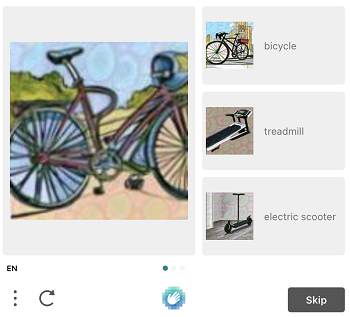
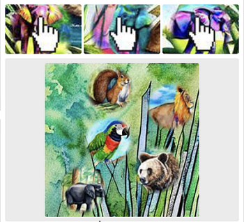

---
sidebar_position: 4
sidebar_label: HCaptchaTask
---

import Tabs from '@theme/Tabs';
import TabItem from '@theme/TabItem';
import ParamItem from '@theme/ParamItem';
import MethodItem from '@theme/MethodItem';
import MethodDescription from '@theme/MethodDescription'
import PriceBlock from '@theme/PriceBlock';
import PriceBlockWrap from '@theme/PriceBlockWrap';

# HCaptchaTask

<PriceBlockWrap>
  <PriceBlock title="hCaptcha" name="hCaptchaToken"/>
  <PriceBlock title="hCaptcha Enterprise" name="hCaptchaEnterpriseToken"/>
</PriceBlockWrap>

对象包含用于解决 hCaptcha 任务的数据。为了提供对这种类型任务的稳定普适性，我们复制了用于完成自动化任务的每一个环境因素。这包括：代理访问、浏览器的用户代理、cookies（可选）。这种方法将消除未来可能出现的所有可能障碍。

相较于通常的图片验证码，这种类型的验证码可能需要更长时间来解决，但通过发送给您的 g-captcha-response 值在我们解决您的验证码后仍然有效，有效期为60秒。

**重要提示！** 如果您在接受 hCaptcha 令牌时遇到问题，请与 CapMonster Cloud 支持联系，并提供 URL 和 sitekey。我们将尽快解决这个问题。

## 请求参数


<Tabs className="full-width-tabs filled-tabs" groupId="captcha-type">
  <TabItem value="proxyless" label="HCaptchaTaskProxyless (without proxy)" default className="bordered-panel">
    <ParamItem title="type" required type="string" />
    **HCaptchaTaskProxyless**

    ---

    <ParamItem title="websiteURL" required type="string" />
    包含 hCaptcha 的网页地址。

    ---

    <ParamItem title="websiteKey" required type="string" />
    hCaptcha 网站密钥。

    ---

    <ParamItem title="isInvisible" type="boolean" />
    对于 hCaptcha 的隐形版本，请使用 true。

    ---

    <ParamItem title="data" type="string" />
    <p>自定义数据，在某些 hCaptcha 实现中使用，主要与 `isInvisible=true` 配合使用。 <br/>
	数据字段的值可以从用于呈现验证码的 rqdata 参数中获取。 </p>

    ---

    <ParamItem title="userAgent" type="string" />
    **仅传递来自 Windows 操作系统的实际 UA。现在是：** userAgentPlaceholder

    ---

    <ParamItem title="cookies" type="string" />
    <p>在与目标页面交互期间必须使用的额外 cookies。</p><p>**格式**：cookiename1=cookievalue1; cookiename2=cookievalue2</p>

    ---

    <ParamItem title="fallbackToActualUA" type="boolean" />
    <p>**true** - 指定此参数时，我们将忽略用户在请求中发送的无关紧要的用户代理，并在 getTaskResult 中返回我们自己的（相关的）用户代理。这将提高令牌的接受率。</p><p>**false** - 我们插入请求中指定的用户代理。如果用户代理无效，您将收到错误 ERROR\_WRONG\_USERAGENT（在日志中显示为 USERAGENT IS EXPIRED）。</p>

  </TabItem>
  
  <TabItem value="proxy" label="HCaptchaTask (using proxy)" className="bordered-panel">
    <ParamItem title="type" required type="string" />
    **HCaptchaTask**

    ---

    <ParamItem title="websiteURL" required type="string" />
    包含 hCaptcha 的网页地址。

    ---

    <ParamItem title="websiteKey" required type="string" />
    hCaptcha 网站密钥。

    ---

    <ParamItem title="isInvisible" type="boolean" />
    对于 hCaptcha 的隐形版本，请使用 true。

    ---

    <ParamItem title="data" type="string" />
    <p>自定义数据，在某些 hCaptcha 实现中使用，主要与 `isInvisible=true` 配合使用。 <br/>
	数据字段的值可以从用于呈现验证码的 rqdata 参数中获取。 </p>

    ---

    <ParamItem title="userAgent" type="string" />
    **仅传递来自 Windows 操作系统的实际 UA。现在是：** userAgentPlaceholder

    ---

    <ParamItem title="cookies" type="string" />
    <p>在与目标页面交互期间必须使用的额外 cookies。</p><p>**格式**：cookiename1=cookievalue1; cookiename2=cookievalue2</p>

    ---

    <ParamItem title="fallbackToActualUA" type="boolean" />
    <p>**true** - 指定此参数时，我们将忽略用户在请求中发送的无关紧要的用户代理，并在 getTaskResult 中返回我们自己的（相关的）用户代理。这将提高令牌的接受率。</p><p>**false** - 我们插入请求中指定的用户代理。如果用户代理无效，您将收到错误 ERROR\_WRONG\_USERAGENT（在日志中显示为 USERAGENT IS EXPIRED）。</p>

    ---

    <ParamItem title="proxyType" required type="string" />
    **http** - 普通的 http/https 代理；<br />**https** - 仅在 "http" 不起作用时尝试此选项（某些自定义代理需要）；<br />**socks4** - socks4 代理；<br />**socks5** - socks5 代理。

    ---

    <ParamItem title="proxyAddress" required type="string" />
    <p>IP 代理地址 IPv4/IPv6。不允许使用：</p><p>- 使用主机名；</p><p>- 使用透明代理（可以看到客户端的 IP）；</p><p>- 使用本地机器上的代理。</p>

    ---

    <ParamItem title="proxyPort" required type="integer" />
    代理端口。

    ---

    <ParamItem title="proxyLogin" type="string" />
    代理服务器登录。

    ---

    <ParamItem title="proxyPassword" type="string" />
    代理服务器密码。

  </TabItem>
  
</Tabs>

**支持的类型**<br/>
支持的图像类型如下：

|||
| :- | :- |
|||
|||
||


## 创建任务方法

<Tabs className="full-width-tabs filled-tabs request-tabs" groupId="captcha-type">
	<TabItem value="proxyless" label="HCaptchaTaskProxyless (without proxy)" default className="method-panel">
		<MethodItem>
			```http
			https://api.capmonster.cloud/createTask
			```
		</MethodItem>
		<MethodDescription>
			**要求**
			```json
			{
				"clientKey":"API_KEY",
				"task":
				{
					"type":"HCaptchaTaskProxyless",
					"websiteURL":"https://lessons.zennolab.com/captchas/hcaptcha/?level=easy",
					"websiteKey":"472fc7af-86a4-4382-9a49-ca9090474471",
					"userAgent": "userAgentPlaceholder",
					"fallbackToActualUA":true
				}
			}
			```
			**回应**
			```json
			{
			  "errorId":0,
			  "taskId":407533072
			}
			```
		</MethodDescription>
	</TabItem>

	<TabItem value="proxy" label="HCaptchaTask (using proxy)" className="method-panel">
		<MethodItem>
			```http
			https://api.capmonster.cloud/createTask
			```
		</MethodItem>
		<MethodDescription>
			**要求**
			```json
			{
				"clientKey":"API_KEY",
				"task":
				{
					"type":"HCaptchaTask",
					"websiteURL":"https://lessons.zennolab.com/captchas/hcaptcha/?level=easy",
					"websiteKey":"472fc7af-86a4-4382-9a49-ca9090474471",
					"userAgent": "userAgentPlaceholder",
					"fallbackToActualUA":true,
					"proxyType":"http",
					"proxyAddress":"8.8.8.8",
					"proxyPort":8080,
					"proxyLogin":"proxyLoginHere",
					"proxyPassword":"proxyPasswordHere"
				}
			}
			```
			**回应**
			```json
			{
			  "errorId":0,
			  "taskId":407533072
			}
			```
		</MethodDescription>
	</TabItem>
  
</Tabs>


## 获取任务结果方法
使用 [getTaskResult](../api/methods/get-task-result.md) 方法请求 hCaptcha 的答案。根据服务的工作负载，您将在 10 到 80 秒内收到响应。

<TabItem value="proxyless" label="GeeTestTaskProxyless (without proxy)" default className="method-panel-full">
	<MethodItem>
		```http
		https://api.capmonster.cloud/getTaskResult
		```
	</MethodItem>
	<MethodDescription>
		**要求**
		```json
		{
		  "clientKey":"API_KEY",
		  "taskId": 407533072
		}
		```
		**回应**
		```json
		{
		  "errorId":0,
		  "status":"ready",
		  "solution": {
			"gRecaptchaResponse": "P1_eyJ0eXAiOiJKV1QiLCJhbGciOiJIUzI1NiJ9.hKdwYXNza2V5xQb9JvlblBqjTdKpourvlRNpOZLvJb0yJRmsXVFVjyxFWlL1wdYBXaPyFtnxwy2ukbMgwWn62-cjSc98Iw2XIPYWg5MNDKS4_7tBIhjY0PienoKy1...",
			"respKey": "E0_eyJ0eXAiOiJKV1QiLCJhbGciOiJIUzI1NiJ9.eyJkYXRhIjoidjQ3RjlqZGFYTllFQXlZZFYyRTlaWlBVQUdLaFpPakpRNjBXRTljVW40VnY3NnhuN2V3R0wwVWd1MW1Wai90WEdoYmt5a2NqVGlGdWpsSlpmVjcza...",
			"userAgent": "userAgentPlaceholder"
		  }
		}
		```
	</MethodDescription>
</TabItem>

<br />

|**属性**|**类型**|**描述**|
| :- | :- | :- |
|gRecaptchaResponse|String|应插入到目标网站的 hCaptcha 提交表单中的哈希值。|
|userAgent|String|提交时，您应使用与解决 hCaptcha 时相同的*用户代理*。|
|respKey|String|当可用时，“window.hcaptcha.getRespKey()”函数的结果。一些网站使用此值进行额外验证。|


## 使用 SDK 库

<Tabs className="full-width-tabs filled-tabs request-tabs" groupId="captcha-type">
  <TabItem value="js" label="JavaScript" default className="method-panel">
    ```js
    // https://github.com/ZennoLab/capmonstercloud-client-js

    import { CapMonsterCloudClientFactory, ClientOptions, HCaptchaRequest } from '@zennolab_com/capmonstercloud-client';

    document.addEventListener('DOMContentLoaded', async () => {
      const cmcClient = CapMonsterCloudClientFactory.Create(new ClientOptions({ clientKey: '<your capmonster.cloud API key>' }));
      console.log(await cmcClient.getBalance());

      const hCaptchaRequest = new HCaptchaRequest({
        websiteURL: 'https://lessons.zennolab.com/captchas/hcaptcha/?level=easy',
        websiteKey: '472fc7af-86a4-4382-9a49-ca9090474471',
        isInvisible: true,
        data: 'some data',
        proxyType: 'https',
        proxyAddress: 'https://proxy.com',
        proxyPort: 6045,
        proxyLogin: 'login',
        proxyPassword: 'password',
      });

      console.log(await cmcClient.Solve(hCaptchaRequest));
    });
    ```
  </TabItem>

  <TabItem value="python" label="Python" className="method-panel">
    ```python
    # https://github.com/ZennoLab/capmonstercloud-client-python

    # HCaptchaProxyless

    import asyncio
    from capmonstercloudclient import CapMonsterClient, ClientOptions
    from capmonstercloudclient.requests import HcaptchaProxylessRequest

    client_options = ClientOptions(api_key="your_api_key")  # Replace with your CapMonster Cloud API key
    cap_monster_client = CapMonsterClient(options=client_options)

    hcaptcha_request = HcaptchaProxylessRequest(
        websiteUrl="https://lessons.zennolab.com/captchas/hcaptcha/?level=easy",  # Website with the captcha
        websiteKey="472fc7af-86a4-4382-9a49-ca9090474471",  # Replace with your websiteKey
        userAgent="Mozilla/5.0 (Windows NT 10.0; Win64; x64) AppleWebKit/537.36 (KHTML, like Gecko) Chrome/130.0.0.0 Safari/537.36",  # Use the current userAgent
        fallbackToActualUA=True
    )

    async def solve_captcha():
        return await cap_monster_client.solve_captcha(hcaptcha_request)

    responses = asyncio.run(solve_captcha())
    print(responses)
    ```

    ```python
    # HCaptcha

    import asyncio
    from capmonstercloudclient import CapMonsterClient, ClientOptions
    from capmonstercloudclient.requests import HcaptchaRequest

    client_options = ClientOptions(api_key="your_api_key")  # Replace with your CapMonster Cloud API key
    cap_monster_client = CapMonsterClient(options=client_options)

    hcaptcha_request = HcaptchaRequest(
        websiteUrl="https://lessons.zennolab.com/captchas/hcaptcha/?level=easy",  # Website with the captcha
        websiteKey="472fc7af-86a4-4382-9a49-ca9090474471",  # Replace with your websiteKey
        userAgent="Mozilla/5.0 (Windows NT 10.0; Win64; x64) AppleWebKit/537.36 (KHTML, like Gecko) Chrome/130.0.0.0 Safari/537.36",  # Use the current userAgent
        proxyType="http",  # Type of proxy (http, https, socks4, socks5)
        proxyAddress="8.8.8.8",
        proxyPort=8080,
        proxyLogin="proxyLoginHere",
        proxyPassword="proxyPasswordHere",
        fallbackToActualUA=True
    )

    async def solve_captcha():
        return await cap_monster_client.solve_captcha(hcaptcha_request)

    responses = asyncio.run(solve_captcha())
    print(responses)
    ```
  </TabItem>

  <TabItem value="csharp" label="C#" className="method-panel">
    ```csharp
    // https://github.com/ZennoLab/capmonstercloud-client-dotnet

    // HCaptchaProxyless:

    using Zennolab.CapMonsterCloud.Requests;
    using Zennolab.CapMonsterCloud;

    class Program
    {
        static async Task Main(string[] args)
        {
            var clientOptions = new ClientOptions
            {
                ClientKey = "your_api_key" // Replace with your CapMonster Cloud API key
            };

            var cmCloudClient = CapMonsterCloudClientFactory.Create(clientOptions);

            var hcaptchaRequest = new HCaptchaProxylessRequest
            {
                WebsiteUrl = "https://lessons.zennolab.com/captchas/hcaptcha/?level=easy",
                WebsiteKey = "472fc7af-86a4-4382-9a49-ca9090474471",
            };
            var hcaptchaResult = await cmCloudClient.SolveAsync(hcaptchaRequest);

            Console.WriteLine("Captcha Solution: " + hcaptchaResult.Solution.Value);
        }
    }
    ```

    ```csharp
    // HCaptcha:

    using Zennolab.CapMonsterCloud.Requests;
    using Zennolab.CapMonsterCloud;

    class Program
    {
        static async Task Main(string[] args)
        {
            var clientOptions = new ClientOptions
            {
                ClientKey = "your_api_key" // Replace with your CapMonster Cloud API key
            };

            var cmCloudClient = CapMonsterCloudClientFactory.Create(clientOptions);

            var hcaptchaRequest = new HCaptchaRequest
            {
                WebsiteUrl = "https://lessons.zennolab.com/captchas/hcaptcha/?level=easy",
                WebsiteKey = "472fc7af-86a4-4382-9a49-ca9090474471",
                ProxyType = ProxyType.Http,
                ProxyAddress = "8.8.8.8",
                ProxyPort = 8080,
                ProxyLogin = "proxyLoginHere",
                ProxyPassword = "proxyPasswordHere"
            };

            var hcaptchaResult = await cmCloudClient.SolveAsync(hcaptchaRequest);

            Console.WriteLine("Captcha Solution: " + hcaptchaResult.Solution.Value);
        }
    }
    ```
  </TabItem>  
</Tabs>