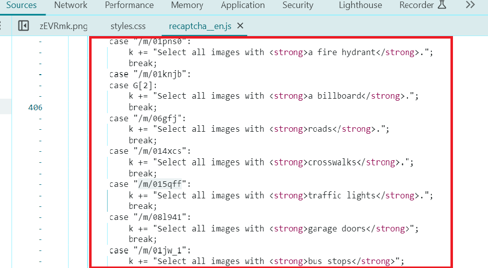

---
sidebar_position: 7
sidebar_label: ComplexImageTask Recaptcha
---

# ComplexImageTask Recaptcha
该对象包含解决谷歌 ReCaptcha2 任务的数据。

## **对象结构**

|**参数**|**类型**|**必需**|**可能的值**|**描述**|
| :- | :- | :- | :- | :- |
|type|String|是|ComplexImageTask|指定任务对象类型|
|class|String|是|recaptcha|指定任务对象类。|
|imageUrls|Array|是（如果 imagesBase64 未填写）|[“[https://i.postimg.cc/yYjg75Kv/img1.jpg](https://i.postimg.cc/yYjg75Kv/payloadtraffic.jpg)”]| 单张 4x4 图片，[3x3](https://i.postimg.cc/yYjg75Kv/payloadtraffic.jpg)或新的 1x1 验证码部分（数组中）。|
|imagesBase64|Array|是（如果 imageUrls 未填写）|[“/9j/4AAQSkZJRgABAQEAAAAAAAD…”]|单张 4x4 图片，[3x3](https://i.postimg.cc/yYjg75Kv/payloadtraffic.jpg)或新的 1x1 验证码部分的 base64 格式（数组中）。|
|metadata.Grid|String|是|4x4，3x3，1x1|图片网格大小。|
|metadata.TaskDefinition|String|是（如果 metadata.Task 未填写）|`/m/015qff` 等等|<p>定义任务类型的技术值</p><p>**如何获取 TaskDefinition**</p><p>数据可以在对`/recaptcha/{recaptchaApi}/reload` 或 `/recaptcha/{recaptchaApi}/userverify` 请求的响应中找到，其中 recaptchaApi 是 "enterprise" 或 "api2"，具体取决于 ReCaptcha 的类型。响应包含 json，可以在其中找到已加载验证码的 TaskDefinitions 列表。</p> |
|metadata.Task|String|是（如果 metadata.TaskDefinition 未填写）|`点击红绿灯`等等|任务文本（<u>英文</u>）。|
|userAgent|String|否|-|加载图像时使用的浏览器用户代理（如果在 imageUrls 中传递了链接）。需要使用现代浏览器签名，否则谷歌会返回错误并要求更新浏览器。|
|websiteURL|String|否|-|解决验证码的页面 URL。|

### **参数描述**

**imageUrls**：图像链接。

**imagesBase64**：Base64 格式的图像。

**metadata.Grid**：与图像网格大小相关的附加元数据。

**metadata.TaskDefinition**：任务描述标识符/类型，例如：`/m/015qff` 表示“点击红绿灯”。



**metadata.Task**：与任务相关的附加元数据。

**userAgent**：用户代理信息。当前 userAgent: Mozilla/5.0 (Windows NT 10.0; Win64; x64) AppleWebKit/537.36 (KHTML, like Gecko) Chrome/126.0.0.0 Safari/537.36

**websiteURL**：包含验证码的网页地址。

## **请求示例**

:::info 方法
```http
https://api.capmonster.cloud/createTask
```
:::
```json
{
  "clientKey":"dce6bcbb1a728ea8d871de6d169a2057",
  "task": {
    "type": "ComplexImageTask",
    "class": "recaptcha",
    "imageUrls":[ "https://i.postimg.cc/yYjg75Kv/payloadtraffic.jpg" ],
    "metadata": {
      "Task": "点击红绿灯",
      "Grid": "3x3",
      "TaskDefinition": "/m/015qff"
    },
    "userAgent": "Mozilla/5.0 (Windows NT 10.0; Win64; x64) AppleWebKit/537.36 (KHTML, like Gecko) Chrome/125.0.0.0 Safari/537.36",
    "websiteUrl": "https://lessons.zennolab.com/captchas/recaptcha/v2_simple.php?level=middle"
  }
}
```


**响应示例**
```json
{
  "errorId":0,
  "taskId":407533072
}
```
### **获取结果**
:::info 方法
```http
https://api.capmonster.cloud/getTaskResult
```
:::
使用[getTaskResult](../api/methods/get-task-result.md)方法获取验证码解决方案。根据系统负载情况，您将在300毫秒到6秒的时间内收到响应。

|**属性**|**类型**|**描述**|
| :- | :- | :- |
|answer|Array|包含布尔值的列表，"true" 表示需要点击对应位置的图像。|

**示例：**
```json
{
  "errorId":0,
  "status":"ready",
  "solution": {
    "answer": [ false, false, false, false, true, false, false, false, false ]
  }
}
```

## **定价**：

||**名称**|**每1000张图片的成本, $**|**每1000张新动态图片的费用, $**|
| :-: | :-: | :-: | :-: |
|1|<p>reCAPTCHA 2 (3\*3)</p><p></p><p></p>|0.2|0.04|
|2|<p>reCAPTCHA 2 (4\*4)</p><p></p>|0.1|不适用|

