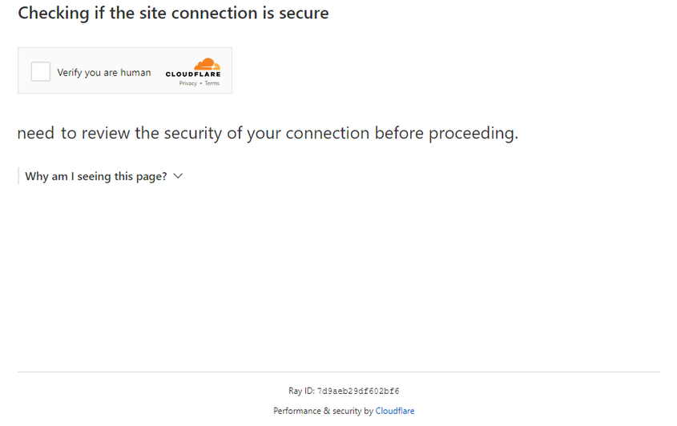

---
sidebar_position: 6
sidebar_label: TurnstileTask
---

# TurnstileTask | Cloudflare Challenge
All Turnstile subtypes are automatically supported: manual, non-interactive, and invisible. Therefore, there is no need to specify a subtype for a regular captcha. 

:::caution Attention!
Check out all three options of captcha recognition and choose the most convenient one for you.
:::
## Option 1 (Turnstile)
You are required to solve a regular turnstile captcha, as here. Note that the CAPTCHA on CloudFlare pages may look identical. Learn more about how to distinguish between a regular Turnstile and a Cloudflare Challenge at the end of the article.
#### **Object structure**
|**Parameter**|**Type**|**Required**|**Value**|
| :- | :- | :- | :- |
|type|String|yes|**TurnstileTaskProxyless**|
|websiteURL|String|yes|The page address, where the captcha is solved|
|websiteKey|String|yes|Turnstile key|
|pageAction|String|no|The `action` field that can be found in the callback function to load the captcha|

## Option 2 (CloudFlare)
You are working through a browser and you need to get a token to pass CloudFlare.
#### **Object structure**
|**Parameter**|**Type**|**Required**|**Value**|
| :- | :- | :- | :- |
|type|String|yes|**TurnstileTaskProxyless**|
|websiteURL|String|yes|Address of the page where the captcha is solved|
|websiteKey|String|yes|Turnstile key|
|cloudflareTaskType|String|yes|**token**|
|userAgent|String|yes|Browser User-Agent.<br /> **Pass only the actual UA from Windows OS. Now this is version 126**: `Mozilla/5.0 (Windows NT 10.0; Win64; x64) AppleWebKit/537.36 (KHTML, like Gecko) Chrome/126.0.0.0 Safari/537.36`|
|pageAction|String|yes|The `action` field can be found in the callback function to load the captcha. If cloudflareTaskType is used, the `action` is usually "managed" or "non-interactive".|
|data|String|yes|The value of the data field can be taken from the `cData` parameter.|
|pageData|String|yes|The value of the pageData field can be taken from the `chlPageData` parameter.|
It is not necessary to pass a proxy to get the token.

These parameters are in the object that is passed during captcha creation to the function `window.turnstile.render(el, paramsObj)`. You can get them, for example, by executing JavaScript before loading other scripts:

```js
(function () {
  const obj = {
    render: function () {
      const { action, cData, chlPageData } = arguments[1];
        const params = [
          ["action", action],
          ["data", cData],
          ["pageData", chlPageData],
        ];
        console.table(params)
    }
  };

  Object.defineProperty(window, "turnstile", {
    get: () => {
      return obj;
    },
  });
})();
```

When calling `window.turnstile.render(el, paramsObj)` the captcha on the page is loaded, and if successful, a `callback` function is called to pass information about the solution.

`window.turnstile.render(el, paramsObj):`

`el`: The DOM element to insert the captcha into.

`paramsObj`: A params object containing information about the captcha and instructions for solving it. This object usually contains fields such as
*sitekey*, *action*, *cData*, *chlPageData*, *callback*. 

`callback` – is a callback function after the captcha is successfully passed.

## Option 3 (CloudFlare)
You are working using queries, and you need cf_clearance cookies. It is required that you need your proxies.
#### **Object structure**
|**Parameter**|**Type**|**Required**|**Value**|
| :- | :- | :- | :- |
|type|String|yes|**TurnstileTask**|
|websiteURL|String|yes|Address of the page on which the captcha is solved|
|websiteKey|String|yes|Turnstile key (you can pass any string)|
|cloudflareTaskType|String|no|**cf_clearance**|
|htmlPageBase64|String|yes|Base64 encoded html page **"Just a moment"** which is given with code 403 when accessing a site with this protection.<br/> Example of obtaining a string htmlPageBase64: *<br/>var htmlContent = document.documentElement.outerHTML;<br/>var htmlBase64 = btoa(unescape(encodeURIComponent(htmlContent)));<br/>console.log(htmlBase64);*|
|userAgent|String|yes|Browser User-Agent.<br /> **Pass only the actual UA from Windows OS. Now this is version 126**: `Mozilla/5.0 (Windows NT 10.0; Win64; x64) AppleWebKit/537.36 (KHTML, like Gecko) Chrome/126.0.0.0 Safari/537.36`|
|proxyType|String|yes|**http** - normal http/https proxy<br/>**https** - try this option only if "http" doesn't work (required for some custom proxies)<br/>**socks4** - socks4 proxy<br/>**socks5** - socks5 proxy|
|proxyAddress|String|yes|IP address of the IPv4/IPv6 proxy. Not allowed:<br/>- use of hostnames<br/>- use of transparent proxies (where you can see client IP)<br/>- use of proxies on local machines|
|proxyPort|Integer|yes|Proxy Port|
|proxyLogin|String|yes|Proxy server login|
|proxyPassword|String|yes|Proxy server password|

## Examples of requests
### **Option 1: Normal Turnstile**
:::info METHOD
```http
https://api.capmonster.cloud/createTask
```
:::
```json
{
    "clientKey":"dce6bcbb1a728ea8d871de6d169a2057",
    "task":
    {
        "type":"TurnstileTaskProxyless",
        "websiteURL":"http://tsmanaged.zlsupport.com",
        "websiteKey":"0x4AAAAAAABUYP0XeMJF0xoy"
    }
}
```
**Example response**
```json
{
  "errorId":0,
  "taskId":407533072
}
```

### **Option 2. CloudFlare (token)**
:::info METHOD
```http
https://api.capmonster.cloud/createTask
```
:::
```json
{
	"clientKey": "dce6bcbb1a728ea8d871de6d169a2057",
	"task": {
		"type": "TurnstileTask",
		"websiteURL": "https://site.com",
		"websiteKey": "0x4AAAAAAADnPIDROrmt1Wwj",
		"cloudflareTaskType": "token",
		"userAgent":"Mozilla/5.0 (Windows NT 10.0; Win64; x64) AppleWebKit/537.36 (KHTML, like Gecko) Chrome/126.0.0.0 Safari/537.36",
		"pageAction": "managed",
		"pageData": "HUHDWUHuhuwfiweh32..uh2uhuhyugYUG=",
		"data": "874291f4retD1366"
	}
}
```
### Option 3. CloudFlare(cookie)
:::info METHOD
```http
https://api.capmonster.cloud/createTask
```
:::
```json 
  {
  "clientKey":"dce6bcbb1a728ea8d871de6d169a2057",
  "task": {
    "type":"TurnstileTask",
    "websiteURL":"https://nowsecure.nl",
    "websiteKey":"xxxxxxxxxx",
    "cloudflareTaskType": "cf_clearance",
    "htmlPageBase64": "PCFET0NUWVBFIGh0...vYm9keT48L2h0bWw+",
    "userAgent": "Mozilla/5.0 (Windows NT 10.0; Win64; x64) AppleWebKit/537.36 (KHTML, like Gecko) Chrome/126.0.0.0 Safari/537.36",
    "proxyType":"http",
    "proxyAddress":"8.8.8.8",
    "proxyPort":8080,
    "proxyLogin":"proxyLoginHere",
    "proxyPassword":"proxyPasswordHere"
  }
}
```

## **GetTaskResult**
Use the [getTaskResult](../api/methods/get-task-result.md) method to get the Turnstile solution. Depending on the system load, you will get a response after a time in the range of 5 to 20s.

|**Property**|**Type**|**Description**|
| :- | :- | :- |
|cf_clearance|String|A special Cloudflare cookie that you can substitute into your browser|
|token|String|Use a token when calling a callback function|
## **How to distinguish between a regular Turnstile and a Cloudflare Challenge**
A Cloudflare challenge can look different.

**Normal variant:**

 

**Stylized variants:**

<figure>


<figcaption>The challenge is seamlessly integrated into the site itself.</figcaption>

</figure>

<figure>

 

<figcaption>It looks like a regular turnstile CAPTCHA, but it's actually a challenge.</figcaption>

</figure>

To be finally convinced of the presence of Cloudflare, you can open the developer tools, look at the traffic, examine the page code, and see the characteristic signs:

- The first request to the site returns a 403 code:


- The form with the id **challenge-form** has an **action** attribute (not to be confused with the action from the parameters for turnstile captcha) containing the `__cf_chl_f_tk=` parameter:


- The page contains two similar `<script>` tags that create a new value in the `window` object:

 

<details>
        <summary>Example of solution implementation using Selenium on Node.js</summary>

```js

const { Builder } = require('selenium-webdriver');
const chrome = require('selenium-webdriver/chrome');

(async function example() {
  const options = new chrome.Options();
  options.addArguments('--auto-open-devtools-for-tabs')

  const driver = new Builder()
    .forBrowser('chrome')
    .setChromeOptions(options)
    .build();

  try {
    driver.executeScript(`
    window.turnstile = new Proxy(window.turnstile, {
      get(target, prop) {
        if (prop === 'render') {
          return function(a, b) {
            let p = {
              type: "TurnstileTaskProxyless",
              websiteKey: b.sitekey,
              websiteURL: window.location.href,
              data: b.cData,
              pagedata: b.chlPageData,
              action: b.action,
              userAgent: navigator.userAgent
          }
          
          console.log(JSON.stringify(p))
          window.params = p;
          window.turnstileCallback = b.callback;
            return target.render.apply(this, arguments);
          }
        }
        return target[prop];
      }
    });
    `)

    driver.get('SITE WITH CAPTCHA');
    

    const params = await driver.executeScript(`
      return new Promise((resolve, reject) => {
        setTimeout(() => {
          resolve(window.params)
        }, 2000)
      })
    `);

    if (params) {
      const data = {
        clientKey: 'API KEY',
        task: {
          type: 'TurnstileTaskProxyless',
          websiteURL: params.websiteURL,
          websiteKey: params.websiteKey,
          data: params.data,
          action: params.action
        }
      }

      const createResult = await fetch('https://api.capmonster.cloud/createTask', {
        method: 'post',
        body: JSON.stringify(data)
      });

      const createTaskResult = await createResult.json()

      if (createTaskResult.taskId) {
        const asyncDelay = (timeout) =>
          new Promise(resolve => {
              setTimeout(() => {
                  resolve();
              }, timeout);
          });
        
        const getTaskResult = async (taskId) => {
          const taskResult = await fetch('https://api.capmonster.cloud/getTaskResult', {
            method: 'post',
            body: JSON.stringify({
              "clientKey":"API KEY",
              "taskId": createTaskResult.taskId
            })
          });
          const taskResponse = await taskResult.json();
          if (taskResponse.status === 'processing') {
            await asyncDelay(5000);
            return await getTaskResult(taskId)
          }
          return taskResponse;
        }
       
        const taskRes = await getTaskResult(createTaskResult.taskId)

        if (taskRes.solution) {
          await driver.executeScript(`
            window.turnstileCallback(${taskRes.solution.token});
          `);
        }
      }
      
    }

    //DO SOMETHING
  } finally {
    await driver.quit();
  }
})();
```
</details>
