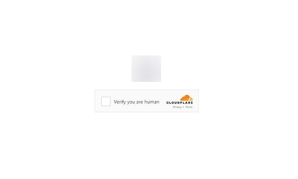
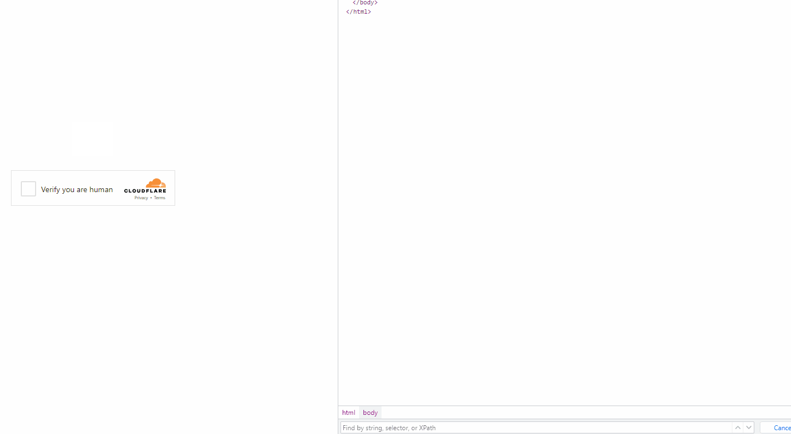

---
sidebar_position: 6
sidebar_label: TurnstileTask
---

# TurnstileTask | Cloudflare Challenge
所有 Turnstile 子类型都会自动支持：手动、非交互式和隐形。因此，对于常规验证码，无需指定子类型。

:::caution 注意！
请查看所有三个验证码识别选项，并选择最适合您的选项。
:::
## 选项 1（Turnstile）
您需要解决一个常规的 Turnstile 验证码，就像这里一[样](https://zenno.link/zl-support)。 请注意，CloudFlare 页面上的验证码可能看起来相同。了解如何区分常规 Turnstile 和 Cloudflare Challenge 的更多信息，请参阅本文末尾。
#### **对象结构**
|**参数**|**类型**|**必需**|**值**|
| :- | :- | :- | :- |
|type|String|是|**TurnstileTaskProxyless**|
|websiteURL|String|是|解决验证码的页面地址|
|websiteKey|String|是|Turnstile 密钥|
|pageAction|String|否|可以在加载验证码的回调函数中找到的 `action` 字段|

## 选项 2（CloudFlare）
您正在通过浏览器工作，需要获取一个令牌来通过 CloudFlare。
#### **对象结构**
|**参数**|**类型**|**必需**|**值**|
| :- | :- | :- | :- |
|type|String|是|**TurnstileTaskProxyless**|
|websiteURL|String|是|解决验证码的页面地址|
|websiteKey|String|是|Turnstile 密钥|
|cloudflareTaskType|String|是|**token**|
|userAgent|String|是|浏览器 User-Agent。<br /> **仅传递来自 Windows 操作系统的实际 UA。现在是**: `Mozilla/5.0 (Windows NT 10.0; Win64; x64) AppleWebKit/537.36 (KHTML, like Gecko) Chrome/126.0.0.0 Safari/537.36`|
|pageAction|String|是|在加载验证码的回调函数中可以找到的 `action` 字段。如果使用 cloudflareTaskType，则 `action` 通常为 "managed" 或 "non-interactive"。|
|data|String|是|data 字段的值可以从 `cData` 参数中获取。|
|pageData|String|是|pageData 字段的值可以从 `chlPageData` 参数中获取。|
获取令牌时不需要传递代理。

这些参数位于在创建验证码时传递给函数 `window.turnstile.render(el, paramsObj)` 的对象中。您可以通过在加载其他脚本之前执行 JavaScript 来获取它们，例如：

```js
(function () {
  const obj = {
    render: function () {
      const { action, cData, chlPageData } = arguments[1];
        const params = [
          ["action", action],
          ["data", cData],
          ["pageData", chlPageData],
        ];
        console.table(params)
    }
  };

  Object.defineProperty(window, "turnstile", {
    get: () => {
      return obj;
    },
  });
})();
```

调用 `window.turnstile.render(el, paramsObj)` 时，页面上的验证码将被加载，如果成功，将调用一个 `callback` 函数来传递有关解决方案的信息。

`window.turnstile.render(el, paramsObj):`

`el`：要插入验证码的 DOM 元素。

`paramsObj`：包含有关验证码和解决方案指令的参数对象。此对象通常包含诸如 
*sitekey*、*action*、*cData*、*chlPageData*、*callback* 等字段。

`callback` – 是一个在成功通过验证码后调用的回调函数。

## 选项 3（CloudFlare）
您正在通过查询工作，并且需要 cf\_clearance cookies。您需要使用代理。
#### **对象结构**
|**参数**|**类型**|**必填**|**值**|
| :- | :- | :- | :- |
|type|String|是|**TurnstileTask**|
|websiteURL|String|是|解决验证码的页面地址|
|websiteKey|String|是|Turnstile 密钥（可以传递任意字符串）|
|cloudflareTaskType|String|否|**cf\_clearance**|
|htmlPageBase64|String|是|Base64 编码的 html 页面**"Just a moment"**，在访问受此保护的站点时返回代码 403。<br/> 获取 htmlPageBase64 的示例：*<br/>var htmlContent = document.documentElement.outerHTML;<br/>var htmlBase64 = btoa(unescape(encodeURIComponent(htmlContent)));<br/>console.log(htmlBase64);*|
|userAgent|String|是|浏览器 User-Agent。<br /> **仅传递来自 Windows 操作系统的实际 UA。当前版本为 126**: `Mozilla/5.0 (Windows NT 10.0; Win64; x64) AppleWebKit/537.36 (KHTML, like Gecko) Chrome/126.0.0.0 Safari/537.36`|
|proxyType|String|是|**http** - 普通的 http/https 代理<br/>**https** - 如果 "http" 不起作用，请尝试此选项（适用于某些自定义代理）<br/>**socks4** - socks4 代理<br/>**socks5** - socks5 代理|
|proxyAddress|String|是|IPv4/IPv6 代理的 IP 地址。不允许：<br/>- 使用主机名<br/>- 使用透明代理（可以看到客户端 IP）<br/>- 在本地机器上使用代理|
|proxyPort|Integer|是|代理端口|
|proxyLogin|String|是|代理服务器登录|
|proxyPassword|String|是|代理服务器密码|

## 请求示例
### **选项 1: 普通 Turnstile**
:::info 方法
```http
https://api.capmonster.cloud/createTask
```
:::
```json
{
    "clientKey":"API_KEY",
    "task":
    {
        "type":"TurnstileTaskProxyless",
        "websiteURL":"http://tsmanaged.zlsupport.com",
        "websiteKey":"0x4AAAAAAABUYP0XeMJF0xoy"
    }
}
```
**示例响应**
```json
{
  "errorId":0,
  "taskId":407533072
}
```

### **选项 2.CloudFlare（token）**
:::info 方法
```http
https://api.capmonster.cloud/createTask
```
:::
```json
{
	"clientKey": "API_KEY",
	"task": {
		"type": "TurnstileTask",
		"websiteURL": "https://site.com",
		"websiteKey": "0x4AAAAAAADnPIDROrmt1Wwj",
		"cloudflareTaskType": "token",
		"userAgent":"Mozilla/5.0 (Windows NT 10.0; Win64; x64) AppleWebKit/537.36 (KHTML, like Gecko) Chrome/125.0.0.0 Safari/537.36",
		"pageAction": "managed",
		"pageData": "HUHDWUHuhuwfiweh32..uh2uhuhyugYUG=",
		"data": "874291f4retD1366"
	}
}
```
### 选项 3.CloudFlare（cookie）
:::info 方法
```http
https://api.capmonster.cloud/createTask
```
:::
```json 
{
  "clientKey":"API_KEY",
  "task": {
    "type":"TurnstileTask",
    "websiteURL":"https://nowsecure.nl",
    "websiteKey":"xxxxxxxxxx",
    "cloudflareTaskType": "cf_clearance",
    "htmlPageBase64": "PCFET0NUWVBFIGh0...vYm9keT48L2h0bWw+",
    "userAgent": "Mozilla/5.0 (Windows NT 10.0; Win64; x64) AppleWebKit/537.36 (KHTML, like Gecko) Chrome/125.0.0.0 Safari/537.36",
    "proxyType":"http",
    "proxyAddress":"8.8.8.8",
    "proxyPort":8080,
    "proxyLogin":"proxyLoginHere",
    "proxyPassword":"proxyPasswordHere"
  }
}
```

## **获取任务结果**
使用 [getTaskResult](../api/methods/get-task-result.md) 方法获取 Turnstile 解决方案。根据系统负载情况，您将在 5 到 20 秒内收到响应。

|**属性**|**类型**|**描述**|
| :- | :- | :- |
|cf_clearance|String|特殊的 Cloudflare cookie，可以用于浏览器中|
|token|String|在调用回调函数时使用的 token|
## **如何区分普通 Turnstile 和 Cloudflare Challenge**
Cloudflare 挑战的外观可能不同。

**普通变体：**


**风格化变体：**

<figure>


<figcaption>挑战无缝集成到网站本身。</figcaption>

</figure>

<figure>



<figcaption>外观类似于普通 turnstile CAPTCHA，但实际上是一个挑战。</figcaption>

</figure>

要最终确认Cloudflare的存在，您可以打开开发者工具，查看网络流量，检查页面代码，并查看以下特征标志：

- 第一个对站点的请求返回403状态码：


- 具有id为**challenge-form**的表单有一个**action**属性（注意不要与turnstile验证码的参数混淆），其中包含`__cf_chl_f_tk=`参数：


- 页面包含两个类似的`<script>`标签，在`window`对象中创建了一个新的值：



<details>
        <summary>使用Node.js上的Selenium实现解决方案示例</summary>

```js

const { Builder } = require('selenium-webdriver');
const chrome = require('selenium-webdriver/chrome');

(async function example() {
  const options = new chrome.Options();
  options.addArguments('--auto-open-devtools-for-tabs')

  const driver = new Builder()
    .forBrowser('chrome')
    .setChromeOptions(options)
    .build();

  try {
    driver.executeScript(`
    window.turnstile = new Proxy(window.turnstile, {
      get(target, prop) {
        if (prop === 'render') {
          return function(a, b) {
            let p = {
              type: "TurnstileTaskProxyless",
              websiteKey: b.sitekey,
              websiteURL: window.location.href,
              data: b.cData,
              pagedata: b.chlPageData,
              action: b.action,
              userAgent: navigator.userAgent
          }
          
          console.log(JSON.stringify(p))
          window.params = p;
          window.turnstileCallback = b.callback;
            return target.render.apply(this, arguments);
          }
        }
        return target[prop];
      }
    });
    `)

    driver.get('站点网址');
    

    const params = await driver.executeScript(`
      return new Promise((resolve, reject) => {
        setTimeout(() => {
          resolve(window.params)
        }, 2000)
      })
    `);

    if (params) {
      const data = {
        clientKey: 'API KEY',
        task: {
          type: 'TurnstileTaskProxyless',
          websiteURL: params.websiteURL,
          websiteKey: params.websiteKey,
          data: params.data,
          action: params.action
        }
      }

      const createResult = await fetch('https://api.capmonster.cloud/createTask', {
        method: 'post',
        body: JSON.stringify(data)
      });

      const createTaskResult = await createResult.json()

      if (createTaskResult.taskId) {
        const asyncDelay = (timeout) =>
          new Promise(resolve => {
              setTimeout(() => {
                  resolve();
              }, timeout);
          });
        
        const getTaskResult = async (taskId) => {
          const taskResult = await fetch('https://api.capmonster.cloud/getTaskResult', {
            method: 'post',
            body: JSON.stringify({
              "clientKey":"API KEY",
              "taskId": createTaskResult.taskId
            })
          });
          const taskResponse = await taskResult.json();
          if (taskResponse.status === 'processing') {
            await asyncDelay(5000);
            return await getTaskResult(taskId)
          }
          return taskResponse;
        }
       
        const taskRes = await getTaskResult(createTaskResult.taskId)

        if (taskRes.solution) {
          await driver.executeScript(`
            window.turnstileCallback(${taskRes.solution.token});
          `);
        }
      }
      
    }

    //做一些事情
  } finally {
    await driver.quit();
  }
})();
```
</details>
