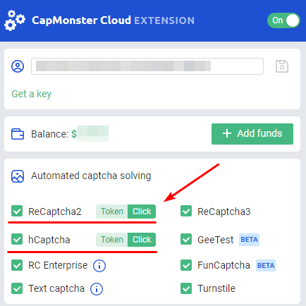

---
sidebar_position: 3
sidebar_label: 在ProjectMaker浏览器中安装扩展的说明
---

# 安装CapMonster Cloud扩展程序至ProjectMaker浏览器的说明

:::info 信息

该扩展仅适用于Chromium浏览器！

:::

## **方法一：使用CRX文件安装。**
1. 下载 [CRX文件 CapMonster Cloud](https://chrome.google.com/webstore/detail/capmonster-cloud-%E2%80%94-automa/pabjfbciaedomjjfelfafejkppknjleh?hl=en)；

:::info 信息
[在这里](https://zennolab.atlassian.net/wiki/spaces/RU/pages/2081423361#%D0%9A%D0%B0%D0%BA-%D1%81%D0%BA%D0%B0%D1%87%D0%B0%D1%82%D1%8C-crx-%D1%84%D0%B0%D0%B9%D0%BB-%D1%80%D0%B0%D1%81%D1%88%D0%B8%D1%80%D0%B5%D0%BD%D0%B8%D1%8F)您可以找到安装CRX文件的说明。
:::

2. 打开ProjectMaker；

3. 添加“添加扩展”操作；

   1. 在操作设置中指定CRX文件的路径；
   
4. 添加“激活扩展”操作；

5. 在操作设置中设置扩展ID为“pabjfbciaedomjjfelfafejkppknjleh”；

6. 在打开的扩展窗口中，输入来自您的CapMonster Cloud个人账户的API密钥。
## **方法二：通过Chrome Web Store安装。**
1. 打开ProjectMaker；
2. 转到扩展页面` <https://chrome.google.com/webstore/detail/capmonster-cloud-%E2%80%94-automa/pabjfbciaedomjjfelfafejkppknjleh?hl=en>`;
3. 点击“安装”按钮并安装扩展；
4. 添加“激活扩展”操作；

   1. 在操作设置中，插入扩展ID“pabjfbciaedomjjfelfafejkppknjleh”；
   
5. 在打开的扩展窗口中，输入来自您的CapMonster Cloud个人账户的API密钥。
:::info 信息
CapMonster Cloud扩展的新版本支持解决reCAPTCHA2、reCAPTCHA Enterprise和hCaptcha（通过点击）。
:::

:::caution 警告
请注意，在安装扩展时，默认将reCAPTCHA2、reCAPTCHA Enterprise和hCaptcha的解决类型设置为“点击”。
:::
为了使CapMonster Cloud扩展在ProjectMaker中更易于使用，我们准备了一个项目来自动化安装扩展、输入API密钥以及选择解决类型reCAPTCHA2、reCAPTCHA Enterprise和hCaptcha。

***ZennoPoster的最低版本要求为7.6.1***

:::caution 警告
通过CRX文件安装CapMonster Cloud扩展时，需要保持扩展程序版本更新。如果有版本更新，需要重新下载当前的CRX文件并重新安装。
:::
:::caution 警告
使用CapMonster Cloud扩展时，请从您的项目中移除验证码识别操作。
:::