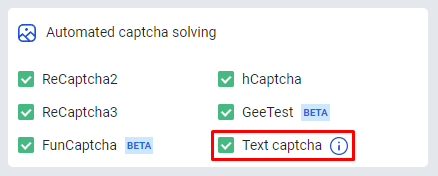
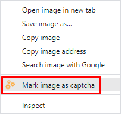
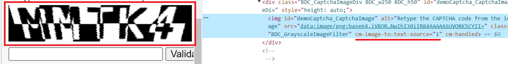

---
sidebar_position: 2
---

# 解决文本验证码
## **描述**
我们在浏览器扩展中增加了识别文本验证码的功能。

## **工作原理**
### **浏览器中的操作**
1\.在验证码上右键，从弹出菜单中选择“Mark image as captcha”。

2\. 在打开的菜单中，右键点击答案输入字段，并选择“Select an input for the captcha result”。

3\.结果将自动填写到答案输入字段中。

### **使用软件自动化识别**
要在浏览器中自动化识别文本验证码的过程（例如使用 *开发者工具* 或 *Selenium*），您需要：
1. 将 `cm-image-to-text-source="id"` 属性分配给包含图像的元素：

2. 将 `cm-image-to-text-input-result="id"` 属性分配给包含输入字段的元素：

其中 "id" 是验证码标识符（任意值）。
:::info 信息
同时，相互对应的验证码和输入字段应具有相同的 id。

您可以同时在页面上解决多个验证码，关键是在同一组内 id 是唯一的，并且验证码和输入字段的 id 相互匹配。
:::
