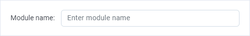
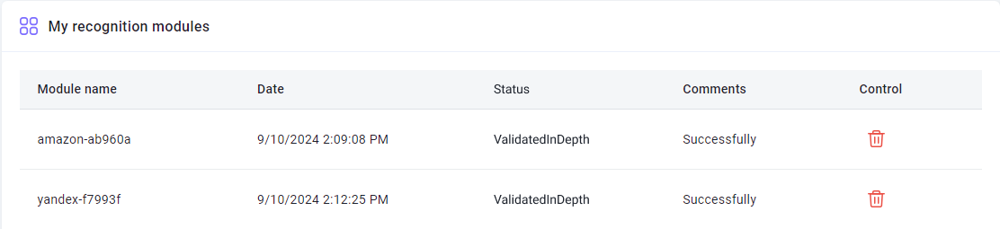
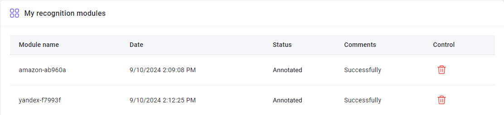

import { ArticleHead } from '../../../../../src/theme/ArticleHead';

<ArticleHead slug="api/user-module" />

# 创建用户模块
## 描述
此功能允许您创建定制模块，用于针对特定类型的验证码进行训练。这将有助于更快、更高效地识别非标准验证码，并降低错误发生的概率。

要访问[模块训练页面](https://capmonster.cloud/UserModules)，请点击网站右上角的电子邮件，然后在菜单中选择相关选项。

-----
## 工作原理
简要来说：

1. 收集验证码并进行归档
1. 将它们发送给我们，并指定模块名称
1. 向账户充值10美元（这笔款项将保留在您的余额上）
1. 我们创建模块
1. 您从您的软件发送请求，并指定已创建的模块名称

现在让我们详细讨论每个步骤。

-----
### 1. 收集验证码
#### **需要多少验证码？**
要回答这个问题，请在[模块训练页面](https://capmonster.cloud/UserModules)的表单中标记您的验证码包含的符号类型。完成后，在上传存档按钮上方会显示一个提示，告诉您需要上传多少验证码：支持的图片格式

#### 支持的图片格式
- jpg
- jpeg
- png
#### 如何收集验证码？
让我们以[ZennoPoster](https://zennolab.atlassian.net/wiki/spaces/EN/pages/924581921/ZennoPoster)为例。

假设您正在注册某个网站的账户，该网站有一个需要创建模块的验证码。有几种方法可以收集验证码：

- 很可能，您已经有一个用于此网站的运行中项目，这意味着您已经在解决这个验证码。在[识别验证码](https://zennolab.atlassian.net/wiki/spaces/EN/pages/924582077/Recognize+captcha)操作中的*更多*选项卡中，您可以找到专为此类情况创建的[保存](https://zennolab.atlassian.net/wiki/spaces/EN/pages/924582077/Recognize+captcha#Saving)选项。
- 您可以采用更简单的方法：转到验证码页面。它总是有一个刷新按钮。将验证码发送给解码器或[手动解决](https://zennolab.atlassian.net/wiki/spaces/EN/pages/924484621/Entering+captchas+manually)(先前在[保存](https://zennolab.atlassian.net/wiki/spaces/EN/pages/924582077/Recognize+captcha#Saving)操作中设置)，刷新验证码，然后再次发送以解决。重复这些步骤，直到收集到足够数量的验证码。

:::warning 警告
不要在数十甚至数百个线程中运行验证码收集！很少有网站会喜欢这样做。
:::

-----
### 2. 发送验证码归档

#### 2.1.Name
首先，设置模块名称（只能使用拉丁字符）。

:::warning 警告
模块名称不能包含单词 **captcha**。
:::
#### 2.2.符号类型
标记您的验证码包含的符号类型。

您在此处标记的内容会影响您需要上传来训练模块的验证码数量。

您可以从建议中选择一个或多个选项。

:::info 信息
您至少应标记以下选项之一：“包含 Cyrillic 字符”、“包含 Latin 字符”、包含数字。
:::
#### 2.3.标记位置
指定验证码答案的位置。

非常简单：

- **None** - 如果您的验证码没有答案，请选择此选项（在这种情况下，模块训练可能需要更长时间）。
- **Located in file names** - 如果每个验证码图像的文件名是其答案，请选择此选项（有时候操作系统不允许文件名中有某些符号）。
- **Located in a separate file in the archieve** - 如果答案保存在文件中，请选择此选项（应该是一个简单的文本文件—.txt）。
  - 文件名 - answers.txt
  - 应位于包含验证码的归档文件内
  - 格式 - CaptchaFileName：CaptchaAnswer，每个验证码占一行。例如：
~~~
captcha1.png:d9li1

captcha2.png:2zhnw

captcha3.png:99loe
~~~
#### 2.4.发送归档
在指定了模块名称、选择了符号类型和答案位置后，您需要上传包含验证码的 zip 归档并发送给我们。

#### 2.5.付款
- 如果您完成了所有步骤，您的请求将显示为**Validated**状态。
- 完成后，您需要为每个模块存入 10 美元。

:::note 注意
用于训练的资金不会被扣除，而是保留在余额中。您随时可以将它们用于解决任何验证码。
:::

- 成功存款后，**第一个**传的模块的状态将变为**已支付**。
-----
### 3. 状态

#### Validated

在正确提交表单后（假设你已经一切都做对了）你会获得这个状态。

:::note 注意
拥有这个状态的模块可以被删除。如果你上传了模块但发现上传了错误的存档或者给模块起了错误的名字，你可以删除它，进行修改，然后重新提交。
:::
#### 已支付

你的模块付款已经成功接受。
#### 深度验证中

准备工作进行中。
#### 已标注

验证码标记已完成。训练正在进行中。
#### 已训练

模块已准备就绪！你现在可以向其提交验证码。
### 4. 向特定模块发送验证码
有几种方法可以指定一个解决验证码的模块：

- [在发送 /createTask 请求时添加 CapMonsterModule 参数及模块名称](../captchas/image-to-text.mdx)（如果您直接与我们的 API 交互）
- [在 ApiKey 中指定模块名称](module-name.mdx)（当您使用第三方程序且无法修改请求时非常方便）
-----
## 常见问题解答

模块训练需要多长时间？

通常需要一天的时间。

**注意：** 训练只在周一到周五的工作日进行。如果您在周五发送请求，训练将在下周初完成。

我想同时训练多个模块，应该如何正确操作？

操作很简单：您只需上传验证码存档并支付费用。然后，上传第二个存档并支付费用。对所有存档都重复此步骤。

每个模块的训练需要一天的时间。

我看到我的模块旁边的“评论”列显示“错误”标志。我该怎么办？

不要惊慌！请稍等一会。

如果一天内没有变化，[联系支持团队](https://helpdesk.zennolab.com)，我们一定会帮助您。

我上传了错误的存档，可以重新发送吗？

如果您尚未支付模块费用且模块状态为**Validated**，您可以删除它。更多信息请参阅**Validated**状态的描述。

表格中的“管理”列是什么？我什么都没有看到

您将在此列看到“删除”按钮。但这仅适用于状态为**Validated**的模块。

对于其他状态的模块，此列将保持为空白。

为什么我的模块名称中添加了一些符号？

这是为了使模块名称唯一。某些系统用户可能选择相同的模块名称。为了避免混淆，系统会自动生成并添加随机符号到模块名称中。这样每个用户都可以向自己的模块发送验证码，不会混淆。

我可以为 CapMonster2 程序获取训练过的模块吗？

不可以。训练过的模块仅在 CapMonster.Cloud 中提供。

我对训练质量不满意。该怎么办？

[联系我们的支持服务。](https://helpdesk.zennolab.com/)

我有一个这里没有覆盖的问题。我应该联系哪里？

[联系我们的支持服务。](https://helpdesk.zennolab.com/)

<!-- ![ref1]模块训练需要多长时间？

通常需要一天的时间。

**注意：** 训练只在周一到周五的工作日进行。如果您在周五发送请求，训练将在下周初完成。-->

<!-- ![ref1]我想同时训练多个模块，应该如何正确操作？

操作很简单：您只需上传验证码存档并支付费用。然后，上传第二个存档并支付费用。对所有存档都重复此步骤。

每个模块的训练需要一天的时间。 -->

<!-- ![ref1]我看到我的模块旁边的“评论”列显示“错误”标志。我该怎么办？

不要惊慌！请稍等一会。

如果一天内没有变化，[联系支持团队](https://helpdesk.zennolab.com/ru)，我们一定会帮助您。-->

<!-- ![ref1]我上传了错误的存档，可以重新发送吗？

如果您尚未支付模块费用且模块状态为**Validated**，您可以删除它。更多信息请参阅**Validated**状态的描述。-->

<!-- ![ref1]表格中的“管理”列是什么？我什么都没有看到。

您将在此列看到“删除”按钮。但这仅适用于状态为**Validated**的模块。

对于其他状态的模块，此列将保持为空白。-->

<!-- ![ref1]为什么我的模块名称中添加了一些符号？

这是为了使模块名称唯一。某些系统用户可能选择相同的模块名称。为了避免混淆，系统会自动生成并添加随机符号到模块名称中。这样每个用户都可以向自己的模块发送验证码，不会混淆。-->

<!-- ![ref1]我可以为 CapMonster2 程序获取训练过的模块吗？

不可以。训练过的模块仅在 CapMonster.Cloud 中提供。-->

<!-- ![ref1]我对训练质量不满意。该怎么办？

[联系我们的支持服务。](https://helpdesk.zennolab.com/ru)

![ref1]我有一个这里没有覆盖的问题。我应该联系哪里？

[联系我们的支持服务。](https://helpdesk.zennolab.com/ru)

[ref1]: Aspose.Words.aac7548a-0b79-486d-96ce-e145c7faf5a6.001.png -->
