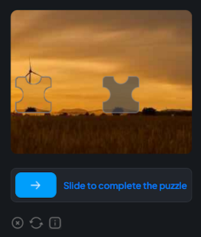

---
sidebar_position: 14
sidebar_label: Basilisk
---

import Tabs from '@theme/Tabs';
import TabItem from '@theme/TabItem';
import ParamItem from '@theme/ParamItem';
import MethodItem from '@theme/MethodItem';
import MethodDescription from '@theme/MethodDescription'
import PriceBlock from '../../../../../src/theme/PriceBlock';
import PriceBlockWrap from '@theme/PriceBlockWrap';

# Basilisk - FaucetPay 验证码

<PriceBlockWrap>
  <PriceBlock title="Basilisk" captchaId="faucetpay"/>
</PriceBlockWrap>



:::warning **注意！**
CapMonster Cloud 默认通过内置代理工作——这些代理已包含在费用内。仅当网站不接受令牌或对内置服务的访问受限时，才需要指定您自己的代理。您可以联系[支持服务](https://helpdesk.zennolab.com/conversation/new)以确认细节并了解令牌在特定网站上的接受情况。

如果代理按 IP 授权，请将地址 **65.21.190.34** 加入白名单。
:::

## 请求参数
<TabItem value="proxyless" label="CustomTask (without proxy)" default className="bordered-panel">
    <ParamItem title="type" required type="string" />
    **CustomTask**

    ---

    <ParamItem title="class" required type="string" />
    **Basilisk**

    ---

    <ParamItem title="websiteURL" required type="string" />
    解决验证码的主页地址。

    ---

    <ParamItem title="websiteKey" required type="string" />
    可以在验证码容器的**data-sitekey**属性中或在向 `https://basiliskcaptcha.com/challenge/check-site`发送的 POST 请求的 **site\_key**字段中找到。

    ---

    <ParamItem title="userAgent" type="string" />
	浏览器的 User-Agent。<br />
**请仅传递当前 Windows 系统下的有效 UA。当前推荐值为**：`userAgentPlaceholder`
   
   ---

   <ParamItem title="proxyType" type="string" />
    **http** - 普通的 http/https 代理；<br />**https** - 仅在 "http" 不起作用时尝试（某些自定义代理服务器要求）；<br />**socks4** - socks4 代理；<br />**socks5** - socks5 代理。

     ---

    <ParamItem title="proxyAddress" type="string" />
    <p>
	  代理 IP 地址 IPv4/IPv6。不允许：
		- 使用主机名；
		- 使用透明代理（其中客户端 IP 可见）；
		- 使用来自本地网络的代理。
	</p>

     ---

    <ParamItem title="proxyPort" type="integer" />
    代理端口。

     ---

    <ParamItem title="proxyLogin" type="string" />
    代理登录。

     ---

    <ParamItem title="proxyPassword" type="string" />
    代理密码。


</TabItem>


## 创建任务方法
<Tabs className="full-width-tabs filled-tabs request-tabs" groupId="captcha-type">
  <TabItem value="proxyless" label="CustomTask (无代理)" default className="method-panel">
    <MethodItem>
      ```http
      https://api.capmonster.cloud/createTask
      ```
    </MethodItem>
    <MethodDescription>

    **请求**

    ```json
    {
      "clientKey": "API_KEY",
      "task": {
        "type": "CustomTask",
        "class": "Basilisk",
        "websiteURL": "https://domain.io/account/register",
        "websiteKey": "b7890hre5cf2544b2759c19fb2600897",
        "userAgent": "userAgentPlaceholder"
      }
    }
    ```

    **响应**

    ```json
    {
      "errorId": 0,
      "taskId": 407533072
    }
    ```

    </MethodDescription>
  </TabItem>

  <TabItem value="proxy" label="CustomTask (使用代理)" className="method-panel">
    <MethodItem>
      ```http
      https://api.capmonster.cloud/createTask
      ```
    </MethodItem>
    <MethodDescription>

    **请求**

    ```json
    {
      "clientKey": "API_KEY",
      "task": {
        "type": "CustomTask",
        "class": "Basilisk",
        "websiteURL": "https://domain.io/account/register",
        "websiteKey": "b7890hre5cf2544b2759c19fb2600897",
        "userAgent": "userAgentPlaceholder",
        "proxyType": "http",
        "proxyAddress": "8.8.8.8",
        "proxyPort": 8080,
        "proxyLogin": "proxyLoginHere",
        "proxyPassword": "proxyPasswordHere"
      }
    }
    ```

    **响应**

    ```json
    {
      "errorId": 0,
      "taskId": 407533072
    }
    ```

    </MethodDescription>
  </TabItem>
</Tabs>


## 获取任务结果方法
使用方法[getTaskResult](../api/methods/get-task-result.md)获取Basilisk解决方案。

<TabItem value="proxyless" label="GeeTestTaskProxyless (without proxy)" default className="method-panel-full">
	<MethodItem>
		```http
		https://api.capmonster.cloud/getTaskResult
		```
	</MethodItem>
	<MethodDescription>
		**要求**
		```json
		{
		  "clientKey":"API_KEY",
		  "taskId": 407533072
		}
		```
		**回应**
		```json
		{
		   "errorId":0,
		   "status":"ready",
		   "solution": {
			  "data": {
				   "captcha_response": "5620301f30daf284b829fba66fa9b3d0"
			   },
			   "headers": {
				   "User-Agent": "userAgentPlaceholder"
			   }
		   }
		}
		```
	</MethodDescription>
</TabItem>

## 如何查找任务创建所需的所有参数

### 手动方式

1. 请在浏览器中访问您的网站，该网站包含验证码功能。
2. 右键点击验证码元素，选择 **检查（Inspect）**。

#### websiteKey

在 **网络** (Network) 选项卡中，使用与验证码相关的关键词过滤请求，比如 *site_key*。这些请求会包含 *site_key* 参数——这是一个用于在验证码解决过程中识别网站的值：


### 自动方法

一种方便的自动化获取所有必要参数的方式。
某些参数每次页面加载时都会重新生成，因此需要通过浏览器（普通或无头模式，如使用**Playwright**）提取它们。
由于动态参数值的有效期很短，获取后必须立即解决验证码。

:::warning **重要提示！**
提供的代码片段是用于熟悉参数提取的基本示例。具体实现将取决于验证码页面、其结构及使用的HTML元素/选择器。
:::

<Tabs className="full-width-tabs filled-tabs request-tabs">
  <TabItem value="js" label="JavaScript" default className="method-panel">
    <details>
      <summary>显示代码（浏览器中）</summary>
      ```js
      // 查找具有 data-sitekey 属性的元素
      const captchaElement = document.querySelector('[data-sitekey]');

      // 提取 sitekey 值
      if (captchaElement) {
        const siteKey = captchaElement.getAttribute('data-sitekey');
        console.log('找到 site-key:', siteKey);
      } else {
        console.log('未找到 site-key');
      }
      ```
    </details>

    <details>
      <summary>显示代码（Node.js）</summary>
      ```js
      import { chromium } from 'playwright';

      async function extractSiteKey() {
        const browser = await chromium.launch({ headless: true });
        const page = await browser.newPage();

        const url = 'https://example.com';
        await page.goto(url);

        // 查找具有 data-sitekey 属性的元素
        const captchaElement = await page.$('[data-sitekey]');

        // 提取 sitekey 值
        if (captchaElement) {
          const siteKey = await captchaElement.getAttribute('data-sitekey');
          console.log('找到 site-key:', siteKey);
        } else {
          console.log('未找到 site-key');
        }

        await browser.close();
      }

      extractSiteKey();
      ```
    </details>
  </TabItem>

  <TabItem value="python" label="Python" className="method-panel">
    <details>
      <summary>显示代码</summary>
      ```python
      import asyncio
      from playwright.async_api import async_playwright

      async def main():
          async with async_playwright() as p:
              browser = await p.chromium.launch(headless=False)
              page = await browser.new_page()

              url = 'https://example.com/captcha-page'
              await page.goto(url)

              # 查找具有 data-sitekey 属性的元素
              captcha_element = await page.query_selector('[data-sitekey]')

              # 如果找到元素则提取 sitekey 值
              if captcha_element:
                  site_key = await captcha_element.get_attribute('data-sitekey')
                  print('找到 site-key:', site_key)
              else:
                  print('未找到 site-key')

              await browser.close()

      asyncio.run(main())
      ```
    </details>
  </TabItem>

  <TabItem value="csharp" label="C#" className="method-panel">
    <details>
      <summary>显示代码</summary>
      ```csharp
      using System;
      using System.Threading.Tasks;
      using Microsoft.Playwright;

      class Program
      {
          static async Task Main(string[] args)
          {
              string url = "https://example.com/captcha-page";

              using var playwright = await Playwright.CreateAsync();
              var browser = await playwright.Chromium.LaunchAsync(new BrowserTypeLaunchOptions { 
              Headless = false });
              var page = await browser.NewPageAsync();

              await page.GotoAsync(url);

              // 查找具有 data-sitekey 属性的元素
              var captchaElement = await page.QuerySelectorAsync("[data-sitekey]");

              // 如果找到元素则提取 sitekey 值
              if (captchaElement != null)
              {
                  var siteKey = await captchaElement.GetAttributeAsync("data-sitekey");
                  Console.WriteLine("找到 site-key: " + siteKey);
              }
              else
              {
                  Console.WriteLine("未找到 site-key");
              }

              await browser.CloseAsync();
          }
      }
      ```
    </details>
  </TabItem>
</Tabs>

## 使用 SDK 库

<Tabs className="full-width-tabs filled-tabs request-tabs" groupId="captcha-type">

  <TabItem value="js" label="JavaScript" default className="method-panel">

  ```js
  // https://github.com/ZennoLab/capmonstercloud-client-js

  import { CapMonsterCloudClientFactory, ClientOptions, BasiliskRequest } from '@zennolab_com/capmonstercloud-client';

  document.addEventListener('DOMContentLoaded', async () => {
    const cmcClient = CapMonsterCloudClientFactory.Create(
      new ClientOptions({ clientKey: '<你的 capmonster.cloud API key>' })
    );

    console.log(await cmcClient.getBalance());

    // 不使用代理选项
    const basiliskRequest = new BasiliskRequest({
      websiteURL: 'https://example.com', // 带验证码的页面 URL
      websiteKey: 'websiteKey',          // 替换为正确的值
    });

    // 使用代理选项
    /*
    const basiliskRequest = new BasiliskRequest({
      websiteURL: 'https://example.com', 
      websiteKey: 'websiteKey',          
      proxyAddress: '8.8.8.8',
      proxyPort: 8080,
      proxyLogin: 'proxyLoginHere',
      proxyPassword: 'proxyPasswordHere',
    });
    */

    console.log(await cmcClient.Solve(basiliskRequest));
  });
````

  </TabItem>

  <TabItem value="python" label="Python" className="method-panel">

```python
# https://github.com/ZennoLab/capmonstercloud-client-python

import asyncio
from capmonstercloudclient import CapMonsterClient, ClientOptions
from capmonstercloudclient.requests import BasiliskCustomTaskRequest

# 你的 CapMonster Cloud API key
client_options = ClientOptions(api_key="your_api_key")  # 你的 CapMonster Cloud API key
cap_monster_client = CapMonsterClient(options=client_options)

# 不使用代理选项
basilisk_request = BasiliskCustomTaskRequest(
    websiteUrl="https://example.com",                  # 带验证码的页面 URL
    websiteKey="b3760bfe5cf4254b2759c19fg2698og"       # 替换为正确的值
)

# 使用代理选项
# 取消注释下面的代码块并填写代理数据
# basilisk_request = BasiliskCustomTaskRequest(
#     websiteUrl="https://example.com",                
#     websiteKey="b3760bfe5cf4254b2759c19fg2698og",     
#     proxyType="http",           
#     proxyAddress="127.0.0.1",   
#     proxyPort=8080,             
#     proxyLogin="username",      
#     proxyPassword="password"    
# )

async def solve_captcha():
    return await cap_monster_client.solve_captcha(basilisk_request)

responses = asyncio.run(solve_captcha())
print(responses)
```

  </TabItem>

  <TabItem value="csharp" label="C#" className="method-panel">

```csharp
// https://github.com/ZennoLab/capmonstercloud-client-dotnet

using System;
using System.Threading.Tasks;
using Zennolab.CapMonsterCloud;
using Zennolab.CapMonsterCloud.Requests;

class Program
{
    static async Task Main(string[] args)
    {
        // 你的 CapMonster Cloud API key
        var clientOptions = new ClientOptions
        {
            ClientKey = "your_api_key" // 你的 CapMonster Cloud API key
        };

        var cmCloudClient = CapMonsterCloudClientFactory.Create(clientOptions);

        // 不使用代理选项
        var basiliskRequest = new BasiliskCustomTaskRequest
        {
            WebsiteUrl = "https://example.com",                 // 带验证码的页面 URL
            WebsiteKey = "b3760bfe5cf4254b2759c19fg2698og"      // 替换为正确的值
        };

        // 使用代理选项
        // 取消注释下面的代码块并填写代理数据
        /*
        var basiliskRequest = new BasiliskCustomTaskRequest
        {
            WebsiteUrl = "https://example.com",                         
            WebsiteKey = "b3760bfe5cf4254b2759c19fg2698og",     
            Proxy = new ProxyContainer(
                "8.8.8.8",            
                8080,                 
                ProxyType.Http,       
                "proxyLoginHere",     
                "proxyPasswordHere"   
            )
        };
        */

        var basiliskResult = await cmCloudClient.SolveAsync(basiliskRequest);

        Console.WriteLine("验证码解决数据: " + string.Join(", ", basiliskResult.Solution.Data));
        Console.WriteLine("验证码解决头信息: " + string.Join(", ", basiliskResult.Solution.Headers));
    }
}
```

  </TabItem>

</Tabs>
