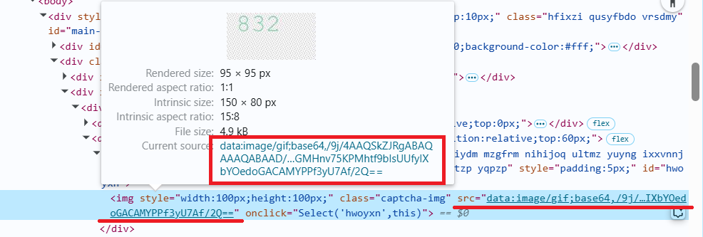

import Tabs from '@theme/Tabs';
import TabItem from '@theme/TabItem';
import ParamItem from '@theme/ParamItem';
import MethodItem from '@theme/MethodItem';
import MethodDescription from '@theme/MethodDescription';
import PriceBlock from '../../../../../src/theme/PriceBlock';
import PriceBlockWrap from '@theme/PriceBlockWrap';
import TaskImageWrapper from '@theme/TaskImageWrapper';
import TaskImageBlock from '@theme/TaskImageBlock';
import TaskImage from '@theme/TaskImage';
import { TaskImageText } from '../../../../../src/theme/TaskImageText';
import BlogLink from '@theme/BlogLink';

# ComplexImageTask Recognition

<TaskImageWrapper>
  <TaskImageBlock link="/zh/docs/captchas/ComplexImageTask-Recognition#oocl_rotate_new">
    <TaskImage></TaskImage>
    <TaskImageText title="Oocl_rotate_new" captchaId="complex-rec_oocl_rotate_new" />
  </TaskImageBlock>

  <TaskImageBlock link="/zh/docs/captchas/ComplexImageTask-Recognition#oocl_rotate_double_new">
    <TaskImage></TaskImage>
    <TaskImageText title="Oocl_rotate_double_new" captchaId="complex-rec_oocl_rotate_double_new" />
  </TaskImageBlock>

  <TaskImageBlock link="/zh/docs/captchas/ComplexImageTask-Recognition#betpunch_3x3_rotate">
    <TaskImage></TaskImage>
    <TaskImageText title="Betpunch_3x3_rotate request" captchaId="complex-rec_betpunch_3x3_rotate_request" />
  </TaskImageBlock>

  <TaskImageBlock link="/zh/docs/captchas/ComplexImageTask-Recognition#bls">
    <TaskImage></TaskImage>
    <TaskImageText  captchaId="complex-rec_bls" />
  </TaskImageBlock>

  <TaskImageBlock link="/docs/captchas/ComplexImageTask-Recognition#shein">
    <TaskImage></TaskImage>
    <TaskImageText title="shein" captchaId="complex-rec_oocl_rotate_new" />
  </TaskImageBlock>

  <TaskImageBlock link="/docs/captchas/ComplexImageTask-Recognition#baidu">
    <TaskImage></TaskImage>
    <TaskImageText title="baidu" captchaId="complex-rec_baidu" />
  </TaskImageBlock>

  <TaskImageBlock link="/docs/captchas/ComplexImageTask-Recognition#bills_audio">
    <TaskImage></TaskImage>
    <TaskImageText title="bills_audio" captchaId="complex-rec_bills_audio" />
  </TaskImageBlock>
</TaskImageWrapper>

## 请求参数

<TabItem value="proxyless" label="ComplexImageTask (without proxy)" default className="bordered-panel">
    <ParamItem title="type" required type="string" />
    **ComplexImageTask**

    ---

    <ParamItem title="class" required type="string" />
    **recognition**

    ---

    <ParamItem title="imagesBase64" required type="array" />
    仅图像的Base64编码
    示例: [ “/9j/4AAQSkZJRgABAQEAAAAAAAD…”]

    ---

    <ParamItem title="Task（在 metadata 中）" required type="string" />
    可能的值：`oocl_rotate_new` 等。
    任务名称（<u>英文</u>）。

</TabItem>

## oocl_rotate_new

### 创建任务`oocl_rotate_new`

<PriceBlockWrap>
  <PriceBlock title="ComplexImageTask" captchaId="complex-rec_oocl_rotate_new" />
</PriceBlockWrap>

<TabItem value="proxyless" label="RecaptchaV2TaskProxyless (without proxy)" default className="method-panel">
	<MethodItem>
		```http
		https://api.capmonster.cloud/createTask
		```
	</MethodItem>
	<MethodDescription>
		**要求**
		```json
		{
			"clientKey": "API_KEY",
			"task": {
				"type": "ComplexImageTask",
				"class": "recognition",
				"imagesBase64": [
					"{background_base64}",
					"{circle_base64}"
				],
				"metadata": {
					"Task": "oocl_rotate_new"
				}
			}
		}
		```

    	背景图像 (*background_base64*):

    	

    	圆形图像 (*circle_base64*):

    	

    	**回应**
    	```json
    	{
    	  "errorId":0,
    	  "taskId":407533072
    	}
    	```
    </MethodDescription>

</TabItem>

### 获取任务结果`oocl_rotate_new`

<TabItem value="proxyless" label="GeeTestTaskProxyless (without proxy)" default className="method-panel-full">
	<MethodItem>
		```http
		https://api.capmonster.cloud/getTaskResult
		```
	</MethodItem>
	<MethodDescription>
		**要求**
		```json
		{
		  "clientKey":"API_KEY",
		  "taskId": 407533072
		}
		```
		**回应**
		圆形需要顺时针旋转的度数。
		```json
		{
		  "errorId":0,
		  "status":"ready",
		  "errorCode":null,
		  "errorDescription":null,
		  "solution": 
		  {
			  "answer":[130.90909],
			  "metadata":{"AnswerType":"NumericArray"}
		  }		   
		}
		```
	</MethodDescription>
</TabItem>

## oocl_rotate_double_new

### 创建任务`oocl_rotate_double_new`

<PriceBlockWrap>
  <PriceBlock title="ComplexImageTask" captchaId="complex-rec_oocl_rotate_double_new" />
</PriceBlockWrap>

在请求中我们传递三张图片：背景、环形和圆形。

<TabItem value="proxyless" label="ComplexImageTask (без прокси)" default className="method-panel">
	<MethodItem>
		```http
		https://api.capmonster.cloud/createTask
		```
	</MethodItem>
	<MethodDescription>
		**要求**
		```json
		{ 
			"clientKey": "API_KEY",
			"task": {
				"type": "ComplexImageTask",
				"class": "recognition",
				"imagesBase64": [
					"{background_base64}",
					"{ring_base64}",
					"{circle_base64}"
				],
				"metadata": {
					"Task": "oocl_rotate_double_new"
				}
			}
		}
		```

    	背景图像 (*background_base64*):

    	

    	环形图像 (*ring_base64*):

    	

    	圆形图像 (*circle_base64*):

    	

    	**回应**
    	```json
    	{
    	  "errorId":0,
    	  "taskId":407533072
    	}
    	```
    </MethodDescription>

</TabItem>

### 获取任务结果`oocl_rotate_double_new`

<TabItem value="proxyless" label="ComplexImageTask (without proxy)" default className="method-panel-full">
	<MethodItem>
		```http
		https://api.capmonster.cloud/getTaskResult
		```
	</MethodItem>
	<MethodDescription>
		**要求**
		```json
		{
		  "clientKey":"API_KEY",
		  "taskId": 407533072
		}
		```
		**回应**
		环形需要逆时针旋转的度数，圆形需要顺时针旋转的度数。
		```json
		{
		  "errorId":0,
		  "status":"ready",
		  "errorCode":null,
		  "errorDescription":null,
		  "solution": 
		  {
			  "answer":[130.90909],
			  "metadata":{"AnswerType":"NumericArray"}
		  }		   
		}
		```
	</MethodDescription>
</TabItem>

## betpunch_3x3_rotate

### 创建任务`betpunch_3x3_rotate`

<PriceBlockWrap>
  <PriceBlock title="ComplexImageTask" captchaId="complex-rec_betpunch_3x3_rotate_request" />
</PriceBlockWrap>

在请求中我们传递九张图片。图片必须按以下顺序传递：


<TabItem value="proxyless" label="ComplexImageTask (без прокси)" default className="method-panel">
	<MethodItem>
		```http
		https://api.capmonster.cloud/createTask
		```
	</MethodItem>
	<MethodDescription>
		**要求**
		```json
		{ 
			"clientKey": "API_KEY",
			"task": {
				"type": "ComplexImageTask",
				"class": "recognition",
				"imagesBase64": [
					"{image_1_Base64}",
					"{image_2_Base64}",
					"{image_3_Base64}",
					"{image_4_Base64}",
					"{image_5_Base64}",
					"{image_6_Base64}",
					"{image_7_Base64}",
					"{image_8_Base64}",
					"{image_9_Base64}",
				],
				"metadata": {
					"Task": "betpunch_3x3_rotate"
				}
			}
		}
		```

    	**回应**
    	```json
    	{
    	  "errorId":0,
    	  "taskId":407533072
    	}
    	```
    </MethodDescription>

</TabItem>

### 获取任务结果`betpunch_3x3_rotate`

<TabItem value="proxyless" label="ComplexImageTask (without proxy)" default className="method-panel-full">
	<MethodItem>
		```http
		https://api.capmonster.cloud/getTaskResult
		```
	</MethodItem>
	<MethodDescription>
		**要求**
		```json
		{
		  "clientKey":"API_KEY",
		  "taskId": 407533072
		}
		```
		**回应**
		"answer":[X,X,X,X,X,X,X,X,X], 其中 X 是每张图片的整数值，范围为 1 到 4。4 表示图像不需要旋转；1-3 表示图像逆时针旋转的次数。
		```json
		{
			"errorId":0,
			"status":"ready",
			"errorCode":null,
			"errorDescription":null,
			"solution":
			{
				"answer":[4,4,4,4,4,3,1,2,2],
				"metadata":{"AnswerType":"NumericArray"}
			}
		}
		```
	</MethodDescription>
</TabItem>

## bls

### 创建任务 `bls`

<PriceBlockWrap>
  <PriceBlock title="Bls" captchaId="complex-rec_bls" />
</PriceBlockWrap>

在请求中，我们发送9张以base64格式编码的图片。
我们还在 metadata 中传递所需的值TaskArgument。

<BlogLink url="https://capmonster.cloud/zh/blog/news/bls-solve-extension" />

<TabItem value="proxyless" label="ComplexImageTask (without proxy)" default className="method-panel">
	<MethodItem>
		```http
		https://api.capmonster.cloud/createTask
		```
	</MethodItem>
	<MethodDescription>
		**要求**
		```json
		{
			"clientKey":{{API_key}},
			"task": 
			{
				"type": "ComplexImageTask",
				"class": "recognition",
				"imagesBase64": [
					"image1_to_base64",
					"image2_to_base64",
					"image3_to_base64",
					"image4_to_base64",
					"image5_to_base64",
					"image6_to_base64",
					"image7_to_base64",
					"image8_to_base64",
					"image9_to_base64"
				],
				"metadata": {
					"Task": "bls_3x3",
					"TaskArgument": "123"
				}
			}
		}
		```

    	示例任务：

    	

    	发送转换为base64的图片：

    	
    	
    	
    	
    	
    	
    	
    	
    	

    	对于此示例： "TaskArgument": "546"

    	**回应**
    	```json
    	{
    	  "errorId":0,
    	  "taskId":143998457
    	}
    	```
    </MethodDescription>

</TabItem>

### 获取任务结果 `bls`

<TabItem value="proxyless" label="ComplexImageTask (without proxy)" default className="method-panel-full">
	<MethodItem>
		```http
		https://api.capmonster.cloud/getTaskResult
		```
	</MethodItem>
	<MethodDescription>
		**要求**
		```json
		{
		  "clientKey":"API_KEY",
		  "taskId": 143998457
		}
		```
		**回应**
		一个值的数组，元素为 true 或 false，取决于图片中的数字是否为所需的参数。 
		```json
		{
		  "errorId":0,
		  "status":"ready",
		  "errorCode":null,
		  "errorDescription":null,
		  "solution": 
		  {
			"answer":[true,true,false,false,true,false,false,true,true],
			"metadata":{"AnswerType":"Grid"}
		  }
		}
		```
	</MethodDescription>
</TabItem>

## shein

### 创建任务 `shein`

<PriceBlockWrap>
  <PriceBlock title="shein" captchaId="complex-rec_oocl_rotate_new" />
</PriceBlockWrap>

在请求中，我们传递一张 base64 格式的图片。

<TabItem value="proxyless" label="ComplexImageTask (without proxy)" default className="method-panel">
	<MethodItem>
		```http
		https://api.capmonster.cloud/createTask
		```
	</MethodItem>
	<MethodDescription>
		**要求**
		```json
{
		    "clientKey": "API_KEY",
		    "task": {
			"type": "ComplexImageTask",
			"class": "recognition",
			"imagesBase64": [
			   "base64"
			],
			"metadata": {
			    "Task": "shein"
		        }
	        }
}
		```

    	示例任务：

    	
    	

    	**回应**
    	```json
    	{
    	  "errorId":0,
    	  "taskId":143998457
    	}
    	```
    </MethodDescription>

</TabItem>

### 获取任务结果 `shein`

<TabItem value="proxyless" label="ComplexImageTask (without proxy)" default className="method-panel-full">
	<MethodItem>
		```http
		https://api.capmonster.cloud/getTaskResult
		```
	</MethodItem>
	<MethodDescription>
		**要求**
		```json
		{
		  "clientKey":"API_KEY",
		  "taskId": 143998457
		}
		```
		**回应**
		按特定顺序点击的坐标。
		```json
{
    "solution":
	{
	    "answer":[{"X":68.99999964,"Y":201.954889},{"X":127.99999783999999,"Y":281.54887104},{"X":181.00000776,"Y":49.894734680000006}],
		"metadata":{"AnswerType":"Coordinate"}
	},
		"cost":0.0003,
		"status":"ready",
		"errorId":0,
		"errorCode":null,
		"errorDescription":null
}
		```
	</MethodDescription>
</TabItem>

## baidu

### 创建任务 `baidu`

<PriceBlockWrap>
  <PriceBlock title="baidu" captchaId="complex-rec_baidu" />
</PriceBlockWrap>

:::warning 注意！
在解决流程开始时，可能会暂时出现 unsolvable 的结果。
这不是错误 —— 验证码将在初始化完成后继续成功解决。
:::

在请求中，我们传递一张 base64 格式的图片。

<TabItem value="proxyless" label="ComplexImageTask (without proxy)" default className="method-panel">
	<MethodItem>
		```http
		https://api.capmonster.cloud/createTask
		```
	</MethodItem>
	<MethodDescription>
		**要求**
		```json
		{
			"clientKey": "API_KEY",
			"task": 
			{
				"type": "ComplexImageTask",
				"class": "recognition",
				"imagesBase64": ["base64"],
				"metadata": {
					"Task": "baidu"
				}
			}
		}
		```

    	示例任务：

    	

    	**回应**
    	```json
    	{
    		"errorId":0,
    		"taskId":143998457
    	}
    	```
    </MethodDescription>

</TabItem>

### 获取任务结果 `baidu`

<TabItem value="proxyless" label="ComplexImageTask (without proxy)" default className="method-panel-full">
	<MethodItem>
		```http
		https://api.capmonster.cloud/getTaskResult
		```
	</MethodItem>
	<MethodDescription>
		**要求**
		```json
		{
			"clientKey":"API_KEY",
			"taskId": 143998457
		}
		```
		**回应**
		顺时针旋转图像所需的角度。
		```json
		{
			"solution":
			{
				"answer":[297],
				"metadata":{"AnswerType":"NumericArray"}
			},
			"cost":0.0005,
			"status":"ready",
			"errorId":0,
			"errorCode":null,
			"errorDescription":null
		}
		```
	</MethodDescription>
</TabItem>

---

## bills_audio

### 创建任务 `bills_audio`

<PriceBlockWrap>
  <PriceBlock title="bills_audio" captchaId="complex-rec_bills_audio" />
</PriceBlockWrap>

音频验证码 `bills_audio` 是“收据验证码”的声音版本，其中生成的图像或数据模拟收据，例如包含数字、金额和日期。在此类任务中，用户需要听音频文件，并根据听到的信息确认输入的正确性。该格式示例如下：

 

<TabItem value="proxyless" label="ComplexImageTask（无代理）" default className="method-panel">
    <MethodItem>
    ```http
    https://api.capmonster.cloud/createTask
    ```
    </MethodItem>
    <MethodDescription>
    **请求**
    ```json
    {
        "clientKey": "API_KEY",
        "task": {
            "type": "ComplexImageTask",
            "class": "recognition",
            "imagesBase64": [
                "UklGRnjuAwBXQVZFZm10...f/2f/9/6z/vf8MAAAA"
            ],
            "metadata": {
                "Task": "bills_audio",
                "PayloadType": "Audio"
            }
        }
    }
    ```

    **响应**
    ```json
    {
        "errorId": 0,
        "taskId": 143998457
    }
    ```
    </MethodDescription>
</TabItem>

### 获取任务结果 `bills_audio`

<TabItem value="proxyless" label="ComplexImageTask（无代理）" default className="method-panel-full">
    <MethodItem>
    ```http
    https://api.capmonster.cloud/getTaskResult
    ```
    </MethodItem>
    <MethodDescription>
    **请求**
    ```json
    {
        "clientKey": "API_KEY",
        "taskId": 143998457
    }
    ```
    **响应**  
    响应中返回音频中的数字。
    ```json
    {
        "solution": {
            "answer": [6, 8, 4, 1, 2, 3],
            "metadata": {"AnswerType": "Text"}
        },
        "cost": 0.0008,
        "status": "ready",
        "errorId": 0,
        "errorCode": null,
        "errorDescription": null
    }
    ```
    </MethodDescription>
</TabItem>

### 如何从页面获取音频文件并转换为 Base64 格式

1. 打开验证码页面并启动 **开发者工具（DevTools）**，然后切换到 **Network** 标签。  
2. 点击相应按钮启用验证码的音频模式。  
3. 在请求列表中找到类似以下格式的 URL：  
   `blob:https://example.com/3be79ac6-1b3d-43ef-9a8a-7ad8877b3606`  
4. 复制该 URL 并在浏览器地址栏打开 — 音频验证码文件将以 **.wav** 格式显示。


5. 保存文件，并将 **.wav** 转换为 **Base64**，可使用你方便的方法，例如 Node.js 代码：
```JavaScript
const fs = require("fs");

// 源 .wav 文件路径
const filePath = "C:\\Users\\User\\Downloads\\file-acbe-4fb3-9f8e-f989ba6c7fde.wav";

const fileBuffer = fs.readFileSync(filePath);

// 转换为 Base64
const base64 = fileBuffer.toString("base64");

// 将 Base64 字符串保存到文本文件
fs.writeFileSync("output.txt", base64);

console.log("文件已成功转换为 Base64，并保存为 output.txt");
```

6. 在 CapMonster Cloud 的任务请求中使用生成的 Base64 字符串。

---


## 如何获取 Base64

网页上的图片可以以URL或Base64编码格式直接呈现。要找到所需的值，右键点击图片，选择 **检查**，仔细查看 **元素** 部分或网络请求网格——在那里可以找到URL或编码内容。

### 手动方式

1. 请在浏览器中访问您的网站，该网站包含验证码功能。
2. 右键点击验证码元素，选择 **检查（Inspect）**。



### 自动方法

一种方便的自动化获取所有必要参数的方式。
某些参数每次页面加载时都会重新生成，因此需要通过浏览器（普通或无头模式，如使用**Playwright**）提取它们。
由于动态参数值的有效期很短，获取后必须立即解决验证码。

:::warning **重要提示！**
提供的代码片段是用于熟悉参数提取的基本示例。具体实现将取决于验证码页面、其结构及使用的HTML元素/选择器。
:::

<Tabs className="full-width-tabs filled-tabs request-tabs">

  <TabItem value="js" label="JavaScript" default className="method-panel">
    <details>
      <summary>显示代码 (Node.js)</summary>

      ```js
      import { chromium } from 'playwright';

      // 从src中提取base64的函数
      async function getBase64FromSrc(elementHandle) {
        const src = await elementHandle.getAttribute('src');
        if (src && src.startsWith('data:image')) {
          return src.split(',')[1];
        }
        return null;
      }

      // 使用截图获取base64的函数（如果src不是base64格式）
      async function elementToBase64(elementHandle) {
        const base64 = await getBase64FromSrc(elementHandle);
        if (base64) {
          return base64; // 如果图片已经是base64格式，直接返回
        }
        const buffer = await elementHandle.screenshot();
        return buffer.toString('base64');
      }

      // 将元素数组转换为base64字符串数组的函数
      async function multipleElementsToBase64(elements) {
        const base64Array = [];
        for (const el of elements) {
          const base64 = await elementToBase64(el);
          base64Array.push(base64);
        }
        return base64Array;
      }

      // -------------------------------------------------------------
      // 为不同类型的验证码准备base64
      // -------------------------------------------------------------

      // 1. oocl_rotate_new (背景 + 圆圈)
      async function prepareOoclRotateNew(page) {
        const background = await page.$('img.background');
        const circle = await page.$('img.circle');

        const backgroundBase64 = await elementToBase64(background);
        const circleBase64 = await elementToBase64(circle);

        return { backgroundBase64, circleBase64 };
      }

      // 2. oocl_rotate_double_new (背景 + 圆环 + 圆圈)
      async function prepareOoclRotateDoubleNew(page) {
        const background = await page.$('img.background');
        const ring = await page.$('img.ring');
        const circle = await page.$('img.circle');

        const backgroundBase64 = await elementToBase64(background);
        const ringBase64 = await elementToBase64(ring);
        const circleBase64 = await elementToBase64(circle);

        return { backgroundBase64, ringBase64, circleBase64 };
      }

      // 3. betpunch_3x3_rotate (9张小图片)
      async function prepareBetpunch3x3(page) {
        const sectors = await page.$$('img.sector');

        const sectorsBase64 = await multipleElementsToBase64(sectors);

        return { sectorsBase64 };
      }

      // 4. bls (9张小图片用于点击)
      async function prepareBls(page) {
        const sectors = await page.$$('img.sector');

        const sectorsBase64 = await multipleElementsToBase64(sectors);

        return { sectorsBase64 };
      }

      // 5. shein (1张大图片)
      async function prepareShein(page) {
        const captchaImage = await page.$('img.captcha');

        const captchaBase64 = await elementToBase64(captchaImage);

        return { captchaBase64 };
      }

      // Playwright示例
      async function run() {
        const browser = await chromium.launch();
        const page = await browser.newPage();
        await page.goto('https://example.com'); // 替换为实际URL

        // 获取oocl_rotate_new的base64示例
        const { backgroundBase64, circleBase64 } = await prepareOoclRotateNew(page);
        console.log('Base64背景:', backgroundBase64);
        console.log('Base64圆圈:', circleBase64);

        await browser.close();
      }

      run();
      ```
    </details>
  </TabItem>

  <TabItem value="python" label="Python" className="method-panel">
    <details>
      <summary>显示代码</summary>

      ```python
      import base64
      import asyncio
      from playwright.async_api import async_playwright

      # 从src中提取base64的函数
      async def get_base64_from_src(element_handle):
          src = await element_handle.get_attribute("src")
          if src and src.startswith("data:image"):
              return src.split(",")[1]
          return None

      # 使用截图获取base64的函数（如果src不是base64格式）
      async def element_to_base64(element_handle):
          base64_str = await get_base64_from_src(element_handle)
          if base64_str:
              return base64_str  # 如果图片已经是base64格式，直接返回
          screenshot = await element_handle.screenshot()
          return base64.b64encode(screenshot).decode("utf-8")

      # 将元素数组转换为base64字符串数组的函数
      async def multiple_elements_to_base64(elements):
          base64_list = []
          for el in elements:
              base64_str = await element_to_base64(el)
              base64_list.append(base64_str)
          return base64_list

      # -------------------------------------------------------------
      # 为不同类型的验证码准备base64
      # -------------------------------------------------------------

      # 1. oocl_rotate_new (背景 + 圆圈)
      async def prepare_oocl_rotate_new(page):
          background = await page.query_selector("img.background")
          circle = await page.query_selector("img.circle")

          background_base64 = await element_to_base64(background)
          circle_base64 = await element_to_base64(circle)

          return {"backgroundBase64": background_base64, "circleBase64": circle_base64}

      # 2. oocl_rotate_double_new (背景 + 圆环 + 圆圈)
      async def prepare_oocl_rotate_double_new(page):
          background = await page.query_selector("img.background")
          ring = await page.query_selector("img.ring")
          circle = await page.query_selector("img.circle")

          background_base64 = await element_to_base64(background)
          ring_base64 = await element_to_base64(ring)
          circle_base64 = await element_to_base64(circle)

          return {"backgroundBase64": background_base64, "ringBase64": ring_base64, "circleBase64": circle_base64}

      # 3. betpunch_3x3_rotate (9张小图片)
      async def prepare_betpunch3x3(page):
          sectors = await page.query_selector_all("img.sector")
          sectors_base64 = await multiple_elements_to_base64(sectors)

          return {"sectorsBase64": sectors_base64}

      # 4. bls (9张小图片用于点击)
      async def prepare_bls(page):
          sectors = await page.query_selector_all("img.sector")
          sectors_base64 = await multiple_elements_to_base64(sectors)

          return {"sectorsBase64": sectors_base64}

      # 5. shein (1张大图片)
      async def prepare_shein(page):
          captcha_image = await page.query_selector("img.captcha")
          captcha_base64 = await element_to_base64(captcha_image)

          return {"captchaBase64": captcha_base64}

      # Playwright示例
      async def run():
          async with async_playwright() as p:
              browser = await p.chromium.launch()
              page = await browser.new_page()
              await page.goto("https://example.com")

              # 获取oocl_rotate_new的base64示例
              result = await prepare_oocl_rotate_new(page)
              print(result)

              await browser.close()

      if __name__ == "__main__":
          asyncio.run(run())
      ```
    </details>
  </TabItem>

  <TabItem value="csharp" label="C#" className="method-panel">
    <details>
      <summary>显示代码</summary>

      ```csharp
      using System;
      using System.Collections.Generic;
      using System.Threading.Tasks;
      using Microsoft.Playwright;

      class Program
      {
          // 从src中提取base64的函数
          private static async Task<string?> GetBase64FromSrcAsync(IElementHandle elementHandle)
          {
              var src = await elementHandle.GetAttributeAsync("src");
              if (!string.IsNullOrEmpty(src) && src.StartsWith("data:image"))
              {
                  return src.Split(',')[1];
              }
              return null;
          }

          // 使用截图获取base64的函数（如果src不是base64格式）
          private static async Task<string> ElementToBase64Async(IElementHandle elementHandle)
          {
              var base64Str = await GetBase64FromSrcAsync(elementHandle);
              if (base64Str != null)
              {
                  return base64Str; // 如果图片已经是base64格式，直接返回
              }

              var screenshot = await elementHandle.ScreenshotAsync();
              return Convert.ToBase64String(screenshot);
          }

          // 将元素数组转换为base64字符串数组的函数
          private static async Task<List<string>> MultipleElementsToBase64Async(IEnumerable<IElementHandle> elements)
          {
              var base64List = new List<string>();
              foreach (var el in elements)
              {
                  var base64Str = await ElementToBase64Async(el);
                  base64List.Add(base64Str);
              }
              return base64List;
          }

          // -------------------------------------------------------------
          // 为不同类型的验证码准备base64
          // -------------------------------------------------------------

          // 1. oocl_rotate_new (背景 + 圆圈)
          private static async Task<Dictionary<string, string>> PrepareOoclRotateNewAsync(IPage page)
          {
              var background = await page.QuerySelectorAsync("img.background");
              var circle = await page.QuerySelectorAsync("img.circle");

              var backgroundBase64 = await ElementToBase64Async(background);
              var circleBase64 = await ElementToBase64Async(circle);

              return new Dictionary<string, string>
              {
                  ["backgroundBase64"] = backgroundBase64,
                  ["circleBase64"] = circleBase64
              };
          }

          // 2. oocl_rotate_double_new (背景 + 圆环 + 圆圈)
          private static async Task<Dictionary<string, string>> PrepareOoclRotateDoubleNewAsync(IPage page)
          {
              var background = await page.QuerySelectorAsync("img.background");
              var ring = await page.QuerySelectorAsync("img.ring");
              var circle = await page.QuerySelectorAsync("img.circle");

              var backgroundBase64 = await ElementToBase64Async(background);
              var ringBase64 = await ElementToBase64Async(ring);
              var circleBase64 = await ElementToBase64Async(circle);

              return new Dictionary<string, string>
              {
                  ["backgroundBase64"] = backgroundBase64,
                  ["ringBase64"] = ringBase64,
                  ["circleBase64"] = circleBase64
              };
          }

          // 3. betpunch_3x3_rotate (9张小图片)
          private static async Task<Dictionary<string, List<string>>> PrepareBetpunch3x3Async(IPage page)
          {
              var sectors = await page.QuerySelectorAllAsync("img.sector");
              var sectorsBase64 = await MultipleElementsToBase64Async(sectors);

              return new Dictionary<string, List<string>>
              {
                  ["sectorsBase64"] = sectorsBase64
              };
          }

          // 4. bls (9张小图片用于点击)
          private static async Task<Dictionary<string, List<string>>> PrepareBlsAsync(IPage page)
          {
              var sectors = await page.QuerySelectorAllAsync("img.sector");
              var sectorsBase64 = await MultipleElementsToBase64Async(sectors);

              return new Dictionary<string, List<string>>
              {
                  ["sectorsBase64"] = sectorsBase64
              };
          }

          // 5. shein (1张大图片)
          private static async Task<Dictionary<string, string>> PrepareSheinAsync(IPage page)
          {
              var captchaImage = await page.QuerySelectorAsync("img.captcha");
              var captchaBase64 = await ElementToBase64Async(captchaImage);

              return new Dictionary<string, string>
              {
                  ["captchaBase64"] = captchaBase64
              };
          }

          public static async Task Main()
          {
              using var playwright = await Playwright.CreateAsync();
              var browser = await playwright.Chromium.LaunchAsync();
              var page = await browser.NewPageAsync();
              await page.GotoAsync("https://example.com");

              var result = await PrepareOoclRotateNewAsync(page);
              Console.WriteLine($"Background base64 length: {result["backgroundBase64"].Length}");
              Console.WriteLine($"Circle base64 length: {result["circleBase64"].Length}");

              await browser.CloseAsync();
          }
      }
      ```
    </details>
  </TabItem>

</Tabs>

<details>
        <summary>在Node.js中搜索oocl参数的示例</summary>

```js
import { chromium } from "playwright";

// 代理（可选）
// const proxyHost = "";
// const proxyUsername = "";
// const proxyPassword = "";

async function getBase64FromSrc(elementHandle) {
  const src = await elementHandle.getAttribute("src");
  if (src && src.startsWith("data:image")) {
    return src.split(",")[1];
  }
  return null;
}

async function elementToBase64(elementHandle) {
  const base64 = await getBase64FromSrc(elementHandle);
  if (base64) {
    return base64;
  }
  const buffer = await elementHandle.screenshot();
  return buffer.toString("base64");
}

async function extractVerifyImagesBase64(page) {
  const imgSelectors = [".verify-img-panel img", ".verify-sub-block img"];

  const imageHandles = (
    await Promise.all(imgSelectors.map((selector) => page.$$(selector)))
  ).flat();

  if (imageHandles.length === 0) {
    throw new Error(
      "在verify-img-panel或verify-sub-block中未找到图片。"
    );
  }

  const imagesBase64 = [];
  for (const handle of imageHandles) {
    const base64 = await elementToBase64(handle);
    imagesBase64.push({
      src: await handle.getAttribute("src"),
      base64,
    });
  }

  return imagesBase64;
}

async function run() {
  const browser = await chromium.launch({
    headless: false,
    // proxy: {
    //   server: `http://${proxyHost}`,
    //   username: proxyUsername,
    //   password: proxyPassword,
    // },
  });

  const page = await browser.newPage();
  await page.goto(
    "https://example.com/registration/form?appurl=https://example.com"
  );

  try {
    const images = await extractVerifyImagesBase64(page);
    for (const { src, base64 } of images) {
      console.log("来源:", src);
      console.log("Base64:", base64);
    }
  } catch (err) {
    console.error(err.message);
  }

  await browser.close();
}

run();
```
</details>

## 使用 SDK 库

<Tabs className="full-width-tabs filled-tabs request-tabs" groupId="captcha-type">

  <TabItem value="js" label="JavaScript" default className="method-panel">

```js
// https://github.com/ZennoLab/capmonstercloud-client-js

import { CapMonsterCloudClientFactory, ClientOptions, ComplexImageTaskRecognitionRequest } from '@zennolab_com/capmonstercloud-client';

document.addEventListener('DOMContentLoaded', async () => {
  const cmcClient = CapMonsterCloudClientFactory.Create(
    new ClientOptions({ clientKey: '<你的 capmonster.cloud API key>' })
  );
  console.log(await cmcClient.getBalance());

  const citRecognitionRequest = new ComplexImageTaskRecognitionRequest({
    imagesBase64: ['/9xwee/'], // 图像的 base64 格式
    metaData: { Task: 'oocl_rotate' },
  });

  console.log(await cmcClient.Solve(citRecognitionRequest));
});
````

  </TabItem>

  <TabItem value="python" label="Python" className="method-panel">

```python
# https://github.com/ZennoLab/capmonstercloud-client-python

import asyncio
from capmonstercloudclient import CapMonsterClient, ClientOptions
from capmonstercloudclient.requests import RecognitionComplexImageTaskRequest

# 你的 CapMonster Cloud API key
client_options = ClientOptions(api_key="your_api_key")
cap_monster_client = CapMonsterClient(options=client_options)

complexImage_request = RecognitionComplexImageTaskRequest(
    imagesBase64=[
        "/9xwee/"  # 图像的 base64 格式
    ],
    metadata={"Task": "oocl_rotate"}
)

async def solve_captcha():
    solution = await cap_monster_client.solve_captcha(complexImage_request)
    return solution

responses = asyncio.run(solve_captcha())
print(responses)
```

  <BlogLink url="https://capmonster.cloud/ru/blog/re-1/python-recaptcha-v2"/>
  </TabItem>

  <TabItem value="csharp" label="C#" className="method-panel">

```csharp
// https://github.com/ZennoLab/capmonstercloud-client-dotnet

using Zennolab.CapMonsterCloud.Requests;
using Zennolab.CapMonsterCloud;

class Program
{
    static async Task MainComplexImageTaskRecognition(string[] args)
    {
        var clientOptions = new ClientOptions
        {
            ClientKey = "your_api_key" // 你的 CapMonster Cloud API key 
        };

        var cmCloudClient = CapMonsterCloudClientFactory.Create(clientOptions);

        var recognitionCITRequest = new RecognitionComplexImageTaskRequest
        {
            ImagesBase64 = new List<string>
            {
                "/9j/4AAQSkZJRgABAQEAAAAAAAD…" // 图像的 base64 格式
            },
            Metadata = new RecognitionComplexImageTaskRequest.RecognitionMetadata
            {
                Task = "oocl_rotate_new"
            }
        };

        var recognitionCITResult = await cmCloudClient.SolveAsync(recognitionCITRequest);

        if(recognitionCITResult.Solution.Answer.IsGrid)
            Console.WriteLine("验证码解决方案: " + recognitionCITResult.Solution.Answer.GridAnswer);
        else if (recognitionCITResult.Solution.Answer.IsNumeric)
            Console.WriteLine("验证码解决方案: " + recognitionCITResult.Solution.Answer.NumericAnswer);
    }
}
```

  </TabItem>

</Tabs>

