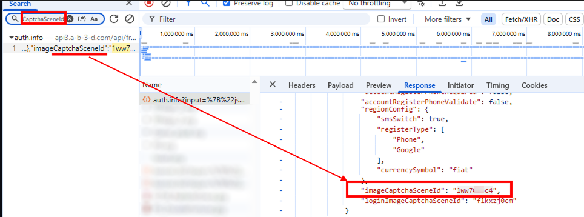

import Tabs from '@theme/Tabs';
import TabItem from '@theme/TabItem';
import ParamItem from '@theme/ParamItem';
import MethodItem from '@theme/MethodItem';
import ImageWrap from '@theme/ImageWrap';
import ImagesLayout from '@theme/ImagesLayout';
import MethodDescription from '@theme/MethodDescription'
import PriceBlock from '@theme/PriceBlock';
import PriceBlockWrap from '@theme/PriceBlockWrap';
import { ArticleHead } from '../../../../../src/theme/ArticleHead';

<ArticleHead slug="captchas/alibaba-task" />

# Alibaba Cloud Captcha

<PriceBlockWrap>
  <PriceBlock title="Alibaba Captcha" captchaId="alibabacaptcha"/>
</PriceBlockWrap>

## 任务示例

以下是当前 CapMonster Cloud 服务支持的 Alibaba CAPTCHA 任务类型示例：

<ImagesLayout gap="16px" columns={3}>
  <ImageWrap title="Puzzle CAPTCHA"></ImageWrap>
  <ImageWrap title="Image restoration CAPTCHA"></ImageWrap>
</ImagesLayout>

:::warning **注意！**
CapMonster Cloud 默认通过内置代理工作——这些代理已包含在费用内。仅当网站不接受令牌或对内置服务的访问受限时，才需要指定您自己的代理。

如果代理按 IP 授权，请将地址 **65.21.190.34** 加入白名单。
:::

## 请求参数

<TabItem value="proxy" label="CustomTask（使用代理）" className="bordered-panel">

  <ParamItem title="type" required type="string" />
  **CustomTask**

  ---

  <ParamItem title="class" required type="string" />
  **alibaba**

   --- 

  <ParamItem title="websiteURL" required type="string" />
  包含 CAPTCHA 的页面完整 URL。

  ---

  <ParamItem title="sceneId（在 metadata 中）" required type="string" />
  CAPTCHA 场景标识符，以如下格式传递：`"sceneId":"1ww7426c4"`（如何获取该参数值，请参见[对应章节](#sceneid)）

  ---
  <ParamItem title="prefix（在 metadata 中）" required type="string" />
  CAPTCHA 初始化参数，通过用于加载页面任务文本的请求 URL 传递。<br />
  例如，如果 URL 为：`https://dlw3kug.captcha-open.example.aliyuncs.com/`，则 `prefix` 参数的值对应子域名 —— `dlw3kug`。

  ---

  <ParamItem title="userAgent" type="string" />
  浏览器的 User-Agent。<br />
  **请仅传递最新的 Windows 系统 UA，目前推荐使用**：`userAgentPlaceholder`

  ---

    <ParamItem title="proxyType" type="string" />
  **http** - 普通 http/https 代理；<br />
  **https** - 如果 http 不工作，可以尝试此选项（部分自定义代理要求）；<br />
  **socks4** - socks4 代理；<br />
  **socks5** - socks5 代理。

  ---

  <ParamItem title="proxyAddress" type="string" />
  <p>
    代理的 IPv4 或 IPv6 地址。禁止以下情况：
    - 使用透明代理（即暴露真实客户端 IP）；
    - 使用本地代理地址。
  </p>

  ---

  <ParamItem title="proxyPort" type="integer" />
  代理端口。

  ---

  <ParamItem title="proxyLogin" type="string" />
  代理用户名。

  ---

  <ParamItem title="proxyPassword" type="string" />
  代理密码。

  ---
</TabItem>

## 创建任务的方法

<Tabs className="full-width-tabs filled-tabs request-tabs" groupId="captcha-type">
  <TabItem value="proxyless" label="CustomTask（无代理）" default className="method-panel">
    <MethodItem>
    ```http
    https://api.capmonster.cloud/createTask
    ```
    </MethodItem>
    <MethodDescription>
      
      **请求**
      ```json
      {
        "clientKey": "API_KEY",
        "task": {
          "type": "CustomTask",
          "class": "alibaba",
          "websiteURL": "https://www.example.com",
          "userAgent": "userAgentPlaceholder"
          "metadata": {
			"sceneId":"1ww7426c4",
			"prefix":"dlw3kug"
		}
	}
      ```

      **响应**
      ```json
      {
        "errorId": 0,
        "taskId": 407533077
      }
      ```
    </MethodDescription>
  </TabItem>

    <TabItem value="proxy" label="CustomTask（使用代理）" className="method-panel">
    <MethodItem>
      ```http
      https://api.capmonster.cloud/createTask
      ```
    </MethodItem>
    <MethodDescription>
      
      **请求**
      ```json
      {
        "clientKey": "API_KEY",
        "task": {
          "type": "CustomTask",
          "class": "alibaba",
          "websiteURL": "https://www.example.com",
          "userAgent": "userAgentPlaceholder"
          "metadata": {
			"sceneId":"1ww7426c4",
			"prefix":"dlw3kug",
          "proxyType": "http",
          "proxyAddress": "8.8.8.8",
          "proxyPort": 8080,
          "proxyLogin": "proxyLoginHere",
          "proxyPassword": "proxyPasswordHere"
        }
      }
      ```

      **响应**
      ```json
      {
        "errorId": 0,
        "taskId": 407533077
      }
      ```
    </MethodDescription>
  </TabItem>
</Tabs>

## 获取结果的方法

使用方法 [getTaskResult](../api/methods/get-task-result.mdx) 获取 Alibaba CAPTCHA 的解决结果。

<TabItem value="proxyless" label="CustomTask（无代理）" default className="method-panel-full">
  <MethodItem>
    ```http
    https://api.capmonster.cloud/getTaskResult
    ```
  </MethodItem>
  <MethodDescription>

  **请求**
  ```json
  {
    "clientKey": "API_KEY",
    "taskId": 407533077
  }
```

**响应**

```json
{
  "errorId": 0,
  "errorCode": null,
  "errorDescription": null,
  "status": "ready",
  "solution": {
    "data": {
      "tokens": "{\"sceneId\":\"1ww7426c4\",\"certifyId\":\"kBjCxX2W2c\",\"deviceToken\":\"U0dfV0VCIzM3...wOGJkMjY=\",\"data\":\"JRMnX3B...EUQdCpLkqSj7THYNf3dn\"}"
    }
  }
}
```

  </MethodDescription>
</TabItem>

## 如何获取创建任务所需的所有参数

## `sceneId`

`sceneId` 可以在成功完成一次 CAPTCHA 后获取：

1. 在网站上手动完成 CAPTCHA。
2. 打开 **DevTools** → **Network** 标签。
3. 找到验证成功后发送的请求（例如：verify、check、validate）。
4. 在 **Payload** 或 **Response** 中找到参数 `sceneId`。


该参数也可以通过在网络请求中搜索获取：

1. 打开包含 CAPTCHA 的页面，然后进入 **DevTools** → **Network** 标签。
3. 使用搜索（Ctrl + F）查找关键字 `sceneId` 或 `CaptchaSceneId`。




## `prefix`

`prefix` 可以从用于加载 CAPTCHA 任务文本的请求 URL 中获取：

1. 打开包含 CAPTCHA 的页面。
2. 找到与加载任务相关的请求（通常通过 **DevTools** → **Network**）。


