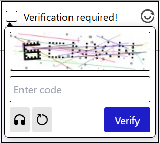
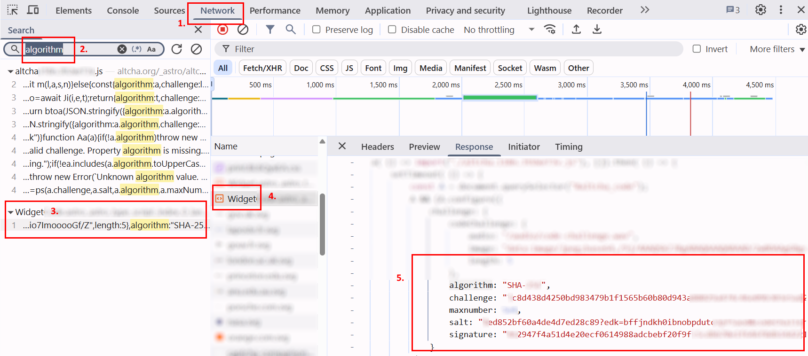

import Tabs from '@theme/Tabs';
import TabItem from '@theme/TabItem';
import ParamItem from '@theme/ParamItem';
import MethodItem from '@theme/MethodItem';
import MethodDescription from '@theme/MethodDescription'
import PriceBlock from '@theme/PriceBlock';
import PriceBlockWrap from '@theme/PriceBlockWrap';

# Altcha - Alternative CAPTCHA

<PriceBlockWrap>
  <PriceBlock title="altcha" captchaId="altcha"/>
</PriceBlockWrap>

## 任务示例

<Tabs className="full-width-tabs">
  <TabItem value="pow" label="PoW (工作量证明)" default>
    
  </TabItem>
  <TabItem value="code" label="Code Captcha">
    
  </TabItem>
</Tabs>

*还有一种 **隐形验证码** (**Invisible Captcha**)，在页面上没有可见界面，不需要用户操作 — 验证在后台自动完成。*

:::warning **注意！**
此任务中，CapMonster Cloud 默认使用内置代理，因此无需提供自己的代理（费用已包含在价格中）。  
仅当令牌在目标网站不可用或访问内置服务受限时，才需要指定自己的代理。您可以联系 [支持](https://helpdesk.zennolab.com/conversation/new) 获取详细信息，并确认令牌在特定网站上的有效性。
:::

## 请求参数

<TabItem value="proxyless" label="CustomTask（无代理）" default className="bordered-panel">
  
  <ParamItem title="type" required type="string" />
  **CustomTask**

  ---

  <ParamItem title="class" required type="string" />
  **altcha**

  ---

  <ParamItem title="websiteURL" required type="string" />
  Altcha 所在的主页面 URL。

  ---

  <ParamItem title="websiteKey" required type="string" />
  对于此任务，可以发送空字符串。

  ---

  <ParamItem title="challenge (metadata 内)" required="required" type="string" />
  从网站获取的任务唯一标识符。

  ---

  <ParamItem title="iterations (metadata 内)" required="required" type="string" />
  计算迭代次数或最大值。
  > **重要提示：** 参数 `iterations` 对应 `maxnumber` 的值！

  ---

  <ParamItem title="salt (metadata 内)" required="required" type="string" />
  从网站获取的 salt，用于生成哈希。

  ---

  <ParamItem title="signature (metadata 内)" required="required" type="string" />
  请求的数字签名。

  ---

  <ParamItem title="userAgent" type="string" />
  浏览器 User-Agent。<br />
  **请只传递 Windows 的有效 UA，目前为**: `userAgentPlaceholder`

  ---

  <ParamItem title="proxyType" type="string" />
  **http** - 常规 http/https 代理；<br />
  **https** - 仅当 "http" 无效时使用（某些自定义代理需要）；<br />
  **socks4** - socks4 代理；<br />
  **socks5** - socks5 代理。

  ---

  <ParamItem title="proxyAddress" type="string" />
  <p>
    代理 IPv4/IPv6 地址。禁止：
    - 使用主机名；
    - 使用透明代理（可看到客户端 IP）；
    - 使用本地机器代理。
  </p>

  ---

  <ParamItem title="proxyPort" type="integer" />
  代理端口。

  ---

  <ParamItem title="proxyLogin" type="string" />
  代理服务器登录名。

  ---

  <ParamItem title="proxyPassword" type="string" />
  代理服务器密码。

  ---
</TabItem>

## 创建任务方法
<Tabs className="full-width-tabs filled-tabs request-tabs" groupId="captcha-type">
  <TabItem value="proxyless" label="Altcha CustomTask（无代理）" default className="method-panel">
    <MethodItem>
      ```http
      https://api.capmonster.cloud/createTask
      ```
    </MethodItem>
    <MethodDescription>
      **请求**
      ```json
      {
        "clientKey": "API_KEY",
        "task": {
          "type": "CustomTask",
          "class": "altcha",
          "websiteURL": "https://example.com",
          "websiteKey": "",
          "userAgent": "userAgentPlaceholder",
          "metadata": {
            "challenge": "3dd28253be6cc0c54d95f7f98c517e68744597cc6e66109619d1ac975c39181c",
            "iterations": "5000",
            "salt": "bf356449d56c719fd904c58f",
            "signature": "4b1cf0e0be0f4e5247e50b0f9a449830f1fbca44c32ff94bc080146815f31a18"
          }
        }
      }
      ```
      **响应**
      ```json
      {
        "errorId": 0,
        "taskId": 407533072
      }
      ```
    </MethodDescription>
  </TabItem>

  <TabItem value="proxy" label="Altcha CustomTask（使用代理）" className="method-panel">
    <MethodItem>
      ```http
      https://api.capmonster.cloud/createTask
      ```
    </MethodItem>
    <MethodDescription>
      **请求**
      ```json
      {
        "clientKey": "API_KEY",
        "task": {
          "type": "CustomTask",
          "class": "altcha",
          "websiteURL": "https://example.com",
          "websiteKey": "",
          "userAgent": "userAgentPlaceholder",
          "metadata": {
            "challenge": "3dd28253be6cc0c54d95f7f98c517e68744597cc6e66109619d1ac975c39181c",
            "iterations": "5000",
            "salt": "bf356449d56c719fd904c58f",
            "signature": "4b1cf0e0be0f4e5247e50b0f9a449830f1fbca44c32ff94bc080146815f31a18"
          },
          "proxyType":"http",
          "proxyAddress":"8.8.8.8",
          "proxyPort":8080,
          "proxyLogin":"proxyLoginHere",
          "proxyPassword":"proxyPasswordHere"
        }
      }
      ```
      **响应**
      ```json
      {
        "errorId": 0,
        "taskId": 407533072
      }
      ```
    </MethodDescription>
  </TabItem>
</Tabs>

## 获取任务结果方法

使用 [getTaskResult](../api/methods/get-task-result.md) 方法获取 Altcha 解决方案。

<TabItem value="proxyless" label="Altcha CustomTask（无代理）" default className="method-panel-full">
  <MethodItem>
    ```http
    https://api.capmonster.cloud/getTaskResult
    ```
  </MethodItem>
  <MethodDescription>
    **请求**
    ```json
    {
      "clientKey": "API_KEY",
      "taskId": 407533072
    }
    ```
    **响应**
    ```json
    {
      "errorId": 0,
      "status": "ready",
      "solution": {
        "number": 4883
      }
    }
    ```
  </MethodDescription>
</TabItem>

## 如何获取创建任务所需的所有参数

以下示例展示了如何提取 Altcha 参数，以便在 CapMonster Cloud 中创建任务。请注意，不同网站的 captcha 实现可能不同，因此获取参数的方法也可能有所变化。

1. 在浏览器中打开 Altcha 页面，启动 **开发者工具**（**F12** 或 **Ctrl+Shift+I**），并切换到 **Network** 标签。

2. 点击验证码复选框并手动完成验证。在 **Network 搜索栏** 输入任意参数名称（例如 *"algorithm"*）。

3. 找到包含 JSON 参数的请求。

4. 点击请求，如有需要切换到 **Response** 查看服务器返回的数据。

5. 复制参数 — 这些值将用于创建 CapMonster Cloud 任务。



> 一般来说，在页面激活 captcha 后，需要分析网络请求并识别所有相关交互。这些步骤有助于确定参数并理解验证过程。例如，下图显示了名为 `altcha` 的请求，其中包含所有关键参数：


在获取所需参数后，需要将它们传入 `metadata` 对象中，以便在 CapMonster Cloud 创建任务时使用。示例结构：

```javascript
metadata: {
  challenge: "<challenge 值>", 
  iterations: "<maxnumber 值>", // 必须用引号括起来，与其他参数一致
  salt: "<salt 值>",             
  signature: "<signature 值>",  
}
```

您还可以使用以下代码示例提取所有参数：

<details>
<summary>GET 请求示例</summary>

对指定 URL 执行 HTTP GET 请求，并将响应输出到控制台。

```javascript
const url = 'https://example-portal.mysite.rs.gov.br/Altcha/Example'; // 用于提取验证码参数的 API 端点

fetch(url, { method: 'GET' })
  .then(res => res.text())
  .then(data => console.log('Response:', data))
  .catch(err => console.error(err));
````

</details>

<details>
<summary>参数拦截器</summary>

浏览器脚本，重写 `fetch` 和 `XMLHttpRequest`，以自动监控网络请求并提取关键 Altcha 验证码参数。将此脚本粘贴到验证码页面的浏览器控制台中并激活验证码 — 所需参数将自动输出到控制台。

```javascript
(function() {
  const keywords = ['algorithm','challenge','maxnumber','salt','signature'];
  const foundParams = {};

  const intercept = (url, body, text) => {
    keywords.forEach(key => {
      if ((url && url.includes(key)) || (body && body.includes(key)) || (text && text.includes(key))) {
        foundParams[key] = foundParams[key] || [];
        if (url?.includes(key)) foundParams[key].push(url);
        if (body?.includes(key)) foundParams[key].push(body);
        if (text?.includes(key)) foundParams[key].push(text);
      }
    });
    if (Object.keys(foundParams).length) console.log('Found parameters:', foundParams);
  };

  const originalFetch = window.fetch;
  window.fetch = async (...args) => {
    const [resource, config] = args;
    const url = typeof resource === 'string' ? resource : resource.url;
    const body = config?.body;
    const response = await originalFetch.apply(this, args);
    try {
      const text = await response.clone().text();
      intercept(url, body, text);
    } catch {}
    return response;
  };

  const originalOpen = XMLHttpRequest.prototype.open;
  const originalSend = XMLHttpRequest.prototype.send;

  XMLHttpRequest.prototype.open = function(method, url, ...rest) {
    this._url = url;
    return originalOpen.call(this, method, url, ...rest);
  };

  XMLHttpRequest.prototype.send = function(body) {
    this.addEventListener('load', () => intercept(this._url, body, this.responseText));
    return originalSend.call(this, body);
  };
})();
```
</details>

## Altcha 自动化解决示例 — Node.js 与 Playwright

在某些情况下，仅发送 `number` 参数即可确认解决方案。但有时网站要求 **所有参数**，以 `base64` 格式加密。

例如：


解码该值后，我们得到一个 JSON 对象，其中包含用于验证验证码的数据：

```json
{
  "algorithm": "SHA-256",
  "challenge": "86d178e154a5d04665710897b7bfc269d86407830d3a49dad3a3e027f6a824a6",
  "number": 92199,
  "salt": "f8ec36f9d615aa2c67c7ea29e?expires=1759147489",
  "signature": "29a57a68dd2b1de8cba74b104c38de8fc860f8dd5b5eacd04755dcff7eb7ee8f",
  "took": 1520
}
```

在 CapMonster Cloud 的响应中，会单独返回 `number`，以及包含 `number` 的完整参数集合，已编码为 `base64`。

在下面的示例中，通过 **token** 确认解决方案，该 token 包含完整的参数集。
如果您只需要发送 `number`，则需要相应地调整确认逻辑。

<details>
<summary>显示代码示例</summary>

```javascript
const { chromium } = require("playwright");

// 替换为你的值：
// - API_KEY → 你的 CapMonster Cloud 密钥
// - ALTCHA_PAGE → Altcha 页面地址
const API_KEY = "your_capmonster_cloud_api_key";
const ALTCHA_PAGE = "https://url_with_altcha";

(async () => {
  const browser = await chromium.launch({ headless: false, devtools: true });
  const context = await browser.newContext(); 
  const page = await context.newPage(); 

  await page.route("**/*", (route) => {
    const url = route.request().url();
    if (url.includes("api.capmonster.cloud")) return route.abort();
    return route.continue();
  });

  let challengeResp = null; // 存储 Altcha challenge 的变量
  page.on("response", async (response) => {
    try {
      if (response.url().includes("/Altcha/GerarDesafio")) {
        challengeResp = await response.json(); // 获取 challenge JSON 参数
        console.log("Captured /Altcha/GerarDesafio:", challengeResp);
      }
    } catch {}
  });

  await page.goto(ALTCHA_PAGE, { waitUntil: "networkidle" });

  try {
    await page.waitForSelector("altcha-widget input[type='checkbox']", { timeout: 10000 });
    await page.click("altcha-widget input[type='checkbox']");
  } catch {
    const widgetHandle = await page.$("altcha-widget");
    if (widgetHandle) await widgetHandle.click(); // 如果标准选择器未找到
  }

  // 等待 challenge
  const start = Date.now();
  while (!challengeResp && Date.now() - start < 30000) {
    await new Promise((r) => setTimeout(r, 300));
  }
  if (!challengeResp) {
    console.error("无法捕获 /Altcha/GerarDesafio。");
    await browser.close();
    return;
  }

  const { challenge, salt, signature, maxnumbers } = challengeResp;

  // 构建 CapMonster Cloud 创建任务请求体
  const createTaskBody = {
    clientKey: API_KEY,
    task: {
      type: "CustomTask",
      class: "altcha",
      websiteURL: ALTCHA_PAGE,
      websiteKey: "",
      userAgent:
        "Mozilla/5.0 (Windows NT 10.0; Win64; x64) AppleWebKit/537.36 (KHTML, like Gecko) Chrome/140.0.0.0 Safari/537.36",
      metadata: {
        challenge,
        iterations: maxnumbers,
        salt,
        signature,
      },
    },
  };

  // 创建任务
  const taskResp = await fetch("https://api.capmonster.cloud/createTask", {
    method: "POST",
    headers: { "Content-Type": "application/json" },
    body: JSON.stringify(createTaskBody),
  }).then((r) => r.json());

  console.log("CreateTask response:", taskResp);
  if (!taskResp || !taskResp.taskId) {
    console.error("创建任务失败:", taskResp);
    await browser.close();
    return;
  }

  const taskId = taskResp.taskId;

  // 等待任务解决
  let fullSolution = null;
  const maxPollMs = 120000;
  const pollStart = Date.now();
  while (Date.now() - pollStart < maxPollMs) {
    const res = await fetch("https://api.capmonster.cloud/getTaskResult", {
      method: "POST",
      headers: { "Content-Type": "application/json" },
      body: JSON.stringify({ clientKey: API_KEY, taskId }),
    }).then((r) => r.json());

    if (res.status === "ready") {
      fullSolution = res.solution;
      console.log("CapMonster 完整解决方案:", fullSolution);
      break;
    }
    await new Promise((r) => setTimeout(r, 3000));
  }

  if (!fullSolution) {
    console.error("在指定时间内未收到解决方案。");
    await browser.close();
    return;
  }

  // 提取 token
  const token =
    (fullSolution && fullSolution.data && fullSolution.data.token) ||
    fullSolution.token ||
    (fullSolution && fullSolution.data) ||
    null;

  if (!token) {
    console.error("CapMonster 响应中未找到 token:", fullSolution);
    await browser.close();
    return;
  }

  // 将 token 注入页面
  await page.evaluate((tokenValue) => {
    const cpv = document.querySelector("#captchaParaValidar");
    if (cpv) {
      cpv.value = tokenValue;
    } else {
      const created = document.createElement("input");
      created.type = "hidden";
      created.id = "captchaParaValidar";
      created.name = "captchaParaValidar";
      created.value = tokenValue;
      (document.querySelector("form") || document.body).appendChild(created);
    }

    let alt = document.querySelector('input[name="altcha"]');
    if (alt) {
      alt.value = tokenValue;
    } else {
      const created2 = document.createElement("input");
      created2.type = "hidden";
      created2.name = "altcha";
      created2.value = tokenValue;
      (document.querySelector("form") || document.body).appendChild(created2);
    }

    const widget = document.querySelector("altcha-widget");
    if (widget) {
      widget.setAttribute("data-state", "verified");
      const checkbox = widget.querySelector("input[type='checkbox']");
      if (checkbox) {
        checkbox.checked = true;
        checkbox.dispatchEvent(new Event("change", { bubbles: true }));
      }
      const label = widget.querySelector(".altcha-label");
      if (label) label.textContent = "Verified";
    }
  }, token);

  console.log("Token 已注入:", token);
})();
```
</details>
