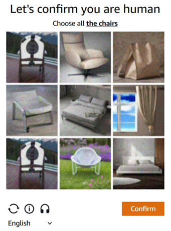

import Tabs from '@theme/Tabs';
import TabItem from '@theme/TabItem';
import ParamItem from '@theme/ParamItem';
import MethodItem from '@theme/MethodItem';
import MethodDescription from '@theme/MethodDescription'
import PriceBlock from '@theme/PriceBlock';
import PriceBlockWrap from '@theme/PriceBlockWrap';
import BlogLink from '@theme/BlogLink';

# AmazonTask | AWS WAF 验证码与挑战

<PriceBlockWrap>
  <PriceBlock title="AmazonTask" name="amazonToken"/>
</PriceBlockWrap>

解决 AWS WAF 中的验证码和挑战

<BlogLink url="https://capmonster.cloud/zh/blog/scraping/amazon-captcha-web-scraping"/>

:::warning **警告！**
此任务将使用我们的代理服务器执行。
:::

### <span style={{fontSize: '1.5rem'}}>可能的验证码变体。</span>



## 选项 1
<TabItem value='proxyless' label='AmazonTaskProxyless (no proxy)' default className='bordered-panel'>
    <ParamItem title='type' required type='string' />
    **AmazonTaskProxyless**

    --- 

    <ParamItem title='websiteURL' required type='string' /> 网站地址。
    解决验证码的主页面地址。

    ---
	
	<ParamItem title='websiteKey' required type='string' /> 验证码的主页面地址。
    在渲染验证码时，可以在 `apiKey` 字段中找到。

    ---

    <ParamItem title=‘captchaScript’ required type='string' />
    链接到 HTML 页面上的 jsapi.js，形式为 <集成 URL>/jsapi.js

    ---

    <ParamItem title='cookieSolution' type='boolean' />
    默认为**false**。如果需要 “aws-waf-token ”cookie，则指定值为**true**。否则，您将得到 “验证码_凭证 ”和 “现有令牌 ”的响应。

</TabItem> 标签

## 选项 2
## 请求参数
<TabItem value="proxyless" label="RecaptchaV2EnterpriseTaskProxyless (无代理)" default className="bordered-panel">
    <ParamItem title="type" required type="string" />
    **AmazonTaskProxyless**

    --- 

    <ParamItem title="websiteURL" required type="string" />
    解决验证码的主页地址

    ---

    <ParamItem title="challengeScript" required type="string" />
    challenge.js 的链接（请参阅表格下方的描述）。

    ---

    <ParamItem title=“captchaScript” type='string' />
    到 captcha.js 的链接（如果只是挑战，可能会丢失）

    ---

    <ParamItem title="websiteKey" required type="string" />
    可以从带有验证码的 HTML 页面或通过执行 `window.gokuProps.key`的 JavaScript 脚本中检索到的字符串。

    ---

    <ParamItem title="context" required type="string" />
    可以从带有验证码的 HTML 页面或通过执行 `window.gokuProps.context`的 JavaScript 脚本中检索到的字符串。

    ---

    <ParamItem title="iv" required type="string" />
    可以从带有验证码的 HTML 页面或通过执行 `window.gokuProps.iv`的 JavaScript 脚本中检索到的字符串。

    ---

    <ParamItem title="cookieSolution" type="boolean" />
    默认为 **false**。如果需要使用名为 "aws-waf-token" 的 cookie，请指定值为 **true**。否则，您将得到 "captcha_voucher" 和 "existing_token"。

</TabItem>


### 如何获取 websiteKey、context、iv 和 challengeScript 参数
当您访问一个网站时，您可能会收到一个 405 响应和一个带有验证码的 HTML 页面。您可以从这个页面获取所有参数： 


##任务创建方法
##选项 1
<TabItem value="proxyless" label="RecaptchaV2TaskProxyless (无代理)" default className="method-panel">
	<MethodItem>
		```http
		https://api.capmonster.cloud/createTask
		```
	</MethodItem>
	<MethodDescription>
		**要求**
		```json
		{
			"clientKey": "API_KEY",
			"task": {
				"type": "AmazonTaskProxyless",
				"websiteURL": "https://example.com/index.html",
				"websiteKey": "h15hX7brbaRTR...Za1_1",
				"userAgent": "Mozilla/5.0 (Windows NT 10.0; Win64; x64) AppleWebKit/537.36 (KHTML, like Gecko) Chrome/134.0.0.0 Safari/537.36",
				"captchaScript": "https://234324vgvc23.yejk.captcha-sdk.awswaf.com/234324vgvc23/jsapi.js",
				"cookieSolution": true
			}
		}
		```
		**Response**
		```json
		{
		  "errorId":0,
		  "taskId":407533072
		}
		```
	</MethodDescription>
</TabItem>

##选项 2
<TabItem value="proxyless" label="AmazonTaskProxyless (无代理)" default className="method-panel">
	<MethodItem>
		```http
		https://api.capmonster.cloud/createTask
		```
	</MethodItem>
	<MethodDescription>
		**要求**
		```json
		{
			"clientKey": "API_KEY",
			"task": {
				"type": "AmazonTaskProxyless",
				"websiteURL": "https://example.com",
				"challengeScript": "https://41bcdd4fb3cb.610cd090.us-east-1.token.awswaf.com/41bcdd4fb3cb/0d21de737ccb/cd77baa6c832/challenge.js",
				"captchaScript": "https://41bcdd4fb3cb.610cd090.us-east-1.captcha.awswaf.com/41bcdd4fb3cb/0d21de737ccb/cd77baa6c832/captcha.js",
				"websiteKey": "AQIDA...wZwdADFLWk7XOA==",
				"context": "qoJYgnKsc...aormh/dYYK+Y=",
				"iv": "CgAAXFFFFSAAABVk",
				"cookieSolution": true
			}
		}
		```
		**回应**
		```json
		{
		  "errorId":0,
		  "taskId":407533072
		}
		```
	</MethodDescription>
</TabItem>

## 获取任务结果方法
使用[getTaskResult](../api/methods/get-task-result.md)方法获取 AmazonTask 的解决方案。


<TabItem value="proxyless" label="GeeTestTaskProxyless (without proxy)" default className="method-panel-full">
	<MethodItem>
		```http
		https://api.capmonster.cloud/getTaskResult
		```
	</MethodItem>
	<MethodDescription>
		**要求**
		```json
		{
			"clientKey":"API_KEY",
			"taskId": 407533072
		}
		```
		**回应**
		```json
		{
			"errorId":0,
			"status":"ready",
			"solution": {
				"cookies": {
					"aws-waf-token": "10115f5b-ebd8-45c7-851e-cfd4f6a82e3e:EAoAua1QezAhAAAA:dp7sp2rXIRcnJcmpWOC1vIu+yq/A3EbR6b6K7c67P49usNF1f1bt/Af5pNcZ7TKZlW+jIZ7QfNs8zjjqiu8C9XQq50Pmv2DxUlyFtfPZkGwk0d27Ocznk18/IOOa49Rydx+/XkGA7xoGLNaUelzNX34PlyXjoOtL0rzYBxMAQy0D1tn+Q5u97kJBjs5Mytqu9tXPIPCTSn4dfXv5llSkv9pxBEnnhwz6HEdmdJMdfur+YRW1MgCX7i3L2Y0/CNL8kd8CEhTMzwyoXekrzBM="
				},
				"userAgent": "userAgentPlaceholder"
			}
		}
		```
	</MethodDescription>
</TabItem>


## 使用 SDK 库

<Tabs className="full-width-tabs filled-tabs request-tabs" groupId="captcha-type">
	<TabItem value="js" label="JavaScript" default className="method-panel">
		```js
		// https://github.com/ZennoLab/capmonstercloud-client-js

		import { CapMonsterCloudClientFactory, ClientOptions, AmazonProxylessRequest } from '@zennolab_com/capmonstercloud-client';

		document.addEventListener('DOMContentLoaded', async () => {
			const cmcClient = CapMonsterCloudClientFactory.Create(new ClientOptions({ clientKey: '<your capmonster.cloud API key>' }));
			console.log(await cmcClient.getBalance());

			const amazonRequest = new AmazonProxylessRequest({
				websiteURL: 'https://example.com',
				websiteKey: 'websiteKey',
				challengeScript: 'https://41bcdd4fb3cb.610cd090.us-east-1.token.awswaf.com/41bcdd4fb3cb/0d21de737ccb/cd77baa6c832/challenge.js',
				captchaScript: 'https://41bcdd4fb3cb.610cd090.us-east-1.captcha.awswaf.com/41bcdd4fb3cb/0d21de737ccb/cd77baa6c832/captcha.js',
				context: 'qoJYgnKsc...aormh/dYYK+Y=',
				iv: 'CgAAXFFFFSAAABVk',
			});

			console.log(await cmcClient.Solve(amazonRequest));
		});
		```
	</TabItem>

  <TabItem value="python" label="Python" default className="method-panel">
    ```python
    # https://github.com/ZennoLab/capmonstercloud-client-python

    import asyncio
    from capmonstercloudclient import CapMonsterClient, ClientOptions
    from capmonstercloudclient.requests import AmazonWafProxylessRequest

    client_options = ClientOptions(api_key="your_api_key")  # Replace with your CapMonster Cloud API key
    cap_monster_client = CapMonsterClient(options=client_options)

    amazon_waf_request = AmazonWafProxylessRequest(
        websiteUrl="https://example.com",  # URL с CAPTCHA
        challengeScript="https://example.com/path/to/challenge.js",
        captchaScript="https://example.com/path/to/captcha.js",
        websiteKey="your_website_key",
        context="your_context_value",
        iv="your_iv_value",
        cookieSolution=False
    )

    async def solve_captcha():
        return await cap_monster_client.solve_captcha(amazon_waf_request)

    responses = asyncio.run(solve_captcha())
    print(responses)
    ```
  </TabItem>

  <TabItem value="csharp" label="C#" className="method-panel">
    ```csharp
    // https://github.com/ZennoLab/capmonstercloud-client-dotnet

    using Zennolab.CapMonsterCloud.Requests;
    using Zennolab.CapMonsterCloud;

    class Program
    {
        static async Task Main(string[] args)
        {
            var clientOptions = new ClientOptions
            {
                ClientKey = "your_api_key" // Replace with your CapMonster Cloud API key
            };

            var cmCloudClient = CapMonsterCloudClientFactory.Create(clientOptions);

            var amazonWafRequest = new AmazonWafProxylessRequest
            {
                WebsiteUrl = "https://example.com", // URL with the captcha
                ChallengeScript = "URL_of_challenge.js",
                CaptchaScript = "URL_of_captcha.js",
                WebsiteKey = "website_key",
                Context = "context_value",
                Iv = "iv_value",
                CookieSolution = false
            };

            var solveResult = await cmCloudClient.SolveAsync(amazonWafRequest);

            Console.WriteLine("ExistingToken: " + solveResult.Solution.ExistingToken); // Adjust based on your expected solution format
            Console.WriteLine("CaptchaVoucher: " + solveResult.Solution.CaptchaVoucher);
        }
    }
    ```
  </TabItem>
</Tabs>