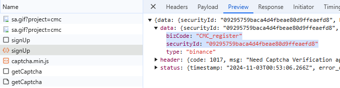
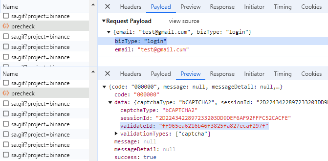
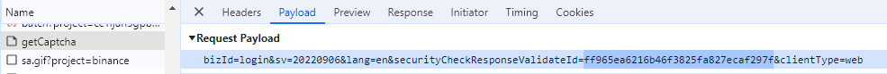

import Tabs from '@theme/Tabs';
import TabItem from '@theme/TabItem';
import ParamItem from '@theme/ParamItem';
import MethodItem from '@theme/MethodItem';
import MethodDescription from '@theme/MethodDescription'
import PriceBlock from '@theme/PriceBlock';
import PriceBlockWrap from '@theme/PriceBlockWrap';


# Binance - Binance captcha

<PriceBlockWrap>
  <PriceBlock title="Binance captcha" name="binanceToken"/>
</PriceBlockWrap>

:::warning **注意！**
* 此任务将通过我们的代理服务器执行。
* 仅可使用您的账户登录。
:::

## 请求参数
<Tabs className="full-width-tabs filled-tabs" groupId="captcha-type">
  <TabItem value="proxyless" label="BinanceTaskProxyless (无代理)" default className="bordered-panel">
    <ParamItem title="type" required type="string" />
    **BinanceTaskProxyless**

    ---

    <ParamItem title="websiteURL" required type="string" />
    解决 CAPTCHA 的主页面地址。

    ---

    <ParamItem title="websiteKey" required type="string" />
    您网站部分的唯一参数。参数 `bizId`、`bizType` 或 `bizCode` 的值。可以从流量中获取（请参见下面的描述）。

    ---

    <ParamItem title="validateId" required type="string" />
    动态密钥。参数 `validateId`、`securityId` 或 `securityCheckResponseValidateId` 的值。可以从流量中获取（请参见下面的描述）。

    ---

    <ParamItem title="userAgent" type="string" />
    浏览器的 User-Agent。**您可以提供自己的 User-Agent，或指定来自 Windows 操作系统的最新 User-Agent。**: `userAgentPlaceholder`

  </TabItem>
  
  <TabItem value="proxy" label="BinanceTask (使用代理)" default className="bordered-panel">
    <ParamItem title="type" required type="string" />
    **BinanceTask**

    ---

    <ParamItem title="websiteURL" required type="string" />
    解决 CAPTCHA 的主页面地址。

    ---

    <ParamItem title="websiteKey" required type="string" />
    您网站部分的唯一参数。参数 `bizId`、`bizType` 或 `bizCode` 的值。可以从流量中获取（请参见下面的描述）。

    ---

    <ParamItem title="validateId" required type="string" />
    动态密钥。参数 `validateId`、`securityId` 或 `securityCheckResponseValidateId` 的值。可以从流量中获取（请参见下面的描述）。

    ---

    <ParamItem title="userAgent" type="string" />
    浏览器的 User-Agent。**您可以提供自己的 User-Agent，或指定来自 Windows 操作系统的最新 User-Agent。**: `userAgentPlaceholder`
	
	 ---

    <ParamItem title="proxyType" required type="string" />
    **http** - 普通的 http/https 代理；<br />**https** - 仅在 "http" 不起作用时尝试（某些自定义代理服务器要求）；<br />**socks4** - socks4 代理；<br />**socks5** - socks5 代理。

     ---

    <ParamItem title="proxyAddress" required type="string" />
    <p>
	  代理 IP 地址 IPv4/IPv6。不允许：
		- 使用主机名；
		- 使用透明代理（其中客户端 IP 可见）；
		- 使用来自本地网络的代理。
	</p>

     ---

    <ParamItem title="proxyPort" required type="integer" />
    代理端口。

     ---

    <ParamItem title="proxyLogin" type="string" />
    代理登录。

     ---

    <ParamItem title="proxyPassword" type="string" />
    代理密码。

  </TabItem>
</Tabs>


### 如何获取 `websiteKey` 和 `validateId`
启用开发者工具，进入 "Network"（网络）标签，激活 CAPTCHA，然后查看请求。有些请求会包含所需的参数值。
例如，参数:

bizCode: "CMC_register",
securityId: "09295759baca4d4fbeae80d9ffeaefd8"

 

或者 

bizId: "CMC_register", 
securityCheckResponseValidateId: "09295759baca4d4fbeae80d9ffeaefd8"

 

或者 

bizType: "login",
validateId: "ff965ea6216b46f3825fa827ecaf297f"

 

或者

bizId: "login", 
securityCheckResponseValidateId: "ff965ea6216b46f3825fa827ecaf297f"

 

要解决验证码所需的参数可以通过执行 JavaScript 获得: 
	```json
		let originalBCaptcha = window.BCaptcha;
		let BCaptchaData;
		Object.defineProperty(window, 'BCaptcha', {
			get: function() {
				return function(args) {
					const BCaptcha = new originalBCaptcha(args);
					let BCaptchaShow = BCaptcha.__proto__.show
					BCaptcha.__proto__.show = function(args) {
						BCaptchaData = args;
						return 1;
					};
					return BCaptcha;
				}
			}
		});
	```
然后，您可以像这样检索参数，例如 `BCaptchaData.securityCheckResponseValidateId`.


## 创建任务方法
<Tabs className="full-width-tabs filled-tabs request-tabs" groupId="captcha-type">
  <TabItem value="proxyless" label="BinanceTaskProxyless (无代理)" default className="method-panel">
	<MethodItem>
		```http
		https://api.capmonster.cloud/createTask
		```
	</MethodItem>
	<MethodDescription>
		**要求**
		```json
		{
			"clientKey": "API_KEY",
			"task": 
			{
				"type": "BinanceTaskProxyless",
				"websiteURL": "https://binance.com/login",
				"websiteKey": "login",
				"validateId": "cb0bfefa598b4c3887661fde54ecd57b",
				"userAgent": "userAgentPlaceholder"
			}
		}
		```
		**回应**
		```json
		{
			"errorId":0,
			"taskId":407533072
		}
		```
	</MethodDescription>
  </TabItem>

  <TabItem value="proxy" label="BinanceTask (使用代理)" default className="method-panel">
	<MethodItem>
		```http
		https://api.capmonster.cloud/createTask
		```
	</MethodItem>
	<MethodDescription>
		**要求**
		```json
		{
			"clientKey": "API_KEY",
			"task": 
			{
				"type": "BinanceTask",
				"websiteURL": "https://binance.com/login",
				"websiteKey": "login",
				"validateId": "cb0bfefa598b4c3887661fde54ecd57b",
				"userAgent": "userAgentPlaceholder",
				"proxyType":"http",
				"proxyAddress":"8.8.8.8",
				"proxyPort":8080,
				"proxyLogin":"proxyLoginHere",
				"proxyPassword":"proxyPasswordHere"
			}
		}
		```
		**回应**
		```json
		{
			"errorId":0,
			"taskId":407533072
		}
		```
	</MethodDescription>
  </TabItem>
</Tabs>


## 获取任务结果方法
使用方法 [getTaskResult](../api/methods/get-task-result.md) 获取币安解决方案。

<TabItem value="proxyless" label="CustomTask (without proxy)" default className="method-panel-full">
	<MethodItem>
		```http
		https://api.capmonster.cloud/getTaskResult
		```
	</MethodItem>
	<MethodDescription>
		**要求**
		```json
		{
			"clientKey":"API_KEY",
			"taskId": 407533072
		}
		```
		**回应**
		```json
		{
			"errorId":0,
			"status":"ready",
			"solution": 
			{
				"token":"captcha#09ba4905a79f44f2a99e44f234439644-ioVA7neog7eRHCDAsC0MixpZvt5kc99maS943qIsquNP9D77",
				"userAgent":"userAgentPlaceholder"
			}
		}
		```
	</MethodDescription>
</TabItem>

## 使用 SDK 库

	<Tabs className="full-width-tabs filled-tabs request-tabs" groupId="captcha-type">
		<TabItem value="js" label="JavaScript" default className="method-panel">
			```js
			// https://github.com/ZennoLab/capmonstercloud-client-js

			import { CapMonsterCloudClientFactory, ClientOptions, BinanceProxylessRequest /*BinanceRequest*/ } from '@zennolab_com/capmonstercloud-client';

			document.addEventListener('DOMContentLoaded', async () => {
				const cmcClient = CapMonsterCloudClientFactory.Create(new ClientOptions({ clientKey: '<your capmonster.cloud API key>' }));
				console.log(await cmcClient.getBalance());
				
				const binanceRequest = new BinanceProxylessRequest({
					websiteURL: 'https://example.com',
					websiteKey: 'websiteKey',
					validateId: 'validateId',
				});

				// const binanceRequest = new BinanceRequest({
				//  websiteURL: 'https://example.com',
				//	websiteKey: 'websiteKey',
				//	validateId: 'validateId',
				//	proxyType: 'http',
				//	proxyAddress: '8.8.8.8',
				//	proxyPort: 8080,
				//	proxyLogin: 'proxyLoginHere',
				//	proxyPassword: 'proxyPasswordHere',
				// });

				console.log(await cmcClient.Solve(binanceRequest));
			});
			```
		</TabItem>
	</Tabs>