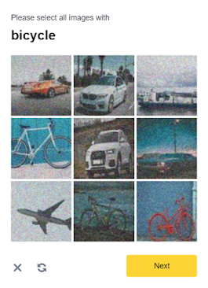

import Tabs from '@theme/Tabs';
import TabItem from '@theme/TabItem';
import ParamItem from '@theme/ParamItem';
import MethodItem from '@theme/MethodItem';
import MethodDescription from '@theme/MethodDescription'
import PriceBlock from '../../../../../src/theme/PriceBlock';
import PriceBlockWrap from '@theme/PriceBlockWrap';
import { ArticleHead } from '../../../../../src/theme/ArticleHead';

<ArticleHead slug="captchas/binance" />


# Binance - Binance captcha

<PriceBlockWrap>
  <PriceBlock title="Binance captcha" captchaId="binance"/>
</PriceBlockWrap>



:::warning **注意！**
* CapMonster Cloud 默认通过内置代理工作——这些代理已包含在费用内。仅当网站不接受令牌或对内置服务的访问受限时，才需要指定您自己的代理。

* 如果代理按 IP 授权，请将地址 **65.21.190.34** 加入白名单。

* 仅可使用您的账户登录。
:::

## 请求参数

  <TabItem value="proxy" label="BinanceTask (使用代理)" default className="bordered-panel">
    <ParamItem title="type" required type="string" />
    **BinanceTask**

    ---

    <ParamItem title="websiteURL" required type="string" />
    解决 CAPTCHA 的主页面地址。

    ---

    <ParamItem title="websiteKey" required type="string" />
    您网站部分的唯一参数。参数 `bizId`、`bizType` 或 `bizCode` 的值。可以从流量中获取（请参见下面的描述）。

    ---

    <ParamItem title="validateId" required type="string" />
    动态密钥。参数 `validateId`、`securityId` 或 `securityCheckResponseValidateId` 的值。可以从流量中获取（请参见下面的描述）。

    ---

    <ParamItem title="userAgent" type="string" />
    浏览器的 User-Agent。<br />
**请仅传递当前 Windows 系统下的有效 UA。当前推荐值为**：`userAgentPlaceholder`
	
	 ---

    <ParamItem title="proxyType" type="string" />
    **http** - 普通的 http/https 代理；<br />**https** - 仅在 "http" 不起作用时尝试（某些自定义代理服务器要求）；<br />**socks4** - socks4 代理；<br />**socks5** - socks5 代理。

     ---

    <ParamItem title="proxyAddress" type="string" />
    <p>
	  代理 IP 地址 IPv4/IPv6。不允许：
		- 使用透明代理（其中客户端 IP 可见）；
		- 使用来自本地网络的代理。
	</p>

     ---

    <ParamItem title="proxyPort" type="integer" />
    代理端口。

     ---

    <ParamItem title="proxyLogin" type="string" />
    代理登录。

     ---

    <ParamItem title="proxyPassword" type="string" />
    代理密码。

  </TabItem>


## 创建任务方法
<Tabs className="full-width-tabs filled-tabs request-tabs" groupId="captcha-type">
  <TabItem value="proxyless" label="BinanceTask (无代理)" default className="method-panel">
	<MethodItem>
		```http
		https://api.capmonster.cloud/createTask
		```
	</MethodItem>
	<MethodDescription>
		**要求**
		```json
		{
			"clientKey": "API_KEY",
			"task": 
			{
				"type": "BinanceTask",
				"websiteURL": "https://example.com",
				"websiteKey": "login",
				"validateId": "cb0bfefa598b4c3887661fde54ecd57b",
				"userAgent": "userAgentPlaceholder"
			}
		}
		```
		**回应**
		```json
		{
			"errorId":0,
			"taskId":407533072
		}
		```
	</MethodDescription>
  </TabItem>

  <TabItem value="proxy" label="BinanceTask (使用代理)" default className="method-panel">
	<MethodItem>
		```http
		https://api.capmonster.cloud/createTask
		```
	</MethodItem>
	<MethodDescription>
		**要求**
		```json
		{
			"clientKey": "API_KEY",
			"task": 
			{
				"type": "BinanceTask",
				"websiteURL": "https://example.com",
				"websiteKey": "login",
				"validateId": "cb0bfefa598b4c3887661fde54ecd57b",
				"userAgent": "userAgentPlaceholder",
				"proxyType":"http",
				"proxyAddress":"8.8.8.8",
				"proxyPort":8080,
				"proxyLogin":"proxyLoginHere",
				"proxyPassword":"proxyPasswordHere"
			}
		}
		```
		**回应**
		```json
		{
			"errorId":0,
			"taskId":407533072
		}
		```
	</MethodDescription>
  </TabItem>
</Tabs>


## 获取任务结果方法
使用方法 [getTaskResult](../api/methods/get-task-result.mdx) 获取币安解决方案。

<TabItem value="proxyless" label="CustomTask (without proxy)" default className="method-panel-full">
	<MethodItem>
		```http
		https://api.capmonster.cloud/getTaskResult
		```
	</MethodItem>
	<MethodDescription>
		**要求**
		```json
		{
			"clientKey":"API_KEY",
			"taskId": 407533072
		}
		```
		**回应**
		```json
		{
			"errorId":0,
			"status":"ready",
			"solution": 
			{
				"token":"captcha#09ba4905a79f44f2a99e44f234439644-ioVA7neog7eRHCDAsC0MixpZvt5kc99maS943qIsquNP9D77",
				"userAgent":"userAgentPlaceholder"
			}
		}
		```
	</MethodDescription>
</TabItem>

## 如何获取 `websiteKey` 和 `validateId`
启用开发者工具，进入 "Network"（网络）标签，激活 CAPTCHA，然后查看请求。有些请求会包含所需的参数值。
例如，参数:

bizCode: "CMC_register",
securityId: "09295759baca4d4fbeae80d9ffeaefd8"

 

或者 

bizId: "CMC_register", 
securityCheckResponseValidateId: "09295759baca4d4fbeae80d9ffeaefd8"

 

或者 

bizType: "login",
validateId: "ff965ea6216b46f3825fa827ecaf297f"

 

或者

bizId: "login", 
securityCheckResponseValidateId: "ff965ea6216b46f3825fa827ecaf297f"

 

要解决验证码所需的参数可以通过执行 JavaScript 获得: 
	```javascript
		let originalBCaptcha = window.BCaptcha;
		let BCaptchaData;
		Object.defineProperty(window, 'BCaptcha', {
			get: function() {
				return function(args) {
					const BCaptcha = new originalBCaptcha(args);
					let BCaptchaShow = BCaptcha.__proto__.show
					BCaptcha.__proto__.show = function(args) {
						BCaptchaData = args;
						return 1;
					};
					return BCaptcha;
				}
			}
		});
	```
然后，您可以像这样检索参数，例如 `BCaptchaData.securityCheckResponseValidateId`.

## 使用 SDK 库

<Tabs className="full-width-tabs filled-tabs request-tabs" groupId="captcha-type">

  <TabItem value="js" label="JavaScript" default className="method-panel">
<details>
      <summary>显示代码（用于浏览器）</summary>
```js
// https://github.com/ZennoLab/capmonstercloud-client-js

import { CapMonsterCloudClientFactory, ClientOptions, BinanceRequest } from '@zennolab_com/capmonstercloud-client';

const API_KEY = "YOUR_API_KEY";  // 输入您的 CapMonster Cloud API 密钥

document.addEventListener("DOMContentLoaded", async () => {
    const client = CapMonsterCloudClientFactory.Create(
        new ClientOptions({ clientKey: API_KEY })
    );

    // 基本示例，无需代理
    // CapMonster Cloud 会自动使用它们的代理
    let binanceRequest = new BinanceRequest({
        websiteURL: 'https://example.com', // Binance 验证码页面 URL
        websiteKey: 'login',               // 替换为正确的值
        validateId: 'cb0bfefa598b4c3887661fde54ecd57b'
    });

    // 使用您自己的代理的示例
    // 如果想使用自己的代理，请取消注释以下代码块
    /*
    const proxy = {
        proxyType: "http",
        proxyAddress: "123.45.67.89",
        proxyPort: 8080,
        proxyLogin: "username",
        proxyPassword: "password"
    };

    binanceRequest = new BinanceRequest({
        websiteURL: 'https://example.com',
        websiteKey: 'login',
        validateId: 'cb0bfefa598b4c3887661fde54ecd57b',
        proxy
    });
    */

    // 如有必要，可以检查余额
    const balance = await client.getBalance();
    console.log("Balance:", balance);

    const result = await client.Solve(binanceRequest);
    console.log("Solution:", result);
});
```
</details>

<details>
      <summary>显示代码 (Node.js)</summary>
```javascript
// https://github.com/ZennoLab/capmonstercloud-client-js

import { CapMonsterCloudClientFactory, ClientOptions, BinanceRequest } from '@zennolab_com/capmonstercloud-client';

const API_KEY = "YOUR_API_KEY";  // 输入您的 CapMonster Cloud API 密钥

async function solveBinanceCaptcha() {
    const client = CapMonsterCloudClientFactory.Create(
        new ClientOptions({ clientKey: API_KEY })
    );

    // 基本示例，无需代理
    // CapMonster Cloud 会自动使用它们的代理
    let binanceRequest = new BinanceRequest({
        websiteURL: 'https://example.com', // Binance 验证码页面 URL
        websiteKey: 'login',               // 替换为正确的值
        validateId: 'cb0bfefa598b4c3887661fde54ecd57b'
    });

    // 使用您自己的代理的示例
    // 如果想使用自己的代理，请取消注释以下代码块
    /*
    const proxy = {
        proxyType: "http",
        proxyAddress: "123.45.67.89",
        proxyPort: 8080,
        proxyLogin: "username",
        proxyPassword: "password"
    };

    binanceRequest = new BinanceRequest({
        websiteURL: 'https://example.com',
        websiteKey: 'login',
        validateId: 'cb0bfefa598b4c3887661fde54ecd57b',
        proxy
    });
    */

    // 如有必要，可以检查余额
    const balance = await client.getBalance();
    console.log("Balance:", balance);

    const result = await client.Solve(binanceRequest);
    console.log("Solution:", result);
}

solveBinanceCaptcha().catch(console.error);
```
</details>
  </TabItem>

  <TabItem value="python" label="Python" default className="method-panel">
<details>
      <summary>显示代码</summary>
```python
# https://github.com/ZennoLab/capmonstercloud-client-python

import asyncio
from capmonstercloudclient import CapMonsterClient, ClientOptions
from capmonstercloudclient.requests import BinanceTaskRequest
# from capmonstercloudclient.requests.baseRequestWithProxy import ProxyInfo  # 如果计划使用代理，请取消注释

API_KEY = "YOUR_API_KEY"  # 输入您的 CapMonster Cloud API 密钥

async def solve_binance():
    client_options = ClientOptions(api_key=API_KEY)
    cap_monster_client = CapMonsterClient(options=client_options)

    # 基本示例，无需代理
    # CapMonster Cloud 会自动使用它们的代理
    binance_request = BinanceTaskRequest(
        websiteUrl="https://example.com",    # Binance 验证码页面 URL
        websiteKey="login",               # 替换为正确的值
        validateId="cb0bfefa598b4c3887661fde54ecd57b",    # 替换为实际的 validateId
        userAgent="userAgentPlaceholder"         # 使用实际的 UserAgent
    )

    # 使用您自己的代理的示例
    # 如果想使用代理，请取消注释以下代码块
    #
    # proxy = ProxyInfo(
    #     proxyType="http",
    #     proxyAddress="123.45.67.89",
    #     proxyPort=8080,
    #     proxyLogin="username",
    #     proxyPassword="password"
    # )
    #
    # binance_request = BinanceTaskRequest(
    #     websiteUrl="https://example.com",
    #     websiteKey="login",
    #     validateId="cb0bfefa598b4c3887661fde54ecd57b",
    #     userAgent="userAgentPlaceholder",
    #     proxy=proxy
    # )

    # 如有必要，可以检查余额
    balance = await cap_monster_client.get_balance()
    print("Balance:", balance)

    result = await cap_monster_client.solve_captcha(binance_request)
    print("Solution:", result)

asyncio.run(solve_binance())
```
</details>
  </TabItem>

  <TabItem value="csharp" label="C#" className="method-panel">
<details>
      <summary>显示代码</summary>

```csharp
// https://github.com/ZennoLab/capmonstercloud-client-dotnet

using System;
using System.Threading.Tasks;
using Zennolab.CapMonsterCloud;
using Zennolab.CapMonsterCloud.Requests;

class Program
{
    static async Task Main(string[] args)
    {
        // 输入您的 CapMonster Cloud API 密钥
        var clientOptions = new ClientOptions
        {
            ClientKey = "YOUR_API_KEY"
        };

        var cmCloudClient = CapMonsterCloudClientFactory.Create(clientOptions);

        // 基本示例，无需代理
        // CapMonster Cloud 会自动使用它们的代理
        var binanceRequest = new BinanceTaskRequest
        {
            WebsiteUrl = "https://example.com",      // Binance 验证码页面 URL
            WebsiteKey = "login",                    // 替换为正确的值
            ValidateId = "cb0bfefa598b4c3887661fde54ecd57b",
            UserAgent = "userAgentPlaceholder"    // 使用实际的 UserAgent
        };

        // 使用您自己的代理的示例
        // 如果想使用代理，请取消注释以下代码块
        /*
        binanceRequest = new BinanceTaskRequest
        {
            WebsiteUrl = "https://example.com",
            WebsiteKey = "login",
            ValidateId = "cb0bfefa598b4c3887661fde54ecd57b",
            UserAgent = "userAgentPlaceholder",
            Proxy = new ProxyContainer(
                "123.45.67.89",  
                8080,   
                ProxyType.Http,   
                "username", 
                "password"   
            )
        };
        */

        // 如有必要，可以检查余额
        var balance = await cmCloudClient.GetBalanceAsync();
        Console.WriteLine("Balance: " + balance);

        var binanceResult = await cmCloudClient.SolveAsync(binanceRequest);

        Console.WriteLine("Binance Solution: " + binanceResult.Solution.Value);
    }
}
```
</details>
  </TabItem>

</Tabs>
