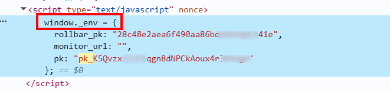

import Tabs from '@theme/Tabs';
import TabItem from '@theme/TabItem';
import ParamItem from '@theme/ParamItem';
import MethodItem from '@theme/MethodItem';
import MethodDescription from '@theme/MethodDescription'
import PriceBlock from '@theme/PriceBlock';
import PriceBlockWrap from '@theme/PriceBlockWrap';
import { ArticleHead } from '../../../../../src/theme/ArticleHead';

<ArticleHead slug="captchas/castle-task" />

# Castle

<PriceBlockWrap>
  <PriceBlock title="Castle" captchaId="castle"/>
</PriceBlockWrap>

Castle 是一种网站保护系统，可阻止自动化攻击和可疑活动。它实时监控用户行为和请求，对普通访问者几乎不可察觉，仅在异常或大量流量时才会显现。


:::warning **注意！**
CapMonster Cloud 默认通过内置代理工作 —— 它们已包含在价格中。  
只有在网站不接受令牌或无法访问内置服务时，才需要指定您自己的代理。

如果您使用基于 IP 认证的代理，请将 **65.21.190.34** 添加到白名单中。
:::

## 请求参数

<TabItem value="proxy" label="CastleTask" className="bordered-panel">
<ParamItem title="type" required type="string" />
**CustomTask**

---

<ParamItem title="class" required type="string" />
**Castle**

---

<ParamItem title="websiteURL" required type="string" />
Castle 所在页面的 URL。

---

<ParamItem title="websiteKey" required type="string" />
**Publishable Key**，Castle 的标识符。可在页面或网站脚本中找到。  
示例：```pk_1Tk5Yzr1WFzxrJCh7WzMZzY1rHpaOtdK```

---

<ParamItem title="wUrl (inside metadata)" required type="string" />
`cw.js` 的链接，例如：```https://s.rsg.sc/auth/js/20251234bgef/build/cw.js```

---

<ParamItem title="swUrl (inside metadata)" required type="string" />
`csw.js` 的链接，例如：```https://s.rsg.sc/auth/js/20251234bgef/build/cw.js```

---

<ParamItem title="count (inside metadata)" type="intenger" />
令牌数量 — 默认值为 1（生成 1 到 49 个绑定到同一浏览器会话的 Castle 令牌，即具有相同的 `__cuid` 标识符）。  
如果指定的值大于 49，则将返回允许的最大令牌数量 49，并按该数量计费。

---

<ParamItem title="userAgent" type="string" />
浏览器的 User-Agent。<br />
**请仅传递当前 Windows 系统下的有效 UA。当前推荐值为**：`userAgentPlaceholder`

---

<ParamItem title="proxyType" type="string" />
**http** - 常规 http/https 代理；<br />
**https** - 仅当 "http" 无效时使用（某些自定义代理需要）；<br />
**socks4** - socks4 代理；<br />
**socks5** - socks5 代理。

---

<ParamItem title="proxyAddress" type="string" />
<p>
代理的 IPv4/IPv6 地址。禁止以下使用方式：
- 使用透明代理（可暴露客户端 IP）；
- 使用本地机器上的代理。
</p>

---

<ParamItem title="proxyPort" type="integer" />
代理端口。

---

<ParamItem title="proxyLogin" type="string" />
代理服务器登录用户名。

---

<ParamItem title="proxyPassword" type="string" />
代理服务器登录密码。

</TabItem>

## 创建任务的方法

<Tabs className="full-width-tabs filled-tabs request-tabs" groupId="captcha-type">

  <TabItem value="proxyless" label="CustomTask（无代理）" default className="method-panel">
    <MethodItem>
      ```http
      https://api.capmonster.cloud/createTask
      ```
    </MethodItem>
    <MethodDescription>
      **请求**
      ```json
      {
		"type": "CustomTask",
		"Class": "Castle",
		"websiteURL": "https://www.example.com/",
		"websiteKey": "pk_1Tk5Yzr1WFzxrJCh7WzMZzY1rHpaOtdK",
		"userAgent": "userAgentPlaceholder",
		"metadata": {
			"wUrl": "https://s.rsg.sc/auth/js/20251234bgef/build/cw.js",
			"swUrl": "https://s.rsg.sc/auth/js/20251234bgef/build/csw.js",
			"count":1
		}
}
        ```
        **响应**
        ```json
        {
            "errorId": 0,
            "taskId": 123456789
        }
        ```
        </MethodDescription>
    </TabItem>

 <TabItem value="proxy" label="CustomTask（使用代理）" className="method-panel">
    <MethodItem>
      ```http
      https://api.capmonster.cloud/createTask
      ```
    </MethodItem>
    <MethodDescription>
      **请求**
      ```json
      {
		"type": "CustomTask",
		"Class": "Castle",
		"websiteURL": "https://www.example.com/",
		"websiteKey": "pk_1Tk5Yzr1WFzxrJCh7WzMZzY1rHpaOtdK",
		"userAgent": "userAgentPlaceholder",
		"metadata": {
			"wUrl": "https://s.rsg.sc/auth/js/20251234bgef/build/cw.js",
			"swUrl": "https://s.rsg.sc/auth/js/20251234bgef/build/csw.js",
			"count":1
		}
          "proxyType": "http",
          "proxyAddress": "8.8.8.8",
          "proxyPort": 8080,
          "proxyLogin": "proxyLoginHere",
          "proxyPassword": "proxyPasswordHere"
        }
      }
      ```

      **响应**
      ```json
      {
        "errorId": 0,
        "taskId": 407533072
      }
      ```
    </MethodDescription>
  </TabItem>

</Tabs>

## 获取任务结果的方法
使用 [getTaskResult](../api/methods/get-task-result.mdx) 方法获取 TenDI 的解决结果。

<TabItem value="proxyless" label="CustomTask（无代理）" default className="method-panel-full">
	<MethodItem>
		```http
		https://api.capmonster.cloud/getTaskResult
		```
	</MethodItem>
	<MethodDescription>
		**请求**
		```json
		{
		  "clientKey":"API_KEY",
		  "taskId": 407533072
		}
		```
		**响应**
		```json
        {
          "errorId":0,
          "status":"ready",
          "solution":  {
              "data":
          {
            "tokens":["Q05Ap...H7nYn", "cn9xW...aFl_4", ...]
          },
              "domains": {
                  "www.example.com": {
                      "cookies": {
                          "__cuid": "6883480a9ab7442d9f97da7307d6ea9c"
                      }
                  }
              }
          }
      }
		```
	</MethodDescription>
</TabItem>

## 如何获取 Castle 参数

### `pk (websiteKey)`

**方法 1：**

1. 打开包含 Castle 的页面并启动 **开发者工具**，切换到 **Elements（元素）** 选项卡。
2. 打开搜索（Ctrl + F），输入关键字 **pk** 或 **publishableKey**。
3. 在页面元素或关联脚本中查找 `Publishable Key` 参数。


**方法 2：**

如果网站使用 ```window._env``` 对象：



复制 `pk` 的值或在浏览器控制台中执行以下命令：```window._env.pk```


**方法 3：**

如果 `pk` 位于 `data-config` 中：


复制 `pk` 的值或在浏览器控制台中使用以下代码：

```javascript
const script = document.querySelector('script[data-config]');
const config = JSON.parse(script.dataset.config);
config.castle.publishableKey;
````

---

### `cw.js` 和 `csw.js`

在 **开发者工具** 中，切换到 **Network（网络）** 选项卡，激活 Castle 并分析网络请求。找到对 `cw.js` 和 `csw.js` 文件的请求并复制它们的 URL。


