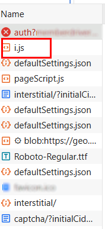

import Tabs from '@theme/Tabs';
import TabItem from '@theme/TabItem';
import ParamItem from '@theme/ParamItem';
import MethodItem from '@theme/MethodItem';
import MethodDescription from '@theme/MethodDescription'
import PriceBlock from '../../../../../src/theme/PriceBlock';
import PriceBlockWrap from '@theme/PriceBlockWrap';

# DataDome

<PriceBlockWrap>
  <PriceBlock title="DataDome" captchaId="datadome"/>
</PriceBlockWrap>

这种类型的验证码通常要求用户通过移动滑块来完成拼图以进行验证。


:::warning **注意！**

* 执行此任务时，请使用 **您自己的代理**。
* 如果代理按 IP 授权，请将地址 **65.21.190.34** 加入白名单。
* 完成验证后，您将获得 **特殊的Cookie**，需要添加到浏览器中。
:::

## 请求参数

<TabItem value="proxyless" label="CustomTask (without proxy)" default className="bordered-panel">
    <ParamItem title="type" required type="string" />
    **CustomTask**
    
---

<ParamItem title="class" required type="string" />
**DataDome**

---

<ParamItem title="websiteURL" required type="string" />
验证码所在的主页面URL。

---

<ParamItem title="captchaUrl（在metadata中）" required="required" type="string" />
`"captchaUrl"` - 验证码链接。通常格式为: `"https://geo.captcha-delivery.com/captcha/?initialCid=..."`。

---

<ParamItem title="datadomeCookie（在metadata中）" required type="string" />
您的DataDome Cookie。可以通过页面的 `document.cookie` 获取（如果Cookie没有 *HttpOnly* 标志），通过请求头 Set-Cookie: "datadome=..."，或直接从HTML代码中的 `initialCid` 获取 ([*查看如何找到datadomeCookie示例*](#如何找到datadomecookie))。

---

<ParamItem title="proxyType" required type="string" />
**http** - 常规http/https代理；<br />
**https** - 仅在http不工作时使用（某些自定义代理需要）；<br />
**socks4** - socks4代理；<br />
**socks5** - socks5代理。

---

<ParamItem title="proxyAddress" required type="string" />
<p>
  代理IPv4/IPv6地址。禁止使用：
    - 主机名；
    - 透明代理（客户端IP可见）；
    - 本地机器代理。
</p>

---

<ParamItem title="proxyPort" required type="integer" />
代理端口。

---

<ParamItem title="proxyLogin" required type="string" />
代理服务器登录名。

---

<ParamItem title="proxyPassword" required type="string" />
代理服务器密码。

---

<ParamItem title="userAgent" type="string" />
浏览器的 User-Agent。<br />
**请仅传递当前 Windows 系统下的有效 UA。当前推荐值为**：`userAgentPlaceholder`

---

</TabItem>

## 任务创建方法

:::warning **重要**
在页面加载过程中，DataDome可能会使用两种脚本之一：`c.js` 或 `i.js`。
如果目标网站使用 `c.js`，提取的Cookie可能无法用于验证。在执行解决方案之前，请检查加载了哪个脚本 (**DevTools → Network / HTML**)。
:::

**使用 `c.js` 的情况：**


**使用 `i.js` 的情况：**



<TabItem value="proxyless" label="CustomTask（无代理）" default className="method-panel">
	<MethodItem>
		```http
		https://api.capmonster.cloud/createTask
		```
	</MethodItem>
	<MethodDescription>
		**请求**
```json
{
  "clientKey": "API_KEY",
  "task": {
    "type": "CustomTask",
    "class": "DataDome",
    "websiteURL": "https://example.com",
    "userAgent": "userAgentPlaceholder",
    "metadata": {
      "captchaUrl": "https://geo.captcha-delivery.com/interstitial/?initialCid=AHrlqAAAAAMA9UvsL58YLqIAXNLFPg%3D%3D&hash=C0705ACD75EBF650A07FF8291D3528&cid=7sfa5xUfDrR4bQTp1c2mhtiD7jj9TXExcQypjdNAxKVFyIi1S9tE0~_mqLa2EFpOuzxKcZloPllsNHjNnqzD9HmBA4hEv7SsEyPYEidCBvjZEaDyfRyzefFfolv0lAHM&referer=https%3A%2F%2Fwww.example.com.au%2F&s=6522&b=978936&dm=cm",
      "datadomeCookie": "datadome=VYUWrgJ9ap4zmXq8Mgbp...64emvUPeON45z"
    },
    "proxyType": "http",
    "proxyAddress": "123.45.67.89",
    "proxyPort": 8080,
    "proxyLogin": "proxyUsername",
    "proxyPassword": "proxyPassword"
  }
}
```
		**响应**
		```json
		{
		  "errorId":0,
		  "taskId":407533072
		}
		```
	</MethodDescription>
</TabItem>

## 获取任务结果的方法

使用 [getTaskResult](../api/methods/get-task-result.md) 方法来获取DataDome验证码的解决方案。

<TabItem value="proxyless" label="CustomTask（无代理）" default className="method-panel-full">
	<MethodItem>
		```http
		https://api.capmonster.cloud/getTaskResult
		```
	</MethodItem>
	<MethodDescription>
		**请求**
		```json
		{
		  "clientKey":"API_KEY",
		  "taskId": 407533072
		}
		```
		**响应**

```json
{
  "errorId": 0,
  "status": "ready",
  "solution": {
    "domains": {
      "www.example.com": {
        "cookies": {
          "datadome": "P1w0VnjFcTFslfps0J4FaPpY_QPbPBW4MeYxj4LW~pztIfJiSSuBPr8oQTUHzdrfgv137FbOBd3kCUOOgny7LhIkhm5e1qdtzYM4s2e46U_qfERK4KiCy22MOSIDsDyh"
        },
        "localStorage": null
      }
    },
    "url": null,
    "fingerprint": null,
    "headers": null,
    "data": null
  }
}
```
</MethodDescription>
</TabItem>

## 如何找到 `datadomeCookie`

### 使用开发者工具

**方法1：**

1. 在浏览器中打开受DataDome保护的网站（Chrome、Firefox）。

2. 按 F12 → 打开 **Application** 标签 → **Cookies**。

3. 找到网站域名（例如：[www.example.com）。](http://www.example.com）。)

在Cookie中查找键 `datadome` —— 这就是所需的 `datadomeCookie` 参数。


**方法2：**

1. 打开触发DataDome验证码的网站。

2. 进入 **DevTools → Network**，刷新页面，找到加载带有 `initialCid` 参数的请求。

示例URL：

`https://geo.captcha-delivery.com/interstitial/?initialCid=...&hash=...&cid=...`


或:

3. 打开该请求的 **Response**，在HTML代码中找到对象：

`var ddm = { ... };`

4. 在该对象中找到参数 `cid`，其值即为当前 `datadomeCookie`。


**方法3：**

1. 打开触发DataDome验证码的网站。

2. 进入 **DevTools → Network**，刷新页面，找到状态为 **403** 的请求。

3. 切换到 **Headers → Response Headers**，在头部找到 `Set-Cookie:` 并复制 `datadome` 参数的值（格式 `datadome=<value>`）。


{/* ## 使用 SDK 库

<Tabs className="full-width-tabs filled-tabs request-tabs" groupId="captcha-type">
  <TabItem value="js" label="JavaScript" default className="method-panel">
    ```js
    // https://github.com/ZennoLab/capmonstercloud-client-js

    import { CapMonsterCloudClientFactory, ClientOptions, DataDomeRequest } from '@zennolab_com/capmonstercloud-client';

    document.addEventListener('DOMContentLoaded', async () => {
      const cmcClient = CapMonsterCloudClientFactory.Create(new ClientOptions({ clientKey: '<your capmonster.cloud API key>' }));
      console.log(await cmcClient.getBalance());

      const dataDomeRequest = new DataDomeRequest({
        websiteURL: 'https://example.com',
        userAgent: 'Mozilla/5.0 (iPhone; CPU iPhone OS 17_5_1 like Mac OS X) AppleWebKit/605.1.15 (KHTML, like Gecko) Version/17.5.1 Mobile/21F90 Safari/604.1',
        metadata: {
          captchaUrl: 'https://geo.captcha-delivery.com/captcha/?initialCid=12434324',
          datadomeCookie: '',
        },
      });

      console.log(await cmcClient.Solve(dataDomeRequest));
    });
    ```
  </TabItem>

  <TabItem value="python" label="Python" className="method-panel">
    ```python
    # https://github.com/ZennoLab/capmonstercloud-client-python

    import asyncio
    from capmonstercloudclient import CapMonsterClient, ClientOptions
    from capmonstercloudclient.requests import DataDomeCustomTaskProxylessRequest

    client_options = ClientOptions(api_key="your_api_key")  # Replace with your CapMonster Cloud API key
    cap_monster_client = CapMonsterClient(options=client_options)

    data_dome_request = DataDomeCustomTaskProxylessRequest(
        websiteUrl="https://example.com",  # URL with the captcha

        userAgent="Mozilla/5.0 (iPhone; CPU iPhone OS 17_5_1 like Mac OS X) AppleWebKit/605.1.15 (KHTML, like Gecko) Version/17.5.1 Mobile/21F90 Safari/604.1",  # Use the current userAgent
        metadata={
            "htmlPageBase64": "PGh0bWw+PGhlYWQ+PHRpdGxlPn...+48L2h0bWw+",  # Replace with your HTML base64 or use captchaUrl
            "datadomeCookie": "datadome=oZJnhpo...1PuyGg"  # Replace with your DataDome cookie
        }
    )

    async def solve_captcha():
        return await cap_monster_client.solve_captcha(data_dome_request)

    responses = asyncio.run(solve_captcha())
    print(responses)
    ```
  </TabItem>
  
	<TabItem value="csharp" label="C#" className="method-panel">
		```csharp
		// https://github.com/ZennoLab/capmonstercloud-client-dotnet

		using Zennolab.CapMonsterCloud.Requests;
		using Zennolab.CapMonsterCloud;

		class Program
		{
			static async Task MainDatadome(string[] args)
			{
				var clientOptions = new ClientOptions
				{
					ClientKey = "your_api_key" // Replace with your CapMonster Cloud API key
				};

				var cmCloudClient = CapMonsterCloudClientFactory.Create(clientOptions);

				var DataDomeRequest = new DataDomeCustomTaskRequest(datadomeCookie: "datadome=6BvxqELMoorFNoo7GT1...JyfP_mhz", captchaUrl: "https://example.com", htmlPageBase64: "PGh0bWw+PGhlYWQ+PHRpdGxlPmJs...N0E5QTA1")
				{
					WebsiteUrl = "https://example.com",
					UserAgent = "Mozilla/5.0 (iPhone; CPU iPhone OS 17_5_1 like Mac OS X) AppleWebKit/605.1.15 (KHTML, like Gecko) Version/17.5.1 Mobile/21F90 Safari/604.1", // Use the current userAgent
				};

				var DataDomeResult = await cmCloudClient.SolveAsync(DataDomeRequest);

				Console.WriteLine("Captcha Solution: " + JsonSerializer.Serialize(DataDomeResult.Solution));
			}
		}
		```
	</TabItem>
</Tabs> */}
