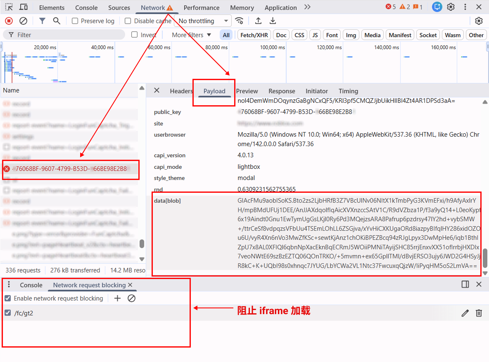

import Tabs from '@theme/Tabs';
import TabItem from '@theme/TabItem';
import ParamItem from '@theme/ParamItem';
import MethodItem from '@theme/MethodItem';
import MethodDescription from '@theme/MethodDescription'
import PriceBlock from '@theme/PriceBlock';
import PriceBlockWrap from '@theme/PriceBlockWrap';
import { ArticleHead } from '../../../../../src/theme/ArticleHead';

<ArticleHead slug="captchas/funcaptcha-task" />

# FunCaptcha

<PriceBlockWrap>
  <PriceBlock title="FunCaptcha" captchaId="funcaptcha"/>
</PriceBlockWrap>


:::warning **注意！**
CapMonster Cloud 默认通过内置代理工作——这些代理已包含在费用内。仅当网站不接受令牌或对内置服务的访问受限时，才需要指定您自己的代理。

如果代理按 IP 授权，请将地址 **65.21.190.34** 加入白名单。
:::

## 请求参数

<TabItem value="proxy" label="FunCaptchaTask" className="bordered-panel">
<ParamItem title="type" required type="string" />
**FunCaptchaTask**

---

<ParamItem title="websiteURL" required type="string" />
验证码所在页面的 URL。

---

<ParamItem title="websitePublicKey" required type="string" />
FunCaptcha 密钥（值为 *public key* 或 *pk*）。

---

<ParamItem title="data" type="string" />
附加参数。如果网站使用 *data[blob]* 则必填。<br />
**重要提示：** 不要加载 captcha iframe 来提取 `blob`。一旦加载验证码，该值即失效。

---

<ParamItem title="funcaptchaApiJSSubdomain" type="string" />
Arkose Labs 子域名（值为 *surl*）。只有在不同于默认值时才需要指定：`client-api.arkoselabs.com`。

---

<ParamItem title="userAgent" type="string" />
浏览器 User-Agent。<br />
**仅传递当前 Windows 系统的 UA 示例:** `userAgentPlaceholder`。

---

<ParamItem title="cookies" type="string" />
以如下格式传递额外 Cookie：

```

cookieName1=value1; cookieName2=value2

````

---

<ParamItem title="proxyType" type="string" />
**http** - 常规 http/https 代理；<br />
**https** - 仅当 "http" 无效时使用（某些自定义代理需要）；<br />
**socks4** - socks4 代理；<br />
**socks5** - socks5 代理。

---

<ParamItem title="proxyAddress" type="string" />
<p>
代理的 IPv4/IPv6 地址。禁止以下使用方式：
- 使用透明代理（可暴露客户端 IP）；
- 使用本地机器上的代理。
</p>

---

<ParamItem title="proxyPort" type="integer" />
代理端口。

---

<ParamItem title="proxyLogin" type="string" />
代理服务器登录用户名。

---

<ParamItem title="proxyPassword" type="string" />
代理服务器登录密码。

</TabItem>

## 创建任务的方法

<Tabs className="full-width-tabs filled-tabs request-tabs" groupId="captcha-type">
<TabItem value="proxyless" label="FunCaptchaTask（无代理）" default className="method-panel">
<MethodItem>
```http
https://api.capmonster.cloud/createTask
````

</MethodItem>
<MethodDescription>
**请求**
```json
{
  "clientKey": "API_KEY",
  "task": {
    "type": "FunCaptchaTask",
    "websiteURL": "https://www.example.com",
    "websitePublicKey": "EX72CCFB-26EX-40E5-91E6-85EX70BE98ED",
    "funcaptchaApiJSSubdomain": "example-api.arkoselabs.com",
    "data": "{\"blob\":\"nj9UbL+yio7goOlTQ/b64t.ayrrBnP6kPgzlKYCP/kv491lKS...Wot/7gjpyIxs7VYb0+QuRcfQ/t6bzh5pXDkOFSskA/V/ITSVZSAlglIplLcdreZ4PE8skfMU6k1Q\"}",
    "userAgent": "userAgentPlaceholder"
  }
}
```
**响应**
```json
{
  "errorId":0,
  "taskId":407533077
}
```
</MethodDescription>
</TabItem>

<TabItem value="proxy" label="FunCaptchaTask（使用代理）" default className="method-panel">
<MethodItem>
```http
https://api.capmonster.cloud/createTask
```
</MethodItem>
<MethodDescription>
**请求**
```json
{
  "clientKey": "API_KEY",
  "task": {
    "type": "FunCaptchaTask",
    "websiteURL": "https://www.example.com",
    "websitePublicKey": "EX72CCFB-26EX-40E5-91E6-85EX70BE98ED",
    "funcaptchaApiJSSubdomain": "example-api.arkoselabs.com",
    "data": "{\"blob\":\"nj9UbL+yio7goOlTQ/b64t.ayrrBnP6kPgzlKYCP/kv491lKS...Wot/7gjpyIxs7VYb0+QuRcfQ/t6bzh5pXDkOFSskA/V/ITSVZSAlglIplLcdreZ4PE8skfMU6k1Q\"}",
    "userAgent": "userAgentPlaceholder",
    "proxyType": "http",
    "proxyAddress": "8.8.8.8",
    "proxyPort": 8080,
    "proxyLogin": "proxyLoginHere",
    "proxyPassword": "proxyPasswordHere"
  }
}
```
**响应**
```json
{
  "errorId":0,
  "taskId":407533077
}
```
</MethodDescription>
</TabItem>
</Tabs>

## 获取任务结果的方法

使用 [getTaskResult](../api/methods/get-task-result.mdx) 获取 FunCaptcha 解决方案。

<TabItem value="proxyless" label="FunCaptchaTask（无代理）" default className="method-panel-full">
<MethodItem>
```http
https://api.capmonster.cloud/getTaskResult
```
</MethodItem>
<MethodDescription>
**请求**
```json
{
  "clientKey": "API_KEY",
  "taskId": 407533077
}
```

**响应**

```json
{
  "errorId": 0,
  "errorCode": null,
  "errorDescription": null,
  "solution": {
    "token": "337187b9f57678923.5060184402|r=us-west-2|lang=en|pk=EX72CCFB-26EX-40E5-91E6-85EX70BE98ED|at=40|ag=101|cdn_url=https%3A%2F%2Fclient-api.arkoselabs.com%2Fcdn%2Ffc|surl=https%3A%2F%2Fclient-api.arkoselabs.com|smurl=https%3A%2F%2Fclient-api.arkoselabs.com%2Fcdn%2Ffc%2Fassets%2Fstyle-manager",
    "userAgent": "userAgentPlaceholder"
  },
  "status": "ready"
}
```

</MethodDescription>
</TabItem>

## 获取 FunCaptcha 参数

### `websitePublicKey` 和 `funcaptchaApiJSSubdomain`

打开 DevTools → **Elements**，找到隐藏输入框 ID 为 `verification-token` 或 `FunCaptcha-Token` 的元素。其中包含 `pk` (*websitePublicKey*) 和 `surl` (*funcaptchaApiJSSubdomain*) 值。

通过控制台获取参数：

```js
const v = document.querySelector("#verification-token, #FunCaptcha-Token").value;
const p = Object.fromEntries(v.split("|").map(x => x.split("=")));
console.log("pk:", p.pk);
console.log("surl:", decodeURIComponent(p.surl));
```

### `data (blob)`

如果网站使用额外的 `blob` 参数，可以按以下方式获取：

#### 1. 确定数据来源

`blob` 参数可能存在于：

* **HTML 属性**：例如 `data-blob` 或其他 `data-*` 属性。


* **JSON API 响应**：用户操作（如点击或请求验证码）后返回。

* **JSON 中 URL 的查询参数**：有时 `blob` 作为 URL 的一部分传递。

#### 2. 执行请求

* **GET 请求**到显示验证码的页面，
  或
* **POST 请求**到返回验证码数据的 API。

> **重要提示：** 不要加载 captcha iframe 来提取 `blob`。一旦验证码加载，参数即失效。

#### 3. 提取参数

* 如果响应是 **HTML** — 使用正则或 HTML 解析工具定位属性。
* 如果响应是 **JSON** — 获取对应键的值（例如 `data.blob`）。
* 如果 `blob` 在 **URL** 中 — 解析 query 参数以获取值。

<div style={{ fontSize: '110%' }}>
  **您也可以通过 DevTools 的网络请求找到 `blob` 参数及其值：**
</div>

1. 打开包含验证码的页面，打开 DevTools，并触发验证码显示。
   然后打开 **Network（网络）** 标签，找到类似以下的请求：
   `https://arkoselabs.example.com/fc/gt2/public_key/176068BF-9607-4799-B53D-366BE98E2B84`

   

2. 阻止验证码 iframe 的加载，以获取有效的 `blob`。
   操作方法：按 **Ctrl + Shift + P**（在 Chromium 浏览器中），输入 **Enable network request blocking（启用网络请求阻止）**，启用请求阻止，并添加如下模式：
   `/fc/gt2`

   重新加载页面后，iframe 将被阻止。复制 `blob` 参数的值，并在验证码求解请求中使用。

   

## 使用 `data[blob]` 自动解决 FunCaptcha

下面的 JavaScript（Node.js）、Python 和 C# 示例演示了如何使用 Playwright 提取 `public_key` 和 `blob` 参数，在 CapMonster Cloud 创建任务，并获取验证码解决方案的 token。
你也可以使用其他自动化或测试工具实现相同的逻辑。

---

<TabItem value="js" label="JavaScript" default className="method-panel">
<details>
<summary>Node.js</summary>

```javascript
// npm install playwright

const { chromium } = require("playwright");

const apiKey = "YOUR_API_KEY"; // CapMonster Cloud API 密钥
const websiteURL = "https://www.example.com/"; // 包含 FunCaptcha 的页面

// 等待 FunCaptcha 请求，检查并提取 public_key 和 blob
async function captureBlobAndPublicKey(page) {
    return new Promise(resolve => {
        page.on("request", req => {
            const url = req.url();

            // 检查请求是否与 FunCaptcha 初始化相关
            if (url.includes("/fc/gt2/public_key/")) {
                const publicKey = url.split("/fc/gt2/public_key/")[1].split("/")[0];
                const post = req.postData();

                // 检查 POST 数据中是否存在 blob 并提取
                if (post && post.includes("data[blob]")) {
                    const params = new URLSearchParams(post);
                    const blob = params.get("data[blob]");

                    console.log("Extracted blob:", blob);
                    console.log("Extracted public_key:", publicKey);

                    resolve({ blob, publicKey });
                }
            }
        });
    });
}

// 在 CapMonster Cloud 创建 FunCaptchaTask 并发送参数
async function createTask(blob, publicKey) {
    const task = {
        type: "FunCaptchaTask",
        websiteURL,
        websitePublicKey: publicKey,
        data: JSON.stringify({ blob }),
        userAgent: "userAgentPlaceholder"
    };

    const res = await fetch("https://api.capmonster.cloud/createTask", {
        method: "POST",
        headers: { "Content-Type": "application/json" },
        body: JSON.stringify({ clientKey: apiKey, task })
    });

    const json = await res.json();

    // 检查 CapMonster Cloud 响应并等待 taskId
    if (!json.taskId) {
        console.error("createTask error:", json);
        process.exit(1);
    }

    console.log("Task created:", json.taskId);
    return json.taskId;
}

// 等待任务解决
async function getTaskResult(taskId) {
    while (true) {
        const res = await fetch("https://api.capmonster.cloud/getTaskResult", {
            method: "POST",
            headers: { "Content-Type": "application/json" },
            body: JSON.stringify({ clientKey: apiKey, taskId })
        });

        const json = await res.json();

        // 检查解决方案是否就绪
        if (json.status === "ready") return json.solution;

        console.log("Processing...");
        await new Promise(r => setTimeout(r, 2500));
    }
}

(async () => {
    const browser = await chromium.launch({ headless: false });
    const page = await browser.newPage();

    // 阻止验证码 iframe
    await page.route("**/fc/gt2/**", route => route.abort());

    console.log("Opening page...");
    await page.goto(websiteURL, { waitUntil: "domcontentloaded" });

    console.log("Capturing public_key + blob...");

    /**
     * 重要！
     * 在此步骤，你需要触发 CAPTCHA。
     * - 点击登录 / 注册
     * - 输入邮箱 / 用户名
     * - 等待 FunCaptcha 出现
     *
     * 示例：
     * await page.click('text="Create account"');
     * await page.waitForTimeout(1000);
     */

    const { blob, publicKey } = await captureBlobAndPublicKey(page);

    // 检查参数是否成功提取
    if (!blob || !publicKey) {
        console.error("Failed to extract blob or public_key");
        await browser.close();
        return;
    }

    console.log("Creating CapMonster task...");
    const taskId = await createTask(blob, publicKey);

    console.log("Waiting for solution...");
    const solution = await getTaskResult(taskId);

    // 获取最终 token
    console.log("CAPTCHA SOLVED");
    console.log("Token:", solution.token);

    await browser.close();
})();
```

</details>
</TabItem>

---

<TabItem value="python" label="Python" className="method-panel">
<details>
<summary>Python</summary>

```python
# pip install playwright
# playwright install

import asyncio
import json
import time
import requests
from playwright.async_api import async_playwright

API_KEY = "YOUR_API_KEY"  # CapMonster Cloud API 密钥
WEBSITE_URL = "https://www.example.com/"  # 包含 FunCaptcha 的页面

# 等待 FunCaptcha 请求，拦截并提取 public_key 和 blob
async def capture_blob_and_public_key(page):
    future = asyncio.Future()

    async def on_request(request):
        url = request.url

        # 检查请求是否与 FunCaptcha 初始化相关
        if "/fc/gt2/public_key/" in url:
            public_key = url.split("/fc/gt2/public_key/")[1].split("/")[0]
            post_data = request.post_data

            # 检查 POST 数据中是否存在 blob
            if post_data and "data[blob]" in post_data:
                params = dict(x.split("=") for x in post_data.split("&"))
                blob = params.get("data[blob]")

                print("Extracted blob:", blob)
                print("Extracted public_key:", public_key)

                future.set_result((blob, public_key))

    # 订阅网络请求
    page.on("request", on_request)
    return await future

# 在 CapMonster Cloud 创建 FunCaptchaTask 并发送参数
def create_task(blob, public_key):
    task = {
        "type": "FunCaptchaTask",
        "websiteURL": WEBSITE_URL,
        "websitePublicKey": public_key,
        "data": json.dumps({"blob": blob}),  # 发送 blob
        "userAgent": "userAgentPlaceholder"
    }

    res = requests.post(
        "https://api.capmonster.cloud/createTask",
        json={"clientKey": API_KEY, "task": task},
        headers={"Content-Type": "application/json"}
    )

    data = res.json()

    # 检查任务创建是否成功
    if "taskId" not in data:
        raise Exception(f"createTask error: {data}")

    print("Task created:", data["taskId"])
    return data["taskId"]

# 等待 CapMonster Cloud 任务解决
def get_task_result(task_id):
    while True:
        res = requests.post(
            "https://api.capmonster.cloud/getTaskResult",
            json={"clientKey": API_KEY, "taskId": task_id},
            headers={"Content-Type": "application/json"}
        )

        data = res.json()

        # 检查任务状态
        if data.get("status") == "ready":
            return data["solution"]

        print("Processing...")
        time.sleep(2.5)

async def main():
    async with async_playwright() as p:
        browser = await p.chromium.launch(headless=False)
        page = await browser.new_page()

        # 阻止 FunCaptcha iframe
        await page.route("**/fc/gt2/**", lambda route: route.abort())

        print("Opening page...")
        await page.goto(WEBSITE_URL, wait_until="domcontentloaded")

        print("Capturing public_key + blob...")

        # ------------------------------------------------------------------
        # 重要！
        # 在此步骤，你需要触发 CAPTCHA。
        # - 点击登录 / 注册
        # - 输入邮箱 / 用户名
        # - 等待 FunCaptcha 出现
        #
        # 示例：
        # await page.click("text=Sign up")
        # await page.wait_for_timeout(1000)
        # ------------------------------------------------------------------

        blob, public_key = await capture_blob_and_public_key(page)

        # 检查参数是否成功提取
        if not blob or not public_key:
            print("Failed to extract blob or public_key")
            await browser.close()
            return

        print("Creating CapMonster task...")
        task_id = create_task(blob, public_key)

        print("Waiting for solution...")
        solution = get_task_result(task_id)

        # 最终 FunCaptcha token
        print("CAPTCHA SOLVED")
        print("Token:", solution["token"])

        await browser.close()

# 运行
asyncio.run(main())
```

</details>
</TabItem>

---

<TabItem value="js" label="JavaScript" default className="method-panel">
<details>
<summary>C#</summary>

```csharp
// dotnet add package Microsoft.Playwright

using Microsoft.Playwright;
using System.Text;
using System.Text.Json;
using System.Net.Http;
using System.Threading.Tasks;

class Program
{
    private static readonly string ApiKey = "YOUR_API_KEY";   // CapMonster Cloud API 密钥
    private static readonly string WebsiteURL = "https://www.example.com/"; // 包含 FunCaptcha 的页面
    private static readonly HttpClient http = new HttpClient();

    // 等待 FunCaptcha 网络请求，查找 public_key + blob
    static TaskCompletionSource<(string blob, string publicKey)> blobTcs;

    static async Task Main()
    {
        blobTcs = new TaskCompletionSource<(string, string)>();

        using var playwright = await Playwright.CreateAsync();
        var browser = await playwright.Chromium.LaunchAsync(new BrowserTypeLaunchOptions
        {
            Headless = false
        });

        var page = await browser.NewPageAsync();

        // 阻止 FunCaptcha iframe
        await page.RouteAsync("**/fc/gt2/**", route => route.AbortAsync());

        // 订阅网络请求
        page.Request += OnRequest;

        Console.WriteLine("Opening page...");
        await page.GotoAsync(WebsiteURL, new PageGotoOptions
        {
            WaitUntil = WaitUntilState.DOMContentLoaded
        });

        Console.WriteLine("Capturing public_key + blob...");

        // ---------------------------------------------------------------
        // 重要！
        // 在此步骤，你需要触发 CAPTCHA。
        // - 点击登录 / 注册
        // - 输入账号信息
        // - 等待 FunCaptcha 出现
        //
        // 示例：
        // await page.ClickAsync("text=Sign up");
        // await page.WaitForTimeoutAsync(1500);
        // ---------------------------------------------------------------

        var (blob, publicKey) = await blobTcs.Task;

        if (blob == null || publicKey == null)
        {
            Console.WriteLine("Failed to extract blob or public_key");
            await browser.CloseAsync();
            return;
        }

        Console.WriteLine("Creating CapMonster task...");
        var taskId = await CreateTask(blob, publicKey);

        Console.WriteLine("Waiting for solution...");
        var solution = await GetTaskResult(taskId);

        Console.WriteLine("CAPTCHA SOLVED");
        Console.WriteLine("Token: " + solution);

        await browser.CloseAsync();
    }

    // 网络请求处理程序 — 查找 public_key + blob
    private static async void OnRequest(object sender, IRequest request)
    {
        string url = request.Url;

        // 检查请求是否与 FunCaptcha 相关
        if (url.Contains("/fc/gt2/public_key/"))
        {
            string publicKey = url.Split("/fc/gt2/public_key/")[1].Split("/")[0];
            string postData = request.PostData;

            // 检查 POST 数据中是否存在 blob
            if (!string.IsNullOrEmpty(postData) && postData.Contains("data[blob]"))
            {
                var parts = postData.Split('&');
                string blob = null;

                foreach (var part in parts)
                {
                    if (part.StartsWith("data[blob]="))
                        blob = part.Substring("data[blob]=".Length);
                }

                Console.WriteLine("Extracted blob: " + blob);
                Console.WriteLine("Extracted public_key: " + publicKey);

                blobTcs.TrySetResult((blob, publicKey));
            }
        }
    }

    // 在 CapMonster Cloud 创建 FunCaptchaTask
    private static async Task<int> CreateTask(string blob, string publicKey)
    {
        var task = new
        {
            type = "FunCaptchaTask",
            websiteURL = WebsiteURL,
            websitePublicKey = publicKey,
            data = JsonSerializer.Serialize(new { blob }),
            userAgent = "userAgentPlaceholder"
        };

        var payload = new
        {
            clientKey = ApiKey,
            task
        };

        var content = new StringContent(JsonSerializer.Serialize(payload), Encoding.UTF8, "application/json");
        var res = await http.PostAsync("https://api.capmonster.cloud/createTask", content);
        var json = JsonDocument.Parse(await res.Content.ReadAsStringAsync());

        if (!json.RootElement.TryGetProperty("taskId", out var taskIdProp))
        {
            throw new Exception("createTask error: " + json.RootElement.ToString());
        }

        int taskId = taskIdProp.GetInt32();
        Console.WriteLine("Task created: " + taskId);

        return taskId;
    }

    // 等待 CapMonster Cloud 任务解决
    private static async Task<string> GetTaskResult(int taskId)
    {
        while (true)
        {
            var payload = new
            {
                clientKey = ApiKey,
                taskId
            };

            var content = new StringContent(JsonSerializer.Serialize(payload), Encoding.UTF8, "application/json");
            var res = await http.PostAsync("https://api.capmonster.cloud/getTaskResult", content);
            var json = JsonDocument.Parse(await res.Content.ReadAsStringAsync());

            if (json.RootElement.GetProperty("status").GetString() == "ready")
            {
                return json.RootElement.GetProperty("solution").GetProperty("token").GetString();
            }

            Console.WriteLine("Processing...");
            await Task.Delay(2500);
        }
    }
}
```

</details>
</TabItem>
