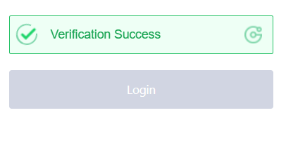
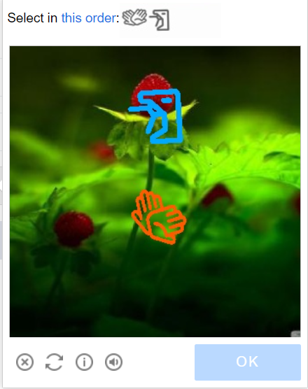
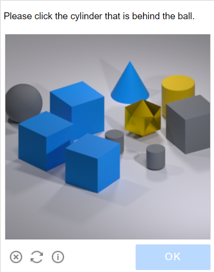

---
sidebar_position: 5
sidebar_label: GeeTestTask
---

import Tabs from '@theme/Tabs';
import TabItem from '@theme/TabItem';
import ParamItem from '@theme/ParamItem';
import MethodItem from '@theme/MethodItem';
import MethodDescription from '@theme/MethodDescription'
import PriceBlock from '@theme/PriceBlock';
import PriceBlockWrap from '@theme/PriceBlockWrap';

# GeeTestTask

<PriceBlockWrap>
  <PriceBlock title="GeeTestTask" name="geeTestToken"/>
</PriceBlockWrap>

这种类型的任务是通过您的代理解决 GeeTest 验证码的问题。
您的应用程序应发送站点地址、公共域键 (`gt`)、键 (`challenge`) 和代理。

解决问题的结果是用于提交表单的三个或五个令牌。

:::warning **注意！**
暂不支持带有 IP 授权的代理。
:::

## 对象结构

:::info
- `gt`、`challenge` 和 `geetestApiServerSubdomain` 参数通常可以在 `initGeetest` JavaScript 函数内找到。
- 您还可以在页面的 HTML 代码中找到它们。您可以在页面完全加载后在 `<sсript>` 块中找到它们。
  
V3


V4 (captcha_id = gt)


:::

<br />

## <span style={{fontSize: '2.25rem'}}>GeeTest V3</span>

### <span style={{fontSize: '1.5rem'}}>可能的验证码变体。</span>

<Tabs className="full-width-tabs">
  <TabItem value="intelligent" label="Intelligent mode" default className="bordered-panel">
    
  </TabItem>
  <TabItem value="slide" label="Slide CAPTCHA" className="bordered-panel">
    
  </TabItem>
  <TabItem value="icon" label="Icon CAPTCHA" className="bordered-panel">
    
  </TabItem>
  <TabItem value="space" label="Space CAPTCHA" className="bordered-panel">
    
  </TabItem>
</Tabs>

### <span style={{fontSize: '1.5rem'}}>请求参数</span>

  <TabItem value="proxy" label="GeeTestTask (using proxy)" className="bordered-panel">
    <ParamItem title="type" required type="string" />
    **GeeTestTask**

    ---

    <ParamItem title="websiteURL" required type="string" />
    解决验证码的页面地址。正確的 Url 始終會傳給請求 https://api-na.geetest.com/gettype.php 上的 Referer？舉例來說： 我們在 https://example.com#login，但我們看到驗證碼實際上沒有在那裡初始化，而是在 https://example.com。

    ---

    <ParamItem title="gt" required type="string" />
    该域名的 GeeTest 标识符键 gt。静态值，更新频率较低。

    ---

    <ParamItem title="challenge" required="required only for V3" type="string" />
    <p> 一个动态密钥。<br />每次调用我们的 API 时，我们需要获取一个新的密钥值。如果验证码已经加载在页面上，则 `challenge` 值不再有效，您将收到 [错误](../api/api-errors.md) `ERROR_TOKEN_EXPIRED`。<br /> 对于带有 `ERROR_TOKEN_EXPIRED` 错误的任务，将会收取费用。 需要检查请求并找到返回此值的请求，并在每次创建识别任务之前执行该请求并解析出挑战值。 </p>

    ---

    <ParamItem title="version" type="integer" required="required only for V4"/>
    3

    ---

    <ParamItem title="geetestApiServerSubdomain" type="string" />
    Geetest API 子域服务器（必须与 api.geetest.com 不同）。<br />可选参数。某些站点可能需要。

    ---

    <ParamItem title="geetestGetLib" type="string" />
    展示验证码脚本的路径。 <br /> 可选参数。某些站点可能需要。<br />以字符串形式发送 JSON。

    ---

    <ParamItem title="proxyType" type="string" />
    **http** - 常规的 HTTP/HTTPS 代理；<br /> **https** - 仅当 "http" 不起作用时尝试此选项（某些自定义代理需要）；<br /> **socks4** - socks4 代理；<br /> **socks5** - socks5 代理。

    ---

    <ParamItem title="proxyAddress" type="string" />
    <p>IPv4/IPv6 代理 IP 地址。不允许使用：</p><p>- 使用主机名；</p><p>- 使用透明代理（可以看到客户端 IP）；</p><p>- 使用本地机器上的代理。</p>

    ---

    <ParamItem title="proxyPort" type="integer" />
    代理端口。

    ---

    <ParamItem title="proxyLogin" type="string" />
    代理服务器登录名。

    ---

    <ParamItem title="proxyPassword" type="string" />
    代理服务器密码。

    ---

    <ParamItem title="userAgent" type="string" />
    用于识别验证码的浏览器 User-Agent。
  </TabItem>


### <span style={{fontSize: '1.5rem'}}>创建任务</span>

<Tabs className="full-width-tabs filled-tabs request-tabs" groupId="captcha-type">
	<TabItem value="proxyless" label="GeeTestTask (without proxy)" default className="method-panel">
		<MethodItem>
			```http
			https://api.capmonster.cloud/createTask
			```
		</MethodItem>
		<MethodDescription>
			**要求**
			```json
			{
				"clientKey":"YOUR_CAPMONSTER_CLOUD_API_KEY",
				"task":
				{
					"type":"GeeTestTask",
					"websiteURL":"https://www.geetest.com/en/demo",
					"gt":"022397c99c9f646f6477822485f30404",
					"challenge":"7f044f48bc951ecfbfc03842b5e1fe59",
					"geetestApiServerSubdomain":"api-na.geetest.com"

				}
			}
			```
			**回应**
			```json
			{
			  "errorId":0,
			  "taskId":407533072
			}
			```
		</MethodDescription>
	</TabItem>

	<TabItem value="proxy" label="GeeTestTask (using proxy)" className="method-panel">
		<MethodItem>
			```http
			https://api.capmonster.cloud/createTask
			```
		</MethodItem>
		<MethodDescription>
			**要求**
			```json 
			  {
				"clientKey":"YOUR_CAPMONSTER_CLOUD_API_KEY",
				"task": {
				  "type":"GeeTestTask",
				  "websiteURL":"https://www.geetest.com/en/demo",
				  "gt":"022397c99c9f646f6477822485f30404",
				  "challenge":"7f044f48bc951ecfbfc03842b5e1fe59",
				  "geetestApiServerSubdomain":"api-na.geetest.com",
				  "proxyType":"http",
				  "proxyAddress":"8.8.8.8",
				  "proxyPort":8080,
				  "proxyLogin":"proxyLoginHere",
				  "proxyPassword":"proxyPasswordHere",
				  "userAgent":"userAgentPlaceholder"
				}
			  }
			```
			**回应**
			```json
			{
			  "errorId":0,
			  "taskId":407533072
			}
			```
		</MethodDescription>
	</TabItem>
  
</Tabs>


使用 [getTaskResult](../api/methods/get-task-result.md) 方法获取 GeeTest 识别结果。根据系统负载，您将在 10 到 30 秒内收到响应。

### <span style={{fontSize: '1.5rem'}}>Get task result</span>

	<TabItem value="proxyless" label="GeeTestTask (without proxy)" default className="method-panel-full">
		<MethodItem>
			```http
			https://api.capmonster.cloud/getTaskResult
			```
		</MethodItem>
		<MethodDescription>
			**要求**
			```json
			{
			  "clientKey":"API_KEY",
			  "taskId": 407533072
			}
			```
			**回应**
			```json
			{
			  "errorId":0,
			  "status":"ready",
			  "solution": {
				"challenge":"0f759dd1ea6c4wc76cedc2991039ca4f23",
				"validate":"6275e26419211d1f526e674d97110e15",
				"seccode":"510cd9735583edcb158601067195a5eb|jordan"
			  }
			}
			```
		</MethodDescription>
	</TabItem>

<br />


<table><tr>
<th><b>属性</b></th><th><b>类型</b></th><th><b>描述</b></th>
</tr>
<tr><td>challenge</td><td>String</td><td rowspan="3">在目标网站提交表单时，这三个参数都是必需的。</td></tr>
<tr><td>validate</td><td>String</td></tr>
<tr><td>seccode</td><td>String</td></tr>
</table>


### <span style={{fontSize: '1.5rem'}}>使用 SDK 库</span>

<Tabs className="full-width-tabs filled-tabs request-tabs" groupId="captcha-type">
  <TabItem value="js" label="JavaScript" default className="method-panel">
    ```js
    // https://github.com/ZennoLab/capmonstercloud-client-js

    import { CapMonsterCloudClientFactory, ClientOptions, GeeTestRequest, /*GeeTestRequest*/ } from '@zennolab_com/capmonstercloud-client';

    document.addEventListener('DOMContentLoaded', async () => {
      const cmcClient = CapMonsterCloudClientFactory.Create(new ClientOptions({ clientKey: '<your capmonster.cloud API key>' }));
      console.log(await cmcClient.getBalance());

      const geetestV3Request = new GeeTestRequest({
        websiteURL: 'https://example.com/geetest.php',
        gt: '81dc9bdb52d04dc20036dbd8313ed055',
        challenge: 'd93591bdf7860e1e4ee2fca799911215',
      });

      // const geetestV3Request = new GeeTestRequest({
      //   websiteURL: 'https://example.com/geetest.php',
      //   gt: '81dc9bdb52d04dc20036dbd8313ed055',
      //   challenge: 'd93591bdf7860e1e4ee2fca799911215',
      //   userAgent: 'userAgentPlaceholder',
      //   proxyType: 'https',
      //   proxyAddress: 'https://proxy.com',
      //   proxyPort: 6045,
      //   proxyLogin: 'login',
      //   proxyPassword: 'password',
      // });

      console.log(await cmcClient.Solve(geetestV3Request));
    });
    ```
  </TabItem>

  <TabItem value="python" label="Python" className="method-panel">
    ```python
    # https://github.com/ZennoLab/capmonstercloud-client-python

    # GeeTestV3:

    import asyncio
    from capmonstercloudclient import CapMonsterClient, ClientOptions
    from capmonstercloudclient.requests import GeetestRequest

    client_options = ClientOptions(api_key="your_api_key")  # Replace with your CapMonsterCloud API key
    cap_monster_client = CapMonsterClient(options=client_options)

    geetest_request = GeetestRequest(
        websiteUrl="https://example.com",  # Website with the captcha
        gt="your_gt_value",  # Replace with the 'gt' parameter
        challenge="your_challenge_value"  # Replace with the 'challenge' parameter
    )

    async def solve_captcha():
        return await cap_monster_client.solve_captcha(geetest_request)

    responses = asyncio.run(solve_captcha())
    print(responses)
    ```

    ```python
    # Geetest V3

    import asyncio
    from capmonstercloudclient import CapMonsterClient, ClientOptions
    from capmonstercloudclient.requests import GeetestRequest

    client_options = ClientOptions(api_key="your_api_key")  # Replace with your CapMonsterCloud API key
    cap_monster_client = CapMonsterClient(options=client_options)

    geetest_request = GeetestRequest(
        websiteUrl="https://example.com",  # Website with the captcha
        gt="your_gt_value",  
        challenge="your_challenge_value",  
        proxyType="http",  # Type of proxy (http, https, socks4, socks5)
        proxyAddress="8.8.8.8",  
        proxyPort=8080,  
        proxyLogin="proxyLoginHere",  
        proxyPassword="proxyPasswordHere", 
        user_agent="Mozilla/5.0 (Windows NT 10.0; Win64; x64) AppleWebKit/537.36 (KHTML, like Gecko) Chrome/130.0.0.0 Safari/537.36"  # Use the current userAgent
    )

    async def solve_captcha():
        return await cap_monster_client.solve_captcha(geetest_request)

    responses = asyncio.run(solve_captcha())
    print(responses)
    ```
  </TabItem>

  <TabItem value="csharp" label="C#" className="method-panel">
    ```csharp
    // https://github.com/ZennoLab/capmonstercloud-client-dotnet

    // GeeTestV3:

    using Zennolab.CapMonsterCloud.Requests;
    using Zennolab.CapMonsterCloud;

    class Program
    {
        static async Task Main(string[] args)
        {
            var clientOptions = new ClientOptions
            {
                ClientKey = "your_api_key" // Replace with your CapMonster Cloud API key
            };

            var cmCloudClient = CapMonsterCloudClientFactory.Create(clientOptions);

            var geetestRequest = new GeeTestRequest
            {
                WebsiteUrl = "https://example.com/demo/geetest", // URL with the captcha
                Gt = "your_gt_value", // Replace with the actual gt value
                Challenge = "your_challenge_value" // Replace with the actual challenge value
            };

            var geetestResult = await cmCloudClient.SolveAsync(geetestRequest);

            Console.WriteLine("Captcha Solution:");
            Console.WriteLine($"Challenge: {geetestResult.Solution.Challenge}");
            Console.WriteLine($"Validate:  {geetestResult.Solution.Validate}");
            Console.WriteLine($"SecCode:   {geetestResult.Solution.SecCode}");
        }
    }
    ```

    ```csharp
    // Geetest V3

    using Zennolab.CapMonsterCloud.Requests;
    using Zennolab.CapMonsterCloud;

    class Program
    {
        static async Task Main(string[] args)
        {
            var clientOptions = new ClientOptions
            {
                ClientKey = "your_api_key" // Replace with your CapMonster Cloud API key
            };

            var cmCloudClient = CapMonsterCloudClientFactory.Create(clientOptions);

            var geetestRequest = new GeeTestRequest
            {
                WebsiteUrl = "https://example.com/demo/geetest", // URL with the captcha
                Gt = "your_gt_value", // Replace with the actual gt value
                Challenge = "your_challenge_value",
                ProxyType = ProxyType.Http,
                ProxyAddress = "8.8.8.8",
                ProxyPort = 8080,
                ProxyLogin = "proxyLoginHere",
                ProxyPassword = "proxyPasswordHere"
            };

            var geetestResult = await cmCloudClient.SolveAsync(geetestRequest);

            Console.WriteLine("Captcha Solution:");
            Console.WriteLine($"Challenge: {geetestResult.Solution.Challenge}");
            Console.WriteLine($"Validate:  {geetestResult.Solution.Validate}");
            Console.WriteLine($"SecCode:   {geetestResult.Solution.SecCode}");
        }
    }
    ```
  </TabItem>  
</Tabs>

<br />


## <span style={{fontSize: '2.25rem'}}>GeeTest V4</span>

### <span style={{fontSize: '1.5rem'}}>可能的验证码变体</span>


### <span style={{fontSize: '1.5rem'}}>请求参数</span>

  <TabItem value="proxy" label="GeeTestTask (using proxy)" className="bordered-panel">
    <ParamItem title="type" required type="string" />
    **GeeTestTask**

    ---

    <ParamItem title="websiteURL" required type="string" />
    解决验证码的页面地址。

    ---

    <ParamItem title="gt" required type="string" />
    该域名的 GeeTest 标识符键 - `captcha_id` 参数。

    ---

    <ParamItem title="version" type="integer" required="required only for V4"/>
    4

    ---

    <ParamItem title="geetestApiServerSubdomain" type="string" />
    Geetest API 子域名服务器（必须不同于 api.geetest.com）。<br />可选参数。某些网站可能需要此参数。

    ---

    <ParamItem title="geetestGetLib" type="string" />
    用于在页面上显示验证码的脚本路径。<br />可选参数。某些网站可能需要此参数。<br />将 JSON 作为字符串发送。

    ---

    <ParamItem title="initParameters" type="object" />
    版本 4 的附加参数，与“riskType”（验证码类型/验证特征）一起使用。

    ---

    <ParamItem title="proxyType" type="string" />
    **http** - 常规的 HTTP/HTTPS 代理；<br /> **https** - 仅当 "http" 不起作用时尝试此选项（某些自定义代理需要）；<br /> **socks4** - socks4 代理；<br /> **socks5** - socks5 代理。

    ---

    <ParamItem title="proxyAddress" type="string" />
    <p>IPv4/IPv6 代理 IP 地址。不允许使用：</p><p>- 使用主机名；</p><p>- 使用透明代理（可以看到客户端 IP）；</p><p>- 使用本地机器上的代理。</p>

    ---

    <ParamItem title="proxyPort" type="integer" />
    代理端口。

    ---

    <ParamItem title="proxyLogin" type="string" />
    代理服务器登录名。

    ---

    <ParamItem title="proxyPassword" type="string" />
    代理服务器密码。

    ---

    <ParamItem title="userAgent" type="string" />
    用于识别验证码的浏览器 User-Agent。
  </TabItem>

### <span style={{fontSize: '1.5rem'}}>Create task method</span>


<Tabs className="full-width-tabs filled-tabs request-tabs" groupId="captcha-type">
	<TabItem value="proxyless" label="GeeTestTask (without proxy)" default className="method-panel">
		<MethodItem>
			```http
			https://api.capmonster.cloud/createTask
			```
		</MethodItem>
		<MethodDescription>
			**要求**
			```json
			{
				"clientKey":"YOUR_CAPMONSTER_CLOUD_API_KEY",
				"task":
				{
					"type":"GeeTestTask",
					"websiteURL":"https://gt4.geetest.com/",
					"gt":"54088bb07d2df3c46b79f80300b0abbe",
					"version": 4,
					"initParameters": {
					  "riskType": "slide"

					}
				}
			}
			```
			**回应**
			```json
			{
			  "errorId":0,
			  "taskId":407533072
			}
			```
		</MethodDescription>
	</TabItem>

	<TabItem value="proxy" label="GeeTestTask (using proxy)" className="method-panel">
		<MethodItem>
			```http
			https://api.capmonster.cloud/createTask
			```
		</MethodItem>
		<MethodDescription>
			**要求**
			```json
			{
			  "clientKey":"YOUR_CAPMONSTER_CLOUD_API_KEY",
			  "task": {
				"type":"GeeTestTask",
				"websiteURL":"https://gt4.geetest.com/",
				"gt":"54088bb07d2df3c46b79f80300b0abbe",
				"version": 4,
				"initParameters": {
				  "riskType": "slide"
				},
				"proxyType":"http",
				"proxyAddress":"8.8.8.8",
				"proxyPort":8080,
				"proxyLogin":"proxyLoginHere",
				"proxyPassword":"proxyPasswordHere",
				"userAgent":"userAgentPlaceholder"

			  }
			}
			```

			**回应**
			```json
			{
			  "errorId":0,
			  "taskId":407533072
			}
			```
		</MethodDescription>
	</TabItem>
  
</Tabs>


使用 [getTaskResult](../api/methods/get-task-result.md) 方法获取 GeeTest 识别结果。根据系统负载，您将在 10 到 30 秒内收到响应。

### <span style={{fontSize: '1.5rem'}}>获取任务结果方法</span>

<TabItem value="proxyless" label="GeeTestTask (without proxy)" default className="method-panel-full">
	<MethodItem>
		```http
		https://api.capmonster.cloud/getTaskResult
		```
	</MethodItem>
	<MethodDescription>
		**要求**
		```json
		{
		  "clientKey":"API_KEY",
		  "taskId": 407533072
		}
		```
		**回应**
		```json
		{
		  "errorId":0,
		  "status":"ready",
		  "solution": {
			"captcha_id":"f5c2ad5a8a3cf37192d8b9c039950f79",
			"lot_number":"bcb2c6ce2f8e4e9da74f2c1fa63bd713",
			"pass_token":"edc7a17716535a5ae624ef4707cb6e7e478dc557608b068d202682c8297695cf",
			"gen_time":"1683794919",
			"captcha_output":"XwmTZEJCJEnRIJBlvtEAZ662T...[cut]...SQ3fX-MyoYOVDMDXWSRQig56"
		  }
		}
		```
	</MethodDescription>
</TabItem>

<br />

<table>
<tr>
<th><b>属性</b></th><th><b>类型</b></th><th><b>描述</b></th>
</tr>
<tr>
<td>captcha_id</td><td>String</td><td rowspan="5">在目标网站提交表单时，这五个参数都是必需的。<br />input[name=captcha\_id]<br />input[name=lot\_number]<br />input[name=pass\_token]<br />input[name=gen\_time]<br />input[name=captcha\_output]</td>
</tr>
<tr><td>lot_number</td><td>String</td></tr>
<tr><td>pass_token</td><td>String</td></tr>
<tr><td>gen_time</td><td>String</td></tr>
<tr><td>captcha_output</td><td>String</td></tr>
</table>

### <span style={{fontSize: '1.5rem'}}>使用 SDK 库</span>

<Tabs className="full-width-tabs filled-tabs request-tabs" groupId="captcha-type">
  <TabItem value="js" label="JavaScript" default className="method-panel">
    ```js
    // https://github.com/ZennoLab/capmonstercloud-client-js

    import { CapMonsterCloudClientFactory, ClientOptions, GeeTestRequest, /*GeeTestRequest*/ } from '@zennolab_com/capmonstercloud-client';

    document.addEventListener('DOMContentLoaded', async () => {
      const cmcClient = CapMonsterCloudClientFactory.Create(new ClientOptions({ clientKey: '<your capmonster.cloud API key>' }));
      console.log(await cmcClient.getBalance());

      const geetestV4Request = new GeeTestRequest({
        websiteURL: 'https://example.com/geetest.php',
        gt: '81dc9bdb52d04dc20036dbd8313ed055',
        challenge: 'd93591bdf7860e1e4ee2fca799911215',
        version: '4',
        initParameters: {
          riskType: 'slide',
        },
      });

      // const geetestV4Request = new GeeTestRequest({
      //   websiteURL: 'https://example.com/geetest.php',
      //   gt: '81dc9bdb52d04dc20036dbd8313ed055',
      //   challenge: 'd93591bdf7860e1e4ee2fca799911215',
      //   version: '4',
      //   initParameters: {
      //     riskType: 'slide',
      //   },
      //   userAgent: 'userAgentPlaceholder',
      //   proxyType: 'https',
      //   proxyAddress: 'https://proxy.com',
      //   proxyPort: 6045,
      //   proxyLogin: 'login',
      //   proxyPassword: 'p@ssword',
      // })

      console.log(await cmcClient.Solve(geetestV4Request));
    });
    ```
  </TabItem>
  
  <TabItem value="python" label="Python" className="method-panel">
    ```python
    # https://github.com/ZennoLab/capmonstercloud-client-python

    # GeeTestV4
    import asyncio
    from capmonstercloudclient import CapMonsterClient, ClientOptions
    from capmonstercloudclient.requests import GeetestRequest

    client_options = ClientOptions(api_key = "your_api_key")  # Replace with your CapMonsterCloud API key
    cap_monster_client = CapMonsterClient(options = client_options)

    gee_test_request = GeetestRequest(
        websiteUrl    = "https://example.com/",  # Website with the captcha 
        gt            = "54088bb07d2df3c46b79f80300b0abbe",  
        version       = 4,  
        initParameters = {
            "riskType": "slide"
        }
    )

    async def solve_captcha():
        return await cap_monster_client.solve_captcha(gee_test_request)

    responses = asyncio.run(solve_captcha())
    print(responses)
    ```

    ```python
    # GeeTestV4
    import asyncio
    from capmonstercloudclient import CapMonsterClient, ClientOptions
    from capmonstercloudclient.requests import GeetestRequest

    client_options = ClientOptions(api_key = "your_api_key")  # Replace with your CapMonsterCloud API key
    cap_monster_client = CapMonsterClient(options = client_options)

    gee_test_request = GeetestRequest(
        websiteUrl    = "https://example.com/",  # Website with the captcha
        gt            = "54088bb07d2df3c46b79f80300b0abbe",  
        version       = 4,  
        initParameters = {
            "riskType": "slide"
        },
        proxyType     = "http",  # Type of proxy (http, https, socks4, socks5)
        proxyAddress  = "8.8.8.8",  
        proxyPort     = 8080, 
        proxyLogin    = "proxyLoginHere",  
        proxyPassword = "proxyPasswordHere",
        user_agent    = "Mozilla/5.0 (Windows NT 10.0; Win64; x64) AppleWebKit/537.36 (KHTML, like Gecko) Chrome/130.0.0.0 Safari/537.36"  # Use the current userAgent
    )

    async def solve_captcha():
        return await cap_monster_client.solve_captcha(gee_test_request)

    responses = asyncio.run(solve_captcha())
    print(responses)
    ```
  </TabItem>
  
  <TabItem value="csharp" label="C#" className="method-panel">
    ```csharp
    // https://github.com/ZennoLab/capmonstercloud-client-dotnet

    // GeeTestV4
    using Zennolab.CapMonsterCloud.Requests;
    using Zennolab.CapMonsterCloud;

    class Program
    {
        static async Task Main(string[] args)
        {
            var clientOptions = new ClientOptions
            {
                ClientKey = "your_api_key" // Replace with your CapMonster Cloud API key
            };

            var cmCloudClient = CapMonsterCloudClientFactory.Create(clientOptions);

            var geetestRequest = new GeeTestRequest
            {
                WebsiteUrl = "https://example.com/", // Website with the captcha
                Gt = "54088bb07d2df3c46b79f80300b0abbe",
                Version = 4,
                InitParameters = new Dictionary<string, string> { { "riskType", "slide" } }
            };

            var geetestResult = await cmCloudClient.SolveAsync(geetestRequest);

            Console.WriteLine("Captcha Solution:");
            Console.WriteLine($"CaptchaId: {geetestResult.Solution.CaptchaId}");
            Console.WriteLine($"LotNumber: {geetestResult.Solution.LotNumber}");
            Console.WriteLine($"PassToken: {geetestResult.Solution.PassToken}");
            Console.WriteLine($"GenTime: {geetestResult.Solution.GenTime}");
            Console.WriteLine($"CaptchaOutput: {geetestResult.Solution.CaptchaOutput}");
        }
    }
    ```

    ```csharp
    // Geetest V4
    using Zennolab.CapMonsterCloud.Requests;
    using Zennolab.CapMonsterCloud;

    class Program
    {
        static async Task Main(string[] args)
        {
            var clientOptions = new ClientOptions
            {
                ClientKey = "your_api_key" // Replace with your CapMonster Cloud API key
            };

            var cmCloudClient = CapMonsterCloudClientFactory.Create(clientOptions);

            var geetestRequest = new GeeTestRequest
            {
                WebsiteUrl = "https://example.com/", // Website with the captcha
                Gt = "54088bb07d2df3c46b79f80300b0abbe", // Replace with the correct gt value
                Version = 4,
                InitParameters = new Dictionary<string, string> { { "riskType", "slide" } },
                ProxyType = ProxyType.Http,
                ProxyAddress = "8.8.8.8",
                ProxyPort = 8080,
                ProxyLogin = "proxyLoginHere",
                ProxyPassword = "proxyPasswordHere"
            };

            var geetestResult = await cmCloudClient.SolveAsync(geetestRequest);

            Console.WriteLine("Captcha Solution:");
            Console.WriteLine($"CaptchaId: {geetestResult.Solution.CaptchaId}");
            Console.WriteLine($"LotNumber: {geetestResult.Solution.LotNumber}");
            Console.WriteLine($"PassToken: {geetestResult.Solution.PassToken}");
            Console.WriteLine($"GenTime: {geetestResult.Solution.GenTime}");
            Console.WriteLine($"CaptchaOutput: {geetestResult.Solution.CaptchaOutput}");
        }
    }
    ```
  </TabItem>
</Tabs>
