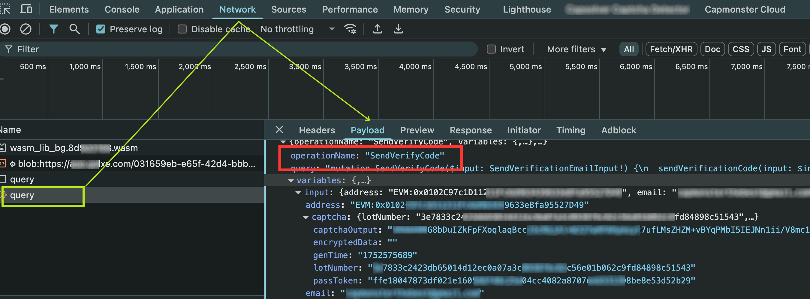

---
sidebar_position: 5
sidebar_label: GeeTest
---

import Tabs from '@theme/Tabs';
import TabItem from '@theme/TabItem';
import ParamItem from '@theme/ParamItem';
import MethodItem from '@theme/MethodItem';
import MethodDescription from '@theme/MethodDescription'
import PriceBlock from '../../../../../src/theme/PriceBlock';
import PriceBlockWrap from '@theme/PriceBlockWrap';
import { ArticleHead } from '../../../../../src/theme/ArticleHead';

<ArticleHead slug="captchas/geetest-task" />

# GeeTest

<PriceBlockWrap>
  <PriceBlock title="GeeTestTask" captchaId="geetest"/>
</PriceBlockWrap>

 

这种类型的任务是通过您的代理解决 GeeTest 验证码的问题。
您的应用程序应发送站点地址、公共域键 (`gt`)、键 (`challenge`) 和代理。

解决问题的结果是用于提交表单的三个或五个令牌。

:::warning **注意！**
* CapMonster Cloud 默认通过内置代理工作——这些代理已包含在费用内。仅当网站不接受令牌或对内置服务的访问受限时，才需要指定您自己的代理。

* 暂不支持带有 IP 授权的代理。
:::

## 对象结构

:::info
- `gt`、`challenge` 和 `geetestApiServerSubdomain` 参数通常可以在 `initGeetest` JavaScript 函数内找到。
- 您还可以在页面的 HTML 代码中找到它们。您可以在页面完全加载后在 `<sсript>` 块中找到它们。
  
V3


V4 (captcha_id = gt)


:::

<br />

## <span style={{fontSize: '2.25rem'}}>GeeTest V3</span>

### <span style={{fontSize: '1.5rem'}}>可能的验证码变体。</span>

<Tabs className="full-width-tabs">
  <TabItem value="intelligent" label="Intelligent mode" default className="bordered-panel">
    
  </TabItem>
  <TabItem value="slide" label="Slide CAPTCHA" className="bordered-panel">
    
  </TabItem>
  <TabItem value="icon" label="Icon CAPTCHA" className="bordered-panel">
    
  </TabItem>
  <TabItem value="space" label="Space CAPTCHA" className="bordered-panel">
    
  </TabItem>
</Tabs>

### <span style={{fontSize: '1.5rem'}}>请求参数</span>

  <TabItem value="proxy" label="GeeTestTask (using proxy)" className="bordered-panel">
    <ParamItem title="type" required type="string" />
    **GeeTestTask**

    ---

    <ParamItem title="websiteURL" required type="string" />
    解决验证码的页面地址。正確的 Url 始終會傳給請求 https://api-na.geetest.com/gettype.php 上的 Referer？舉例來說： 我們在 https://example.com#login，但我們看到驗證碼實際上沒有在那裡初始化，而是在 https://example.com。

    ---

    <ParamItem title="gt" required type="string" />
    该域名的 GeeTest 标识符键 gt。静态值，更新频率较低。

    ---

    <ParamItem title="challenge" required="required only for V3" type="string" />
    <p> 一个动态密钥。<br />每次调用我们的 API 时，我们需要获取一个新的密钥值。如果验证码已经加载在页面上，则 `challenge` 值不再有效，您将收到 [错误](../api/api-errors.mdx) `ERROR_TOKEN_EXPIRED`。<br /> 对于带有 `ERROR_TOKEN_EXPIRED` 错误的任务，将会收取费用。 需要检查请求并找到返回此值的请求，并在每次创建识别任务之前执行该请求并解析出挑战值。 </p>

    ---

    <ParamItem title="version" type="integer" required="required only for V4"/>
    3

    ---

    <ParamItem title="geetestApiServerSubdomain" type="string" />
    Geetest API 子域服务器（必须与 api.geetest.com 不同）。<br />可选参数。某些站点可能需要。

    ---

    <ParamItem title="geetestGetLib" type="string" />
    展示验证码脚本的路径。 <br /> 可选参数。某些站点可能需要。<br />以字符串形式发送 JSON。

    ---

    <ParamItem title="proxyType" type="string" />
    **http** - 常规的 HTTP/HTTPS 代理；<br /> **https** - 仅当 "http" 不起作用时尝试此选项（某些自定义代理需要）；<br /> **socks4** - socks4 代理；<br /> **socks5** - socks5 代理。

    ---

    <ParamItem title="proxyAddress" type="string" />
<p>
  代理IPv4/IPv6地址。禁止使用：
    - 透明代理（客户端IP可见）；
    - 本地机器代理。
</p>

---

    ---

    <ParamItem title="proxyPort" type="integer" />
    代理端口。

    ---

    <ParamItem title="proxyLogin" type="string" />
    代理服务器登录名。

    ---

    <ParamItem title="proxyPassword" type="string" />
    代理服务器密码。

    ---

    <ParamItem title="userAgent" type="string" />
    浏览器的 User-Agent。<br />
**请仅传递当前 Windows 系统下的有效 UA。当前推荐值为**：`userAgentPlaceholder`

  </TabItem>


### <span style={{fontSize: '1.5rem'}}>创建任务</span>

<Tabs className="full-width-tabs filled-tabs request-tabs" groupId="captcha-type">
	<TabItem value="proxyless" label="GeeTestTask (without proxy)" default className="method-panel">
		<MethodItem>
			```http
			https://api.capmonster.cloud/createTask
			```
		</MethodItem>
		<MethodDescription>
			**要求**
			```json
			{
				"clientKey":"YOUR_CAPMONSTER_CLOUD_API_KEY",
				"task":
				{
					"type":"GeeTestTask",
					"websiteURL":"https://www.geetest.com/en/demo",
					"gt":"022397c99c9f646f6477822485f30404",
					"challenge":"7f044f48bc951ecfbfc03842b5e1fe59",
					"geetestApiServerSubdomain":"api-na.geetest.com"

				}
			}
			```
			**回应**
			```json
			{
			  "errorId":0,
			  "taskId":407533072
			}
			```
		</MethodDescription>
	</TabItem>

	<TabItem value="proxy" label="GeeTestTask (using proxy)" className="method-panel">
		<MethodItem>
			```http
			https://api.capmonster.cloud/createTask
			```
		</MethodItem>
		<MethodDescription>
			**要求**
			```json 
			  {
				"clientKey":"YOUR_CAPMONSTER_CLOUD_API_KEY",
				"task": {
				  "type":"GeeTestTask",
				  "websiteURL":"https://www.geetest.com/en/demo",
				  "gt":"022397c99c9f646f6477822485f30404",
				  "challenge":"7f044f48bc951ecfbfc03842b5e1fe59",
				  "geetestApiServerSubdomain":"api-na.geetest.com",
				  "proxyType":"http",
				  "proxyAddress":"8.8.8.8",
				  "proxyPort":8080,
				  "proxyLogin":"proxyLoginHere",
				  "proxyPassword":"proxyPasswordHere",
				  "userAgent":"userAgentPlaceholder"
				}
			  }
			```
			**回应**
			```json
			{
			  "errorId":0,
			  "taskId":407533072
			}
			```
		</MethodDescription>
	</TabItem>
  
</Tabs>


使用 [getTaskResult](../api/methods/get-task-result.mdx) 方法获取 GeeTest 识别结果。根据系统负载，您将在 10 到 30 秒内收到响应。

### <span style={{fontSize: '1.5rem'}}>Get task result</span>

	<TabItem value="proxyless" label="GeeTestTask (without proxy)" default className="method-panel-full">
		<MethodItem>
			```http
			https://api.capmonster.cloud/getTaskResult
			```
		</MethodItem>
		<MethodDescription>
			**要求**
			```json
			{
			  "clientKey":"API_KEY",
			  "taskId": 407533072
			}
			```
			**回应**
			```json
			{
			  "errorId":0,
			  "status":"ready",
			  "solution": {
				"challenge":"0f759dd1ea6c4wc76cedc2991039ca4f23",
				"validate":"6275e26419211d1f526e674d97110e15",
				"seccode":"510cd9735583edcb158601067195a5eb|jordan"
			  }
			}
			```
		</MethodDescription>
	</TabItem>

<br />


<table><tr>
<th><b>属性</b></th><th><b>类型</b></th><th><b>描述</b></th>
</tr>
<tr><td>challenge</td><td>String</td><td rowspan="3">在目标网站提交表单时，这三个参数都是必需的。</td></tr>
<tr><td>validate</td><td>String</td></tr>
<tr><td>seccode</td><td>String</td></tr>
</table>

## 如何查找任务创建所需的所有参数

### 手动方式

1. 请在浏览器中访问您的网站，该网站包含验证码功能。
2. 右键点击验证码元素，选择 **检查（Inspect）**。

所有参数可以在请求中的 *init-params* 中找到：


### 自动方法

为了自动化获取所需参数，可以通过 **浏览器**（普通模式或 headless 模式，例如使用 **Playwright**）进行提取，或直接从 **HTTP 请求**中获取。由于动态参数的有效时间较短，建议在获取后尽快使用。

:::warning **重要**
所提供的代码片段仅作为获取必要参数的基础示例。具体实现方式取决于包含验证码的网站、本身的页面结构，以及所使用的 HTML 元素和选择器。
:::

<Tabs className="full-width-tabs filled-tabs request-tabs">
  <TabItem value="js" label="JavaScript" default className="method-panel">
    <details>
      <summary>显示代码（浏览器内）</summary>

      ```js
      (function detectGeeTestV3Browser() {
        const t = Date.now();
        const url = `https://example.com/api/v1/captcha/gee-test/init-params?t=${t}`;

        fetch(url)
          .then(res => res.json())
          .then(data => {
            const { gt, challenge } = data;
            if (gt && challenge) {
              console.log("检测到 GeeTest v3:");
              console.log({ gt, challenge });
            } else {
              console.log("未找到 gt/challenge 参数");
            }
          })
          .catch(err => console.error("请求错误:", err));
      })();
      ```
    </details>

    <details>
      <summary>显示代码（Node.js）</summary>

      ```js
      async function detectGeeTestV3() {
        const result = {
          version: null,
          data: {},
        };

        const t = Date.now(); // 获取当前时间戳
        try {
          const response = await fetch(
            `https://example.com/api/v1/captcha/gee-test/init-params?t=${t}`
          );

          if (response.ok) {
            const data = await response.json();
            const challenge = data.challenge;
            const gt = data.gt;

            if (gt && challenge) {
              result.version = "v3";
              result.data = { gt, challenge };
              console.log(result.data);
            } else {
              console.log("错误: 缺少 gt 或 challenge");
            }
          } else {
            console.log("错误: 响应状态无效", response.status);
          }
        } catch (error) {
          console.error("请求失败", error);
        }

        return result;
      }

      detectGeeTestV3();
      ```
    </details>
  </TabItem>

  <TabItem value="python" label="Python" className="method-panel">
    <details>
      <summary>显示代码</summary>

      ```python
      import requests
      import asyncio
      import time

      async def detect_gee_test_v3():
        result = {
            'version': None,
            'data': {},
        }

        t = int(time.time() * 1000)
        response = requests.get(f'https://example.com/api/v1/captcha/gee-test/init-params?t={t}')
        
        if response.status_code == 200:
            data = response.json()
            challenge = data.get('challenge')
            gt = data.get('gt')

            if gt and challenge:
                result['version'] = 'v3'
                result['data'] = {'gt': gt, 'challenge': challenge}
                print(result['data'])
            else:
                print('错误')

        return result

      asyncio.run(detect_gee_test_v3())
      ```
    </details>
  </TabItem>

  <TabItem value="csharp" label="C#" className="method-panel">
    <details>
      <summary>显示代码</summary>

      ```csharp
      using System;
      using System.Net.Http;
      using System.Threading.Tasks;
      using Newtonsoft.Json.Linq;

      class Program
      {
          static async Task DetectGeeTestV3()
          {
              var result = new
              {
                  version = (string)null,
                  data = new { gt = (string)null, challenge = (string)null },
              };

              using (var client = new HttpClient())
              {
                  long t = DateTimeOffset.Now.ToUnixTimeMilliseconds();
                  var url = $"https://example.com/api/v1/captcha/gee-test/init-params?t={t}";

                  var response = await client.GetAsync(url);

                  if (response.IsSuccessStatusCode)
                  {
                      var responseContent = await response.Content.ReadAsStringAsync();
                      var data = JObject.Parse(responseContent);
                      var challenge = data["challenge"]?.ToString();
                      var gt = data["gt"]?.ToString();

                      if (!string.IsNullOrEmpty(gt) && !string.IsNullOrEmpty(challenge))
                      {
                          result = new
                          {
                              version = "v3",
                              data = new { gt = gt, challenge = challenge }
                          };
                          Console.WriteLine($"GT: {gt}, Challenge: {challenge}");
                      }
                      else
                      {
                          Console.WriteLine("错误: 缺少必要参数。");
                      }
                  }
                  else
                  {
                      Console.WriteLine("错误: 获取响应失败。");
                  }
              }
          }

          static async Task Main(string[] args)
          {
              await DetectGeeTestV3();
          }
      }
      ```
    </details>
  </TabItem>
</Tabs>

## <span style={{fontSize: '1.5rem'}}>使用 SDK 库</span>

<Tabs className="full-width-tabs filled-tabs request-tabs" groupId="captcha-type">
  <TabItem value="js" label="JavaScript" default className="method-panel">
  <details>
      <summary>显示代码（用于浏览器）</summary>
    ```js
    // https://github.com/ZennoLab/capmonstercloud-client-js

    import { 
        CapMonsterCloudClientFactory, 
        ClientOptions, 
        GeeTestRequest 
    } from '@zennolab_com/capmonstercloud-client';

    const API_KEY = "YOUR_API_KEY"; // 输入您的 CapMonster Cloud API 密钥

    document.addEventListener('DOMContentLoaded', async () => {
        const client = CapMonsterCloudClientFactory.Create(
            new ClientOptions({ clientKey: API_KEY })
        );

        // 如有必要，可以检查余额
        const balance = await client.getBalance();
        console.log("Balance:", balance);

        // 基本示例，无需代理
        // CapMonster Cloud 会自动使用它们的代理
        let geetestRequest = new GeeTestRequest({
            websiteURL: "https://example.com/geetest.php", // 验证码页面的 URL
            gt: "81dc9bdb52d04dc20036dbd8313ed055",        // 替换为正确的值
            challenge: "d93591bdf7860e1e4ee2fca799911215"  // 替换为正确的值
        });

        // 使用您自己的代理的示例
        // 如果想使用自己的代理，请取消注释以下代码块

        /*
        const proxy = {
            proxyType: "https",
            proxyAddress: "123.45.67.89",
            proxyPort: 8080,
            proxyLogin: "username",
            proxyPassword: "password"
        };

        geetestRequest = new GeeTestRequest({
            websiteURL: "https://example.com/geetest.php",
            gt: "81dc9bdb52d04dc20036dbd8313ed055",
            challenge: "d93591bdf7860e1e4ee2fca799911215",
            proxy,
            userAgent: "userAgentPlaceholder"
        });
        */

        const result = await client.Solve(geetestRequest);
        console.log("Solution:", result);
    });
    ```
</details>

<details>
      <summary>显示代码 (Node.js)</summary>
```javascript
// https://github.com/ZennoLab/capmonstercloud-client-js

import { CapMonsterCloudClientFactory, ClientOptions, GeeTestRequest } from '@zennolab_com/capmonstercloud-client';

const API_KEY = "YOUR_API_KEY"; // 输入您的 CapMonster Cloud API 密钥

async function solveGeeTest() {
    const client = CapMonsterCloudClientFactory.Create(
        new ClientOptions({ clientKey: API_KEY })
    );

    // 如有必要，可以检查余额
    const balance = await client.getBalance();
    console.log("Balance:", balance);

    // 基本示例，无需代理
    // CapMonster Cloud 会自动使用它们的代理
    let geetestRequest = new GeeTestRequest({
        websiteURL: "https://example.com/geetest.php", // 验证码页面的 URL
        gt: "81dc9bdb52d04dc20036dbd8313ed055",       // 替换为正确的值
        challenge: "d93591bdf7860e1e4ee2fca799911215" // 替换为正确的值
    });

    // 使用您自己的代理的示例
    // 如果想使用自己的代理，请取消注释以下代码块

    /*
    const proxy = {
        proxyType: "https",
        proxyAddress: "123.45.67.89",
        proxyPort: 8080,
        proxyLogin: "username",
        proxyPassword: "password"
    };

    geetestRequest = new GeeTestRequest({
        websiteURL: "https://example.com/geetest.php",
        gt: "81dc9bdb52d04dc20036dbd8313ed055",
        challenge: "d93591bdf7860e1e4ee2fca799911215",
        proxy,
        userAgent: "userAgentPlaceholder"
    });
    */

    const result = await client.Solve(geetestRequest);
    console.log("Solution:", result);
}

solveGeeTest().catch(console.error);
```
</details>
  </TabItem>

  <TabItem value="python" label="Python" className="method-panel">
  <details>
      <summary>显示代码</summary>
    ```python
    # https://github.com/ZennoLab/capmonstercloud-client-python

    import asyncio
    from capmonstercloudclient import CapMonsterClient, ClientOptions
    from capmonstercloudclient.requests import GeetestRequest
    # from capmonstercloudclient.requests.baseRequestWithProxy import ProxyInfo   # 如果计划使用代理，请取消注释

    API_KEY = "YOUR_API_KEY"  # 输入您的 CapMonster Cloud API 密钥

    async def solve_geetest():
        client_options = ClientOptions(api_key=API_KEY)
        cap_monster_client = CapMonsterClient(options=client_options)

        # 基本示例，无需代理
        # CapMonster Cloud 会自动使用它们的代理
        geetest_request = GeetestRequest(
            websiteUrl="https://example.com",
            gt="81dc9bdb52d04dc20036dbd8313ed055",
            challenge="d93591bdf7860e1e4ee2fca799911215"
        )

        # 使用您自己的代理的示例
        # 如果想使用自己的代理，请取消注释以下代码块

        # proxy = ProxyInfo(
        #     proxyType="http",
        #     proxyAddress="123.45.67.89",
        #     proxyPort=8080,
        #     proxyLogin="username",
        #     proxyPassword="password"
        # )

        # geetest_request = GeetestRequest(
        #     websiteUrl="https://example.com",
        #     gt="81dc9bdb52d04dc20036dbd8313ed055",
        #     challenge="d93591bdf7860e1e4ee2fca799911215",
        #     proxy=proxy,
        #     userAgent="userAgentPlaceholder"
        # )

        # 如有必要，可以检查余额
        balance = await cap_monster_client.get_balance()
        print("Balance:", balance)

        result = await cap_monster_client.solve_captcha(geetest_request)
        print("Solution:", result)

    asyncio.run(solve_geetest())
    ```
    </details>
  </TabItem>

  <TabItem value="csharp" label="C#" className="method-panel">
  <details>
      <summary>显示代码</summary>
```csharp
// https://github.com/ZennoLab/capmonstercloud-client-dotnet

using System;
using System.Threading.Tasks;
using Zennolab.CapMonsterCloud;
using Zennolab.CapMonsterCloud.Requests;

class Program
{
    static async Task Main(string[] args)
    {
        // 输入您的 CapMonster Cloud API 密钥
        var clientOptions = new ClientOptions
        {
            ClientKey = "YOUR_API_KEY"
        };

        var cmCloudClient = CapMonsterCloudClientFactory.Create(clientOptions);

        // 如有必要，可以检查余额
        var balance = await cmCloudClient.GetBalanceAsync();
        Console.WriteLine("Balance: " + balance);

        // 基本示例，无需代理
        // CapMonster Cloud 会自动使用它们的代理
        var geetestRequest = new GeeTestRequest
        {
            WebsiteUrl = "https://example.com/demo/geetest", // 页面中验证码的 URL
            Gt = "your_gt_value",                             // 替换为正确的值
            Challenge = "your_challenge_value"               // 替换为正确的值
        };

        // 使用您自己的代理的示例
        // 如果想使用自己的代理，请取消注释以下代码块
        /*
        var geetestRequest = new GeeTestRequest
        {
            WebsiteUrl = "https://example.com/demo/geetest", // 页面中验证码的 URL
            Gt = "your_gt_value",  
            Challenge = "your_challenge_value",

            Proxy = new ProxyContainer(
                "123.45.67.89", 
                8080,           
                ProxyType.Http,    
                "username",  
                "password"
            )
        };
        */

        var geetestResult = await cmCloudClient.SolveAsync(geetestRequest);

        Console.WriteLine("Solution:");
        Console.WriteLine($"Challenge: {geetestResult.Solution.Challenge}");
        Console.WriteLine($"Validate:  {geetestResult.Solution.Validate}");
        Console.WriteLine($"SecCode:   {geetestResult.Solution.SecCode}");
    }
}
```
</details>
  </TabItem>  
</Tabs>

<br />

## <span style={{fontSize: '2.25rem'}}>GeeTest V4</span>

### <span style={{fontSize: '1.5rem'}}>可能的验证码变体</span>


### <span style={{fontSize: '1.5rem'}}>请求参数</span>

  <TabItem value="proxy" label="GeeTestTask (using proxy)" className="bordered-panel">
    <ParamItem title="type" required type="string" />
    **GeeTestTask**

    ---

    <ParamItem title="websiteURL" required type="string" />
    解决验证码的页面地址。

    ---

    <ParamItem title="gt" required type="string" />
    该域名的 GeeTest 标识符键 - `captcha_id` 参数。

    ---

    <ParamItem title="version" type="integer" required="required only for V4"/>
    4

    ---

    <ParamItem title="geetestApiServerSubdomain" type="string" />
    Geetest API 子域名服务器（必须不同于 api.geetest.com）。<br />可选参数。某些网站可能需要此参数。

    ---

    <ParamItem title="geetestGetLib" type="string" />
    用于在页面上显示验证码的脚本路径。<br />可选参数。某些网站可能需要此参数。<br />将 JSON 作为字符串发送。

    ---

    <ParamItem title="initParameters" type="object" />
    版本 4 的附加参数，与“riskType”（验证码类型/验证特征）一起使用。

    ---

    <ParamItem title="proxyType" type="string" />
    **http** - 常规的 HTTP/HTTPS 代理；<br /> **https** - 仅当 "http" 不起作用时尝试此选项（某些自定义代理需要）；<br /> **socks4** - socks4 代理；<br /> **socks5** - socks5 代理。

    ---

    <ParamItem title="proxyAddress" type="string" />
    <p>IPv4/IPv6 代理 IP 地址。不允许使用：</p><p>- 使用主机名；</p><p>- 使用透明代理（可以看到客户端 IP）；</p><p>- 使用本地机器上的代理。</p>

    ---

    <ParamItem title="proxyPort" type="integer" />
    代理端口。

    ---

    <ParamItem title="proxyLogin" type="string" />
    代理服务器登录名。

    ---

    <ParamItem title="proxyPassword" type="string" />
    代理服务器密码。

    ---

    <ParamItem title="userAgent" type="string" />
    用于识别验证码的浏览器 User-Agent。
  </TabItem>

### <span style={{fontSize: '1.5rem'}}>Create task method</span>


<Tabs className="full-width-tabs filled-tabs request-tabs" groupId="captcha-type">
	<TabItem value="proxyless" label="GeeTestTask (without proxy)" default className="method-panel">
		<MethodItem>
			```http
			https://api.capmonster.cloud/createTask
			```
		</MethodItem>
		<MethodDescription>
			**要求**
			```json
			{
				"clientKey":"YOUR_CAPMONSTER_CLOUD_API_KEY",
				"task":
				{
					"type":"GeeTestTask",
					"websiteURL":"https://gt4.geetest.com/",
					"gt":"54088bb07d2df3c46b79f80300b0abbe",
					"version": 4,
					"initParameters": {
					  "riskType": "slide"

					}
				}
			}
			```
			**回应**
			```json
			{
			  "errorId":0,
			  "taskId":407533072
			}
			```
		</MethodDescription>
	</TabItem>

	<TabItem value="proxy" label="GeeTestTask (using proxy)" className="method-panel">
		<MethodItem>
			```http
			https://api.capmonster.cloud/createTask
			```
		</MethodItem>
		<MethodDescription>
			**要求**
			```json
			{
			  "clientKey":"YOUR_CAPMONSTER_CLOUD_API_KEY",
			  "task": {
				"type":"GeeTestTask",
				"websiteURL":"https://gt4.geetest.com/",
				"gt":"54088bb07d2df3c46b79f80300b0abbe",
				"version": 4,
				"initParameters": {
				  "riskType": "slide"
				},
				"proxyType":"http",
				"proxyAddress":"8.8.8.8",
				"proxyPort":8080,
				"proxyLogin":"proxyLoginHere",
				"proxyPassword":"proxyPasswordHere",
				"userAgent":"userAgentPlaceholder"

			  }
			}
			```

			**回应**
			```json
			{
			  "errorId":0,
			  "taskId":407533072
			}
			```
		</MethodDescription>
	</TabItem>
  
</Tabs>


使用 [getTaskResult](../api/methods/get-task-result.mdx) 方法获取 GeeTest 识别结果。根据系统负载，您将在 10 到 30 秒内收到响应。

### <span style={{fontSize: '1.5rem'}}>获取任务结果方法</span>

<TabItem value="proxyless" label="GeeTestTask (without proxy)" default className="method-panel-full">
	<MethodItem>
		```http
		https://api.capmonster.cloud/getTaskResult
		```
	</MethodItem>
	<MethodDescription>
		**要求**
		```json
		{
		  "clientKey":"API_KEY",
		  "taskId": 407533072
		}
		```
		**回应**
		```json
		{
		  "errorId":0,
		  "status":"ready",
		  "solution": {
			"captcha_id":"f5c2ad5a8a3cf37192d8b9c039950f79",
			"lot_number":"bcb2c6ce2f8e4e9da74f2c1fa63bd713",
			"pass_token":"edc7a17716535a5ae624ef4707cb6e7e478dc557608b068d202682c8297695cf",
			"gen_time":"1683794919",
			"captcha_output":"XwmTZEJCJEnRIJBlvtEAZ662T...[cut]...SQ3fX-MyoYOVDMDXWSRQig56"
		  }
		}
		```
	</MethodDescription>
</TabItem>

<br />

<table>
<tr>
<th><b>属性</b></th><th><b>类型</b></th><th><b>描述</b></th>
</tr>
<tr>
<td>captcha_id</td><td>String</td><td rowspan="5">在目标网站提交表单时，这五个参数都是必需的。<br />input[name=captcha\_id]<br />input[name=lot\_number]<br />input[name=pass\_token]<br />input[name=gen\_time]<br />input[name=captcha\_output]</td>
</tr>
<tr><td>lot_number</td><td>String</td></tr>
<tr><td>pass_token</td><td>String</td></tr>
<tr><td>gen_time</td><td>String</td></tr>
<tr><td>captcha_output</td><td>String</td></tr>
</table>

## 如何查找任务创建所需的所有参数

### 手动方式

1. 请在浏览器中访问您的网站，该网站包含验证码功能。
2. 右键点击验证码元素，选择 **检查（Inspect）**。

参数可能加载于 *load?callback*：


### 自动方法

一种方便的自动化获取所有必要参数的方式。
某些参数每次页面加载时都会重新生成，因此需要通过浏览器（普通或无头模式，如使用**Playwright**）提取它们。
由于动态参数值的有效期很短，获取后必须立即解决验证码。

:::warning **重要提示！**
提供的代码片段是用于熟悉参数提取的基本示例。具体实现将取决于验证码页面、其结构及使用的HTML元素/选择器。
:::

<Tabs className="full-width-tabs filled-tabs request-tabs">
  <TabItem value="js" label="JavaScript" default className="method-panel">
    <details>
      <summary>显示代码（浏览器中运行）</summary>

      ```js
      (function() {
        function getQueryParams(url) {
          const params = new URLSearchParams(new URL(url).search);
          const captchaId = params.get('captcha_id');
          const challenge = params.get('challenge');
          const riskType = params.get('risk_type');
          return { captchaId, challenge, riskType };
        }

        const observer = new PerformanceObserver((list) => {
          const entries = list.getEntriesByType('resource');
          entries.forEach((entry) => {
            if (entry.name.includes('https://gcaptcha4.geetest.com/load?')) {
              const { captchaId, challenge, riskType } = getQueryParams(entry.name);
              if (captchaId && challenge) {
                console.log('检测到 GeeTest v4（通过 PerformanceObserver）:');
                console.log({ captchaId, challenge, riskType });
              }
            }
          });
        });

        observer.observe({ type: 'resource', buffered: true });
      })();
      ```
    </details>

    <details>
      <summary>显示代码（Node.js）</summary>

      ```js
      import { chromium } from "playwright";

      async function detectGeeTestV4(pageUrl) {
        const result = { version: null, data: {} };

        const browser = await chromium.launch({ headless: false });
        const context = await browser.newContext();
        const page = await context.newPage();

        page.on("response", async (response) => {
          const url = response.url();
          if (url.includes("https://gcaptcha4.geetest.com/load?")) {
            const urlParams = new URLSearchParams(url.split("?")[1]);
            const captchaId = urlParams.get("captcha_id");
            const challenge = urlParams.get("challenge");
            const riskType = urlParams.get("risk_type");

            if (captchaId && challenge && !result.version) {
              result.version = "v4";
              result.data = {
                captchaId: captchaId,
                challenge: challenge,
                riskType: riskType,
              };
              console.log("检测到 GeeTest v4:");
              console.log(result.data);
            }
          }
        });

        await page.goto(pageUrl, { waitUntil: "networkidle" });
        await page.waitForTimeout(20000);

        if (!result.version) {
          console.log("错误");
        }

        await browser.close();
        return result;
      }

      detectGeeTestV4("https://example.com").then((result) => {
        console.log(result);
      });
      ```
    </details>
  </TabItem>

  <TabItem value="python" label="Python" className="method-panel">
    <details>
      <summary>显示代码</summary>

      ```python
      import asyncio
      from playwright.async_api import async_playwright
      from urllib.parse import urlparse, parse_qs

      async def detect_geetest_v4(page_url):
          result = {"version": None, "data": {}}

          async with async_playwright() as p:
              browser = await p.chromium.launch(headless=False)
              context = await browser.new_context()
              page = await context.new_page()

              async def on_request(request):
                  url = request.url
                  if "https://gcaptcha4.geetest.com/load?" in url:
                      query = parse_qs(urlparse(url).query)
                      captcha_id = query.get("captcha_id", [None])[0]
                      challenge = query.get("challenge", [None])[0]
                      risk_type = query.get("risk_type", [None])[0]

                      if captcha_id and challenge and not result["version"]:
                          result["version"] = "v4"
                          result["data"] = {
                              "captchaId": captcha_id,
                              "challenge": challenge,
                              "riskType": risk_type
                          }
                          print("检测到 GeeTest v4:")
                          print(result["data"])

              context.on("request", on_request)

              await page.goto(page_url, wait_until="networkidle")
              await asyncio.sleep(10)

              if not result["version"]:
                  print("错误")

              await browser.close()
              return result

      asyncio.run(detect_geetest_v4("https://www.example.com"))
      ```
    </details>
  </TabItem>

  <TabItem value="csharp" label="C#" className="method-panel">
    <details>
      <summary>显示代码</summary>

      ```csharp
      using System;
      using System.Threading.Tasks;
      using Microsoft.Playwright;
      using System.Web;

      class Program
      {
          public static async Task Main(string[] args)
          {
              var result = new
              {
                  Version = (string)null,
                  Data = new
                  {
                      CaptchaId = (string)null,
                      Challenge = (string)null,
                      RiskType = (string)null
                  }
              };

              using var playwright = await Playwright.CreateAsync();
              var browser = await playwright.Chromium.LaunchAsync(new BrowserTypeLaunchOptions
              {
                  Headless = false
              });

              var context = await browser.NewContextAsync();
              var page = await context.NewPageAsync();

              page.Request += (_, request) =>
              {
                  var url = request.Url;

                  if (url.Contains("https://gcaptcha4.geetest.com/load?"))
                  {
                      var uri = new Uri(url);
                      var queryParams = HttpUtility.ParseQueryString(uri.Query);
                      var captchaId = queryParams.Get("captcha_id");
                      var challenge = queryParams.Get("challenge");
                      var riskType = queryParams.Get("risk_type");

                      if (!string.IsNullOrEmpty(captchaId) && !string.IsNullOrEmpty(challenge))
                      {
                          Console.WriteLine("检测到 GeeTest v4:");
                          Console.WriteLine($"CaptchaId: {captchaId}");
                          Console.WriteLine($"Challenge: {challenge}");
                          Console.WriteLine($"RiskType: {riskType}");
                      }
                  }
              };

              await page.GotoAsync("https://www.example.com/", new PageGotoOptions
              {
                  WaitUntil = WaitUntilState.NetworkIdle
              });

              await Task.Delay(10000);

              await browser.CloseAsync();
          }
      }
      ```
    </details>
  </TabItem>
</Tabs>

## <span style={{fontSize: '1.5rem'}}>使用 SDK 库</span>

<Tabs className="full-width-tabs filled-tabs request-tabs" groupId="captcha-type">
  <TabItem value="js" label="JavaScript" default className="method-panel">
  <details>
      <summary>显示代码（用于浏览器）</summary>
```js
// https://github.com/ZennoLab/capmonstercloud-client-js

import { 
    CapMonsterCloudClientFactory, 
    ClientOptions, 
    GeeTestRequest 
} from '@zennolab_com/capmonstercloud-client';

const API_KEY = "YOUR_API_KEY"; // 输入您的 CapMonster Cloud API 密钥

document.addEventListener('DOMContentLoaded', async () => {
    const client = CapMonsterCloudClientFactory.Create(
        new ClientOptions({ clientKey: API_KEY })
    );

    // 如有必要，可以检查余额
    const balance = await client.getBalance();
    console.log("Balance:", balance);

    // 基本示例，无需代理
    // CapMonster Cloud 会自动使用它们的代理
    let geetestRequest = new GeeTestRequest({
        websiteURL: "https://example.com/geetest.php", // 页面中验证码的 URL
        gt: "81dc9bdb52d04dc20036dbd8313ed055",
        challenge: "d93591bdf7860e1e4ee2fca799911215",
        version: "4",
        initParameters: { riskType: "slide" }
    });

    // 使用您自己的代理的示例
    // 如果想使用自己的代理，请取消注释以下代码块

    /*
    const proxy = {
        proxyType: "https",
        proxyAddress: "123.45.67.89",
        proxyPort: 8080,
        proxyLogin: "username",
        proxyPassword: "password"
    };

    geetestRequest = new GeeTestRequest({
        websiteURL: "https://example.com/geetest.php",
        gt: "81dc9bdb52d04dc20036dbd8313ed055",
        challenge: "d93591bdf7860e1e4ee2fca799911215",
        version: "4",
        initParameters: { riskType: "slide" },
        proxy,
        userAgent: "userAgentPlaceholder"
    });
    */

    const result = await client.Solve(geetestRequest);
    console.log("Solution:", result);
});
```
    </details>
<details>
      <summary>显示代码 (Node.js)</summary>
```javascript
// https://github.com/ZennoLab/capmonstercloud-client-js

import { CapMonsterCloudClientFactory, ClientOptions, GeeTestRequest } from '@zennolab_com/capmonstercloud-client';

const API_KEY = "YOUR_API_KEY"; // 输入您的 CapMonster Cloud API 密钥

async function solveGeeTest() {
    const client = CapMonsterCloudClientFactory.Create(
        new ClientOptions({ clientKey: API_KEY })
    );

    // 如有必要，可以检查余额
    const balance = await client.getBalance();
    console.log("Balance:", balance);

    // 基本示例，无需代理
    // CapMonster Cloud 会自动使用它们的代理
    let geetestRequest = new GeeTestRequest({
        websiteURL: "https://example.com/geetest.php", // 页面中验证码的 URL
        gt: "81dc9bdb52d04dc20036dbd8313ed055",
        challenge: "d93591bdf7860e1e4ee2fca799911215",
        version: "4",                                 
        initParameters: { riskType: "slide" }
    });

    // 使用您自己的代理的示例
    // 如果想使用自己的代理，请取消注释以下代码块

    /*
    const proxy = {
        proxyType: "https",
        proxyAddress: "123.45.67.89",
        proxyPort: 8080,
        proxyLogin: "username",
        proxyPassword: "password"
    };

    geetestRequest = new GeeTestRequest({
        websiteURL: "https://example.com/geetest.php",
        gt: "81dc9bdb52d04dc20036dbd8313ed055",
        challenge: "d93591bdf7860e1e4ee2fca799911215",
        version: "4",
        initParameters: { riskType: "slide" },
        proxy,
        userAgent: "userAgentPlaceholder"
    });
    */

    const result = await client.Solve(geetestRequest);
    console.log("Solution:", result);
}

solveGeeTest().catch(console.error);
```
</details>

  </TabItem>
  
  <TabItem value="python" label="Python" className="method-panel">
  <details>
      <summary>显示代码</summary>
    ```python
    # https://github.com/ZennoLab/capmonstercloud-client-python

    import asyncio
    from capmonstercloudclient import CapMonsterClient, ClientOptions
    from capmonstercloudclient.requests import GeetestRequest
    # from capmonstercloudclient.requests.baseRequestWithProxy import ProxyInfo  # 如果您计划使用自己的代理，请取消注释

    API_KEY = "YOUR_API_KEY"  # 输入您的 CapMonster Cloud API 密钥

    async def solve_geetest_v4():
        client_options = ClientOptions(api_key=API_KEY)
        cap_monster_client = CapMonsterClient(options=client_options)

        # 基本示例，无需代理
        # CapMonster Cloud 会自动使用它们的代理
        geetest_request = GeetestRequest(
            websiteUrl="https://example.com/",
            gt="54088bb07d2df3c46b79f80300b0abbe",
            version=4,
            initParameters={
                "riskType": "slide"
            }
        )

        # 使用您自己的代理的示例
        # 如果想使用自己的代理，请取消注释以下代码块

        # proxy = ProxyInfo(
        #     proxyType="http",
        #     proxyAddress="123.45.67.89",
        #     proxyPort=8080,
        #     proxyLogin="username",
        #     proxyPassword="password"
        # )

        # geetest_request = GeetestRequest(
        #     websiteUrl="https://example.com/",
        #     gt="54088bb07d2df3c46b79f80300b0abbe",
        #     version=4,
        #     initParameters={
        #         "riskType": "slide"
        #     },
        #     proxy=proxy,
        #     userAgent="userAgentPlaceholder"
        # )

        # 如有必要，可以检查余额
        balance = await cap_monster_client.get_balance()
        print("Balance:", balance)

        result = await cap_monster_client.solve_captcha(geetest_request)
        print("Solution:", result)

    asyncio.run(solve_geetest_v4())
    ```
</details>
  </TabItem>
  
  <TabItem value="csharp" label="C#" className="method-panel">
  
<details>
      <summary>显示代码</summary>
```csharp
// https://github.com/ZennoLab/capmonstercloud-client-dotnet

using System;
using System.Collections.Generic;
using System.Threading.Tasks;
using Zennolab.CapMonsterCloud;
using Zennolab.CapMonsterCloud.Requests;

class Program
{
    static async Task Main(string[] args)
    {
        // 输入您的 CapMonster Cloud API 密钥
        var clientOptions = new ClientOptions
        {
            ClientKey = "YOUR_API_KEY"
        };

        var cmCloudClient = CapMonsterCloudClientFactory.Create(clientOptions);

        // 如有必要，可以检查余额
        var balance = await cmCloudClient.GetBalanceAsync();
        Console.WriteLine("Balance: " + balance);

        // 基本示例，无需代理
        // CapMonster Cloud 会自动使用它们的代理
        var geetestRequest = new GeeTestRequest
        {
            WebsiteUrl = "https://example.com/", // CAPTCHA 页面 URL
            Gt = "54088bb07d2df3c46b79f80300b0abbe",
            Version = 4,                             
            InitParameters = new Dictionary<string, string> { { "riskType", "slide" } } // V4 的附加参数
        };

        // 使用您自己的代理的示例
        // 如果想使用自己的代理，请取消注释以下代码块
        /*
        var geetestRequest = new GeeTestRequest
        {
            WebsiteUrl = "https://example.com/",
            Gt = "54088bb07d2df3c46b79f80300b0abbe",
            Version = 4,
            InitParameters = new Dictionary<string, string> { { "riskType", "slide" } },

            Proxy = new ProxyContainer(
                "123.45.67.89", 
                8080,           
                ProxyType.Http,    
                "username",   
                "password" 
            )
        };
        */

        var geetestResult = await cmCloudClient.SolveAsync(geetestRequest);

        Console.WriteLine("Solution:");
        Console.WriteLine($"CaptchaId:     {geetestResult.Solution.CaptchaId}");
        Console.WriteLine($"LotNumber:     {geetestResult.Solution.LotNumber}");
        Console.WriteLine($"PassToken:     {geetestResult.Solution.PassToken}");
        Console.WriteLine($"GenTime:       {geetestResult.Solution.GenTime}");
        Console.WriteLine($"CaptchaOutput: {geetestResult.Solution.CaptchaOutput}");
    }
}
    ```
    </details>
  </TabItem>
</Tabs>

## app.gal\*\*.com 上的 GeeTest 解决方案特点

:::warning **注意！**
本节内容 **仅适用于 `app.gal**.com` 网站上的 GeeTest 验证码**。这些值不应在其他网站上使用。
:::

<details>
  <summary>何时使用 <code>challenge</code> 字段？</summary>

对于 **`app.gal**.com`** 网站，需要根据执行的操作指定 `challenge` 字段的值。如果未指定该字段，则默认使用 **`AddTypedCredentialItems`**，但这并不适用于所有场景。

`challenge` 可选值列表：

| `app.gal**.com` 网站上的操作 | challenge 值                 |
| ---------------------- | --------------------------- |
| 发送邮箱验证码                | `SendEmailCode`             |
| 确认操作（例如登录）             | `SendVerifyCode`            |
| 领取奖励                   | `ClaimUserTask`             |
| 打开神秘盒子                 | `OpenMysteryBox`            |
| 在 GGShop 购买            | `BuyGGShop`                 |
| 准备购买抽奖票                | `PrepareBuyGGRaffleTickets` |
| 添加凭据                   | `AddTypedCredentialItems`   |
| 创建报告工单                 | `CreateReportTicket`        |
| 参加活动                   | `PrepareParticipate`        |
| 更新凭据数据                 | `RefreshCredentialValue`    |
| 同步数据                   | `SyncCredentialValue`       |
| 社交登录                   | `GetSocialAuthUrl`          |

> `challenge` 的值必须与 DevTools 的网络请求（`Network` 标签）中看到的 `operationName` 一致。



</details>

<details>
  <summary>提交任务示例</summary>

```json
{
  "type": "GeeTestTaskProxyless",
  "websiteURL": "https://app.gal**.com/accountSetting/social",
  "gt": "244bcb8b9846215df5af4c624a750db4",
  "challenge": "SendVerifyCode"
}
```

> 注意：gal\*\*.com 的 GT key 始终为 `244bcb8b9846215df5af4c624a750db4`。可以将该值保持为默认。

</details>

<details>
  <summary>响应示例</summary>

```json
{
  "errorId": 0,
  "errorCode": null,
  "errorDescription": null,
  "solution": {
    "lot_number": "e0c84aab60867ad1316f8606d31ab58d2a54d8a4ca8e78b9339abd8ea62967cb",
    "captcha_output": "7DlZW2dul...cbEA5uIbwg==",
    "pass_token": "ce024389a0926e0d1081792c83e0c46f882084e45e95afa0e148fd03aed3ae10",
    "gen_time": "1753158042",
    "encryptedData": ""
  },
  "status": "ready"
}
```

`encryptedData` 字段在网站端通常为空，因为客户端逻辑会忽略它。虽然该值通过 WebAssembly 返回，但在实际中并未使用。

</details>

