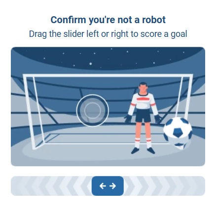

import Tabs from '@theme/Tabs';
import TabItem from '@theme/TabItem';
import ParamItem from '@theme/ParamItem';
import MethodItem from '@theme/MethodItem';
import MethodDescription from '@theme/MethodDescription'
import PriceBlock from '@theme/PriceBlock';
import PriceBlockWrap from '@theme/PriceBlockWrap';
import { ArticleHead } from '../../../../../src/theme/ArticleHead';

<ArticleHead slug="captchas/hunt-task" />

# Hunt

<PriceBlockWrap>
  <PriceBlock title="Hunt" captchaId="hunt"/>
</PriceBlockWrap>



Hunt 验证码是一种用于博彩平台的反机器人系统，用于检测自动化行为。它会跟踪用户行为，并在检测到可疑活动时启动交互式验证。

:::warning **注意！**

* 要完成此任务，请使用**您自己的代理**。

* 我们的解决系统有两种工作模式：**生成 X-HD（指纹）** 和 **验证码求解**。如果您只需要生成 X-HD，请不要传递 `data` 参数。如果您需要解决验证码，请在 `data` 中传递目标网站在特定操作时生成的令牌（例如请求短信时）。
  :::

## 请求参数

<TabItem value="proxy" label="HuntTask" className="bordered-panel">

<ParamItem title="type" required type="string" />
**CustomTask**

---

<ParamItem title="class" required type="string" />
**HUNT**

---

<ParamItem title="websiteURL" required type="string" />
包含 Hunt 验证码的页面地址。

---

<ParamItem title="apiGetLib (在 metadata 内)" required type="string" />

`api.js` 文件的完整链接。

示例：
`https://www.example.com/hd-api/external/apps/<hash>/api.js`

请按以下格式传递：
`"apiGetLib":"https://example.com/hd-api/external/apps/a2157wab1045d68672a63557e0n2a77edbfd15ea/api.js"`

您可以在包含 Hunt 验证码的页面中，通过 DevTools（**Network** 或 **Elements** 标签）找到该链接。
使用关键字搜索：`hd-api` 或 `api.js`。

---

<ParamItem title="data (在 metadata 内)" type="string" />
当选择验证码求解模式时，需要传递 `data`（详见下文说明）。

---

<ParamItem title="userAgent" type="string" />
浏览器的 User-Agent。<br />
**请仅传递来自 Windows 操作系统的最新 UA。目前为**：`userAgentPlaceholder`

---

<ParamItem title="proxyType" required type="string" />
**http** - 常规 HTTP/HTTPS 代理；<br />
**https** - 当 http 不可用时使用（某些自定义代理必填）；<br />
**socks4** - SOCKS4 代理；<br />
**socks5** - SOCKS5 代理。

---

<ParamItem title="proxyAddress" required type="string" />
<p>
代理 IP 地址（IPv4/IPv6）。禁止使用：
- 透明代理
- 本地机器代理
</p>

---

<ParamItem title="proxyPort" required type="integer" />
代理端口

---

<ParamItem title="proxyLogin" required type="string" />
代理登录名

---

<ParamItem title="proxyPassword" required type="string" />
代理密码

</TabItem>
--- 

**该解决方案支持两种工作模式：**

### 1. 生成 X-HD（指纹）

* 在此模式下，您无需传递 `data`。
* 创建任务后，您将获得 **X-HD** —— 一个与您的 IP 绑定的唯一指纹，可用于后续向网站发送请求。

### 2. 验证码求解

* 在此模式下，您需要在参数 `data` 中传递网站在特定操作时生成的**令牌**（`meta.token`），例如在请求短信时。
* 创建任务后，您将获得**验证码解决结果**，即一个可直接在网站上使用的令牌。

---

### 何时使用每种模式

| 场景                 | 是否需要传递 `data`？ |
| ------------------ | -------------- |
| 初始初始化              | 否              |
| 需要获取 X-HD          | 否              |
| 网站返回 Captcha error | 是              |
| 已获得 `meta.token`   | 是              |

---

### 完整工作流程示例

1. 创建任务 **不传递 `data`**
2. 从我们的服务获取 X-HD
3. 使用 X-HD 向网站发送请求
4. 获取 `meta.token`
5. 创建任务 **并设置 `data = meta.token`**
6. 获取解决结果
7. 将解决结果提交到网站

:::warning 重要
如果更换代理，需要重新获取 X-HD。
:::

## 模式 1：生成 X-HD

用于获取与 IP 绑定的 X-HD 令牌。

### 创建用于生成 X-HD 的任务方法

<TabItem value="proxy" label="CustomTask（使用代理）" className="method-panel">
    <MethodItem>
      ```http
      https://api.capmonster.cloud/createTask
      ```
    </MethodItem>
    <MethodDescription>
      **请求**
```json
{
    "type": "CustomTask",
    "class": "HUNT",
    "websiteURL": "https://example.com",
    "metadata": {
      "apiGetLib": "https://example.com/hd-api/external/apps/a2157wab1045d68672a63557e0n2a77edbfd15ea/api.js"
    },
    "userAgent": "userAgentPlaceholder",
    "proxyType": "http",
    "proxyAddress": "8.8.8.8",
    "proxyPort": 8080,
    "proxyLogin": "proxyLoginHere",
    "proxyPassword": "proxyPasswordHere"
  }
}
```

**响应**

```json
{
  "errorId": 0,
  "taskId": 407533072
}
```
</MethodDescription>
</TabItem>

---

## 模式 2：验证码求解

当网站返回 captcha 错误并提供 `meta.token` 后使用。

### 如何获取 `meta.token`

1. 向网站发送请求（例如请求短信验证码）
2. 获取 X-HD

.png)
-1.png)

3. 网站返回：

```json
{
  "errors":[{"code":"113","title":"Captcha error"}],
  "meta":{
    "token":"SITE_META_TOKEN"
  }
}
```

.png)

### 创建用于验证码求解的任务方法

需要将 `meta.token` 的值传递到 `data` 参数中。

<TabItem value="proxy" label="CustomTask（使用代理）" className="method-panel">
    <MethodItem>
      ```http
      https://api.capmonster.cloud/createTask
      ```
    </MethodItem>
    <MethodDescription>
      **请求**
```json
{
  "type": "CustomTask",
  "class": "HUNT",
  "websiteUrl": "https://example.com",        
  "metadata": {
      "apiGetLib": "https://example.com/hd-api/external/apps/a2157wab1045d68672a63557e0n2a77edbfd15ea/api.js",
      "data": "kufyHK/s/jTNU...AfwIW", // META_TOKEN 的值
  },
  "userAgent": "userAgentPlaceholder",
  "proxyType": "http",
  "proxyAddress": "8.8.8.8",
  "proxyPort": 8080,
  "proxyLogin": "proxyLoginHere",
  "proxyPassword": "proxyPasswordHere"
}
```

**响应**

```json
{
  "errorId": 0,
  "taskId": 407533072
}
```
</MethodDescription>
</TabItem>

## 获取任务结果的方法

使用 [getTaskResult](../api/methods/get-task-result.mdx) 方法来获取 X-HD 指纹或 Hunt 验证码的解决结果。

:::warning **注意！**
`solution.token` 的值：

* 在生成 X-HD 模式下 —— 这是 X-HD 令牌，需要在向目标网站发送请求时使用。

* 在验证码求解模式下 —— `solution.token` 是验证码解决令牌，需要将其提交回网站以确认操作。
  :::

<TabItem value="proxyless" label="CustomTask（无代理）" default className="method-panel-full">
	<MethodItem>
		```http
		https://api.capmonster.cloud/getTaskResult
		```
	</MethodItem>
	<MethodDescription>
		**请求**
		```json
		{
		  "clientKey":"API_KEY",
		  "taskId": 407533072
		}
		```
		**响应**
```json
{
  "errorId": 0,
  "status": "ready",
  "solution": {
    "data": {
      "token": "6IyDCCpDdSK...YGs1Wug/z/kLNSpjewI="
    }
  }
}
```
	</MethodDescription>
</TabItem>

---

## Hunt CAPTCHA 解决示例

下面提供一个 **Node.js** 示例，演示如何在 CapMonster Cloud 中创建 Hunt CAPTCHA 任务、等待其完成，并获取 X-HD 令牌。代码中展示了：

* 如何创建带有网站和代理信息的 HUNT 任务
* 如何通过 CapMonster API 等待任务完成
* 如何获取结果并提取令牌以便在网站上使用

> **重要：** 在运行前，请务必将 `API_KEY`、`proxyLogin`、`proxyPassword` 以及其他参数替换为您的真实值。建议将所有敏感数据存储在 `.env` 文件中。

---

<details> 
<summary>显示中文注释版代码 (Node.js)</summary>

```javascript
const API_KEY = "YOUR_API_KEY"; // 替换为你的 CapMonster Cloud API 密钥
const CREATE_TASK_URL = "https://api.capmonster.cloud/createTask";
const GET_RESULT_URL = "https://api.capmonster.cloud/getTaskResult";

const sleep = (ms) => new Promise((resolve) => setTimeout(resolve, ms));

// 创建 HUNT 任务
async function createHuntTask({ data = null } = {}) {
  const payload = {
    clientKey: API_KEY,
    task: {
      type: "CustomTask",
      class: "HUNT",
      websiteURL: "https://example.com/", // 目标网站 URL
      userAgent:
        "userAgentPlaceholder", // 用户代理
      metadata: {
        apiGetLib:
          "https://example.com/hd-api/external/apps/a2157wab1045d68672a63557e0n2a77edbfd15ea/api.js", // HUNT API 脚本
      },
      proxyType: "http", // 代理类型
      proxyAddress: "123.45.67.89", // 代理地址
      proxyPort: 8080, // 代理端口
      proxyLogin: "proxyLogin", // 代理用户名
      proxyPassword: "proxyPassword", // 代理密码
    },
  };

  if (data) {
    payload.task.metadata.data = data;
  }

  const response = await fetch(CREATE_TASK_URL, {
    method: "POST",
    headers: { "Content-Type": "application/json" },
    body: JSON.stringify(payload),
  });

  const result = await response.json();
  return result.taskId; // 返回任务 ID
}

// 等待任务结果
async function waitForResult(taskId) {
  while (true) {
    await sleep(3000); // 每 3 秒轮询一次

    const response = await fetch(GET_RESULT_URL, {
      method: "POST",
      headers: { "Content-Type": "application/json" },
      body: JSON.stringify({
        clientKey: API_KEY,
        taskId: taskId,
      }),
    });

    const result = await response.json();

    if (result.errorId !== 0) {
      throw new Error(result.errorDescription); // 出现错误时抛出异常
    }

    if (result.status === "processing") {
      console.log("任务处理中...");
      continue;
    }

    if (result.status === "ready") {
      console.log("响应结果:\n", JSON.stringify(result, null, 2));
      return result.solution; // 返回任务解决方案
    }
  }
}

// 主函数
async function main() {
  try {
    console.log("创建 HUNT 任务（X-HD 模式）...");

    const taskId = await createHuntTask();
    console.log("任务 ID:", taskId);

    const xhdToken = await waitForResult(taskId);
    console.log("收到 X-HD:\n", xhdToken);

    // ===== 如果需要，可以继续解决验证码 =====
    // const siteMetaToken = "SITE_META_TOKEN";
    // const solveTaskId = await createHuntTask({ data: siteMetaToken });
    // const finalSolution = await waitForResult(solveTaskId);
    // console.log("最终验证码解决方案:\n", finalSolution);
  } catch (error) {
    console.error("错误:", error.message);
  }
}

main();
```
</details>
