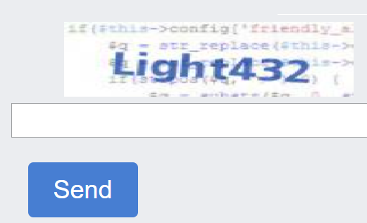

import Tabs from '@theme/Tabs';
import TabItem from '@theme/TabItem';
import ParamItem from '@theme/ParamItem';
import MethodItem from '@theme/MethodItem';
import MethodDescription from '@theme/MethodDescription'
import PriceBlock from '../../../../../src/theme/PriceBlock';
import PriceBlockWrap from '@theme/PriceBlockWrap';
import { ArticleHead } from '../../../../../src/theme/ArticleHead';

<ArticleHead slug="captchas/image-to-text" />

# ImageToTextTask

<PriceBlockWrap>
  <PriceBlock captchaId="text"/>
</PriceBlockWrap>



这是常规验证码，即包含文本的图片，需要输入相应的文本。

:::warning **注意！**
此任务无需使用代理服务器。
:::


## 请求参数
<TabItem value="proxyless" label="RecaptchaV2EnterpriseTaskProxyless (without proxy)" default className="bordered-panel">
    <ParamItem title="type" required type="string" />
    **ImageToTextTask**

    ---

    <ParamItem title="body" required type="string" />
    以base64编码的文件主体。确保发送时没有换行符。

    ---

    <ParamItem title="capMonsterModule" type="string" />
    识别模块的名称，例如“yandex”。可以通过[这里](../api/module-name.md)找到模块名称及所有可用模块的列表。 <br />
    示例: yandex, special 及其他

    ---

    <ParamItem title="recognizingThreshold" type="integer" />
    验证码识别阈值，可取值范围为0到100。例如，如果将 recognizingThreshold 设置为90，并且任务以80的置信度解决，则不会收费。在这种情况下，用户会收到 ERROR_CAPTCHA_UNSOLVABLE 的响应。 种设置扣款阈值的替代方法在 [该文章](../api/threshold.md) 中有描述。

    ---

    <ParamItem title="case" type="boolean" />
    true - 如果验证码区分大小写。

    ---

    <ParamItem title="numeric" type="integer" />
    1 - 如果验证码仅包含数字。 <br />
    可能的值: 0, 1

    ---

    <ParamItem title="math" type="boolean" />
    false — 未定义；<br />true — 如果验证码需要数学操作（例如：验证码 2 + 6 = 将返回值 8）。**重要提示：** 请勿在 `captcha_math` 模块中使用 `math: true` 参数。
</TabItem>

<br />

Base64 是一种数据编码方法，允许将二进制数据表示为文本。以下是使用*开发者工具*中的控制台获取验证码图像的 base64 格式的示例：

```JavaScript
const captchaUrl = 'https://example.com/captcha.jpg';

function loadAndEncodeCaptchaToBase64(url) {
    fetch(url)
        .then(response => response.blob())
        .then(blob => {
            const reader = new FileReader();
            reader.readAsDataURL(blob);

            reader.onloadend = function() {
                const base64Data = reader.result;                
                console.log('Base64 编码的验证码:, base64Data);

                          };
        })
        .catch(error => {
            console.error('加载或编码验证码时出错:', error);
        });
}

loadAndEncodeCaptchaToBase64(captchaUrl);

```


## 创建任务方法 

<TabItem value="proxyless" label="RecaptchaV2TaskProxyless (without proxy)" default className="method-panel">
	<MethodItem>
		```http
		https://api.capmonster.cloud/createTask
		```
	</MethodItem>
	<MethodDescription>
		**要求**
		```json
		{
		  "clientKey":"API_KEY",
		  "task": {
			"type":"ImageToTextTask",
			"body":"BASE64_BODY_HERE!"
		  }
		}
		```
		**回应**
		```json
		{
		  "errorId":0,
		  "taskId":407533072
		}
		```
	</MethodDescription>
</TabItem>


## 获取任务结果方法
使用[getTaskResult](../api/methods/get-task-result.md)方法获取验证码的解决方案。根据系统负载，您将在300毫秒到6秒的时间范围内收到答案。

<TabItem value="proxyless" label="GeeTestTaskProxyless (without proxy)" default className="method-panel-full">
	<MethodItem>
		```http
		https://api.capmonster.cloud/getTaskResult
		```
	</MethodItem>
	<MethodDescription>
		**要求**
		```json
		{
		  "clientKey":"API_KEY",
		  "taskId": 407533072
		}
		```
		**回应**
		```json
		{
		  "errorId":0,
		  "status":"ready",
		  "solution": {
			"text":"answer"
		  }
		}
		```
	</MethodDescription>
</TabItem>

<br />

|**属性**|**类型**|**描述**|
| :-: | :-: | :-: |
|text|String|验证码答案|

## 如何查找任务创建所需的所有参数

### 手动方式

1. 请在浏览器中访问您的网站，该网站包含验证码功能。
2. 右键点击验证码元素，选择 **检查（Inspect）**。

#### base64

在 DOM 树中找到所需的元素并将鼠标悬停在其上——*base64* 编码的图片会直接显示在元素的属性中：


如果图片引用的是外部 URL，而不是包含 base64 编码的数据，你可以在网络请求（**Network**）中找到它。右键点击相关请求，选择 **复制图片为数据 URI**。这会将 *base64* 编码的图片数据复制到剪贴板。


### 自动方法

一种方便的自动化获取所有必要参数的方式。
某些参数每次页面加载时都会重新生成，因此需要通过浏览器（普通或无头模式，如使用**Playwright**）提取它们。
由于动态参数值的有效期很短，获取后必须立即解决验证码。

:::warning **重要提示！**
提供的代码片段是用于熟悉参数提取的基本示例。具体实现将取决于验证码页面、其结构及使用的HTML元素/选择器。
:::

<Tabs className="full-width-tabs filled-tabs request-tabs">
  <TabItem value="js" label="JavaScript" default className="method-panel">
    <details>
      <summary>显示代码（浏览器端）</summary>
      ```js
      (async () => {
        const img = document.querySelector('img'); // 示例选择器

        const imageUrl = img.src;

        const response = await fetch(imageUrl);

        if (!response.ok) {
          throw new Error("加载图片失败");
        }

        const buffer = await response.arrayBuffer();

        // 将二进制数据转换为 base64
        const base64Image = btoa(String.fromCharCode(...new Uint8Array(buffer)));

        console.log(base64Image); 
      })();
      ```
    </details>

    <details>
      <summary>显示代码（Node.js）</summary>
      ```js
      (async () => {
        const imageUrl = "https://example/img/.jpg"; // 图片 URL

        const response = await fetch(imageUrl);

        if (!response.ok) {
          throw new Error("加载图片失败");
        }

        const buffer = await response.arrayBuffer();

        // 转换数据为 base64
        const base64Image = Buffer.from(buffer).toString("base64");

        console.log(base64Image);
      })();
      ```
    </details>
  </TabItem>

  <TabItem value="python" label="Python" className="method-panel">
    <details>
      <summary>显示代码</summary>
      ```python
      import requests
      import base64

      # 图片 URL
      image_url = "https://example/img.jpg"

      response = requests.get(image_url)

      if response.status_code == 200:
          # 将图片二进制数据转换为 base64
          base64_image = base64.b64encode(response.content).decode('utf-8')

          print(base64_image)
      else:
          print("加载图片失败")
      ```
    </details>
  </TabItem>

  <TabItem value="csharp" label="C#" className="method-panel">
    <details>
      <summary>显示代码</summary>
      ```csharp
      using System;
      using System.Net.Http;
      using System.Threading.Tasks;

      class Program
      {
          static async Task Main(string[] args)
          {
              // 图片 URL
              string imageUrl = "https://example/img.jpg";

              using (HttpClient client = new HttpClient())
              {
                  try
                  {
                      byte[] imageBytes = await client.GetByteArrayAsync(imageUrl);

                      // 将图片二进制数据转换为 base64
                      string base64Image = Convert.ToBase64String(imageBytes);

                      Console.WriteLine(base64Image);
                  }
                  catch (Exception ex)
                  {
                      Console.WriteLine("加载图片失败: " + ex.Message);
                  }
              }
          }
      }
      ```
    </details>
  </TabItem>
</Tabs>

## 使用 SDK 库

<Tabs className="full-width-tabs filled-tabs request-tabs" groupId="captcha-type">
  <TabItem value="js" label="JavaScript" default className="method-panel">
    ```js
    // https://github.com/ZennoLab/capmonstercloud-client-js

    import { CapMonsterCloudClientFactory, ClientOptions, ImageToTextRequest } from '@zennolab_com/capmonstercloud-client';

    document.addEventListener('DOMContentLoaded', async () => {
      const cmcClient = CapMonsterCloudClientFactory.Create(new ClientOptions({ clientKey: '<你的 capmonster.cloud API key>' }));
      console.log(await cmcClient.getBalance());

      const imageToTextRequest = new ImageToTextRequest({
        body: 'some base64 body', // 替换为正确的值
        CapMonsterModule: CapMonsterModules.YandexWave,
        Case: true,
        numeric: 1,
        recognizingThreshold: 65,
        math: false,
      });

      console.log(await cmcClient.Solve(imageToTextRequest));
    });
    ```
  </TabItem>

  <TabItem value="python" label="Python" className="method-panel">
    ```python
    # https://github.com/ZennoLab/capmonstercloud-client-python

    import asyncio
    import base64
    from capmonstercloudclient import CapMonsterClient, ClientOptions
    from capmonstercloudclient.requests import ImageToTextRequest

    client_options = ClientOptions(api_key="your_api_key")  # 你的 CapMonster Cloud API key
    cap_monster_client = CapMonsterClient(options=client_options)

    image_base64 = "/9j/4AAQSkZJRgABAQAAAQABAAD/2wBDAAgGBgc…wwzqR4U/yZ//Z" # 替换为正确的值

    image_bytes = base64.b64decode(image_base64)

    image_to_text_request = ImageToTextRequest(
        image_bytes=image_bytes,
        module_name=None,
        threshold=50,      
        case=True,         
        numeric=0,         
        math=False         
    )

    async def solve_captcha():
        return await cap_monster_client.solve_captcha(image_to_text_request)

    responses = asyncio.run(solve_captcha())
    print(responses)
    ```
  </TabItem>

  <TabItem value="csharp" label="C#" className="method-panel">
    ```csharp
    // https://github.com/ZennoLab/capmonstercloud-client-dotnet

    using Zennolab.CapMonsterCloud.Requests;
    using Zennolab.CapMonsterCloud;

    class Program
    {
        static async Task Main(string[] args)
        {
            var clientOptions = new ClientOptions
            {
                ClientKey = "your_api_key" // 你的 CapMonster Cloud API key
            };

            var cmCloudClient = CapMonsterCloudClientFactory.Create(clientOptions);

            var imageToTextRequest = new ImageToTextRequest
            {
                Body = "/9j/4AAQSkZJRgABAQAAAQABA...hMjIyMjIyMjIyMjIyMj", // 替换为正确的值
                CapMonsterModule = "None",  
                RecognizingThreshold = 70, 
                CaseSensitive = true,
                Numeric = false, 
                Math = false
            };

            var imageToTextResult = await cmCloudClient.SolveAsync(imageToTextRequest);

            Console.WriteLine("验证码结果: " + imageToTextResult.Solution.Value);
        }
    }
    ```
  </TabItem>
</Tabs>
