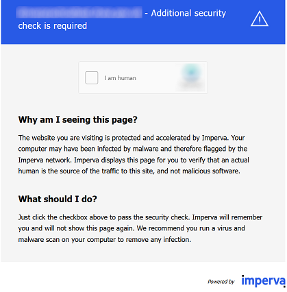

import Tabs from '@theme/Tabs';
import TabItem from '@theme/TabItem';
import ParamItem from '@theme/ParamItem';
import MethodItem from '@theme/MethodItem';
import MethodDescription from '@theme/MethodDescription'
import PriceBlock from '../../../../../src/theme/PriceBlock';
import PriceBlockWrap from '@theme/PriceBlockWrap';
import BlogLink from '@theme/BlogLink';
import { ArticleHead } from '../../../../../src/theme/ArticleHead';

<ArticleHead slug="captchas/incapsula" />

# Imperva (Incapsula)

<PriceBlockWrap>
  <PriceBlock title="Imperva" captchaId="imperva"/>
</PriceBlockWrap>



<BlogLink url="https://capmonster.cloud/zh/blog/news/imperva-incapsula-news"/>

:::warning **注意！**

* 执行此任务时，请使用 **您自己的代理**。

* 如果代理按 IP 授权，请将地址 **65.21.190.34** 加入白名单。

* 完成验证后，您将获得 **特殊的Cookie**，需要添加到浏览器中。
:::


## 请求参数

<TabItem value="proxyless" label="CustomTask (without proxy)" default className="bordered-panel">
    <ParamItem title="type" required type="string" />
    **CustomTask**

    ---

    <ParamItem title="class" required type="string" />
    **Imperva**

    ---

    <ParamItem title="websiteURL" required type="string" />
    Incapsula 所在的主页面地址。 

    ---
    <ParamItem title="incapsulaScriptUrl（在 metadata 中）" required="required" type="string" />
    `"incapsulaScriptUrl": "_Incapsula_Resource?SWJIYLWA=719d34d31c8e3a6e6fffd425f7e032f3"` - Incapsula JS 文件的名称。

    ---

    <ParamItem title="incapsulaCookies（在 metadata 中）" required type="string" />
    你从 Incapsula 获取的 cookies。可以通过在页面中使用 document.cookie 获取，或者在请求头中通过 Set-Cookie: "incap_sess_*=...; visid_incap_*=..." 获取（参见 /createTask 请求示例）。
	
	

  ---

  <ParamItem title="proxyType" required type="string" />
    **http** - 普通的 http/https 代理；<br />**https** - 仅在 "http" 不起作用时尝试（某些自定义代理服务器要求）；<br />**socks4** - socks4 代理；<br />**socks5** - socks5 代理。

     ---

    <ParamItem title="proxyAddress" required type="string" />
    <p>
	  代理 IP 地址 IPv4/IPv6。不允许：
		- 使用透明代理（其中客户端 IP 可见）；
		- 使用来自本地网络的代理。
	</p>

     ---

    <ParamItem title="proxyPort" required type="integer" />
    代理端口。

     ---

    <ParamItem title="proxyLogin" required type="string" />
    代理登录。

     ---

    <ParamItem title="proxyPassword" required type="string" />
    代理密码。

    ---

    <ParamItem title="reese84UrlEndpoint（在 metadata 中）" type="string" />
	reese84 指纹发送的端点名称可以在请求中找到，并以 ?d=site.com 结尾。

    	

    ---

    <ParamItem title="userAgent" type="string" />
	浏览器的 User-Agent。<br />
**请仅传递当前 Windows 系统下的有效 UA。当前推荐值为**：`userAgentPlaceholder`

</TabItem>


## 创建任务方法

<TabItem value="proxyless" label="CustomTask（无代理）" default className="method-panel">
	<MethodItem>
      ```http
      https://api.capmonster.cloud/createTask
      ```
    </MethodItem>
    <MethodDescription>

    **请求**

    ```json
    {
      "clientKey": "API_KEY",
      "task": {
        "type": "CustomTask",
        "class": "Imperva",
        "websiteURL": "https://example.com",
        "userAgent": "userAgentPlaceholder",
        "metadata": {
          "incapsulaScriptUrl": "_Incapsula_Resource?SWJIYLWA=719d34d31c8e3a6e6fffd425f7e032f3",
          "incapsulaCookies": "incap_ses_1166_2930313=br7iX33ZNCtf3HlpEXcuEDzz72cAAAAA0suDnBGrq/iA0J4oERYzjQ==; visid_incap_2930313=P3hgPVm9S8Oond1L0sXhZqfK72cAAAAAQUIPAAAAAABoMSY9xZ34RvRseJRiY6s+;",
          "reese84UrlEndpoint": "Built-with-the-For-hopence-Hurleysurfecting-the-"
        },
        "proxyType": "http",
        "proxyAddress": "8.8.8.8",
        "proxyPort": 8080,
        "proxyLogin": "proxyLoginHere",
        "proxyPassword": "proxyPasswordHere"
      }
    }
    ```

    **响应**

    ```json
    {
      "errorId": 0,
      "taskId": 407533072
    }
    ```

    </MethodDescription>
  </TabItem>


## 获取任务结果方法
使用方法 [getTaskResult](../api/methods/get-task-result.mdx) 来获取 Imperva 解决方案。

<TabItem value="proxyless" label="CustomTask (without proxy)" default className="method-panel-full">
	<MethodItem>
		```http
		https://api.capmonster.cloud/getTaskResult
		```
	</MethodItem>
	<MethodDescription>
		**要求**
		```json
		{
		  "clientKey":"API_KEY",
		  "taskId": 407533072
		}
		```
		**回应**
		```json
		{
			"errorId":0,
			"status":"ready",
			"solution": {
				"domains": {
					"https://example.com": {
						"cookies": {
							"___utmvc": "NMB+nRa4inxXNeXuhPl9w4opzdo2afqlceX5uMBLwrduDVo64yb4KunkabEeLYXmKZuVhloliIv6fWevXUcT1WJiFklg9AghMBMkDFjDAEtAnK639bNQi/ob8l+hp/5wf/WpTQcIkG8F9VifAEcZG7MxawsEpYJxkLji4vDSUbGuHPNf5CzIyEzATfw6UVBRiLiDdUvFWboxszG1T5aUrwQYgIlmm1B2X5ZZW4BzwN3k8Md5J+jIdllfdTaxK9JQfuqYQCdT/g5mifg2TPbrwVQeN14avfo1xQr88Mh+m4oclb0yR6VJp2vaVktDSIe2cwCZ3sKKYE0rzkCpcJb9530gRCOT3YxCtyU4Qqg6yRIf8Rk4q/KRSC8/VJ9ezreZ221mURm4FnFH+OF0PqjAiLd/lVK6oTO6BIet4ykEKCtch9EVk0hgGJieaG1F1Nt5haZcSNjGBa15wPyD2OFZe0kI7VBopsUyWqiD0Ydun6+WD/7aDHROngJj0VIZjSuOnQuVQDK2Vcw9gTVvvqwnDhR28ff0gj5b+LAkvrykfgO/AQO0K/DNCF0HgmWIMiSJeoohCpCa/UArU8tDtETnuxGKGaaJOsGKsPtOS5VRQlyRa+D0inSAVY77lpWF5+9SOS+Ioxlq3r8ovFosR33OOcBCEgAlrkdTNNKvK27mWNwmi+ccKkyuJw5Gtk3SEsYNZ75KU/ok+sKBZM5OIsrmp9ivj+nx0oi7yQf6q0Oksbwr2xTFANsIfpoOJBIMylVSCRGwEbpoN4+IJitczOtb8D/TmfHx5P1td0NWTli7UhqFSADS0CcH+vfBos4nucByHjMxkiKuGcudydlZ4IAzl4j0EhZb9OjqJsVe6NIosjwYuqVWHI6BKpRz4FnaqvW+fbEgNj/SmOrEJ/BbKsOOikJNDw6E6BznYT8oQaV6y5p+HFfut+fP3ocrgdMEjoA16oBDfj0rHopZtpJRk2ss41MOA4XyNbfzXVxotTjUXQnuSJXKqp5n4LUD2nFGFpKTwPOT5bTiFiXyHCwNzscRmlfnv38sjG76999auML2YaK1y1wi4sm9fhrbCJuJ9cSSUAMVyeCJhF6BBZ7K1xcGYsougAqbO+oHt/v2J0dnDBAgqQz43nHMNH0yduHWDZUoFsFGqLU8k9a/YYgznEWQDbXnbXAkLziOTNer9FijatGSGm/USO+Gu6TwbmiCfoRoCtm4LOv0aKpzCh48bVdpgEgU3cKLnY970QqnpcB2HCWyawyWMgW3lpXqRKvCbPXo9kiyIBAssNG+HY4URXrwZnhJsnomsipaxKCyRmAUrGjxxFNe0D7vbXn9uY6KnjlJ01Z2T1f3WgwBTBv1QrJsy33KZPkpKLK4VXmtVwD/NBgtgJx7f2xZrKsqrwS3nwa9nYaA9cbS6h4Akl0Ssruv5bwhcVjd7t5fdnCvH59L7emUBEhWV4GpE9owdZpXbWbW0Sq/ZXWe9QX/g4wKTcSJLDBA+T4tegikJv0NWm1aMI2RMJ58Y38JsWKJnkNgjbHAJ7SuVsAtBY3FBbVYLNlC41ZCs8Ygt5W4HNP5B0tRJxEvzqkdbMPg48oVO9AjohmqSPKaXq1TqRTUEatTvt0LD0Uo6v8FFGbCjuuc0kkq4zslsHxEPcB4PY1UKd5/Xw2ttU2ZeGOBIsG+HVTww2yPCYUNH1orKqEwt5H7oMApKWAy1J4lESr1RUbHCBHj7OikFvg4+clNBDGp0wCk+PigPFFNVWBfxtFwJSCZQTUuev1HpdMz/nEiUSPRL3xFbFDH+Ucmdn8lzwCj2EZSY4Zb8cBT92RzbjjcQoH51pgaSjTn5f9m496SyAu34aqTeGU+fYipD5UsWv5r2csBCVJWKm94Ds1QY3JkIkym69IRWoi3j1PKOKxIKX1QTiMqq+8GEgMgwrXYRhzBAmfp19h/ScvxYdiy0q4z6XzJ0pFs1h1bA+6oqqPOqUvrLVbMP1MM7LZKYlhUyJ70KRsrc13y9fLbJV0Znst7cKhi2RGKbU/8anFlzswtjnDD7Upuw/uO3rfedi33X9NFxUw6+pgUYur8ZWQWY3Gm4kX+ANW0upV4K4y/pj5BcZtCKVSXQ/XcLqWkSOt7acbitnrqOgJdw5LmSBhmB+dZwEMzMdUVhRtDt4+oC5DIgtC0B8FhxFX/BzHv6Gh2eO6HJHmXepSpH3csGFpQyJM/5VgNs0wNFPvl1PDA8GAQsu+bGWLGIycSA+XSZVdsRdnegdRIPi0ktOLsAs+ZIZXebkOCMnZytLnrxmfLkAQVtYoy0Qoh9Bv6QOQsxDUZrRu43oaVC/MLuzhftcv/ZhFtCj6IvqWuCHOUp+zLVpzCyiPvN/5eVoVJrY0Jq/Ky8WLUabkJh4h2CiS+9jipESYH+Tu2qsz3V/pR7swfW8zAwp8a4Hzl+8/eGea9X9NY1htqeqw/BJ3ALeozpaA833KZ4HeWrxLRennaqiOvTSkGKDKJsnT6zRQbMw6geAjXk7EMnZBTgTfrBUqpmCYsExQRiyP7DEEcpgTe3+ry9YzLLFevuyvwBYVI7pmc+AeWBNbcl3e7EwdeKZiprQgt7mASx2KRtkgUzNxH8OiPGvVMrJPYSWxUMgFrwVgxvV1kMb/PEVr0YXoFjccRQwWdsxoMizqBWALnYODaJwwl6RZraZIyPVp3ptW4mCWZCWTg+fFdeUWwzGfC312KHggGX2yntQV/iIE5kQWbk72JFP7Xf3it4XdFWBynaojzykDFXODTCEwGB1NIbmO+aVirjv0Rs6ZoKpxSMB+KHd4/TWRpZ2VzdD0xOTE0NDAscz02NzdiOTY4YjdmYTE5M2FjOTk4N2E5YThhMjljN2E4NjYzNWY4NWIxOWM3NTg4ODQ5NWFjOGE4MmE4OTU2OGEwNzI2ODlkODc4MWIwNmU3MQ==; Max-Age=31536000; Domain=.site.com; Path=/; Secure; SameSite=Lax",
							"reese84":"3:+K02uF6IfjbaMpdv1+5JLw==:x0jVrEYjOB+rVD2ZkdV2gpcVRjsahu5tqUlnsFl5amKje2ikXLJO6QHty6ipwIPX29mSruAp/AhCg15DjBX+EeYyC+ugScX2MtXA62fTUzELpZs2hkd428Q96bpb4lpEZSSVa5B6CBBtGL7VluNDjuVXo6BIUx+9CUFKxf2Zw7RW+BHCmdCZsHJdeCAIZ4h17IzTp3UgFNoxKwSp3fDwuYRgfg1BoezZWNcP4eAs2oaMcBmo66C8pLU8QoHFo5sp6BE43HbjYJ47RrbkokYRRhYwwe2n8OfkCws+9bQq++3LsThVxN37eeWH7UhVd7YlO+ldMOrMZHHP9U6ShTJZDVPUv++XGlKYw4B1sxaf0jN+2vc1a4zPX+eFlsnrvhymURYvE9fjgGjvFSVO+nQb3M50iKTKN/eHbshgnw2UcZmCvzCfcsGJl+idSsieA20YWe13lFAOIIQ3U1wct+EYjmJlSBq02IIn9Y+WtPXP4lkXzXex0W8I14k+uBe+XSb1:vIosWJM6+1OFaFys4VFDiTJ75BZg/k/jwaygMW3VKpU=; Max-Age=31536000; Domain=.site.com; Path=/; Secure; SameSite=Lax"
						}
					}
				}
			}
		}
		```
	</MethodDescription>
</TabItem>

## Access denied

Error 16 - 此错误与使用不符合要求地理位置的代理服务器有关。

## 如何查找任务创建所需的所有参数

### 自动方法

一种方便的自动化获取所有必要参数的方式。
某些参数每次页面加载时都会重新生成，因此需要通过浏览器（普通或无头模式，如使用**Playwright**）提取它们。
由于动态参数值的有效期很短，获取后必须立即解决验证码。

:::warning **重要提示！**
提供的代码片段是用于熟悉参数提取的基本示例。具体实现将取决于验证码页面、其结构及使用的HTML元素/选择器。
:::

<Tabs className="full-width-tabs filled-tabs request-tabs">
  <TabItem value="js" label="JavaScript" default className="method-panel">
    <details>
      <summary>显示代码 (Node.js)</summary>
      ```js
      import { chromium } from "playwright";

      (async () => {
        const browser = await chromium.launch({ headless: false });
        const page = await browser.newPage();

        await page.goto("https://www.example.com/");

        // 提取 id 为 main-iframe 的 iframe 的 src 属性
        const iframeSrc = await page.$eval("#main-iframe", (iframe) =>
          iframe.getAttribute("src")
        );
        console.log("iframe src:", iframeSrc);

        // 获取所有 cookies
        const cookies = await page.context().cookies();

        // 过滤出以 visid_incap_ 或 incap_ses_ 开头的 cookies
        const filteredCookies = cookies.filter(
          (cookie) =>
            cookie.name.startsWith("visid_incap_") ||
            cookie.name.startsWith("incap_ses_")
        );

        filteredCookies.forEach((cookie) => {
          console.log(`${cookie.name}=${cookie.value}`);
        });

        await browser.close();
      })();
      ```
    </details>
  </TabItem>

  <TabItem value="python" label="Python" className="method-panel">
    <details>
      <summary>显示代码</summary>
      ```python
      import asyncio
      from playwright.async_api import async_playwright

      async def main():
          async with async_playwright() as p:
              browser = await p.chromium.launch(headless=False)
              page = await browser.new_page()

              await page.goto("https://www.example.com/")

              # 提取 id 为 main-iframe 的 iframe 的 src 属性
              iframe_src = await page.locator("#main-iframe").get_attribute("src")
              print("iframe src:", iframe_src)  # 输出 src 值

              # 获取所有 cookies
              cookies = await page.context.cookies()

              # 过滤出以 visid_incap_ 或 incap_ses_ 开头的 cookies
              filtered_cookies = [
                  cookie for cookie in cookies
                  if cookie["name"].startswith("visid_incap_") or cookie["name"].startswith("incap_ses_")
              ]

              for cookie in filtered_cookies:
                  print(f"{cookie['name']}={cookie['value']}")

              await browser.close()

      asyncio.run(main())
      ```
    </details>
  </TabItem>

  <TabItem value="csharp" label="C#" className="method-panel">
    <details>
      <summary>显示代码</summary>
      ```csharp
      using System;
      using System.Linq;
      using System.Threading.Tasks;
      using Microsoft.Playwright;

      class Program
      {
          public static async Task Main(string[] args)
          {
              var playwright = await Playwright.CreateAsync();
              var browser = await playwright.Chromium.LaunchAsync(new BrowserTypeLaunchOptions { Headless = false });
              var page = await browser.NewPageAsync();

              await page.GotoAsync("https://www.example.com/");

              // 提取 id 为 main-iframe 的 iframe 的 src 属性
              var iframeSrc = await page.GetAttributeAsync("#main-iframe", "src");
              Console.WriteLine("iframe src: " + iframeSrc); // 输出 src 值

              // 获取所有 cookies
              var cookies = await page.Context.CookiesAsync();

              // 过滤出以 visid_incap_ 或 incap_ses_ 开头的 cookies
              var filteredCookies = cookies.Where(cookie =>
                  cookie.Name.StartsWith("visid_incap_") || cookie.Name.StartsWith("incap_ses_"));

              foreach (var cookie in filteredCookies)
              {
                  Console.WriteLine($"{cookie.Name}={cookie.Value}");
              }

              await browser.CloseAsync();
          }
      }
      ```
    </details>
  </TabItem>
</Tabs>

## 使用 SDK 库

<Tabs className="full-width-tabs filled-tabs request-tabs" groupId="captcha-type">

  <TabItem value="js" label="JavaScript" default className="method-panel">

  ```js
  // https://github.com/ZennoLab/capmonstercloud-client-js

import { CapMonsterCloudClientFactory, ClientOptions, ImpervaRequest } from '@zennolab_com/capmonstercloud-client';

document.addEventListener('DOMContentLoaded', async () => {

    const cmcClient = CapMonsterCloudClientFactory.Create(
        new ClientOptions({ clientKey: 'YOUR_API_KEY' }) // 指定您的 CapMonster Cloud API 密钥
    );

    // 如有需要，可以检查余额
    const balance = await cmcClient.getBalance();
    console.log('Balance:', balance);

    // 配置您的自定义代理
    const proxy = {
        proxyType: "http",
        proxyAddress: '123.123.123.123',
        proxyPort: 8080,
        proxyLogin: 'username',
        proxyPassword: 'password'
    };

    // 配置任务
    const impervaRequest = new ImpervaRequest({
        websiteURL: 'https://example.com/', // 受 Imperva 保护的页面 URL
        metadata: {
            incapsulaScriptUrl: '_Incapsula_Resource?SWJIYLWA=719d34d31c8e3a6e6fffd425f7e032f3',
            incapsulaCookies:
                'incap_ses_1166_2930313=br7iX33ZNCtf3HlpEXcuEDzz72cAAAAA0suDnBGrq/iA0J4oERYzjQ==; ' +
                'visid_incap_2930313=P3hgPVm9S8Oond1L0sXhZqfK72cAAAAAQUIPAAAAAABoMSY9xZ34RvRseJRiY6s+;',
        },
        proxy,
    });

    const result = await cmcClient.Solve(impervaRequest);
    console.log('Solution:', result.solution);
});
````

  </TabItem>

  <TabItem value="python" label="Python" className="method-panel">

```python
# https://github.com/ZennoLab/capmonstercloud-client-python

import asyncio
from capmonstercloudclient import CapMonsterClient, ClientOptions
from capmonstercloudclient.requests import ImpervaCustomTaskRequest
from capmonstercloudclient.requests.baseRequestWithProxy import ProxyInfo

API_KEY = "YOUR_API_KEY"  # 指定您的 CapMonster Cloud API 密钥

async def solve_imperva_captcha():
    client_options = ClientOptions(api_key=API_KEY)
    cap_monster_client = CapMonsterClient(options=client_options)

    # 配置您的自定义代理
    proxy = ProxyInfo(
        proxyType="http",
        proxyAddress="123.123.123.123",
        proxyPort=8080,
        proxyLogin="username",
        proxyPassword="password"
    )

    # 配置任务
    imperva_request = ImpervaCustomTaskRequest(
        websiteUrl="https://example.com",  # 受 Imperva 保护的页面 URL
        metadata={
            "incapsulaScriptUrl": "_Incapsula_Resource?SWJIYLWA=719d34d31c8e3a6e6fffd425f7e032f3",
            "incapsulaCookie": "incap_ses_1166_2930313=br7iX33ZNCtf3HlpEXcuEDzz72cAAAAA0suDnBGrq/iA0J4oERYzjQ==; "
                               "visid_incap_2930313=P3hgPVm9S8Oond1L0sXhZqfK72cAAAAAQUIPAAAAAABoMSY9xZ34RvRseJRiY6s+;",
            "reese84UrlEndpoint": "Built-with-the-For-hopence-Hurleysurfecting-the-"
        },
        proxy=proxy
    )

    # 如有需要，可以检查余额
    balance = await cap_monster_client.get_balance()
    print("Balance:", balance)

    result = await cap_monster_client.solve_captcha(imperva_request)
    print("Solution:", result)

asyncio.run(solve_imperva_captcha())
```

  </TabItem>

</Tabs>

