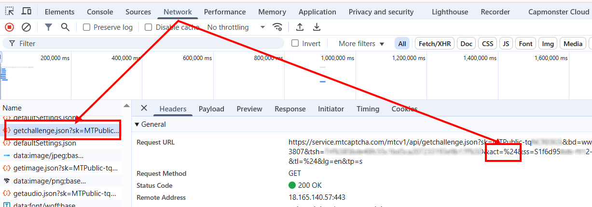

import Tabs from '@theme/Tabs';
import TabItem from '@theme/TabItem';
import ParamItem from '@theme/ParamItem';
import MethodItem from '@theme/MethodItem';
import MethodDescription from '@theme/MethodDescription'
import PriceBlock from '@theme/PriceBlock';
import PriceBlockWrap from '@theme/PriceBlockWrap';

# MTCaptcha

<PriceBlockWrap>
  <PriceBlock title="MTCaptcha task" captchaId="mtcaptcha"/>
</PriceBlockWrap>


:::warning **注意！**
CapMonster Cloud 默认通过内置代理工作——这些代理已包含在费用内。仅当网站不接受令牌或对内置服务的访问受限时，才需要指定您自己的代理。您可以联系[支持服务](https://helpdesk.zennolab.com/conversation/new)以确认细节并了解令牌在特定网站上的接受情况。

如果代理按 IP 授权，请将地址 **65.21.190.34** 加入白名单。
:::


## 请求参数

<TabItem value="proxy" label="MTCaptchaTask" className="bordered-panel">
<ParamItem title="type" required type="string" />
**MTCaptchaTask**

---

<ParamItem title="websiteURL" required type="string" />
进行验证码识别的网页地址。

---

<ParamItem title="websiteKey" required type="string" />
MTCaptcha 的密钥，在请求中以参数 `sk` 传递（*请参见下方示例说明如何查找*）。

---

<ParamItem title="pageAction" type="string" />
*action* 参数在请求中以 `act` 传递，并在 token 验证时显示。仅当值不同于默认值 **%24** 时才需要填写。  
HTML 示例：
```

<script>
var mtcaptchaConfig = {
      "sitekey": "MTPublic-abCDEFJAB",
      "action": "login"
};
</script>

````

---

<ParamItem title="isInvisible" type="bool" />
如果验证码为不可见模式（即隐藏的验证字段），请设为 **true**。当系统怀疑为机器人时将触发额外验证。

---

<ParamItem title="userAgent" type="string" />
浏览器的 User-Agent。<br />
**请仅传递当前 Windows 系统下的有效 UA。当前推荐值为**：`userAgentPlaceholder`

---

<ParamItem title="proxyType" type="string" />
**http** - 常规 http/https 代理；<br />
**https** - 仅当 "http" 无效时使用（某些自定义代理需要）；<br />
**socks4** - socks4 代理；<br />
**socks5** - socks5 代理。

---

<ParamItem title="proxyAddress" type="string" />
<p>
代理的 IPv4/IPv6 地址。禁止以下使用方式：
- 使用主机名；
- 使用透明代理（可暴露客户端 IP）；
- 使用本地机器上的代理。
</p>

---

<ParamItem title="proxyPort" type="integer" />
代理端口。

---

<ParamItem title="proxyLogin" type="string" />
代理服务器登录用户名。

---

<ParamItem title="proxyPassword" type="string" />
代理服务器登录密码。

</TabItem>

## 创建任务的方法
<Tabs className="full-width-tabs filled-tabs request-tabs" groupId="captcha-type">
<TabItem value="proxyless" label="MTCaptchaTask（无代理）" default className="method-panel">
<MethodItem>
```http
https://api.capmonster.cloud/createTask
````

</MethodItem>
<MethodDescription>
**请求**
```json
{
  "clientKey": "API_KEY",
  "task": 
  {
    "type": "MTCaptchaTask",
    "websiteURL": "https://www.example.com",
    "websiteKey": "MTPublic-abCDEFJAB",
    "isInvisible": false,
    "pageAction": "login"
  }
}
```
**响应**
```json
{
  "errorId":0,
  "taskId":407533077
}
```
</MethodDescription>
</TabItem>

<TabItem value="proxy" label="MTCaptchaTask（使用代理）" default className="method-panel">
<MethodItem>
```http
https://api.capmonster.cloud/createTask
```
</MethodItem>
<MethodDescription>
**请求**
```json
{
  "clientKey": "API_KEY",
  "task": 
  {
    "type": "MTCaptchaTask",
    "websiteURL": "https://www.example.com",
    "websiteKey": "MTPublic-abCDEFJAB",
    "isInvisible": false,
    "pageAction": "login",
    "proxyType":"http",
    "proxyAddress":"8.8.8.8",
    "proxyPort":8080,
    "proxyLogin":"proxyLoginHere",
    "proxyPassword":"proxyPasswordHere"
  }
}
```
**响应**
```json
{
  "errorId":0,
  "taskId":407533077
}
```
</MethodDescription>
</TabItem>
</Tabs>

## 获取任务结果的方法

使用方法 [getTaskResult](../api/methods/get-task-result.md) 获取 MTCaptcha 的解决方案。

<TabItem value="proxyless" label="CustomTask（无代理）" default className="method-panel-full">
<MethodItem>
```http
https://api.capmonster.cloud/getTaskResult
```
</MethodItem>
<MethodDescription>
**请求**
```json
{
  "clientKey": "API_KEY",
  "taskId": 407533077
}
```

**响应**

```json
{
  "errorId": 0,
  "errorCode": null,
  "errorDescription": null,
  "solution": {
    "token": "v1(155506dc,c8c2e356,MTPublic-abCDEFJAB,70f03532a53...5FSDA**)"
  },
  "status": "ready"
}
```

</MethodDescription>
</TabItem>

## 如何查找验证码参数

### websiteKey

在开发者工具的 **Network** 标签中可以找到此参数。
查找类似以 `getchallenge.json` 开头的请求 — 参数 **sk** 对应 `websiteKey`。


### pageAction

该请求中也包含参数 `pageAction`，其值通过 **act** 传递。
默认值为 **%24**；若值不同（如 *..\&act=login&...*），请在创建任务时传入。



## 使用 SDK 库

<Tabs className="full-width-tabs filled-tabs request-tabs" groupId="captcha-type">

  <TabItem value="js" label="JavaScript" default className="method-panel">

  ```js
  // https://github.com/ZennoLab/capmonstercloud-client-js

  import { CapMonsterCloudClientFactory, ClientOptions, MTCaptchaRequest } from '@zennolab_com/capmonstercloud-client';

  document.addEventListener('DOMContentLoaded', async () => {
    const cmcClient = CapMonsterCloudClientFactory.Create(
      new ClientOptions({ clientKey: '<你的 capmonster.cloud API key>' })
    );

    console.log(await cmcClient.getBalance());

    const mtcaptchaRequest = new MTCaptchaRequest({
      websiteURL: 'https://www.example.com',     // 带验证码页面的 URL 
      websiteKey: 'MTPublic-abCDEFJAB',          // 替换为正确值
      isInvisible: false,                         // 如果验证码是隐形的，设置为 "true"
      pageAction: 'login',
      /*
      // 如果需要使用代理:
      proxy: {
        type: 'http',
        address: '127.0.0.1',
        port: 8000,
        login: 'user',
        password: 'password'
      }
      */
    });

    console.log(await cmcClient.Solve(mtcaptchaRequest));
  });
````

  </TabItem>

  <TabItem value="python" label="Python" default className="method-panel">

```python
# https://github.com/ZennoLab/capmonstercloud-client-python

import asyncio
from capmonstercloudclient import CapMonsterClient, ClientOptions
from capmonstercloudclient.requests import MTCaptchaRequest

# 你的 CapMonster Cloud API key
client_options = ClientOptions(api_key="API_KEY")
cap_monster_client = CapMonsterClient(options=client_options)

# 选项 1：不使用代理
mtcaptcha_request = MTCaptchaRequest(
    websiteUrl="https://www.example.com", # 带验证码页面的 URL 
    websiteKey="MTPublic-abCDEFJAB", # 替换为正确值
    isInvisible=False,   # 如果验证码是隐形的，设置为 True
    pageAction="login"
)

# 选项 2：使用代理
# 如果需要，请取消注释

# mtcaptcha_request = MTCaptchaRequest(
#     websiteUrl="https://www.example.com",
#     websiteKey="MTPublic-abCDEFJAB",
#     isInvisible=False,
#     pageAction="login",
#     proxyType="http",
#     proxyAddress="123.45.67.89",
#     proxyPort=8000,
#     proxyLogin="proxyUser",
#     proxyPassword="proxyPass"
# )

async def solve_captcha():
    return await cap_monster_client.solve_captcha(mtcaptcha_request)

responses = asyncio.run(solve_captcha())
print(responses)
```

  </TabItem>

  <TabItem value="csharp" label="C#" className="method-panel">

```csharp
// https://github.com/ZennoLab/capmonstercloud-client-dotnet

using System;
using System.Threading.Tasks;
using Zennolab.CapMonsterCloud;
using Zennolab.CapMonsterCloud.Requests;

class Program
{
    static async Task Main(string[] args)
    {
        // 你的 CapMonster Cloud API key
        var clientOptions = new ClientOptions
        {
            ClientKey = "your_api_key"
        };

        var cmCloudClient = CapMonsterCloudClientFactory.Create(clientOptions);

        // 选项 1：MTCaptcha 不使用代理
        var mtcaptchaRequest = new MTCaptchaTaskRequest
        {
            WebsiteUrl = "https://www.example.com", // 带验证码页面的 URL 
            WebsiteKey = "MTPublic-tqNCRE0GS", // 替换为正确值
            Invisible = false,  // 如果验证码是隐形的，设置为 True
            PageAction = "login",
            UserAgent = "userAgentPlaceholder" // 使用当前 UserAgent
        };

        // 选项 2：MTCaptcha 使用代理
        // 如果需要，请取消注释
        /*
        var mtcaptchaRequest = new MTCaptchaTaskRequest
        {
            WebsiteUrl = "https://www.example.com",
            WebsiteKey = "MTPublic-tqNCRE0GS",
            Invisible = false,
            PageAction = "login",
            UserAgent = "userAgentPlaceholder",

            Proxy = new ProxyContainer(
                "123.45.67.89",
                8080,
                ProxyType.Http,
                "proxyLogin",
                "proxyPassword"
            )
        };
        */

        var mtcaptchaResult = await cmCloudClient.SolveAsync(mtcaptchaRequest);

        Console.WriteLine("MTCaptcha 解决方案: " + mtcaptchaResult.Solution.Value);
    }
}
```

  </TabItem>

</Tabs>

