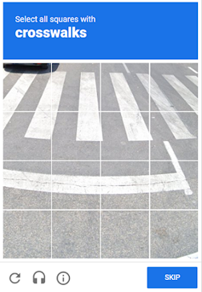
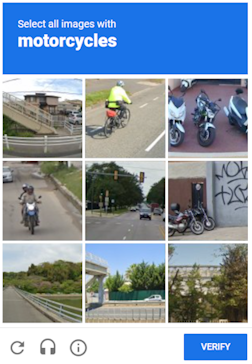
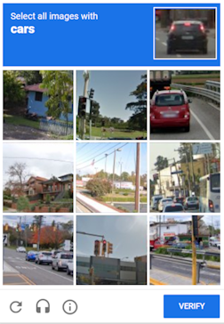

---
sidebar_position: 0
sidebar_label: reCAPTCHA v2
---

import Tabs from '@theme/Tabs';
import TabItem from '@theme/TabItem';
import ParamItem from '@theme/ParamItem';
import MethodItem from '@theme/MethodItem';
import MethodDescription from '@theme/MethodDescription'
import PriceBlock from '../../../../../src/theme/PriceBlock';
import PriceBlockWrap from '@theme/PriceBlockWrap';
import BlogLink from '@theme/BlogLink';
import { ArticleHead } from '../../../../../src/theme/ArticleHead';

<ArticleHead slug="captchas/no-captcha-task" />


# reCAPTCHA v2

<PriceBlockWrap>
  <PriceBlock title="RecaptchaV2" captchaId="rc2"/>
</PriceBlockWrap>

  

该对象包含 Google reCAPTCHA v2 解决任务的数据。为确保解决此类验证码的普遍性，您需要使用在自动填写目标网站表单时使用的所有数据，包括代理、浏览器用户代理和 cookies。这将有助于避免在 Google 更改其验证码代码时出现任何问题。

相比于普通的图像验证码，此类验证码可能需要更长时间来解决，但通过我们发送给您的 `g-recaptcha-response` 值，在解决您的 reCAPTCHA v2 后的下一个 60 秒内仍然有效，可以弥补这一问题。

<BlogLink url="https://capmonster.cloud/zh/blog/re-1/how-to-bypass-recaptcha-v2-using-capmonster-cloud"/>

:::warning **注意！**

默认情况下，CapMonster Cloud 使用内置代理，适用于大多数网站。  
但是，如果目标网站不接受令牌，请尝试使用[自定义代理](#创建任务方法)（*使用代理的 RecaptchaV2Task*）。在解决验证码和提交令牌到网站时，请确保使用**相同的代理**。

* 如果使用基于 IP 的授权，请将 **65.21.190.34** 添加到白名单。

* 如果 reCAPTCHA v2 令牌仍无法被接受，请联系[技术支持](https://helpdesk.zennolab.com/ru/conversation/new)。

:::


## 对象结构

  <TabItem value="proxy" label="RecaptchaV2Task (使用代理)" className="bordered-panel">
    <ParamItem title="type" required type="string" />
    **RecaptchaV2Task**

     ---

    <ParamItem title="websiteURL" required type="string" />
    带有验证码的网页地址。

     ---

    <ParamItem title="websiteKey" required type="string" />
    ReCaptcha 网站密钥。<br />`<div class="g-recaptcha" data-sitekey="THIS_ONE"></div>`

     ---

    <ParamItem title="recaptchaDataSValue" type="string" />
    某些自定义实现可能包含 ReCaptcha2 div 中的额外 "data-s" 参数，实际上是一次性令牌，每次解决 ReCaptcha2 都必须获取。<br />`<div class="g-recaptcha" data-sitekey="some sitekey" data-s="THIS_ONE"></div>`

     ---

    <ParamItem title="userAgent" type="string" />
    用于仿真的浏览器用户代理。必须使用现代浏览器的签名，否则 Google 将要求您 "更新您的浏览器"。

     ---

    <ParamItem title="cookies" type="string" />
    <p>额外的 Cookie，我们在与目标页面或谷歌的交互过程中必须使用</p><p>**格式**：cookiename1=cookievalue1; cookiename2=cookievalue2</p>

     ---

    <ParamItem title="isInvisible" type="bool" />
    "true" 如果验证码是隐形的，即没有确认复选框，而是有一个隐藏字段。如果怀疑是机器人，则进行额外检查。

     ---

    <ParamItem title="proxyType" type="string" />
    **http** - 普通的 http/https 代理；<br />**https** - 仅在 "http" 不起作用时尝试（某些自定义代理服务器要求）；<br />**socks4** - socks4 代理；<br />**socks5** - socks5 代理。

     ---

    <ParamItem title="proxyAddress" type="string" />
    <p>
	  代理 IP 地址 IPv4/IPv6。不允许：
		- 使用透明代理（其中客户端 IP 可见）；
		- 使用来自本地网络的代理。
	</p>

     ---

    <ParamItem title="proxyPort" type="integer" />
    代理端口。

     ---

    <ParamItem title="proxyLogin" type="string" />
    代理登录。

     ---

    <ParamItem title="proxyPassword" type="string" />
    代理密码。

  </TabItem>  


## 创建任务方法

<Tabs className="full-width-tabs filled-tabs request-tabs" groupId="captcha-type">
  <TabItem value="proxyless" label="RecaptchaV2Task (无代理)" default className="method-panel">
    <MethodItem>
      ```http
      https://api.capmonster.cloud/createTask
      ```
    </MethodItem>
	<MethodDescription>
		**要求**
		```json
		{
		  "clientKey":"API_KEY",
		  "task": {
			"type":"RecaptchaV2Task",
			"websiteURL":"https://lessons.zennolab.com/captchas/recaptcha/v2_simple.php?level=high",
			"websiteKey":"6Lcg7CMUAAAAANphynKgn9YAgA4tQ2KI_iqRyTwd"
		  }
		}
		```
		**回应**
		```json
		{
		  "errorId":0,
		  "taskId":407533072
		}
		```
	</MethodDescription>
  </TabItem>
  <TabItem value="proxy" label="RecaptchaV2Task (使用代理)" className="method-panel">
	<MethodItem>
	  ```http
	  https://api.capmonster.cloud/createTask
	  ```
	</MethodItem>
	<MethodDescription>
		**要求**
		```json
		{
		  "clientKey":"API_KEY",
		  "task": {
			"type":"RecaptchaV2Task",
			"websiteURL":"https://lessons.zennolab.com/captchas/recaptcha/v2_simple.php?level=high",
			"websiteKey":"6Lcg7CMUAAAAANphynKgn9YAgA4tQ2KI_iqRyTwd",
			"proxyType":"http",
			"proxyAddress":"8.8.8.8",
			"proxyPort":8080,
			"proxyLogin":"proxyLoginHere",
			"proxyPassword":"proxyPasswordHere",
			"userAgent":"userAgentPlaceholder"
		  }
		}
		```
		**回应**
		```json
		{
		  "errorId":0,
		  "taskId":407533072
		}
		```
	</MethodDescription>
  </TabItem>
</Tabs>

## 获取任务结果方法

:::warning **警告！**
在某些网站上，确保 UserAgent 与解决验证码时使用的 UserAgent 相匹配非常重要。因此，如果 CapMonster Cloud 在返回令牌的同时提供了 UserAgent，**请始终**在提交表单或在目标页面确认解决方案时使用该 UserAgent。
:::

使用[getTaskResult](../api/methods/get-task-result.mdx)方法请求 ReCaptcha2 的答案。根据服务工作负载，您将在 100 毫秒内收到响应。

<TabItem value="proxyless" label="RecaptchaV2Task (without proxy)" default className="method-panel-full">
    <MethodItem>
		```http
		https://api.capmonster.cloud/getTaskResult
		```
    </MethodItem>
    <MethodDescription>
		**要求**
		```json
		{
		  "clientKey":"API_KEY",
		  "taskId": 407533072
		}
		```
		**回应**
		```json
		{
		  "errorId":0,
		  "status":"ready",
		  "solution": {
			"gRecaptchaResponse":"3AHJ_VuvYIBNBW5yyv0zRYJ75VkOKvhKj9_xGBJKnQimF72rfoq3Iy-DyGHMwLAo6a3"
		  }
		}
		```
    对于某些网站，响应可能如下所示。提交解决方案时，请确保使用响应中提供的 UserAgent，即使它与您当前使用的浏览器或脚本不同。
 
```json
{
  "errorId": 0,
  "status": "ready",
  "solution": {
    "userAgent": "Mozilla/5.0 (Windows NT 10.0; Win64; x64) AppleWebKit/537.36 (KHTML, like Gecko) Chrome/139.0.0.0 Safari/537.36",
    "gRecaptchaResponse": "0cAFcWeA5Y3...hF8UWA",
    "cookies": {
      "nocookies": "true"
    }
  }
}
```
	</MethodDescription>
</TabItem>

<br />

|**属性**|**类型**|**描述**|
| :- | :- | :- |
|gRecaptchaResponse|String|应插入到 Recaptcha2 提交表单中的哈希值，格式如 `<textarea id="g-recaptcha-response" ..></textarea>`。长度为500到2190字节。|

## 如何查找任务创建所需的所有参数

### 手动方式

1. 请在浏览器中访问您的网站，该网站包含验证码功能。
2. 右键点击验证码元素，选择 **检查（Inspect）**。

#### websiteKey（data-sitekey）

在 **Elements（元素）** 标签页中：查找页面上的 `<div class="g-recaptcha">` 元素。复制其 *data-sitekey* 属性的值，例如：


在 **Network（网络）** 标签页：

打开 **Network** 标签页并重新加载包含验证码的页面。查找如下请求（**k** 值即为 *data-sitekey*）：


#### recaptchaDataSValue（如果使用）

如果页面包含 *data-s* 属性，在 HTML 中查找它：


#### isInvisible（是否为隐形验证码）

在 **Network** 标签页中：如果是隐形验证码，元素将包含 *size="invisible"* 属性，例如：


### 自动方法

为了自动化获取所需参数，可以通过 **浏览器**（普通模式或 headless 模式，例如使用 **Playwright**）进行提取，或直接从 **HTTP 请求**中获取。由于动态参数的有效时间较短，建议在获取后尽快使用。

:::warning **重要**
所提供的代码片段仅作为获取必要参数的基础示例。具体实现方式取决于包含验证码的网站、本身的页面结构，以及所使用的 HTML 元素和选择器。
:::


<Tabs className="full-width-tabs filled-tabs request-tabs">
  <TabItem value="js" label="JavaScript" default className="method-panel">
    <details>
      <summary>显示代码（浏览器端）</summary>

      ```js
      (() => {
        const iframeEl = document.querySelector('iframe[src^="https://www.google.com/recaptcha/api2/anchor?"]');
        const captchaUrl = iframeEl?.getAttribute('src');

        if (captchaUrl) {
          const urlParams = new URLSearchParams(captchaUrl.split('?')[1]);
          
          const sitekey = urlParams.get('k');
          const size = urlParams.get('size');
          
          const isInvisible = size === 'invisible';

          const sitekeyEl = document.querySelector('[data-sitekey]');
          const datasEl = document.querySelector('[data-s]');
          const datas = datasEl?.getAttribute('data-s');

          console.log({
            sitekey: sitekey || sitekeyEl?.getAttribute('data-sitekey'),
            datas,
            isInvisible
          });
        }
      })();
      ```
    </details>

    <details>
      <summary>显示代码（Node.js）</summary>

      ```js
      import { chromium } from "playwright";

      (async () => {
        const browser = await chromium.launch({ headless: false });
        const page = await browser.newPage();

        await page.goto("https://example.com");

        await page.waitForSelector('iframe[src^="https://www.google.com/recaptcha/api2/anchor?"]');

        const captchaData = await page.evaluate(() => {
          const iframeEl = document.querySelector('iframe[src^=
          "https://www.google.com/recaptcha/api2/anchor?"]');
          const captchaUrl = iframeEl?.getAttribute("src");

          if (captchaUrl) {
            const urlParams = new URLSearchParams(captchaUrl.split("?")[1]);
            const sitekey = urlParams.get("k");
            const size = urlParams.get("size");
            const isInvisible = size === "invisible";

            const sitekeyEl = document.querySelector("[data-sitekey]");
            const datasEl = document.querySelector("[data-s]");
            const datas = datasEl?.getAttribute("data-s");

            return {
              sitekey: sitekey || sitekeyEl?.getAttribute("data-sitekey"),
              datas,
              isInvisible,
            };
          }
          return null;
        });

        console.log(captchaData);
        await browser.close();
      })();
      ```
    </details>
  </TabItem>

  <TabItem value="python" label="Python" className="method-panel">
    <details>
      <summary>显示代码</summary>

      ```python
      import asyncio
      from urllib.parse import urlparse, parse_qs
      from playwright.async_api import async_playwright

      def parse_recaptcha_url(url):
          parsed_url = urlparse(url)
          params = parse_qs(parsed_url.query)
          sitekey = params.get('k', [None])[0]
          size = params.get('size', [None])[0]
          return sitekey, size == 'invisible'

      async def main():
          async with async_playwright() as p:
              browser = await p.chromium.launch(headless=True)
              page = await browser.new_page()
              await page.goto("https://example.com", timeout=60000)
              captcha_url = await page.locator('iframe[
              src^="https://www.google.com/recaptcha/api2/anchor?"]').get_attribute('src')
              if captcha_url:
                  sitekey, is_invisible = parse_recaptcha_url(captcha_url)
                  print({"sitekey": sitekey, "isInvisible": is_invisible})
              await browser.close()

      asyncio.run(main())
      ```
    </details>
  </TabItem>

  <TabItem value="csharp" label="C#" className="method-panel">
    <details>
      <summary>显示代码</summary>

      ```csharp
      using Microsoft.Playwright;
      using System;
      using System.Linq;
      using System.Threading.Tasks;
      using System.Web;

      class Program
      {
          static (string sitekey, bool isInvisible) ParseRecaptchaUrl(string url)
          {
              var uri = new Uri(url);
              var queryParams = HttpUtility.ParseQueryString(uri.Query);
              return (queryParams["k"], queryParams["size"] == "invisible");
          }

          static async Task Main(string[] args)
          {
              var playwright = await Playwright.CreateAsync();
              var browser = await playwright.Chromium.LaunchAsync(
                new BrowserTypeLaunchOptions { Headless = true });
              var page = await browser.NewPageAsync();
              await page.GotoAsync("https://example.com", new PageGotoOptions { Timeout = 60000 });
              var captchaUrl = await page.Locator(
                "iframe[src^='https://www.google.com/recaptcha/api2/anchor?']").GetAttributeAsync("src");
              if (captchaUrl != null)
              {
                  var (sitekey, isInvisible) = ParseRecaptchaUrl(captchaUrl);
                  Console.WriteLine($"{{\"sitekey\": \"{sitekey}\", \"isInvisible\": {isInvisible}}}");
              }
              await browser.CloseAsync();
          }
      }
      ```
    </details>
  </TabItem>
</Tabs>

## 使用 SDK 库

<Tabs className="full-width-tabs filled-tabs request-tabs" groupId="captcha-type">
  <TabItem value="js" label="JavaScript" default className="method-panel">
  <details>
      <summary>显示代码（用于浏览器）</summary>
    ```js
    // https://github.com/ZennoLab/capmonstercloud-client-js

    import { CapMonsterCloudClientFactory, ClientOptions, RecaptchaV2Request } 
      from '@zennolab_com/capmonstercloud-client';

    document.addEventListener('DOMContentLoaded', async () => {

      const API_KEY = "YOUR_API_KEY";  // 输入您的 CapMonster Cloud API 密钥

      const cmcClient = CapMonsterCloudClientFactory.Create(
        new ClientOptions({ clientKey: API_KEY })
      );

      // 如有必要，可以检查余额
      const balance = await cmcClient.getBalance();
      console.log("Balance:", balance);

      // 基本示例，无需代理
      // CapMonster Cloud 会自动使用它们的代理
      let recaptchaV2Request = new RecaptchaV2Request({
        websiteURL: "https://lessons.zennolab.com/captchas/recaptcha/v2_simple.php?level=high",
        websiteKey: "6Lcg7CMUAAAAANphynKgn9YAgA4tQ2KI_iqRyTwd"
      });

      // 使用您自己的代理的示例
      // 如果想使用自己的代理，请取消注释以下代码块

      /*
      const proxy = {
          proxyType: "http",
          proxyAddress: "123.45.67.89",
          proxyPort: 8080,
          proxyLogin: "username",
          proxyPassword: "password"
      };

      recaptchaV2Request = new RecaptchaV2Request({
          websiteURL: "https://lessons.zennolab.com/captchas/recaptcha/v2_simple.php?level=high",
          websiteKey: "6Lcg7CMUAAAAANphynKgn9YAgA4tQ2KI_iqRyTwd",
          proxy,
          userAgent: "userAgentPlaceholder"
      });
      */

      const result = await cmcClient.Solve(recaptchaV2Request);
      console.log("Solution:", result);
    });
    ```
    </details>

    <details>
      <summary>显示代码 (Node.js)</summary>
```javascript
// https://github.com/ZennoLab/capmonstercloud-client-js

import { CapMonsterCloudClientFactory, ClientOptions, RecaptchaV2Request } from '@zennolab_com/capmonstercloud-client';

const API_KEY = "YOUR_API_KEY";  // 输入您的 CapMonster Cloud API 密钥

async function solveRecaptchaV2() {
    const client = CapMonsterCloudClientFactory.Create(
        new ClientOptions({ clientKey: API_KEY })
    );

    // 基本示例，无需代理
    // CapMonster Cloud 会自动使用它们的代理
    let recaptcha2Request = new RecaptchaV2Request({
        websiteURL: "https://lessons.zennolab.com/captchas/recaptcha/v2_simple.php?level=high",
        websiteKey: "6Lcg7CMUAAAAANphynKgn9YAgA4tQ2KI_iqRyTwd"
    });

    // 使用您自己的代理的示例
    // 如果想使用自己的代理，请取消注释以下代码块

    /*
    const proxy = {
        proxyType: "http",
        proxyAddress: "123.45.67.89",
        proxyPort: 8080,
        proxyLogin: "username",
        proxyPassword: "password"
    };

    recaptcha2Request = new RecaptchaV2Request({
        websiteURL: "https://lessons.zennolab.com/captchas/recaptcha/v2_simple.php?level=high",
        websiteKey: "6Lcg7CMUAAAAANphynKgn9YAgA4tQ2KI_iqRyTwd",
        proxy,
        userAgent: "userAgentPlaceholder"
    });
    */

    // 如有必要，可以检查余额
    const balance = await client.getBalance();
    console.log("Balance:", balance);

    const result = await client.Solve(recaptcha2Request);
    console.log("Solution:", result);
}

solveRecaptchaV2().catch(console.error);
```
</details>
    <BlogLink url="https://capmonster.cloud/zh/blog/re-1/javascript-recaptcha-v2"/>
  </TabItem>

  <TabItem value="python" label="Python" className="method-panel">
<details>
      <summary>显示代码</summary>
    ```python
    # https://github.com/ZennoLab/capmonstercloud-client-python

    import asyncio
    from capmonstercloudclient import CapMonsterClient, ClientOptions
    from capmonstercloudclient.requests import RecaptchaV2Request
    # from capmonstercloudclient.requests.baseRequestWithProxy import ProxyInfo  # 如果计划使用代理，请取消注释

    API_KEY = "YOUR_API_KEY"  # 输入您的 CapMonster Cloud API 密钥

    async def solve_recaptcha_v2():
        client_options = ClientOptions(api_key=API_KEY)
        cap_monster_client = CapMonsterClient(options=client_options)

        # 基本示例，无需代理
        # CapMonster Cloud 会自动使用它们的代理
        recaptcha2_request = RecaptchaV2Request(
            websiteUrl="https://lessons.zennolab.com/captchas/recaptcha/v2_simple.php?level=high",
            websiteKey="6Lcg7CMUAAAAANphynKgn9YAgA4tQ2KI_iqRyTwd"
        )

        # 使用您自己的代理的示例
        # 如果想使用自己的代理，请取消注释以下代码块

        # proxy = ProxyInfo(
        #     proxyType="http",
        #     proxyAddress="123.45.67.89",
        #     proxyPort=8080,
        #     proxyLogin="username",
        #     proxyPassword="password"
        # )

        # recaptcha2_request = RecaptchaV2Request(
        #     websiteUrl="https://lessons.zennolab.com/captchas/recaptcha/v2_simple.php?level=high",
        #     websiteKey="6Lcg7CMUAAAAANphynKgn9YAgA4tQ2KI_iqRyTwd",
        #     proxy=proxy,
        #     userAgent="userAgentPlaceholder"
        # )

        # 如有必要，可以检查余额
        balance = await cap_monster_client.get_balance()
        print("Balance:", balance)

        result = await cap_monster_client.solve_captcha(recaptcha2_request)
        print("Solution:", result)

    asyncio.run(solve_recaptcha_v2())
    ```
    </details>
    <BlogLink url="https://capmonster.cloud/zh/blog/re-1/python-recaptcha-v2"/>
  </TabItem>

  <TabItem value="csharp" label="C#" className="method-panel">
  <details>
      <summary>显示代码</summary>
    ```csharp
    // https://github.com/ZennoLab/capmonstercloud-client-dotnet

    using System;
    using System.Threading.Tasks;
    using Zennolab.CapMonsterCloud;
    using Zennolab.CapMonsterCloud.Requests;

    class Program
    {
        static async Task Main(string[] args)
        {
            // 输入您的 CapMonster Cloud API 密钥
            var clientOptions = new ClientOptions
            {
                ClientKey = "YOUR_API_KEY"
            };

            var cmCloudClient = CapMonsterCloudClientFactory.Create(clientOptions);

            // 基本示例，无需代理
            // CapMonster Cloud 会自动使用它们的代理

            var recaptchaV2Request = new RecaptchaV2Request
            {
                WebsiteUrl = "https://lessons.zennolab.com/captchas/recaptcha/v2_simple.php?level=high", // 带有验证码页面的 URL
                WebsiteKey = "6Lcg7CMUAAAAANphynKgn9YAgA4tQ2KI_iqRyTwd"  // 替换为正确的值
            };

            // 使用您自己的代理的示例
            // 如果想使用自己的代理，请取消注释以下代码块

            /*
            var recaptchaV2Request = new RecaptchaV2Request
            {
                WebsiteUrl = "https://lessons.zennolab.com/captchas/recaptcha/v2_simple.php?level=high",
                WebsiteKey = "6Lcg7CMUAAAAANphynKgn9YAgA4tQ2KI_iqRyTwd",

                Proxy = new ProxyContainer(
                    "123.45.67.89",        
                    8080,              
                    ProxyType.Http,   
                    "username", 
                    "password"
                )
            };
            */

            // 如有必要，可以检查余额
            var balance = await cmCloudClient.GetBalanceAsync();
            Console.WriteLine("Balance: " + balance);

            var recaptchaV2Result = await cmCloudClient.SolveAsync(recaptchaV2Request);

            Console.WriteLine("Solution: " + recaptchaV2Result.Solution.Value);
        }
    }
    ```
    </details>
    <BlogLink url="https://capmonster.cloud/zh/blog/re-1/c-recaptcha-v2"/>
  </TabItem>
</Tabs>
