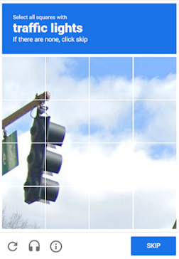

import Tabs from '@theme/Tabs';
import TabItem from '@theme/TabItem';
import ParamItem from '@theme/ParamItem';
import MethodItem from '@theme/MethodItem';
import MethodDescription from '@theme/MethodDescription'
import PriceBlock from '../../../../../src/theme/PriceBlock';
import PriceBlockWrap from '@theme/PriceBlockWrap';
import BlogLink from '@theme/BlogLink';
import { ArticleHead } from '../../../../../src/theme/ArticleHead';

<ArticleHead slug="captchas/recaptcha-v2-enterprise-task" />

# RecaptchaV2EnterpriseTask

<PriceBlockWrap>
  <PriceBlock captchaId="rc2e"/>
  <PriceBlock captchaId="rc2e-spotify-yahoo"/>
</PriceBlockWrap>

  

:::warning **注意！**
CapMonster Cloud 默认通过内置代理工作——这些代理已包含在费用内。仅当网站不接受令牌或对内置服务的访问受限时，才需要指定您自己的代理。

如果代理按 IP 授权，请将地址 **65.21.190.34** 加入白名单。
:::


该对象包含用于解决Google reCAPTCHA Enterprise任务的数据。为了提供解决此类任务的通用性，我们已经再现了您计划完成的自动化任务所需的每一个环境因素。包括代理访问、浏览器的用户代理、Cookies（可选）。

这种类型的验证码与ReCaptcha v.2在视觉上没有区别，您可以通过使用开发者工具中的网络选项卡下的查询来查看验证码代码的差异，例如：

*请求URL（锚点）：`https://www.google.com/recaptcha/enterprise/anchor?ar=1&k=6Lf26sUnAAAAAIKLuWNYgRsFUfmI-3Lex3xT5N-s&co=aHR0cHM6Ly8yY2FwdGNoYS5jb206NDQz&hl=en&v=1kRDYC3bfA-o6-tsWzIBvp7k&size=normal&cb=43r1q2d3mx66`*

这种类型的验证码可能比普通的图片验证码解决时间稍长一些，但这个问题被我们在解决您的ReCaptcha2后发送给您的g-captcha-response值在接下来的60秒内有效这一事实所弥补。

<BlogLink url="https://capmonster.cloud/zh/blog/re-1/recaptcha-enterprise-how-to-solve-complete-guide"/>


## 请求参数

  <TabItem value="proxy" label="RecaptchaV2EnterpriseTask (使用代理)" className="bordered-panel">
    <ParamItem title="type" required type="string" />
    **RecaptchaV2EnterpriseTask**

    ---

    <ParamItem title="websiteURL" required type="string" />
    包含Google ReCaptcha Enterprise的网页地址。

    ---

    <ParamItem title="websiteKey" required type="string" />
    Recaptcha 网站密钥。<br />`<div class="g-recaptcha" data-sitekey="THIS_ONE"></div>`<br/>或 `<iframe title="reCAPTCHA" src="...;k=6LdIFr0ZAAAAAO3vz0O0OQrtAefzdJcWQM2TMYQH&amp;...`，其中 `6LdIFr0ZAAAAAO3vz0O0OQrtAefzdJcWQM2TMYQH` 即为 `websiteKey`

    ---

    <ParamItem title="enterprisePayload" type="string" />
    某些reCAPTCHA Enterprise小部件的实现可能包含传递给“grecaptcha.enterprise.render”方法的附加参数。例如: `<pre lang="js" ><code>grecaptcha.enterprise.render("some-div-id", {<br /> sitekey: "6Lc\_aCMTAAAAABx7u2N0D1XnVbI\_v6ZdbM6rYf16"<br/> theme: "dark"<br/> s: "2JvUXHNTnZl1Jb6WEvbDyB...ugQA"<br/>});</code></pre>`

    ---

    <ParamItem title="apiDomain" type="string" />
    <p>
		加载 reCAPTCHA Enterprise 的域名地址。例如
		- www.google.com
		- www.recaptcha.net

		如果不知道为什么需要参数，请勿使用。
	</p>

    ---

    <ParamItem title="userAgent" type="string" />
    用于模拟的浏览器用户代理。必须使用现代浏览器的签名，否则Google会要求您“更新浏览器”。

    ---

    <ParamItem title="cookies" type="string" />
    <p>我们在与目标页面或Google交互期间必须使用的附加Cookies。</p><p>**格式**: cookiename1=cookievalue1; cookiename2=cookievalue2</p>

    ---

    <ParamItem title="proxyType" type="string" />
    **http** - 普通的http/https代理;<br />**https** - 仅在“http”不起作用时尝试此选项（某些自定义代理服务器需要）；<br />**socks4** - socks4代理;<br/>**socks5** - socks5代理。

    ---

    <ParamItem title="proxyAddress" type="string" />
    <p>
		代理IP地址 IPv4/IPv6。不允许使用:
		- 透明代理（客户端IP可见）；
		- 来自本地网络的代理。
	</p>

    ---

    <ParamItem title="proxyPort" type="integer" />
    代理端口。

    ---

    <ParamItem title="proxyLogin" type="string" />
    代理登录。

    ---

    <ParamItem title="proxyPassword" type="string" />
    代理密码。

  </TabItem>

<br />
对于 `enterprisePayload` - 在调用它之前，您需要用自己的函数替换 `grecaptcha.enterprise.render` 函数，并从其参数中获取值。该函数在加载脚本后存在，验证码通常立即渲染或基于页面事件渲染。如果验证码在客户端使用当前字段 `s` 渲染，那么令牌很可能不会被接受。
可以在没有 `s` 字段的情况下调用原始函数。


`apiDomain` 是托管用于与reCAPTCHA交互的API接口的域，用于验证用户是否通过验证码。

<details>
    <summary>脚本</summary>

```js
var __test_grc = undefined;

var __test_enterprise = undefined;

var __test_render = undefined;

var __test_render_widget = undefined;

var __test_render_args = undefined; // 这里将是调用render时使用的对象。

var __test_handler = {
  get: function(target, name, receiver) {
    if (name == 'enterprise') {
      return __test_enterprise ? __test_enterprise : (__test_enterprise = new Proxy(target[name], __test_handler));
    } else if (name == 'render') {
      __test_render = target[name];
      return (function(a, b) {
        __test_render_args = b;
        __test_render_widget = a;
        return __test_render(a, {sitekey: b.sitekey}); });
    } else {
      return target[name];
    }
  }
};

Object.defineProperty(window, 'grecaptcha', {
  enumerable: true,
  configurable: false,
  get: function() {
    return __test_grc;
  },
  set: function(value) {
    __test_grc = new Proxy(value, __test_handler);
  }
});
```
</details>

## 创建任务方法 

<Tabs className="full-width-tabs filled-tabs request-tabs" groupId="captcha-type">
  <TabItem value="proxyless" label="RecaptchaV2EnterpriseTask (无代理)" default className="method-panel">
    <MethodItem>
		```http
		https://api.capmonster.cloud/createTask
		```
    </MethodItem>
	<MethodDescription>
		**要求**
		```json
		{
		  "clientKey":"API_KEY",
		  "task": {
			"type":"RecaptchaV2EnterpriseTask",
			"websiteURL":"https://mydomain.com/page-with-recaptcha-enterprise",
			"websiteKey":"6Lcg7CMUAAAAANphynKgn9YAgA4tQ2KI_iqRyTwd",
			"enterprisePayload": {
			  "s": "SOME_ADDITIONAL_TOKEN"
			}
		  }
		}
		```
		**回应**
		```json
		{
		  "errorId":0,
		  "taskId":407533072
		}
		```
	</MethodDescription>
  </TabItem>
  <TabItem value="proxy" label="RecaptchaV2EnterpriseTask (使用代理)" className="method-panel">
	<MethodItem>
		```http
		https://api.capmonster.cloud/createTask
		```
	</MethodItem>
	<MethodDescription>
		**要求**
		```json
		{
		  "clientKey":"API_KEY",
		  "task": {
			"type":"RecaptchaV2EnterpriseTask",
			"websiteURL":"https://mydomain.com/page-with-recaptcha-enterprise",
			"websiteKey":"6Lcg7CMUAAAAANphynKgn9YAgA4tQ2KI_iqRyTwd",
			"enterprisePayload": {
			  "s": "SOME_ADDITIONAL_TOKEN"
			},
			"proxyType":"http",
			"proxyAddress":"8.8.8.8",
			"proxyPort":8080,
			"proxyLogin":"proxyLoginHere",
			"proxyPassword":"proxyPasswordHere",
			"userAgent":"userAgentPlaceholder"
		  }
		}
		```
		**回应**
		```json
		{
		  "errorId":0,
		  "taskId":407533072
		}
		```
	</MethodDescription>
  </TabItem>  
</Tabs>


## 获取任务结果方法

使用[getTaskResult](../api/methods/get-task-result.mdx)方法请求 ReCaptcha2 的答案。根据服务负载情况，您将在 10到80 秒内收到响应。

<TabItem value="proxyless" label="RecaptchaV2EnterpriseTask (without proxy)" default className="method-panel-full">
	<MethodItem>
		```http
		https://api.capmonster.cloud/getTaskResult
		```
    </MethodItem>
    <MethodDescription>
		**要求**
		```json
		{
		  "clientKey":"API_KEY",
		  "taskId": 407533072
		}
		```
		**回应**
		```json
		{
		  "errorId":0,
		  "status":"ready",
		  "solution": {
			"gRecaptchaResponse":"3AHJ_VuvYIBNBW5yyv0zRYJ75VkOKvhKj9_xGBJKnQimF72rfoq3Iy-DyGHMwLAo6a3"
		  }
		}
		```
	</MethodDescription>
</TabItem>

<br />

|**属性**|**类型**|**描述**|
| :- | :- | :- |
|gRecaptchaResponse|String|应插入到 Recaptcha2 提交表单中的哈希值 `<textarea id="g-recaptcha-response" ..></textarea>`。长度为 500 到 2190 字节。|

## 如何查找任务创建所需的所有参数

### 手动方式

1. 请在浏览器中访问您的网站，该网站包含验证码功能。
2. 右键点击验证码元素，选择 **检查（Inspect）**。

#### websiteKey

Public site key（网站公钥，sitekey）。您可以在 **Elements（元素）** 中找到 websiteKey：


或在 **Network（网络）** 请求中找到：


### 自动方法

一种方便的自动化获取所有必要参数的方式。
某些参数每次页面加载时都会重新生成，因此需要通过浏览器（普通或无头模式，如使用**Playwright**）提取它们。
由于动态参数值的有效期很短，获取后必须立即解决验证码。

:::warning **重要提示！**
提供的代码片段是用于熟悉参数提取的基本示例。具体实现将取决于验证码页面、其结构及使用的HTML元素/选择器。
:::

<Tabs className="full-width-tabs filled-tabs request-tabs">
  <TabItem value="js" label="JavaScript" default className="method-panel">
    <details>
      <summary>显示代码（浏览器中）</summary>

      ```js
      (() => {
        const payload = {};
        let sitekey = null;

        document.querySelectorAll('.g-recaptcha').forEach(div => {
          if (div.dataset.sitekey) sitekey = div.dataset.sitekey;

          for (const [key, value] of Object.entries(div.dataset)) {
            if (key !== 'sitekey') {
              payload[key] = value;
            }
          }
        });

        const scriptTags = Array.from(document.querySelectorAll("script:not([src])"));
        const regex = /grecaptcha\.enterprise\.render\([^,]+,\s*\{(.*?)\}/s;

        scriptTags.forEach(tag => {
          const match = regex.exec(tag.textContent);
          if (match) {
            const obj = match[1];
            const paramRegex = /(\w+)\s*:\s*['"]([^'"]+)['"]/g;
            let p;
            while ((p = paramRegex.exec(obj)) !== null) {
              const key = p[1];
              const val = p[2];
              if (key === "sitekey") sitekey = val;
              else payload[key] = val;
            }
          }
        });

        console.log("sitekey:", sitekey);
        console.log("enterprisePayload:", payload);
      })();
      ```
    </details>

    <details>
      <summary>显示代码（Node.js）</summary>

      ```js
      import { chromium } from 'playwright';

      (async () => {
        const browser = await chromium.launch({ headless: false });
        const context = await browser.newContext();
        const page = await context.newPage();

        let sitekey = null;
        const enterprisePayload = {};

        const targetUrl = 'https://example.com';
        await page.goto(targetUrl, { timeout: 60000 });
        await page.waitForTimeout(3000);

        const recaptchaDivs = await page.$$('.g-recaptcha');
        for (const div of recaptchaDivs) {
          const attrs = ['data-sitekey', 'data-s', 'data-cdata', 'data-type', 'data-context'];
          for (const attr of attrs) {
            const val = await div.getAttribute(attr);
            if (val) {
              const key = attr.replace('data-', '');
              if (key === 'sitekey') {
                sitekey = val;
              } else {
                enterprisePayload[key] = val;
              }
            }
          }
        }

        const inlineScripts = await page.$$eval("script:not([src])", (scripts) =>
          scripts.map((s) => s.textContent)
        );

        const pattern = /grecaptcha\.enterprise\.render\([^,]+,\s*\{(.*?)\}/s;

        for (const script of inlineScripts) {
          const match = script.match(pattern);
          if (match) {
            const obj = match[1];
            const keyValuePattern = /(\w+)\s*:\s*['"]([^'"]+)['"]/g;
            let keyValueMatch;
            while ((keyValueMatch = keyValuePattern.exec(obj)) !== null) {
              const key = keyValueMatch[1];
              const val = keyValueMatch[2];
              if (key === 'sitekey') {
                sitekey = val;
              } else {
                enterprisePayload[key] = val;
              }
            }
            break;
          }
        }

        console.log(`sitekey: ${sitekey}`);
        console.log("enterprisePayload:");
        for (const [key, value] of Object.entries(enterprisePayload)) {
          console.log(`  ${key}: ${value}`);
        }

        await browser.close();
      })();
      ```
    </details>
  </TabItem>

  <TabItem value="python" label="Python" className="method-panel">
    <details>
      <summary>显示代码</summary>

      ```python
      import asyncio
      import re
      from playwright.async_api import async_playwright

      async def extract_recaptcha_v2_enterprise(url):
          async with async_playwright() as p:
              browser = await p.chromium.launch(headless=False)
              context = await browser.new_context()
              page = await context.new_page()

              sitekey = None
              enterprise_payload = {}

              await page.goto(url, timeout=60000)
              await page.wait_for_timeout(3000)

              recaptcha_divs = await page.query_selector_all(".g-recaptcha")
              for div in recaptcha_divs:
                  attrs = ["data-sitekey", "data-s", "data-cdata", "data-type", "data-context"]
                  for attr in attrs:
                      val = await div.get_attribute(attr)
                      if val:
                          key = attr.replace("data-", "")
                          if key == "sitekey":
                              sitekey = val
                          else:
                              enterprise_payload[key] = val

              inline_scripts = await page.locator("script:not([src])").all_text_contents()
              pattern = re.compile(r"grecaptcha\.enterprise\.render\([^,]+,\s*\{(.*?)\}", re.DOTALL)

              for script in inline_scripts:
                  match = pattern.search(script)
                  if match:
                      obj = match.group(1)
                      for pair in re.finditer(r"(\w+)\s*:\s*['\"]([^'\"]+)['\"]", obj):
                          key = pair.group(1)
                          val = pair.group(2)
                          if key == "sitekey":
                              sitekey = val
                          else:
                              enterprise_payload[key] = val
                      break

              await browser.close()

              print(f"sitekey: {sitekey}")
              print("enterprisePayload:")
              for k, v in enterprise_payload.items():
                  print(f"  {k}: {v}")

      asyncio.run(extract_recaptcha_v2_enterprise("https://example.com"))
      ```
    </details>
  </TabItem>

  <TabItem value="csharp" label="C#" className="method-panel">
    <details>
      <summary>显示代码</summary>

      ```csharp
      using System;
      using System.Text.RegularExpressions;
      using System.Threading.Tasks;
      using Microsoft.Playwright;
      using System.Collections.Generic;

      class Program
      {
          public static async Task Main(string[] args)
          {
              await ExtractRecaptchaV2Enterprise("https://example.com");
          }

          public static async Task ExtractRecaptchaV2Enterprise(string url)
          {
              using var playwright = await Playwright.CreateAsync();
              var browser = await playwright.Chromium.LaunchAsync(new BrowserTypeLaunchOptions { Headless = false });
              var context = await browser.NewContextAsync();
              var page = await context.NewPageAsync();

              string sitekey = null;
              var enterprisePayload = new Dictionary<string, string>();

              await page.GotoAsync(url, new PageGotoOptions { Timeout = 60000 });
              await page.WaitForTimeoutAsync(3000);

              var recaptchaDivs = await page.QuerySelectorAllAsync(".g-recaptcha");

              foreach (var div in recaptchaDivs)
              {
                  var sitekeyAttr = await div.GetAttributeAsync("data-sitekey");
                  if (!string.IsNullOrEmpty(sitekeyAttr))
                      sitekey = sitekeyAttr;

                  var attributes = new[] { "data-s", "data-cdata", "data-type", "data-context" };
                  foreach (var attr in attributes)
                  {
                      var value = await div.GetAttributeAsync(attr);
                      if (!string.IsNullOrEmpty(value))
                      {
                          enterprisePayload[attr.Replace("data-", "")] = value;
                      }
                  }
              }

              var scripts = await page.Locator("script:not([src])").AllTextContentsAsync();
              var pattern = new Regex(@"grecaptcha\.enterprise\.render\([^,]+,\s*\{(.*?)\}", 
              RegexOptions.Singleline);

              foreach (var script in scripts)
              {
                  var match = pattern.Match(script);
                  if (match.Success)
                  {
                      var obj = match.Groups[1].Value;

                      var keyMatches = Regex.Matches(obj, @"(\w+)\s*:\s*['""]([^'""]+)['""]");
                      foreach (Match m in keyMatches)
                      {
                          var key = m.Groups[1].Value.Trim();
                          var val = m.Groups[2].Value.Trim();

                          if (key == "sitekey")
                              sitekey = val;
                          else
                              enterprisePayload[key] = val;
                      }
                      break;
                  }
              }

              Console.WriteLine($"Sitekey: {sitekey}");
              Console.WriteLine("Enterprise Payload:");
              foreach (var kv in enterprisePayload)
              {
                  Console.WriteLine($"  {kv.Key}: {kv.Value}");
              }

              await browser.CloseAsync();
          }
      }
      ```
    </details>
  </TabItem>
</Tabs>

## 使用 SDK 库

<Tabs className="full-width-tabs filled-tabs request-tabs" groupId="captcha-type">

  <TabItem value="js" label="JavaScript" default className="method-panel">
    ```js
    // https://github.com/ZennoLab/capmonstercloud-client-js

    import { CapMonsterCloudClientFactory, ClientOptions, RecaptchaV2EnterpriseRequest } from '@zennolab_com/capmonstercloud-client';

    document.addEventListener('DOMContentLoaded', async () => {
      const cmcClient = CapMonsterCloudClientFactory.Create(new ClientOptions({ clientKey: '<你的 capmonster.cloud API 密钥>' }));
      console.log(await cmcClient.getBalance());

      // 选项 1: 无代理

      const recaptchaV2EnterpriseRequest = new RecaptchaV2EnterpriseRequest({
        websiteURL: 'https://mydomain.com/page-with-recaptcha-enterprise', // 带验证码页面的 URL
        websiteKey: '6Lcg7CMUAAAAANphynKgn9YAgA4tQ2KI_iqRyTwd', // 替换为正确的值
        enterprisePayload: {
          s: 'SOME_ADDITIONAL_TOKEN',
        },
      });

      // 选项 2: 使用代理（如需要）。取消注释以下块并填写代理详情

      // const recaptchaV2EnterpriseRequest = new RecaptchaV2EnterpriseRequest({
      //   websiteURL: 'https://mydomain.com/page-with-recaptcha-enterprise',
      //   websiteKey: '6Lcg7CMUAAAAANphynKgn9YAgA4tQ2KI_iqRyTwd',
      //   enterprisePayload: {
      //     s: 'SOME_ADDITIONAL_TOKEN',
      //   },
      //   proxyType: 'http',
      //   proxyAddress: '8.8.8.8',
      //   proxyPort: 8080,
      //   proxyLogin: 'proxyLoginHere',
      //   proxyPassword: 'proxyPasswordHere',
      //   userAgent: 'userAgentPlaceholder',
      // });

      console.log(await cmcClient.Solve(recaptchaV2EnterpriseRequest));
    });
    ```
    <BlogLink url="https://capmonster.cloud/zh/blog/re-1/javascript-recaptcha-v2"/>
  </TabItem>

  <TabItem value="python" label="Python" className="method-panel">
    ```python
    # https://github.com/ZennoLab/capmonstercloud-client-python

    import asyncio
    from capmonstercloudclient import CapMonsterClient, ClientOptions
    from capmonstercloudclient.requests import RecaptchaV2EnterpriseRequest

    client_options = ClientOptions(api_key="your_api_key")  # 你的 CapMonster Cloud API 密钥
    cap_monster_client = CapMonsterClient(options=client_options)

    # 选项 1: 无代理
    recaptcha2request = RecaptchaV2EnterpriseRequest(
        websiteUrl="https://example.com",  # 带验证码页面的 URL
        websiteKey="6Lf26sUnAAAAAIKLuWNYgRsFUfmI-3Lex3xT5N-s",  # 替换为正确的值
        enterprisePayload={
            "s": "SOME_ADDITIONAL_TOKEN"
        }
    )

    # 选项 2: 使用代理（如需要）
    # 取消注释以下块并填写代理详情

    # recaptcha2request = RecaptchaV2EnterpriseRequest(
    #     websiteUrl="https://example.com",
    #     websiteKey="6Lf26sUnAAAAAIKLuWNYgRsFUfmI-3Lex3xT5N-s",
    #     enterprisePayload={
    #         "s": "SOME_ADDITIONAL_TOKEN"
    #     },
    #     proxy_type="http",
    #     proxy_address="8.8.8.8",   
    #     proxy_port=8080,           
    #     proxy_login="proxyLoginHere",
    #     proxy_password="proxyPasswordHere"
    # )

    async def solve_captcha():
        return await cap_monster_client.solve_captcha(recaptcha2request)

    responses = asyncio.run(solve_captcha())
    print(responses)
    ```
    <BlogLink url="https://capmonster.cloud/zh/blog/re-1/python-recaptcha-v2"/>
  </TabItem>

  <TabItem value="csharp" label="C#" className="method-panel">
    ```csharp
    // https://github.com/ZennoLab/capmonstercloud-client-dotnet

    using System;
    using System.Threading.Tasks;
    using Zennolab.CapMonsterCloud;
    using Zennolab.CapMonsterCloud.Requests;

    class Program
    {
        static async Task Main(string[] args)
        {
            var clientOptions = new ClientOptions
            {
                ClientKey = "your_api_key" // 你的 CapMonster Cloud API 密钥
            };

            var cmCloudClient = CapMonsterCloudClientFactory.Create(clientOptions);

            // 选项 1: 无代理
            var recaptchaV2EnterpriseRequest = new RecaptchaV2EnterpriseRequest
            {
                WebsiteUrl = "https://example.com", // 带验证码页面的 URL
                WebsiteKey = "6Lf26sUnAAAAAIKLuWNYgRsFUfmI-3Lex3xT5N-s", // 替换为正确的值
                EnterprisePayload = "{\"s\":\"SOME_ADDITIONAL_TOKEN\"}"
            };

            // 选项 2: 使用代理（如需要）
            // 取消注释以下块并填写代理详情
            /*
            var recaptchaV2EnterpriseRequest = new RecaptchaV2EnterpriseRequest
            {
                WebsiteUrl = "https://example.com",
                WebsiteKey = "6Lf26sUnAAAAAIKLuWNYgRsFUfmI-3Lex3xT5N-s",
                EnterprisePayload = "{\"s\":\"SOME_ADDITIONAL_TOKEN\"}",

                Proxy = new ProxyContainer(
                    "8.8.8.8",           
                    8080,                
                    ProxyType.Http,      
                    "proxyLoginHere",    
                    "proxyPasswordHere"  
                )
            };
            */

            var recaptchaV2EnterpriseResult = await cmCloudClient.SolveAsync(recaptchaV2EnterpriseRequest);

            Console.WriteLine("验证码结果: " + recaptchaV2EnterpriseResult.Solution.Value);
        }
    }
    ```
    <BlogLink url="https://capmonster.cloud/zh/blog/re-1/c-recaptcha-v2"/>
  </TabItem>

</Tabs>