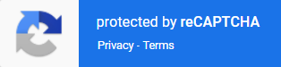

import Tabs from '@theme/Tabs';
import TabItem from '@theme/TabItem';
import ParamItem from '@theme/ParamItem';
import MethodItem from '@theme/MethodItem';
import MethodDescription from '@theme/MethodDescription'
import PriceBlock from '../../../../../src/theme/PriceBlock';
import PriceBlockWrap from '@theme/PriceBlockWrap';
import BlogLink from '@theme/BlogLink';
import { ArticleHead } from '../../../../../src/theme/ArticleHead';

<ArticleHead slug="captchas/recaptcha-v3-task" />


# RecaptchaV3TaskProxyless

<PriceBlockWrap>
  <PriceBlock title="RecaptchaV3TaskProxyless" captchaId="recaptcha3"/>
</PriceBlockWrap>



:::warning **注意！**
任务通过我们的自有代理服务器执行。您无需为代理支付额外费用 —— 它们的使用已包含在价格中。
:::


该对象包含用于解决 Google ReCaptcha3 任务的数据。此任务将通过我们的服务使用我们自己的代理服务器执行。

与 ReCaptcha2 不同，ReCaptcha3 不需要站点访问者执行任何操作，它在页面背景中隐式工作，收集和分析用户数据，以确定其是否为人类或机器人。基于这些分析，网站会得到一个信任评级（从 0.1 到 0.9）。

创建任务时，您还应额外传递两个参数 - pageAction 和 minScore。


## 请求参数

<TabItem value="proxyless" label="RecaptchaV3TaskProxyless (without proxy)" default className="bordered-panel">
    <ParamItem title="type" required type="string" />
    **RecaptchaV3TaskProxyless**

    ---

    <ParamItem title="websiteURL" required type="string" />
    带有 Google ReCaptcha 的网页地址。

    ---

    <ParamItem title="websiteKey" required type="string" />
	Recaptcha 网站密钥。<br/>https://www.google.com/recaptcha/api.js?render=THIS_ONE

	---

	<ParamItem title="minScore" type="double" />
    从 0.1 到 0.9 的值。

    ---

    <ParamItem title="pageAction" type="string" />
    <p>小部件操作值。网站所有者通过此参数定义用户在页面上的活动。默认值: *verify*</p><p>示例:<br/>*`grecaptcha.execute('site_key', {action:'login_test'})`*。</p>
</TabItem>


## 创建任务方法 

<TabItem value="proxyless" label="RecaptchaV2TaskProxyless (without proxy)" default className="method-panel">
	<MethodItem>
		```http
		https://api.capmonster.cloud/createTask
		```
	</MethodItem>
	<MethodDescription>
		**要求**
		```json
		{
		  "clientKey":"API_KEY",
		  "task": {
			"type":"RecaptchaV3TaskProxyless",
			"websiteURL":"https://lessons.zennolab.com/captchas/recaptcha/v3.php?level=beta",
			"websiteKey":"6Le0xVgUAAAAAIt20XEB4rVhYOODgTl00d8juDob",
			"minScore": 0.3,
			"pageAction": "myverify"
		  }
		}
		```
		**回应**
		```json
		{
		  "errorId":0,
		  "taskId":407533072
		}
		```
	</MethodDescription>
</TabItem>


## 获取任务结果方法

:::warning **警告！**
在某些网站上，确保 UserAgent 与解决验证码时使用的 UserAgent 相匹配非常重要。因此，如果 CapMonster Cloud 在返回令牌的同时提供了 UserAgent，**请始终**在提交表单或在目标页面确认解决方案时使用该 UserAgent。
:::

使用 [getTaskResult](../api/methods/get-task-result.md) 请求获取 ReCaptcha3 的答案。根据服务负载情况，您将在 10 到 30 秒内收到响应。

<TabItem value="proxyless" label="GeeTestTaskProxyless (without proxy)" default className="method-panel-full">
    <MethodItem>
		```http
		https://api.capmonster.cloud/getTaskResult
		```
    </MethodItem>
    <MethodDescription>
		**要求**
		```json
		{
		  "clientKey":"API_KEY",
		  "taskId": 407533072
		}
		```
		**回应**
		```json
		{
		  "errorId":0,
		  "status":"ready",
		  "solution": {
			"gRecaptchaResponse":"3AHJ_VuvYIBNBW5yyv0zRYJ75VkOKvhKj9_xGBJKnQimF72rfoq3Iy-DyGHMwLAo6a3"
		  }
		}
		```
    对于某些网站，响应可能如下所示（在确认解决方案时使用返回的 UserAgent）：
 
		```json
		{
		  "errorId":0,
		  "status":"ready",
		  "solution": {
			"userAgent": "Mozilla/5.0 (Windows NT 10.0; Win64; x64) AppleWebKit/537.36 (KHTML, like Gecko) Chrome/139.0.0.0 Safari/537.36", 
                "gRecaptchaResponse": "0cAFcWeA5Y3...hF8UWA", 
                "cookies": {"nocookies": "true"}}"
		  }
		}
		```
	</MethodDescription>
</TabItem>

<br />

|**属性**|**类型**|**描述**|
| :- | :- | :- |
|gRecaptchaResponse|String|应插入到 Recaptcha3 提交表单中的哈希值 `<textarea id="g-recaptcha-response"></textarea>`。长度为 500 到 2190 字节。|

## 如何查找任务创建所需的所有参数

### 手动方式

1. 请在浏览器中访问您的网站，该网站包含验证码功能。
2. 右键点击验证码元素，选择 **检查（Inspect）**。

#### websiteKey

公开站点密钥(sitekey)，通常可以在包含的脚本中找到：

在**Elements**中：


在**Network**标签页中：


#### pageAction

传递给*grecaptcha.execute()*的动作名称，例如：


### 自动方法

一种方便的自动化获取所有必要参数的方式。
某些参数每次页面加载时都会重新生成，因此需要通过浏览器（普通或无头模式，如使用**Playwright**）提取它们。
由于动态参数值的有效期很短，获取后必须立即解决验证码。

:::warning **重要提示！**
提供的代码片段是用于熟悉参数提取的基本示例。具体实现将取决于验证码页面、其结构及使用的HTML元素/选择器。
:::

<Tabs className="full-width-tabs filled-tabs request-tabs">
  <TabItem value="js" label="JavaScript" default className="method-panel">
    <details>
      <summary>显示代码（浏览器中）</summary>

      ```js
      (() => {
          const originalGrecaptcha = window.grecaptcha;

          if (!originalGrecaptcha || !originalGrecaptcha.execute) {
              console.warn("未找到grecaptcha.execute，请等待加载完成");
              return;
          }

          window.__extractedParams = null;

          window.grecaptcha = {
              ...originalGrecaptcha,
              execute: function(sitekey, config) {
                  console.log("已捕获！");
                  console.log("sitekey:", sitekey);
                  console.log("action:", config?.action);
                  window.__extractedParams = {
                      sitekey,
                      action: config?.action
                  };

                  return originalGrecaptcha.execute(sitekey, config);
              },
              ready: originalGrecaptcha.ready
          };

          console.log("grecaptcha.execute已被封装。点击按钮-参数将被捕获");
      })();
      ```
    </details>

    <details>
      <summary>显示代码（Node.js）</summary>

      ```js
      import { chromium } from "playwright";

      (async () => {
        const browser = await chromium.launch({ headless: false });
        const context = await browser.newContext();
        const page = await context.newPage();

        const jsContents = [];

        page.on("response", async (response) => {
          try {
            const url = response.url();
            const ct = response.headers()["content-type"] || "";
            if (ct.includes("javascript") || url.endsWith(".js")) {
              const text = await response.text();
              jsContents.push(text);
            }
          } catch (e) {}
        });

        const targetUrl = "https://lessons.zennolab.com/captchas/recaptcha/v3.php?level=beta";
        await page.goto(targetUrl, { timeout: 60000 });
        await page.waitForTimeout(3000);

        const inlineScripts = await page.$$eval("script:not([src])", (scripts) =>
          scripts.map((s) => s.textContent)
        );
        jsContents.push(...inlineScripts);

        const executeRegex =
          /grecaptcha\.execute\(\s*['"]
          (?<sitekey>[^'"]+)['"]\s*,\s*\{[^}]*action\s*:\s*['"](?<action>[^'"]+)['"]/i;

        let foundSitekey = null;
        let foundAction = null;

        for (const js of jsContents) {
          const match = js.match(executeRegex);
          if (match && match.groups) {
            foundSitekey = match.groups.sitekey;
            foundAction = match.groups.action;
            break;
          }
        }

        console.log({
          sitekey: foundSitekey,
          action: foundAction,
        });

        await browser.close();
      })();
      ```
    </details>
  </TabItem>

  <TabItem value="python" label="Python" className="method-panel">
    <details>
      <summary>显示代码</summary>

      ```python
      import asyncio
      import re
      from playwright.async_api import async_playwright

      async def extract_recaptcha_v3_execute(url):
          async with async_playwright() as p:
              browser = await p.chromium.launch(headless=False)
              context = await browser.new_context()
              page = await context.new_page()

              execute_pattern = re.compile(
                  r"grecaptcha\.execute\(\s*['\"]"
                  r"(?P<sitekey>[^'\"]+)['\"]\s*,\s*\{[^}]*action\s*:\s*['\"](?P<action>[^'\"]+)['\"]",
                  re.IGNORECASE
              )

              found_sitekey = None
              found_action = None
              js_contents = []

              async def handle_response(response):
                  try:
                      ct = response.headers.get("content-type", "")
                      if "javascript" in ct or response.url.endswith(".js"):
                          text = await response.text()
                          js_contents.append(text)
                  except:
                      pass

              page.on("response", handle_response)

              await page.goto(url, timeout=60000)
              await page.wait_for_timeout(3000)

              inline_scripts = await page.locator("script:not([src])").all_text_contents()
              js_contents += inline_scripts

              for js in js_contents:
                  match = execute_pattern.search(js)
                  if match:
                      found_sitekey = match.group("sitekey")
                      found_action = match.group("action")
                      break

              await browser.close()

              print({
                  "sitekey": found_sitekey,
                  "action": found_action
              })

      asyncio.run(extract_recaptcha_v3_execute("https://lessons.zennolab.com/captchas/recaptcha/v3.php?level=beta"))
      ```
    </details>
  </TabItem>

  <TabItem value="csharp" label="C#" className="method-panel">
    <details>
      <summary>显示代码</summary>

      ```csharp
      using System;
      using System.Text.RegularExpressions;
      using System.Threading.Tasks;
      using Microsoft.Playwright;
      using System.Collections.Generic;

      class Program
      {
          public static async Task Main(string[] args)
          {
              await ExtractRecaptchaV3Execute
              ("https://lessons.zennolab.com/captchas/recaptcha/v3.php?level=beta");
          }

          public static async Task ExtractRecaptchaV3Execute(string url)
          {
              using var playwright = await Playwright.CreateAsync();
              var browser = await playwright.Chromium.LaunchAsync(new BrowserTypeLaunchOptions
              {
                  Headless = false
              });

              var context = await browser.NewContextAsync();
              var page = await context.NewPageAsync();

              string foundSitekey = null;
              string foundAction = null;
              var jsContents = new List<string>();

              page.Response += async (_, response) =>
              {
                  try
                  {
                      var ct = response.Headers.ContainsKey("content-type") ? 
                      response.Headers["content-type"] : "";
                      if ((ct != null && ct.Contains("javascript")) || response.Url.EndsWith(".js"))
                      {
                          var text = await response.TextAsync();
                          jsContents.Add(text);
                      }
                  }
                  catch { }
              };

              await page.GotoAsync(url, new PageGotoOptions { Timeout = 60000 });
              await page.WaitForTimeoutAsync(3000);

              var inlineScripts = await page.EvalOnSelectorAllAsync<string[]>(
                  "script:not([src])",
                  "els => els.map(e => e.textContent)"
              );
              jsContents.AddRange(inlineScripts);

              var regex = new Regex(@"grecaptcha\.execute\(\s*['""]"
              + @"(?<sitekey>[^'""]+)['""]\s*,\s*\{[^}]*action\s*:\s*['""](?<action>[^'""]+)['""]", 
              RegexOptions.IgnoreCase);

              foreach (var js in jsContents)
              {
                  var match = regex.Match(js);
                  if (match.Success)
                  {
                      foundSitekey = match.Groups["sitekey"].Value;
                      foundAction = match.Groups["action"].Value;
                      break;
                  }
              }

              Console.WriteLine($"sitekey: {foundSitekey}");
              Console.WriteLine($"action: {foundAction}");

              await browser.CloseAsync();
          }
      }
      ```
    </details>
  </TabItem>
</Tabs>

## 使用 SDK 库

<Tabs className="full-width-tabs filled-tabs request-tabs" groupId="captcha-type">
  <TabItem value="js" label="JavaScript" default className="method-panel">
  
```js
// https://github.com/ZennoLab/capmonstercloud-client-js

import { 
  CapMonsterCloudClientFactory, 
  ClientOptions, 
  RecaptchaV3ProxylessRequest 
} from '@zennolab_com/capmonstercloud-client';

document.addEventListener('DOMContentLoaded', async () => {
  const cmcClient = CapMonsterCloudClientFactory.Create(
    new ClientOptions({ clientKey: '<你的 capmonster.cloud API 密钥>' }) // 你的 CapMonster Cloud API 密钥
  );

  console.log(await cmcClient.getBalance());

  const recaptchaV3Request = new RecaptchaV3ProxylessRequest({
    websiteURL: 'https://lessons.zennolab.com/captchas/recaptcha/v2_simple.php?level=high', // 带验证码页面的 URL
    websiteKey: '6Lcg7CMUAAAAANphynKgn9YAgA4tQ2KI_iqRyTwd', // 替换为正确的值
    minScore: 0.6, 
    pageAction: 'some-action', 
  });

  console.log(await cmcClient.Solve(recaptchaV3Request));
});
````

<BlogLink url="https://capmonster.cloud/zh/blog/re-1/javascript-recaptcha-v3"/>

  </TabItem>

  <TabItem value="python" label="Python" className="method-panel">

```python
# https://github.com/Zennolab/capmonstercloud-client-python

import asyncio
from capmonstercloudclient import CapMonsterClient, ClientOptions
from capmonstercloudclient.requests import RecaptchaV3ProxylessRequest

client_options = ClientOptions(api_key="your_api_key")  # 你的 CapMonster Cloud API 密钥
cap_monster_client = CapMonsterClient(options=client_options)

recaptcha_v3_request = RecaptchaV3ProxylessRequest(
    websiteUrl="https://lessons.zennolab.com/captchas/recaptcha/v3.php?level=beta",  # 带验证码页面的 URL
    websiteKey="6Le0xVgUAAAAAIt20XEB4rVhYOODgTl00d8juDob",  # 替换为正确的值
    minScore=0.6,  
    pageAction="myverify"  
)

async def solve_captcha():
    return await cap_monster_client.solve_captcha(recaptcha_v3_request)

responses = asyncio.run(solve_captcha())
print(responses)
```

<BlogLink url="https://capmonster.cloud/zh/blog/re-1/python-recaptcha-v3"/>

  </TabItem>

  <TabItem value="csharp" label="C#" className="method-panel">

```csharp
// https://github.com/ZennoLab/capmonstercloud-client-dotnet

using Zennolab.CapMonsterCloud.Requests;
using Zennolab.CapMonsterCloud;

class Program
{
    static async Task Main(string[] args)
    {
        var clientOptions = new ClientOptions
        {
            ClientKey = "your_api_key"  // 你的 CapMonster Cloud API 密钥
        };

        var cmCloudClient = CapMonsterCloudClientFactory.Create(clientOptions);

        var recaptchaV3Request = new RecaptchaV3ProxylessRequest
        {
            WebsiteUrl = "https://lessons.zennolab.com/captchas/recaptcha/v3.php?level=beta",  // 带验证码页面的 URL
            WebsiteKey = "6Le0xVgUAAAAAIt20XEB4rVhYOODgTl00d8juDob",  // 替换为正确的值
            MinScore = 0.6, 
            PageAction = "myverify"
        };

        var recaptchaV3Result = await cmCloudClient.SolveAsync(recaptchaV3Request);

        Console.WriteLine("验证码结果: " + recaptchaV3Result.Solution.Value);
    }
}
```

<BlogLink url="https://capmonster.cloud/zh/blog/re-1/c-recaptcha-v3"/>

  </TabItem>
</Tabs>

