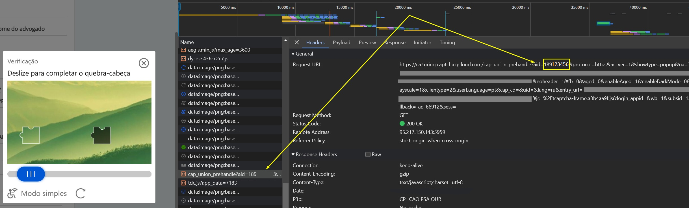

import Tabs from '@theme/Tabs';
import TabItem from '@theme/TabItem';
import ParamItem from '@theme/ParamItem';
import MethodItem from '@theme/MethodItem';
import MethodDescription from '@theme/MethodDescription'
import PriceBlock from '@theme/PriceBlock';
import PriceBlockWrap from '@theme/PriceBlockWrap';


# TenDI - 腾讯验证码

<PriceBlockWrap>
  <PriceBlock title="Tencent captcha" name="tencentToken"/>
</PriceBlockWrap>

:::warning **注意！**
此任务将使用我们的代理服务器执行。
:::


## 请求参数
<TabItem value="proxyless" label="RecaptchaV2EnterpriseTaskProxyless (without proxy)" default className="bordered-panel">
    <ParamItem title="type" required type="string" />
    **CustomTask**

    ---

    <ParamItem title="class" required type="string" />
    **TenDI**

    ---

    <ParamItem title="websiteURL" required type="string" />
    解决验证码的主页地址。

    ---

    <ParamItem title="websiteKey" required type="string" />
    captchaAppId。例如 `"websiteKey": "189123456"` - 是您网站的唯一参数。您可以从带有验证码的HTML页面或流量中获取它（参见下面的描述）。

    ---

    <ParamItem title="userAgent" type="string" />
    浏览器用户代理。**只传递 Windows 操作系统的实际 UA。现在是版本**： `userAgentPlaceholder`

</TabItem>


### 如何获取网站密钥（captchaAppId）
打开开发者工具，转到网络标签，激活验证码并查看请求。其中一些将包含您需要的参数值。在这种情况下，`websiteKey=aid`



## 创建任务方法 
<TabItem value="proxyless" label="RecaptchaV2TaskProxyless (without proxy)" default className="method-panel">
	<MethodItem>
		```http
		https://api.capmonster.cloud/createTask
		```
	</MethodItem>
	<MethodDescription>
		**要求**
		```json
		{
			"clientKey": "API_KEY",
			"task": {
				"type": "CustomTask",
				"class": "TenDI",
				"websiteURL": "https://domain.com",
				"websiteKey": "189123456",
				"userAgent": "userAgentPlaceholder"
			}
		}
		```
		**回应**
		```json
		{
		  "errorId":0,
		  "taskId":407533072
		}
		```
	</MethodDescription>
</TabItem>


## 获取任务结果方法
使用[getTaskResult](../api/methods/get-task-result.md)方法获取TenDI的解决方案。

<TabItem value="proxyless" label="GeeTestTaskProxyless (without proxy)" default className="method-panel-full">
	<MethodItem>
		```http
		https://api.capmonster.cloud/getTaskResult
		```
	</MethodItem>
	<MethodDescription>
		**要求**
		```json
		{
		  "clientKey":"API_KEY",
		  "taskId": 407533072
		}
		```
		**回应**
		```json
		{
			"errorId":0,
			"status":"ready",
			"solution": {
			   "data": {
					"randstr": "@EcL",
					"ticket": "tr03lHUhdnuW3neJZu.....7LrIbs*"
				},
				"headers": {
					"User-Agent": "userAgentPlaceholder"
				}
			}
		}
		```
	</MethodDescription>
</TabItem>


## 使用 SDK 库

<Tabs className="full-width-tabs filled-tabs request-tabs" groupId="captcha-type">
  <TabItem value="js" label="JavaScript" default className="method-panel">
    ```js
    // https://github.com/ZennoLab/capmonstercloud-client-js

    import { CapMonsterCloudClientFactory, ClientOptions, TenDiCustomTaskProxylessRequest } from '@zennolab_com/capmonstercloud-client';

    document.addEventListener('DOMContentLoaded', async () => {
      const cmcClient = CapMonsterCloudClientFactory.Create(new ClientOptions({ clientKey: '<your capmonster.cloud API key>' }));
      console.log(await cmcClient.getBalance());

      const ten_di_request = new TenDiCustomTaskProxylessRequest({
        websiteURL: 'https://example.com',
        websiteKey: '189956587',
        userAgent: 'userAgentPlaceholder',
      });

      console.log(await cmcClient.Solve(ten_di_request));
    });
    ```
  </TabItem>

  <TabItem value="python" label="Python" default className="method-panel">
    ```python
    # https://github.com/ZennoLab/capmonstercloud-client-python

    import asyncio
    from capmonstercloudclient import CapMonsterClient, ClientOptions
    from capmonstercloudclient.requests import TenDiCustomTaskProxylessRequest

    client_options = ClientOptions(api_key="your_api_key")  # Replace with your CapMonster Cloud API key
    cap_monster_client = CapMonsterClient(options=client_options)

    ten_di_request = TenDiCustomTaskProxylessRequest(
        websiteUrl="https://example.com",  # URL with the captcha
        websiteKey="189956587",  # Replace with the website key for the captcha
        userAgent="userAgentPlaceholder"  # Use the current userAgent
    )

    async def solve_captcha():
        return await cap_monster_client.solve_captcha(ten_di_request)

    responses = asyncio.run(solve_captcha())
    print(responses)
    ```
  </TabItem>

  <TabItem value="csharp" label="C#" className="method-panel">
    ```csharp
    // https://github.com/ZennoLab/capmonstercloud-client-dotnet

    using Zennolab.CapMonsterCloud.Requests;
    using Zennolab.CapMonsterCloud;

    class Program
    {
        static async Task Main(string[] args)
        {
            var clientOptions = new ClientOptions
            {
                ClientKey = "your_api_key" // Replace with your CapMonster Cloud API key
            };

            var cmCloudClient = CapMonsterCloudClientFactory.Create(clientOptions);

            var tenDiRequest = new TenDiCustomTaskProxylessRequest
            {
                WebsiteUrl = "https://example.com", // URL with the captcha
                WebsiteKey = "189956587", // Replace with the correct website key
                UserAgent = "userAgentPlaceholder" // Use the current userAgent
            };

            var tenDiRequestResult = await cmCloudClient.SolveAsync(tenDiRequest);
            Console.WriteLine("Captcha Solution: " + string.Join(", ", tenDiRequestResult.Solution.Data));
            Console.WriteLine("Captcha Solution: " + string.Join(", ", tenDiRequestResult.Solution.Headers));
        }
    }
    ```
  </TabItem>
</Tabs>